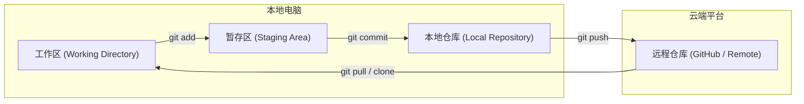

[[Git MOC|← 返回 Git MOC]]

# Git 与 GitHub 详细介绍与使用方法

> [!NOTE]
> 适合对象：**零基础到中级用户**，尤其是计算机专业、软件工程、课程设计、个人项目与团队协作场景。

---

## 一、Git 是什么？

### 1. Git 的定义

**Git** 是一个**分布式版本控制系统（DVCS）**，主要用于：
- 记录代码（或文件）的**历史变化**。
- 支持多人**协同开发**。
- 随时**回退到任意历史版本**。

> [!tip]
> 简单理解：Git = 给代码拍“时间快照”的工具。

---

### 2. 为什么要用 Git？

如果不使用 Git，常见问题包括：
- **文件名混乱**：`final.cpp`、`final2.cpp`、`final_真的最终.cpp`。
- **无法回退**：改错代码后无法撤销修改。
- **协作冲突**：多人改同一份代码，导致文件被互相覆盖。

使用 Git 可以轻松解决这些痛点：
- ✅ **自动保存**：自动记录每一次文件提交。
- ✅ **版本追溯**：清楚知道“谁在什么时候改了什么”。
- ✅ **独立分支**：支持分支开发，多人开发互不干扰。

---

### 3. Git 的核心特点

| 特点 | 说明 |
| :--- | :--- |
| **分布式** | 每个人本地都有完整的代码仓库，不依赖中央服务器。 |
| **快照式存储** | 每次提交保存项目的整体状态，而非差异补丁。 |
| **分支强大** | 创建、切换、合并分支非常轻量和高效。 |
| **离线可用** | 本地即可完成几乎所有提交、查看历史的操作。 |

---

## 二、GitHub 是什么？

### 1. GitHub 的定义

**GitHub** 是一个**基于 Git 的代码托管平台**，主要功能包括：
- 托管 Git 仓库（云端存储）。
- 团队协作开发与权限管理。
- **Issue**（问题管理与需求跟踪）。
- **Pull Request**（代码审查与合并请求）。

> [!tip]
> 类比理解：
> - Git = 本地记账软件
> - GitHub = 云端共享账本

---

### 2. Git 和 GitHub 的关系

| 维度 | Git | GitHub |
| :--- | :--- | :--- |
| **属性** | 软件工具 | 第三方托管平台 |
| **运行位置** | 本地运行 | 云端服务 |
| **核心功能** | 本地版本控制 | 远程代码托管 + 团队协作 |

> [!warning]
> **Git 不等于 GitHub**。即使不联网，依然可以在本地正常使用 Git 进行版本管理。

---

## 三、Git 的基本概念（非常重要）

### 1. 三个工作区域

Git 本地管理包含三个核心区域，文件在其间流转：



| 区域 | 英文名 | 作用 |
| :--- | :--- | :--- |
| **工作区** | Working Directory | 实际编辑和存放文件的地方。 |
| **暂存区** | Staging Area | 准备提交的文件暂存地。 |
| **本地仓库** | Local Repository | 保存已提交的历史版本数据。 |

---

### 2. 仓库（Repository）

一个 **Git 仓库** 就是一个被 Git 管理的项目目录（包含隐藏文件夹 `.git`）。它包含了：
- 项目的所有源码与配置文件。
- 所有的历史提交记录。
- 所有的分支与标签信息。

---

### 3. 提交（Commit）

一次**提交**（Commit）代表了某一时刻对项目的一组修改。
每个 commit 都包含以下信息：
- 唯一的 **ID**（40位十六进制哈希值）。
- **提交人**的姓名与邮箱。
- **提交时间**。
- **提交说明**（写明本次修改的内容）。

---

### 4. 分支（Branch）

**分支**用于并行开发，使多条开发主线可以互不干扰：
- `main / master`：主分支，通常用于发布稳定版本。
- `dev`：开发主分支。
- `feature-xxx`：新功能分支。

> [!tip]
> 可以把分支理解为“平行世界”，各自修改，最后可以合并到一起。

---

## 四、Git 的安装与初始化

### 1. 安装 Git

- **Windows**：下载并安装 Git for Windows 客户端。
- **macOS**：通过 Homebrew 运行 `brew install git`。
- **Linux**：运行 `sudo apt install git`（Ubuntu/Debian）或 `sudo yum install git`（CentOS）。

安装完成后，在终端验证：
```bash
git --version
```

---

### 2. 初始配置（只需一次）

安装后必须配置个人身份，以便 Git 记录是谁提交的代码：
```bash
git config --global user.name "你的名字"
git config --global user.email "你的邮箱"
```

查看全局配置：
```bash
git config --list
```

---

## 五、本地 Git 的完整使用流程

### 1. 创建仓库

#### 方式一：全新项目初始化
进入项目文件夹，执行：
```bash
git init
```

#### 方式二：克隆已有远程项目
```bash
git clone 仓库地址
```

---

### 2. 查看状态

随时查看当前工作区和暂存区的状态：
```bash
git status
```
文件的三种主要状态：
- **未跟踪（Untracked）**：新创建的文件，Git 尚未管理。
- **已修改（Modified）**：文件被修改，但还没放入暂存区。
- **已暂存（Staged）**：已放入暂存区，准备下次提交。

---

### 3. 添加到暂存区

将文件的修改暂存：
```bash
git add 文件名
git add .    # 添加当前目录下所有文件的修改
```

---

### 4. 提交到本地仓库

```bash
git commit -m "本次提交的说明信息"
```

> [!tip]
> 提交说明建议简洁清晰，如 `feat: 新增登录功能` 或 `fix: 修复首页崩溃Bug`。

---

### 5. 查看历史记录

```bash
git log
git log --oneline  # 一行显示一条提交历史，更简洁
```

---

## 六、分支操作（核心技能）

### 1. 查看分支
```bash
git branch
```

### 2. 创建分支
```bash
git branch dev
```

### 3. 切换分支
```bash
git checkout dev
# 或者使用较新版本命令：
git switch dev
```

### 4. 创建并自动切换分支
```bash
git checkout -b feature-login
# 等价于：
git switch -c feature-login
```

### 5. 合并分支
将 `dev` 分支的修改合并到当前分支（通常先切换到 `main`）：
```bash
git checkout main
git merge dev
```

---

### 6. 冲突（Conflict）

- **产生原因**：两个分支在**同一行代码**上做了不同的修改，Git 无法决定保留哪一个。
- **解决步骤**：
  1. 打开有冲突的文件，Git 会用以下符号标记冲突区域：
     ```text
     <<<<<<< HEAD
     你的当前分支修改
     =======
     合并进来的分支修改
     >>>>>>> branch-name
     ```
  2. 手动编辑冲突文件，删除冲突标记，保留正确的代码。
  3. 重新执行 `git add 文件名` 和 `git commit -m "解决冲突"` 提交。

---

## 七、GitHub 的使用流程

### 1. 创建远程仓库
登录 GitHub，点击右上角 **New Repository**，填写仓库名称并创建。

### 2. 关联远程仓库
将本地项目关联到远程 GitHub 仓库：
```bash
git remote add origin 仓库地址
```
查看关联的远程仓库：
```bash
git remote -v
```

### 3. 推送代码到 GitHub
```bash
git push -u origin main
```
> [!note]
> `-u` 参数在首次推送时使用，用于绑定本地与远程分支，以后只需输入 `git push` 即可。

### 4. 从远程拉取代码
```bash
git pull origin main
```

---

## 八、团队协作（GitHub 核心）

### 1. Fork（复刻）
将别人的开源仓库完整复制一份到自己的 GitHub 账号下，可以在自己的仓库里自由修改。

### 2. Pull Request（PR）
贡献代码流程：
1. **Fork** 项目到个人账号。
2. 将个人的 fork 仓库克隆到本地修改并提交。
3. 将修改 **Push** 回自己的 GitHub 仓库。
4. 在原作者仓库页面点击 **New Pull Request**，请求原作者合并你的修改。

### 3. Issue
用于汇报程序缺陷（Bug）、讨论新功能需求或作为开发任务的指派清单。

---

## 九、常用命令速查表

```bash
git init              # 初始化仓库
git status            # 查看状态
git add .             # 添加所有修改到暂存区
git commit -m "msg"   # 提交到本地仓库
git log --oneline     # 查看简洁提交历史
git branch            # 列出本地分支
git checkout -b dev   # 创建并切换到 dev 分支
git merge dev         # 合并 dev 分支到当前分支
git push              # 推送到远程仓库
git pull              # 从远程拉取最新代码
```

---

## 十、学习建议

1. **多用命令行**，通过敲打命令加深对 Git 三个区域工作原理的理解。
2. 每次 commit 都写清楚说明，这是团队协作的基础。
3. 不要在 `main` 分支直接开发大功能，养成在功能分支开发、最后合并的习惯。
4. 多执行 `git status`，时刻掌控文件状态。

---

如果您在使用中遇到问题，可以随时探讨：
- 🛠 提供针对您特定项目的 Git 协作规范
- 🎨 解析更复杂的 Git 冲突解决案例
- 📦 讲解 Git Rebase 与 Cherry-pick 等进阶命令