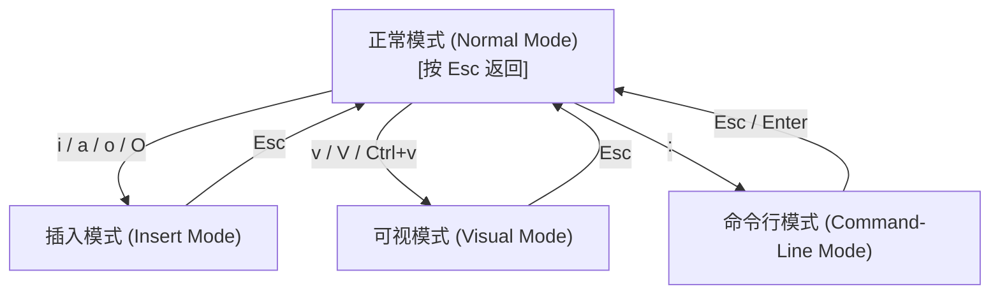

[[../OS MOC|← 返回 操作系统 MOC]]

# CentOS 7 常用终端命令与 Vim/Sed 操作

> [!note]
> 本手册收录 CentOS 7 日常管理及开发环境中最核心的终端命令，并深入总结了主流文本编辑器 **Vim** 和流式编辑器 **Sed** 的实操技巧。

---

## 一、 CentOS 7 常用终端命令

### 1. 文件与目录操作

| 命令 | 功能 | 常用示例 |
| :--- | :--- | :--- |
| `ls` | 列出目录内容 | `ls -l`（详细列表）、`ls -a`（显示隐藏文件） |
| `cd` | 切换工作目录 | `cd /var/log`（进入日志目录）、`cd ..`（返回上级） |
| `pwd` | 显示当前目录路径 | `pwd` |
| `mkdir` | 创建目录 | `mkdir new_dir`、`mkdir -p dir1/dir2`（递归创建多层） |
| `rm` | 删除文件或目录 | `rm file.txt`、`rm -rf dir`（递归强删目录，请小心） |
| `cp` | 复制文件或目录 | `cp file1 file2`、`cp -r dir1 dir2`（复制目录） |
| `mv` | 移动或重命名文件 | `mv old.txt new.txt`（重命名）、`mv file /tmp/`（移动） |
| `touch` | 创建空文件/更新时间戳 | `touch newfile` |
| `cat` | 查看文件全部内容 | `cat /etc/hosts` |
| `less` / `more` | 分页查看文件内容 | `less /var/log/messages`（支持上下滚动，按 `q` 退出） |
| `head` / `tail` | 查看文件头部或尾部 | `tail -f /var/log/secure`（实时追踪安全日志） |
| `find` | 搜索查找文件 | `find /home -name "*.log"` |
| `grep` | 文本正则搜索 | `grep "error" /var/log/messages` |

> [!warning]
> 谨慎使用 `rm -rf /` 或 `rm -rf *`，此类命令会永久且不经确认地删除对应路径下的所有文件。

---

### 2. 系统信息与管理

| 命令 | 功能 | 常用示例 |
| :--- | :--- | :--- |
| `uname` | 查看系统内核及版本 | `uname -a` |
| `df` | 查看磁盘空间占用情况 | `df -h`（人类可读的格式） |
| `du` | 查看指定目录/文件大小 | `du -sh /home`（汇总显示 home 目录大小） |
| `free` | 查看物理与交换内存使用 | `free -m`（以 MB 为单位） |
| `top` | 实时系统负载与进程监控 | `top`（进入交互式界面，按 `q` 退出） |
| `ps` | 截取瞬时进程快照 | `ps aux | grep nginx` |
| `systemctl` | systemd 服务管理主命令 | `systemctl start nginx`（启动）、`systemctl enable nginx`（开机自启） |
| `service` | 兼容旧版 SysV 服务管理 | `service network restart`（重启网络服务） |
| `shutdown` | 关机/重启指令 | `shutdown -r now`（立即重启） |
| `crontab` | 设定定时计划任务 | `crontab -e`（编辑当前用户的定时任务） |

---

### 3. 网络管理

| 命令 | 功能 | 常用示例 |
| :--- | :--- | :--- |
| `ping` | 检测网络连通性 | `ping google.com` |
| `ifconfig` | 查看或配置网卡 | `ifconfig ens33`（需要安装 `net-tools` 包） |
| `ip` | 现代网络配置与路由管理 | `ip addr show`（查看IP）、`ip route`（查看路由表） |
| `netstat` | 显示网络连接状态 | `netstat -tuln`（查看所有监听的 TCP/UDP 端口） |
| `ss` | 高性能网络端口状态查询 | `ss -tunlp`（比 `netstat` 更快地显示监听端口的进程） |
| `curl` / `wget` | 命令行下载与网络工具 | `curl -O http://example.com/file` |
| `firewall-cmd` | firewalld 防火墙管理 | `firewall-cmd --list-all`（查看所有已允许的端口与服务） |

---

### 4. 软件包管理（YUM）

| 命令 | 功能 | 常用示例 |
| :--- | :--- | :--- |
| `yum install` | 安装指定的软件包 | `yum install -y nginx` |
| `yum remove` | 卸载指定的软件包 | `yum remove httpd` |
| `yum update` | 更新系统上所有已安装包 | `yum update` |
| `yum search` | 在远程源中搜索软件包 | `yum search "python3"` |
| `yum list` | 列出软件包状态 | `yum list installed`（列出系统所有已安装软件） |
| `yum clean` | 清除 YUM 缓存目录 | `yum clean all` |

---

### 5. 权限管理

| 命令 | 功能 | 常用示例 |
| :--- | :--- | :--- |
| `chmod` | 修改文件/目录读写执行权限 | `chmod 755 script.sh`（设置为 rwxr-xr-x） |
| `chown` | 修改文件/目录所有者及所属组 | `chown nginx:nginx /var/www/html` |
| `sudo` | 以超级用户（root）权限执行 | `sudo yum update` |
| `passwd` | 修改用户密码 | `passwd`（修改当前用户）、`passwd username`（root 修改他人） |

---

### 6. 压缩与解压

| 格式 | 命令 | 压缩示例 | 解压示例 |
| :--- | :--- | :--- | :--- |
| **tar.gz** | `tar` | `tar -czvf archive.tar.gz /path` | `tar -xzvf archive.tar.gz` |
| **gz** | `gzip` | `gzip file.txt` | `gunzip file.txt.gz` |
| **zip** | `zip/unzip`| `zip -r archive.zip folder/` | `unzip archive.zip` |

---

### 7. 实用脚本与技巧

```bash
# 1. 统计当前目录下的常规文件数
ls -l | grep "^-" | wc -l

# 2. 后台无阻断运行程序，并将输出与错误日志输出到指定文件
nohup ./start.sh > output.log 2>&1 &

# 3. 快速在磁盘上创建一个大小为 1GB 的空测试文件
dd if=/dev/zero of=testfile bs=1M count=1024
```

> [!important]
> 建议在修改任何系统关键配置文件（如 `/etc/fstab`、`/etc/ssh/sshd_config`）前，先进行备份。例如：`cp sshd_config sshd_config.bak`。

---

## 二、 Vim 编辑器核心操作

Vim 是 Linux 终端的编辑利器。熟练掌握它能成倍提升命令行下的开发效率。

### 1. 核心概念：四种模式



- **正常模式 (Normal Mode)**：默认模式，用于光标移动、复制粘贴、文本删除。
- **插入模式 (Insert Mode)**：用于文本输入。
- **可视模式 (Visual Mode)**：用于文本块的选中和批量操作。
- **命令行模式 (Command-Line Mode)**：用于保存、退出、查找替换等全局配置命令。

---

### 2. 光标快速移动

- **基础字符移动**：`h`（左）、`j`（下）、`k`（上）、`l`（右）。
- **单词级移动**：
  - `w` / `W`：移动到下一个单词/字串开头。
  - `b` / `B`：移动到上一个单词/字串开头。
  - `e` / `E`：移动到下一个单词/字串结尾。
- **行内快捷跳转**：
  - `0`：跳转到行首。
  - `^`：跳转到本行第一个非空白字符。
  - `$`：跳转到行尾。
- **段落与全局跳转**：
  - `gg`：跳转到文件第一行。
  - `G`：跳转到文件最后一行。
  - `:[行号]` + `Enter`：跳转到指定行（例如 `:50` 跳转到第 50 行）。
  - `%`：在成对的括号 `()`, `{}`, `[]` 之间进行相互跳转。
- **翻页操作**：
  - `Ctrl+f` / `Ctrl+b`：向下/向上翻整页。
  - `Ctrl+d` / `Ctrl+u`：向下/向上翻半页。

---

### 3. 文本编辑技巧

- **删除（剪切）**：
  - `x`：删除光标下的字符。
  - `dd`：删除（剪切）当前行。
  - `[n]dd`：删除当前行开始的 `n` 行（如 `3dd` 删除 3 行）。
  - `dw`：删除当前光标至下一个单词开头。
  - `d$` 或 `D`：删除当前光标至行尾的所有内容。
- **复制与粘贴**：
  - `yy`：复制当前整行。
  - `[n]yy`：复制当前行开始的 `n` 行。
  - `p`：在光标之后（下行）进行粘贴。
  - `P`：在光标之前（上行）进行粘贴。
- **撤销与重做**：
  - `u`：撤销上一步操作。
  - `Ctrl+r`：恢复上一步撤销的操作（重做）。
- **快捷修改**：
  - `r[字符]`：将当前光标下的字符替换为 `[字符]`。
  - `cw`：删除当前单词至结尾并切换至插入模式。
  - `~`：切换光标下字母的大小写。
  - `>>` / `<<`：当前行向右/向左缩进。

---

### 4. 查找与替换

在命令行模式下执行：
- **/pattern**：向下全局搜索 `pattern`。按 `n` 跳至下一个匹配项，按 `N` 跳至上一个。
- **?pattern**：向上全局搜索 `pattern`。
- **`:%s/old/new/g`**：在全文件范围内，将所有的 `old` 替换为 `new`。
- **`:%s/old/new/gc`**：同上，但每次替换前均会弹框提示让用户确认（Confirm）。
- **`:5,15s/old/new/g`**：仅在第 5 行到第 15 行的区间内进行查找替换。

---

### 5. 文件与保存退出

- `:w`：保存当前修改。
- `:w [新文件名]`：文件另存为。
- `:q`：退出（在未修改文件时有效）。
- `:q!`：强制退出，丢弃所有未保存的修改。
- `:wq` 或 `:x`：保存修改并退出编辑器。

---

### 6. 分割多窗口与标签页

- **水平分割窗口**：输入 `:sp [文件名]`，或按快捷键 `Ctrl+w s`。
- **垂直分割窗口**：输入 `:vsp [文件名]`，或按快捷键 `Ctrl+w v`。
- **切换活动窗口**：按双击 `Ctrl+w w` 顺序循环切换，或使用 `Ctrl+w` 后跟方向键 `h/j/k/l`。
- **关闭活动窗口**：输入 `:close`，或按 `Ctrl+w c`。
- **新建标签页**：输入 `:tabnew [文件名]`，按 `gt` / `gT` 可切换到 下一个/上一个 标签页。

---

### 7. 进阶实用技巧

- **命令前置数字**：在命令前加数字代表重复。例如 `5j` 表示向下移动 5 行，`10dd` 表示连续删除 10 行。
- **点命令 `.`**：在正常模式下，按下 `.` 键将重复执行上一次进行的文本编辑修改操作，极具效率。
- **宏录制（批量操作）**：
  1. 正常模式下输入 `qa`（`q` 为录制，`a` 为存放宏的寄存器）。
  2. 开始执行一系列键盘操作。
  3. 完成后按 `q` 停止录制。
  4. 选中需要重复操作的位置，输入 `@a` 播放宏，或者输入 `10@a` 重复执行 10 次。
- **环境参数临时设定**：
  - `:set number`（或 `:set nu`）显示行号。
  - `:set nonumber` 关闭行号。
  - `:syntax on` 开启语法高亮。

---

## 三、 Sed 流式文本编辑器

Sed 是一个功能强大的非交互式流式编辑器，通常用来执行自动化批量替换、提取特定行、脚本过滤等操作。

### 1. 核心命令格式

```bash
sed 's/查找内容/替换内容/[修饰符]' 文件名
```
- `s`：代表替换动作（substitute）。
- 查找内容与替换内容支持**正则表达式**。
- 常用修饰符：
  - `g`：全局替换（global），若不加，则只替换每行第一次出现的匹配项。
  - `i`：忽略匹配内容的大小写。

---

### 2. 常见场景用法

#### 2.1 文本搜索与替换

```bash
# 1. 将每行第一个 "old" 替换成 "new" 并输出（不修改源文件）
sed 's/old/new/' file.txt

# 2. 全局将所有 "old" 替换为 "new"
sed 's/old/new/g' file.txt

# 3. 仅替换第 3 行的内容
sed '3s/old/new/g' file.txt

# 4. 替换第 2 到第 5 行区间内的匹配项
sed '2,5s/old/new/g' file.txt
```

#### 2.2 删除指定文本行 (`d`)

```bash
# 1. 删除包含关键字 "pattern" 的整行
sed '/pattern/d' file.txt

# 2. 删除文件的第 5 行
sed '5d' file.txt

# 3. 删除第 3 行到最后一行的所有内容
sed '3,$d' file.txt
```

#### 2.3 提取并打印指定行 (`-n` + `p`)

```bash
# 1. 仅打印包含 "pattern" 的匹配行（-n 阻止默认全量输出）
sed -n '/pattern/p' file.txt

# 2. 打印文件的第 3 到第 8 行
sed -n '3,8p' file.txt
```

#### 2.4 在指定位置插入与追加文本 (`i` / `a`)

```bash
# 1. 在第 2 行之前插入一行新内容
sed '2i\This is inserted line' file.txt

# 2. 在第 2 行之后追加一行新内容
sed '2a\This is appended line' file.txt
```

---

### 3. 自定义分隔符

若替换路径中包含 `/` 符号，为避免频繁转义，可以用 `@` 或 `#` 符号代替默认的 `/` 分隔符：
```bash
sed 's@/var/log/nginx@/tmp/nginx@g' config.conf
# 或者：
sed 's#http://#https://#g' urls.txt
```

---

### 4. 直接修改源文件 (`-i` 选项)

> [!caution]
> `-i` 选项会直接在原始磁盘文件上执行修改。建议执行前先进行无 `-i` 备份或直接带备份后缀。

```bash
# 直接修改 file.txt 文件的内容
sed -i 's/old/new/g' file.txt

# 修改 file.txt，并自动生成备份文件 file.txt.bak
sed -i.bak 's/old/new/g' file.txt
```

---

### 5. 正则与管道配合常用命令

```bash
# 1. 去除文件里所有行首的 # 注释符号
sed 's/^#//' config.conf

# 2. 清理多余空行（删除空行）
sed '/^$/d' data.txt

# 3. 配合管道使用：过滤掉 ps 输出结果中的 grep 自身进程
ps aux | grep nginx | sed '/grep/d'
```
