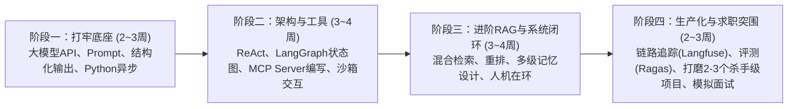

# 智能体应用开发（AI Agent Engineer）求职与学习体系总览

> **定位说明**：本体系专为准备从事 **大模型智能体应用开发（AI Agent Application Developer / LLM Application Engineer）** 岗位的求职者打造，涵盖从底层模型交互、核心决策架构、工具与MCP协议、高级RAG、状态持久化到工程化评测与面试实战的全链路必备技能。

---

## 一、 岗位认知与定位分析

### 1. 岗位本质：Agent 工程师到底在做什么？
在当今大模型落地技术栈中，工程师通常分为三大方向：
1. **模型算法工程师（Pre-training / Post-training）**：负责基础模型预训练、SFT微调、RLHF/DPO对齐、量化蒸馏。偏重算力、数据清洗与算法优化。
2. **传统后端 / 全栈工程师**：负责业务系统 CRUD、高并发架构、微服务治理、数据库优化。
3. **智能体应用开发工程师（AI Agent Developer）**：**位于模型与现实业务系统之间的桥梁**。核心职责是让大模型具备**自主规划（Planning）、记忆沉淀（Memory）、工具调用（Tools Execution）和环境感知交互**的能力，解决大模型本身的“无状态、知识截止、无法行动、幻觉不确定性”四大缺陷。

### 2. 核心能力雷达图
```mermaid
radar
  title 智能体应用工程师能力模型
  "LLM基础与Prompt工程": 85
  "Agent架构与规划模式": 90
  "工具调用与MCP协议": 90
  "高级RAG与检索架构": 85
  "状态持久化与记忆系统": 80
  "工程化可观测与评测": 75
  "后端工程与分布式基础": 80
```

---

## 二、 核心知识与技能大纲索引（MOC）

每个核心模块均已独立拆解为专项学习与面试笔记，点击下方双链即可跳转深入研读：

| 模块编号 | 文档名称 | 核心学习重点 | 技能标签 |
| :--- | :--- | :--- | :--- |
| **01** | [[01_大模型基础与提示工程实战]] | Transformer原理、Token与上下文、结构化输出（JSON/Pydantic）、高级提示工程（CoT/ReAct/Few-shot）、流式SSE与异步调用 | `基础底座` `Prompt` `API` |
| **02** | [[02_智能体核心架构与决策规划机制]] | Agent三要素、ReAct模式、Plan-and-Solve、自我反思纠错（Reflexion）、多智能体协同（MAS）架构与拓扑控制 | `核心架构` `规划与决策` `Multi-Agent` |
| **03** | [[03_工具调用与MCP开放协议深度解析]] | Function Calling原理与Schema设计、Model Context Protocol (MCP) 架构与开发、沙箱代码执行、浏览器自动化、工具容错 | `工具集成` `MCP协议` `环境交互` |
| **04** | [[04_高级RAG与企业知识库检索架构]] | 文档解析分块、向量数据库与Embedding选型、混合检索（Hybrid+RRF）、重排（Re-ranking）、Contextual RAG、GraphRAG | `知识增强` `向量检索` `RAG进阶` |
| **05** | [[05_主流Agent开发框架与生态选型]] | LangChain/LangGraph状态图设计、LlamaIndex数据驱动Agent、CrewAI/AutoGen多智能体框架选型与去框架化自研思路 | `开源框架` `LangGraph` `技术选型` |
| **06** | [[06_记忆系统设计与状态持久化]] | 工作记忆（滑动窗口/摘要压缩）、长期记忆（实体/画像/经验向量库）、LangGraph Checkpointer状态持久化与Human-in-the-Loop人机在环 | `记忆管理` `状态机` `人机协同` |
| **07** | [[07_工程化落地、评测与可观测性]] | Langfuse/Phoenix链路追踪监控、Ragas评估体系、LLM-as-a-Judge、Prompt Caching成本优化、分级路由、安全护栏Guardrails | `LLMOps` `评测体系` `生产落地` |
| **08** | [[08_高频面试题库与实战项目突围]] | 3个工业级量产简历项目设计方案、高频深度技术八股与Bad Case排查思路、面试回答避坑指南 | `简历包装` `面试题库` `项目实战` |
| **09** | [[09_国内大模型生态、私有化部署与极速Web交互]] | 讯飞星火与国内多模型网关、Ollama本地调试、vLLM生产级私有化部署、Streamlit极速Web交付、8周通关实战打卡日程表 | `国内生态` `私有化部署` `Web交付` |
| **专属导师** | [[AI导师系统提示词]] | 专为本套路线定制的专属带教 AI 架构师 System Prompt，可直接导入 Cherry Studio/Dify | `专属带教` `系统提示词` `实战通关` |
| **专项** | [[面试问答]] | **科大讯飞HR与技术初试专项**：职业动机、星火生态认知、三层容错防御、Bad Case排查STAR回答、讯飞业务构想与反问清单 | `面试真题` `讯飞专项` `通关必备` |

---

## 三、 四阶段求职备战路线图



### 阶段一：筑基阶段（模型理解与基础交互）
- **目标**：彻底掌握主流大语言模型的调用机制、限制与 Prompt 精细控制。
- **产出**：能够使用原生 Python / TypeScript 完成结构化数据抽取、具备健壮重试与限流处理的对话接口。

### 阶段二：智能体机制与工程框架
- **目标**：理解 Agent 从“接收意图 -> 分解任务 -> 调用工具 -> 观察反馈 -> 终结回复”的全流程。
- **产出**：熟练掌握 LangGraph 状态机编排，独立编写一套生产级 MCP (Model Context Protocol) Server，并实现代码执行沙箱。

### 阶段三：企业级落地技术（RAG与记忆管理）
- **目标**：攻克实际业务中最常遇到的“知识检索不准、上下文超限、对话多轮状态丢失”问题。
- **产出**：构建包含 Dense+BM25 混合检索与 Cross-Encoder 重排的精准知识库检索系统，实现基于 Redis/Postgres 的会话状态中断恢复。

### 阶段四：工业级调优、评测与面试输出
- **目标**：具备评估 Agent 系统可靠性的能力，能够度量幻觉、延迟与成本。
- **产出**：接入 Langfuse 链路追踪，建立自动化评估集，提炼 2~3 个具有工业级复杂度的实战项目写入简历。

---

## 四、 简历与面试策略备忘

1. **拒绝“玩具项目”（Toy Project）**：
   - 避免简历上写“基于 LangChain 调接口做了个简单本地文档问答”或“调用天气API的Demo”。
   - 必须突出：**复杂决策流程（分支、循环、反思纠错）**、**工业级协议（MCP）**、**Bad Case 调优数据**、**评测基准（Eval）与降本增效指标**。
2. **突出工程抗风险能力**：
   - 智能体最怕“非确定性”与“死循环”。在面试中重点展现你针对工具调用失败、参数解析异常、模型输出幻觉时设计的 **Fallback 降级机制** 与 **防御性兜底设计**。
3. **理解“去框架化”思想**：
   - 面试官通常会考查底层实现，如“不用 LangChain，你如何用 50 行原生代码写一个支持 Tool Call 的 ReAct 循环？”请务必做到知其然并知其所以然。
