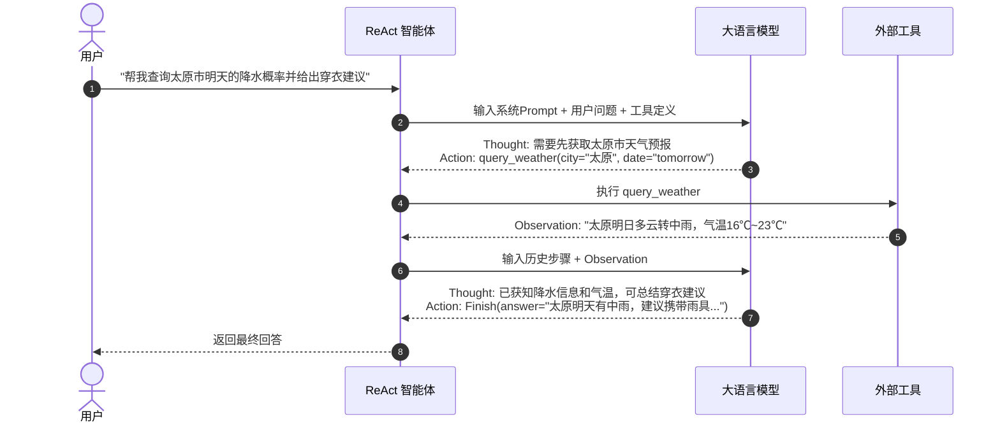
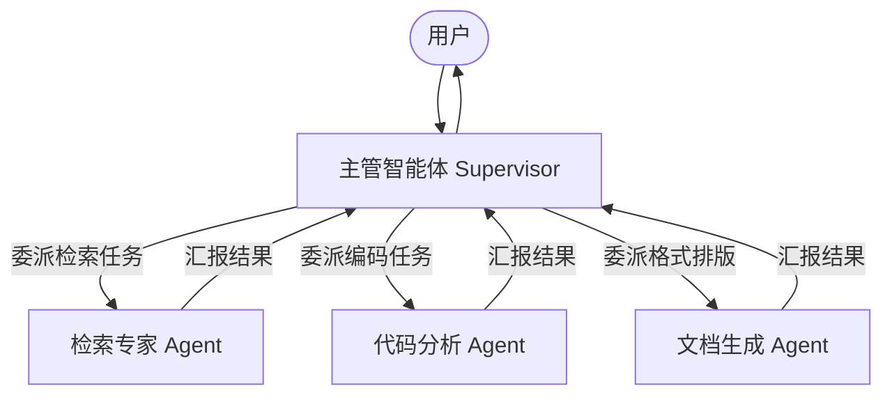

# 02 智能体核心架构与决策规划机制

> 返回上级：[[00_智能体应用开发求职与学习路线总览]]

---

## 一、 智能体的经典认知架构与三要素

智能体（Autonomous Agent）的核心定义是：**能够感知环境、自主规划决策、利用工具行动并达成特定目标的计算实体**。

```mermaid
flowchart TD
    User([用户输入 / 环境状态]) --> Perception[感知层 Perception]
    Perception --> Brain[核心大脑 Brain (LLM)]
    
    subgraph Core [智能体内核]
        Brain <--> Memory[(记忆系统 Memory<br/>短期工作记忆 / 长期向量记忆)]
        Brain <--> Planning[规划与决策 Planning<br/>任务拆解 / 自我反思 / 路由分发]
    end
    
    Planning --> Action[行动层 Action<br/>Tool Calling / API / 沙箱]
    Action --> Environment[外部环境 / 真实世界]
    Environment -.->|执行结果 Observation| Perception
```

### 核心三要素剖析
1. **大脑（Brain / LLM）**：负责自然语言理解、意图识别、复杂推理、时序规划以及生成工具调用指令。
2. **记忆（Memory）**：负责跨会话的状态保存、上下文管理、长期偏好与相似历史成功经验的召回。
3. **工具（Tools / Actuators）**：赋予大模型突破“纯文本生成”局限的能力，使其能够操作终端、查询数据库、调用 API、读写文件、控制浏览器。

---

## 二、 经典单智能体决策规划模式（Single-Agent Patterns）

### 1. ReAct 模式（Reasoning + Acting）
由普林斯顿大学与 Google 提出的里程碑式范式。其核心在于将**“思维链推导”与“环境行动反馈”交替交织**。



- **优势**：具备极强的动态纠错能力。如果上一步工具返回错误或未找到结果，模型可在下一步的 `Thought` 中即时调整查询条件。
- **缺点**：步数过多时 Token 呈指数级累加；长尾任务容易陷入在局部细节中打转的“局部最优陷阱”。

### 2. Plan-and-Solve（先规划后执行）与 PEV
针对 ReAct 模式“缺乏宏观大局观”的问题，Plan-and-Solve 采用两阶段策略：
1. **Planning 阶段**：由一个规划模型将复杂目标分解为一个明确的任务清单（DAG 图或步骤列表，例如 Step 1 -> Step 2 -> Step 3）。
2. **Execution 阶段**：由执行智能体严格按照任务列表逐个执行子任务。
3. **Verification 阶段（PEV - Plan-Execute-Verify）**：由评审器比对各子任务的执行结果与原始用户目标，判断是否达成，若未达成则触发重规划。
- **适用场景**：复杂研报生成、长文档重构、多表联合跨系统数据迁移。

### 3. 反思与自我纠错机制（Reflection & Reflexion）
单纯让同一个模型“自我检查”，由于其先验偏置和注意力局限，往往难以察觉自身逻辑漏洞。工业级反思模式通常遵循 **Reflexion 架构**：

```mermaid
flowchart LR
    Actor[执行者 Actor] -->|生成代码/解答| Environment[环境执行器 (如Python解释器/单元测试)]
    Environment -->|输出报错信息/测试失败| Evaluator[评估器 Evaluator]
    Evaluator -->|提供具体失败反馈| SelfReflection[反思模块 Self-Reflection]
    SelfReflection -->|生成经验教训摘要| MemoryBuffer[(短/长期记忆库)]
    MemoryBuffer -->|注入失败教训与修复思路| Actor
```

- **核心原则**：反思绝不能停留在空洞的“请重新检查”，**必须依赖确定性的客观环境信号（如代码运行 Traceback、Linting 报错、SQL 执行错误码）** 作为 Ground Truth，反哺给反思模块。

### 4. 动态路由（Routing）与并行分治（Parallelization）
- **动态意图路由（Router）**：利用轻量模型对用户输入进行意图识别分类，快速分流至专门的专精子工作流（如问答流、事务流、闲聊流、代码流），大幅缩减每个工作流的 Prompt 复杂度。
- **并行分治（Sectioning）**：当任务可以正交拆分时（例如同时分析 5 家财报、并发抓取 3 个网站），由调度器并发触发多个子任务执行，最后执行 `Fan-In` 归纳汇总。

---

## 三、 多智能体系统协同架构（Multi-Agent System, MAS）

当单一智能体的 Prompt 超过数千字，同时承载 20+ 个工具时，模型的注意力会被严重稀释，出现严重的工具错选与指令漂移。**多智能体系统的本质是“分而治之，职责解耦”**。

### 1. 经典协作拓扑结构

#### A. Supervisor / 主从分级模式（最通用、工业落地首选）
由一个中枢主管（Supervisor / Orchestrator）负责状态研判、分发任务与质量验收，若干 Worker 专注于垂直领域。


#### B. 辩论与评审对抗模式（Debate / Adversarial Pattern）
- **设定**：一个 Generator（生成者）负责产出初步提案，一个 Critic（审查者 / 红队）专门从合规、逻辑漏洞、反例出发进行挑刺。
- **价值**：显著降低幻觉率，尤其适用于法律合同审核、医疗问诊初筛、高风险投资报告撰写。

#### C. 线性流水线模式（Sequential Pipeline）
- 按照明确的流水线工业流程依次流转：`需求分析 Agent -> 架构设计 Agent -> 代码生成 Agent -> 测试验收 Agent`。

### 2. 多智能体系统的工业级挑战与治理方案

| 痛点问题 | 根因剖析 | 工业级解决方案 |
| :--- | :--- | :--- |
| **无限死循环（Infinite Loops）** | 两个 Agent 相互质询或相互推卸责任（如 A 要求 B 提供参数，B 答非所问）。 | 1. 设置严格的硬性阈值：`max_total_turns`（全局最大轮次，如 15 轮强制中断）。<br/>2. 循环检测器：对历史状态特征做哈希比对，检测到相同状态重复出现立即熔断并告警。 |
| **上下文爆炸与跨 Agent 污染** | 将所有 Agent 的全部对话无脑广播给所有成员，导致上下文瞬间超出限制。 | **上下文隔离与结构化传递**：Worker 仅保留自身执行所需的子 Prompt；Worker 之间的交接仅传递提炼后的 **Artifact（制品）** 或结构化 JSON，严禁倾倒原始思考历史。 |
| **状态竞争与不确定性** | 多个 Worker 同时并发修改全局共享状态引起冲突。 | 采用类似于前端 Redux 或 LangGraph 的 **State Reducer 状态归约机制**，明确各个字段的合并规则（如 `append`、`overwrite`）。 |

---

## 四、 面试突围核心考核点

1. **“在什么场景下该用单智能体（ReAct），什么场景下必须引入多智能体（Multi-Agent）？”**
   - *回答要点*：
     - **单智能体**适用于任务路径动态性强、目标明确但步骤依赖实时探索的场景（如查询某个 API 并根据结果再查另一个接口），具有实现轻量、Token 消耗可控、无跨模型通信开销的优势。
     - **多智能体**适用于：① 任务存在明显的不同职能边界（如规划、代码编写、安全审计需要不同 System Prompt 与权限隔离）；② 任务长链路导致单 Prompt 上下文过载和注意力分散；③ 需要对抗性验证（如 Critic 机制降低幻觉）的高可靠场景。
2. **“如何避免多智能体系统中出现相互踢皮球、死循环的异常情况？”**
   - *回答要点*：
     - ① **中心化仲裁**：引入 Supervisor 或状态机控制权收拢机制，所有流转经过中央路由，禁止自由无规则广播；
     - ② **双重限流熔断**：配置单会话最大思考轮数（Max Turns）与预算阈值（Cost Budget）；
     - ③ **降级转人工（Human-in-the-Loop）**：当连续 2 次反思或路由无法推进时，抛出挂起事件，接入人工干预。
