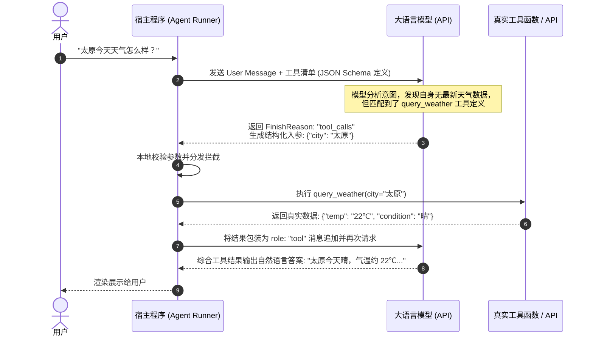
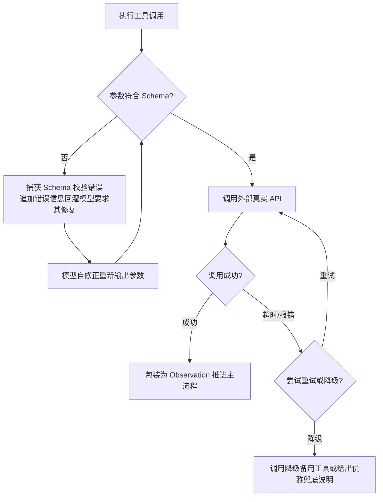

# 03 工具调用与 MCP 开放协议深度解析

> 返回上级：[[00_智能体应用开发求职与学习路线总览]]

---

## 一、 Function Calling（工具调用）底层运行机制

很多初学者误以为“大模型可以直接帮我发送邮件或执行 SQL”。实际上：**LLM 本身不具备任何代码执行能力，它本质上只是一个高阶的文本模式预测器**。

### 1. 工具调用的端到端标准时序



### 2. Tool Schema 设计黄金法则
工具的描述（Description）是指导模型决策的**“定向提示词”**，设计优劣直接决定了模型是否会错选、滥选或漏选工具：
1. **命名清晰精准**：采用动宾结构，例如 `search_flight`、`query_user_profile`，避免模糊的 `handle_data`。
2. **详细描述应用场景与边界**：
   - 描述内容不仅要说明“能做什么”，更要明确**“在什么情况下严禁调用此工具”**。
   - 例：“用于查询公开上市公司近三年财务报表。严禁用于查询未上市企业或个人税务数据。”
3. **参数类型与必填项严谨**：
   - 充分利用 `enum` 限制取值范围（如 `sort_by: ["asc", "desc"]`）。
   - 善用字段说明（`description`）指导入参格式（例如日期格式强制约定 `YYYY-MM-DD`）。

---

## 二、 Model Context Protocol (MCP) 开放协议专题

在 2024~2026 年，Anthropic 开源并发起的 **Model Context Protocol (MCP)** 已迅速成为整个 AI 智能体行业的事实标准，被称为 **“AI 时代的 USB-C 接口”**。

### 1. 为什么需要 MCP？解决什么行业痛点？
- **传统痛点（碎片化与孤岛）**：
  - 过去在 LangChain 写一个 Tool，换到 LlamaIndex 要重写一份；换到 Dify 又要包装成 DSL 插件；换到 Claude Desktop 或 Cursor 又是另一套协议。
  - 数据源（Postgres、Notion、GitHub、本地文件系统）与各种 Agent 宿主之间存在巨大的 $M \times N$ 接入复杂度。
- **MCP 解决方案**：
  - 定义统一的跨平台协议标准，使得**“任意 MCP Client（Cursor / Claude / 自研Agent框架）可以即插即用连接任意 MCP Server”**。

```mermaid
graph LR
    subgraph MCP Clients [大模型宿主 / 客户端]
        C1[Claude Desktop]
        C2[Cursor / Antigravity]
        C3[自研企业级 Agent 平台]
    end

    subgraph MCP Standard Protocol [MCP 统一协议层 (JSON-RPC 2.0)]
        direction TB
        Proto[基于 stdio 或 SSE 传输]
    end

    subgraph MCP Servers [能力与数据源服务器]
        S1[GitHub MCP Server]
        S2[Postgres / SQLite Server]
        S3[Obsidian 知识库 Server]
        S4[企业自研 ERP/CRM Server]
    end

    C1 --> Proto
    C2 --> Proto
    C3 --> Proto
    Proto --> S1
    Proto --> S2
    Proto --> S3
    Proto --> S4
```

### 2. MCP 核心三要素架构

| 概念 | 职能定位 | 访问权限 | 典型应用场景 |
| :--- | :--- | :--- | :--- |
| **Resources** | 外部上下文只读数据（类似静态或动态只读文件） | Read-Only | 暴露系统文件、数据库只读视图、静态配置日志。 |
| **Prompts** | 针对该系统封装的预设交互模板 | Read-Only | 预制的代码审查规范、研报总结框架。 |
| **Tools** | 可执行函数，能改变外部系统状态 | Read-Write | 写入数据库、创建 Pull Request、运行 Shell 命令。 |

### 3. 两种核心传输协议（Transports）
1. **`stdio`（标准输入输出通道）**：
   - 宿主进程以子进程（Child Process）方式拉起 MCP Server，通过 `stdin/stdout` 交换 JSON-RPC 消息。
   - **特点**：延迟极低、无端口暴露风险、安全性高，是本地桌面与单机 Agent 插件的最佳选择。
2. **`sse`（Server-Sent Events + HTTP POST）**：
   - 独立运行的网络微服务，通过 SSE 长连接接收服务端推送事件，通过 HTTP POST 提交 RPC 请求。
   - **特点**：支持跨机器、跨容器分布式部署，适合企业集中式微服务治理。

### 4. 动手实战：基于 Python FastMCP 开发生产级 Server

```python
# 安装依赖: pip install mcp
from mcp.server.fastmcp import FastMCP
from pydantic import Field

# 1. 初始化 MCP 服务实体
mcp = FastMCP("Database-Query-Agent-Service")

# 2. 注册只读资源 (Resource)
@mcp.resource("schema://users")
def get_user_schema() -> str:
    """提供用户表结构的只读 DDL 定义"""
    return """
    CREATE TABLE users (
        id INTEGER PRIMARY KEY,
        name TEXT NOT NULL,
        email TEXT UNIQUE,
        created_at TIMESTAMP DEFAULT CURRENT_TIMESTAMP
    );
    """

# 3. 注册可执行工具 (Tool)
@mcp.tool()
def query_users(
    keyword: str = Field(description="搜索用户的姓名或邮箱关键字"),
    limit: int = Field(default=5, ge=1, le=50, description="最大返回记录数，范围 1~50")
) -> str:
    """根据关键字安全检索系统中的用户信息"""
    # 模拟真实数据库查询与脱敏过滤
    if not keyword.strip():
        return "错误：搜索关键字不能为空"
    
    # 假定业务逻辑执行...
    return f"检索成功，命中记录：[User(id=101, name='张三', email='zhangsan@***.com')]"

if __name__ == "__main__":
    # 以本地标准 stdio 通道启动
    mcp.run(transport="stdio")
```

---

## 三、 环境交互与代码沙箱执行（Sandbox）

许多高级 Agent（如 Code Interpreter、数据分析 Agent）需要具备“编写 Python 脚本并即时运行绘图”的能力。

### 1. 生产环境的代码执行痛点与安全隔离
- **极度危险行为**：在宿主服务器中直接使用 `eval()`、`exec()` 或 `os.system()`。任何恶意的 Prompt 注入都可能导致整个服务器被 `rm -rf /` 清空或变成挖矿节点。
- **生产级安全隔离方案**：
  1. **容器级沙箱（Docker / Podman）**：为每个用户会话动态启动一个完全无特权的瞬态 Docker 容器（禁用公网访问、CPU/内存严格配额 `cgroups`、挂载只读根目录）。
  2. **轻量化微虚机（MicroVM）**：使用 Firecracker 虚拟机实现毫秒级启动与硬件级强隔离。
  3. **专业云沙箱服务**：接入成熟的商业/开源沙箱（如 E2B、Modal），提供即开即用的 Python/Node.js 执行环境。

---

## 四、 工具调用的工业级容错与健壮性设计

在实际生产中，工具调用常会发生：网络超时、数据库锁死、模型返回畸形参数（JSON 解析失败）等异常。一个高可用的 Agent 必须具备以下防线：



1. **参数解析自修正（Self-Correction via Error Feedback）**：
   - 当 Pydantic 抛出 `ValidationError` 时，不要直接崩溃，将错误日志原样回灌：
   - `[System Feedback]: 调用 query_users 工具失败，参数 'limit' 必须为小于等于 50 的整数，你传入了 100。请更正后重新生成参数。`
   - 大模型在看到明确的错误提示后，通常在下一次交互中自修复成功率 > 90%。
2. **工具降级与幂等性保证**：
   - 任何涉及资金扣减、邮件发送等具有**副作用（Side-effects）**的工具，必须在后端强制实现**唯一幂等键（Idempotency Key）**，防止重试导致重复扣款或重复发信。

---

## 五、 面试突围核心考核点

1. **“请向面试官解释一下 MCP 协议的底层通信机制，它与传统的 OpenAPI / Swagger 有何区别？”**
   - *回答要点*：
     - OpenAPI 主要是无状态的 REST API 静态描述协议，侧重于“定义 HTTP 请求格式”；
     - MCP 是一套专为大模型智能体设计的全双工双向交互协议（基于 JSON-RPC 2.0），不仅包含 Tools（函数执行），还抽象出 Resources（实时订阅的主动数据通知）和 Prompts（上下文预设模板）；支持双向长连接（stdio / SSE），具备状态管理与权限握手能力。
2. **“如果模型经常在需要调用工具的时候不调用，或者乱调错误的工具，你在工程上怎么解决？”**
   - *回答要点*：
     - ① **优化 Description**：使用 Few-shot 并在说明中加入显式的“反向排除规则”（例如“在用户询问近3天事实时必须调用，在用户闲聊时绝对禁止调用”）；
     - ② **API 强制约束**：在关键链路将 `tool_choice` 参数从 `"auto"` 显式指定为 `{"type": "function", "function": {"name": "target_tool"}}` 强制模型调用；
     - ③ **工具分流/路由（Tool Partitioning）**：不要一次性将 50 个工具全塞给模型，先通过意图分类器精准缩小至当前领域下的 3~5 个候选工具。
