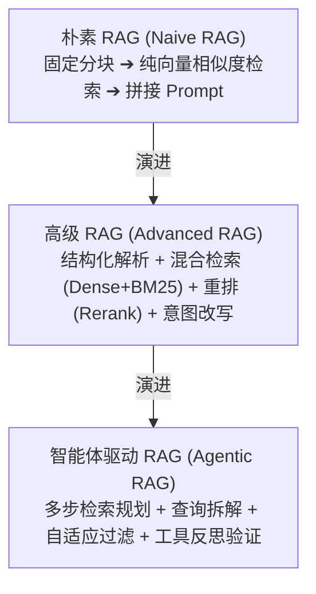

# 04 高级 RAG 与企业知识库检索架构

> 返回上级：[[00_智能体应用开发求职与学习路线总览]]

---

## 一、 RAG 与 Agent 的关系及传统 RAG 痛点

在企业级智能体应用中：**“RAG 是 Agent 的外挂长期记忆与知识获取工具，Agent 是 RAG 的高级决策调度器”**。



### 传统朴素 RAG（Naive RAG）的三大生产死穴
1. **语义割裂（Context Fragmentation）**：把 10 万字文档按每 500 字死板切分，句子被腰斩在两个 chunk 中，专有名词和代词上下文彻底丢失。
2. **纯向量检索的“专有名词盲区”**：向量模型擅长捕捉近义词（“开心”与“高兴”），但在匹配产品型号（如 `RTX-4090-D`）、工号代码、身份证号或精确定量指标时，准确率经常大幅落后于传统全文检索。
3. **低质量噪音导致模型幻觉**：检索回来的 Top-K 内容经常包含重复、过时甚至冲突的数据，大模型被大量噪音淹没，产生严重的注意力稀释或幻觉。

---

## 二、 数据预处理与分块策略（Chunking Strategies）

数据工程（Data Engineering）占据了生产级 RAG 70% 以上的调优精力。

### 1. 多格式文档解析
- **PDF/Word/Excel 解析难点**：多栏排版、跨页表格、嵌套图表、页眉页脚噪音。
- **推荐工具链**：
  - 高精度版面还原：`MinerU (Magic-PDF)`、`Docling`、`Surya`。
  - 轻量规则提取：`PyMuPDF (fitz)`、`python-docx`。
  - 表格专用抽取：将复杂表格转换为 Markdown 表格或 HTML `<table>` 格式，大模型对 Markdown 表格的理解能力远优于纯文本对齐。

### 2. 分块技术演进与选型

| 分块方案 | 原理机制 | 优缺点分析 | 适用场景 |
| :--- | :--- | :--- | :--- |
| **固定字符滑动切分** | 按固定字符数（如 512 Token）切割，保留 10%~20% 的 `chunk_overlap` 重叠区。 | 简单快速，但极易在句中截断，破坏语义连贯性。 | 粗糙初筛、平铺叙述型文本。 |
| **层级与语法感知切分** | 依据 Markdown 标题（`#`、`##`）、代码块、段落换行分块。 | 保证最小单元是一个完整的章节或代码段落。 | 技术文档、结构化排版规范的制度手册。 |
| **语义分块（Semantic Chunking）** | 计算相邻句子之间的 Embedding 余弦相似度，当相似度突变（低于特定阈值）时设立切割点。 | 语义高度聚合内聚，但分块长度不可控，且计算量较大。 | 新闻报道、无标题连续叙述文本。 |
| **上下文增强切分（Contextual Retrieval）** | 由 Anthropic 提出：在每个分块前，调用小模型结合整篇文档上下文，自动生成 50~100 字的**专属背景摘要前缀**。 | **彻底解决分块代词模糊与语境缺失**，召回率提升极其显著。 | 企业级核心知识库、长研报、法律合同。 |

---

## 三、 向量检索与混合检索（Hybrid Search）工程

### 1. 向量数据库主流选型对比
- **Milvus / Zilliz**：为亿级超大规模向量设计的分布式引擎，支持异构硬件加速（GPU），适合大型企业级平台。
- **Qdrant**：基于 Rust 编写，资源消耗低，原生支持极强的**元数据动态过滤（Payload Filtering）**，是中大型 Agent 首选。
- **PGVector**：基于 PostgreSQL 插件，适合不想额外引入独立向量数据库基础设施的中小规模业务（百万级以下），支持 ACID 事务。
- **Chroma**：纯 Python 轻量嵌入式库，极简易用，适合本地开发、单机验证与教学 Demo。

### 2. 混合检索（Hybrid Search）与 RRF 融合算法
生产环境绝对不应只使用单一的稠密向量检索，必须采用 **“稠密向量检索（Dense） + 稀疏关键词检索（BM25 / SPLADE）”** 双路召回。

```mermaid
flowchart LR
    Query[用户原始 Query] --> BranchA[Embedding 向量化]
    Query --> BranchB[分词与关键词提取]
    
    BranchA --> DenseSearch[稠密向量检索 (HNSW)<br/>捕获深层语义/同义词]
    BranchB --> SparseSearch[稀疏检索 (BM25 / Elastic)<br/>捕获专有名词/精准型号]
    
    DenseSearch --> TopDense[Top-50 结果]
    SparseSearch --> TopSparse[Top-50 结果]
    
    TopDense --> RRF[RRF 倒数排名融合算法<br/>归一化加权合并]
    TopSparse --> RRF
    
    RRF --> Rerank[Cross-Encoder 重排模型<br/>精选 Top-5 最优证据]
    Rerank --> FinalChunks[注入 Agent Prompt]
```

- **RRF（Reciprocal Rank Fusion）原理**：
  $$RRF\_Score(d) = \sum_{m \in M} \frac{1}{k + r_m(d)}$$
  其中 $M$ 为检索系统集合（如向量路与 BM25 路），$r_m(d)$ 为文档 $d$ 在该路中的排名，$k$ 为平滑常数（通常取 60）。RRF 无需校准不同检索器返回的分数刻度，只依据排名融合，稳定性极高。

---

## 四、 重排（Re-ranking）与查询重写（Query Transformation）

### 1. 为什么重排（Reranker）是 RAG 性价比最高的调优手段？
- **初筛阶段（Bi-Encoder 双塔架构）**：向量检索计算的是两个独立向量的点积/余弦相似度，Query 与 Document 之间没有任何字词级的交叉注意力交互，速度极快（毫秒级），但精准度有限。
- **重排阶段（Cross-Encoder 单塔架构）**：将 `[Query, Document]` 拼接在一起作为一个整体送入 Transformer，进行深度的 Token 交叉全注意力计算。
- **工程落地模式**：
  1. 混合检索粗筛出 Top 50 条候选；
  2. 使用 `bge-reranker-large` 或 `cohere-rerank` 重新打分；
  3. 截取最高分的 Top 3~5 条注入 Prompt。
  - **效果**：往往仅凭此一步，就能将 RAG 检索的准确率提升 15%~30%。

### 2. 进阶 Query 改写技巧
1. **多轮指代消除（Coreference Resolution）**：
   - 用户提问：“它的最新价格是多少？”
   - 改写 Agent 结合上下文重写为：“华为 Mate 70 Pro 2026年最新官方建议零售价是多少？”
2. **HyDE（假设性文档嵌入，Hypothetical Document Embeddings）**：
   - 面对抽象复杂的提问，先让 LLM 虚构一段看似合理的“理想答案文档”；
   - 使用这个虚构文档的向量去检索真实知识库。由于“假答案”与“真答案”处于同一个语义分布空间，召回率往往远高于用短提问直接检索。
3. **子查询拆解（Sub-Query Decomposition）**：
   - 将“对比比亚迪和特斯拉近三年的毛利率变化”拆解为：Query 1“比亚迪 2023-2025 年各季度毛利率”与 Query 2“特斯拉 2023-2025 年各季度毛利率”，并发检索后交由 Agent 综合。

---

## 五、 GraphRAG（图增强检索）

由微软研究院提出的 **GraphRAG**，专门解决传统 RAG 无法回答“全局总结性、宏观实体关联”问题的弊端。

### 1. 核心链路
1. **抽取（Extraction）**：利用大模型从文档中扫描抽取实体（Entities）、关系（Relationships）和声明（Claims）。
2. **建图与社区发现（Community Detection）**：构建知识图谱，应用 Leiden 聚类算法将实体划分为不同的局部图社区。
3. **分级摘要（Community Summarization）**：由大模型对每个社区生成高层级摘要报告。
4. **宏观问答**：当用户提问“本知识库的核心主旨/主要矛盾是什么？”时，系统检索各社区的高级摘要并聚合回答。
- **缺点与落地考量**：索引构建成本高昂（大模型处理 Token 消耗数十倍于普通 RAG）。在企业落地中，应根据业务收益（如金融尽调、刑侦拓扑分析）权衡引入。

---

## 六、 面试突围核心考核点

1. **“为什么做生产级 RAG 必须做混合检索和重排？直接用 OpenAI 的 Embedding 做 Top-K 不行吗？”**
   - *回答要点*：
     - 单纯向量检索有两个死穴：① 缺乏跨字词的交叉注意力，无法区分微小但致命的区别（如包含“不”、“严禁”的否定词）；② 对专有名词、代码ID、产品型号不敏感；
     - 混合检索结合了向量语义召回与 BM25 精准字面召回；
     - 重排采用 Cross-Encoder 进行全交互打分，初筛保证召回率（Recall），重排保证精确率（Precision），两者配合兼顾性能与高命中率。
2. **“如果知识库里有两篇文档内容相互矛盾，Agent 会怎么回答？如何在架构设计上解决？”**
   - *回答要点*：
     - ① **元数据时效性加权（Temporal Filtering）**：在 Payload 中存入 `created_at`、`version`，优先过滤或高权排序最新版本；
     - ② **权威度置信度分级**：为不同来源设置权限权重（如“官方正式红头文件” > “论坛讨论帖”）；
     - ③ **冲突暴露提示**：在 Prompt 中明确要求模型：“若检索到的参考文档存在明显事实冲突，请明确指出不同来源的观点差异及时间，切勿擅自择一断言”。
