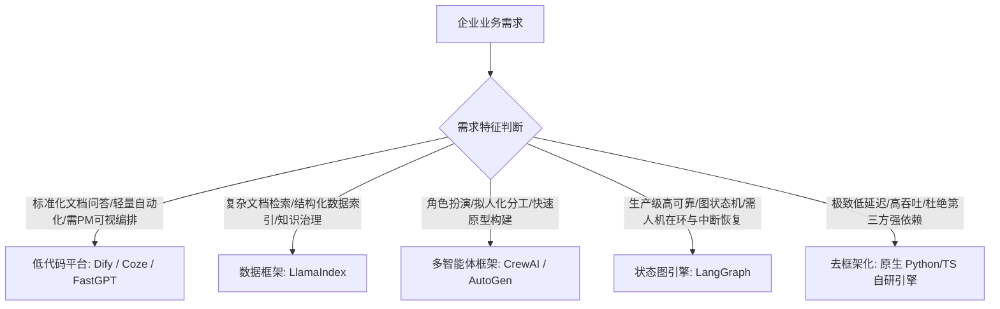

# 05 主流 Agent 开发框架与生态选型

> 返回上级：[[00_智能体应用开发求职与学习路线总览]]

---

## 一、 Agent 开发框架技术选型全景

在企业真实研发场景中，盲目选用框架或盲目自研都会导致项目延期。技术负责人的核心能力在于**根据业务场景做出最精准的技术选型**。



### 框架特性横向矩阵对比

| 框架 / 平台 | 核心定位 | 抽象层次 | 状态机支持 | 生产可靠性 | 典型上手成本 |
| :--- | :--- | :--- | :--- | :--- | :--- |
| **Dify** | 企业级 LLM 应用/工作流低代码平台 | 高 (GUI + DSL) | 良好 (Workflow) | ★★★★★ | 低 (1天即可上手配置) |
| **LangChain (传统)** | 链式 LLM 交互工具包 (LCEL) | 中高 | 差 (DAG无环结构) | ★★☆☆☆ (调试黑盒，生产不推荐) | 中等 |
| **LangGraph** | 基于图状态机（StateGraph）的循环编排 | 中低 (贴近原生) | **完美 (循环+分支+中断)** | ★★★★★ | 较高 (需深入理解状态流转) |
| **LlamaIndex** | 数据连接、索引切片与检索增强 Agent | 中 | 良好 (Workflows 事件流) | ★★★★☆ | 中等 |
| **CrewAI** | 基于角色设定（Role-play）的多智能体协作 | 高 | 较弱 (偏线性委派) | ★★★☆☆ (更适合演示Demo) | 极低 |

---

## 二、 LangGraph 深度剖析（生产级 Agent 必修核心）

### 1. 为什么说 LangGraph 是对传统 LangChain 的颠覆？
- 传统 LangChain 核心抽象是 `Chain`（链），本质是 **有向无环图（DAG）**。
- 但现实中的智能体决策必须包含：**循环（Loops）**、**反思（Reflection）**、**错误回溯** 以及 **人机协同暂停等待（Interrupt）**。DAG 在表达循环时极其臃肿。
- **LangGraph 的底层哲学**：将智能体建模为一个 **状态机图（StateGraph）**。

### 2. LangGraph 核心架构四大要素
1. **State（全局状态）**：一个类型化的字典或 Pydantic 对象，在图的所有节点间共享传递。
2. **Reducers（状态归约器）**：定义某个字段在更新时如何合并。例如 `Annotated[list, add_messages]` 表示新消息是追加（Append）而不是覆盖（Overwrite）。
3. **Nodes（节点）**：纯 Python 函数或异步函数，接收当前 `State`，执行逻辑（调用模型或执行工具），返回增量状态变更字典。
4. **Edges（边）**：
   - 普通边：节点 A 执行完毕无条件跳转至节点 B；
   - **条件边（Conditional Edge）**：根据节点返回的状态（如模型是否输出了 `tool_calls`），动态决策下一步走向工具执行节点还是走向 `END` 结束。

### 3. LangGraph 最小化实战代码架构

```python
from typing import Annotated, Literal
from typing_extensions import TypedDict
from langchain_core.messages import BaseMessage, HumanMessage, AIMessage
from langgraph.graph import StateGraph, START, END
from langgraph.graph.message import add_messages
from langgraph.checkpoint.memory import MemorySaver

# 1. 定义状态结构
class AgentState(TypedDict):
    messages: Annotated[list[BaseMessage], add_messages]

# 2. 定义节点逻辑
def chatbot_node(state: AgentState) -> dict:
    # 模拟大模型推理
    latest_msg = state["messages"][-1].content
    if "查询" in latest_msg:
        # 模拟触发工具调用
        return {"messages": [AIMessage(content="", additional_kwargs={"need_tool": True})]}
    return {"messages": [AIMessage(content="您好，这是普通的回答。")]}

def tool_node(state: AgentState) -> dict:
    # 模拟工具执行并写回数据
    return {"messages": [AIMessage(content="[工具执行结果]: 数据已同步成功。")]}

# 3. 动态条件边路由决策
def route_decision(state: AgentState) -> Literal["tools", END]:
    last_message = state["messages"][-1]
    if last_message.additional_kwargs.get("need_tool"):
        return "tools"
    return END

# 4. 构建图结构
workflow = StateGraph(AgentState)
workflow.add_node("chatbot", chatbot_node)
workflow.add_node("tools", tool_node)

workflow.add_edge(START, "chatbot")
workflow.add_conditional_edges("chatbot", route_decision)
workflow.add_edge("tools", "chatbot") # 形成循环：工具执行完毕将结果送回大模型

# 5. 挂载记忆检查点并编译
app = workflow.compile(checkpointer=MemorySaver())
```

---

## 三、 LlamaIndex 架构特色：数据驱动的 Agentic RAG

如果业务重心是**围绕海量私有数据、复杂异构文档、数据库结构构建智能问答 Agent**，LlamaIndex 是生态中最强劲的利器。
- **Core Abstractions**：
  - `Document` & `Nodes`：统一数据容器。
  - `QueryEngine`：单次检索合成。
  - `RouterQueryEngine`：根据 Query 自动在“摘要索引”与“向量索引”之间做路由选择。
  - `SubQuestionQueryEngine`：自动将复合问题分解为多个子问题分别查询各数据源。

---

## 四、 工业界的“去框架化（Vanilla）”浪潮与自研架构

在很多头部 AI 公司（包括 OpenAI、Anthropic、智谱等技术团队的底层生产系统中），往往**并不直接引入庞大的第三方框架**，而是采用原生轻量封装。

### 1. 为什么头部团队倾向于“去框架化”？
1. **依赖黑盒与升级破坏（Breaking Changes）**：重型框架迭代极快，内部源码层层封装抽象（例如一个 Prompt 调用经历十层继承），难以排查死锁与并发泄漏。
2. **性能与延迟损耗**：框架内部大量隐式钩子、自动序列化与深拷贝对高并发网关带来额外 CPU 与内存损耗。
3. **架构自由度**：自研轻量调度循环仅需 300~500 行核心代码，团队对每一行执行逻辑、异常捕获、流控和监控埋点拥有 100% 绝对掌控权。

### 2. 生产级原生 ReAct 调度核心骨架
```python
class VanillaAgent:
    def __init__(self, llm_client, tools_map, max_steps=10):
        self.client = llm_client
        self.tools = tools_map
        self.max_steps = max_steps

    async def run(self, user_query: str, history: list) -> str:
        messages = history + [{"role": "user", "content": user_query}]
        
        for step in range(self.max_steps):
            response = await self.client.generate(messages, tools=self.tools.schemas())
            messages.append(response.message)
            
            # 若无工具调用，直接输出最终答案
            if not response.tool_calls:
                return response.content
            
            # 存在工具调用：并发执行所有返回的工具
            for call in response.tool_calls:
                tool_func = self.tools.get(call.function.name)
                obs = await tool_func(**call.function.arguments)
                messages.append({"role": "tool", "tool_call_id": call.id, "content": str(obs)})
                
        return "执行超时：已达单次任务最大思考步数。"
```

---

## 五、 面试突围核心考核点

1. **“请详细聊聊 LangChain 和 LangGraph 的区别？为什么 LangGraph 更适合做复杂 Agent？”**
   - *回答要点*：
     - LangChain 早期以 `Chain` 模式为主，本质是单向流水线（DAG），一旦需要处理条件判断、步骤重试、反思纠错等多轮循环，代码会极其别扭脆弱；
     - LangGraph 将执行流抽象为“状态图”，以明确的全局 State 为中心，支持循环回环、条件边分支、跨节点持久化快照（Checkpointer），原生支持人机在环暂停与重放，是真正的生产级状态机。
2. **“在构建大型企业 Agent 项目时，你倾向于使用现成框架还是自研原生核心？你的权衡考量是什么？”**
   - *回答要点*：
     - **PoC与初创期**：优先采用 LangGraph 或 Dify，快速验证商业模式和用户链路，缩短交付周期；
     - **核心大并发核心链路**：建议“去框架化”或基于 LangGraph 思想自研轻量内核。核心诉求在于降低网络与封装开销、完全掌控异常堆栈、无缝对齐企业自研的分布式链路追踪与审计规范。
