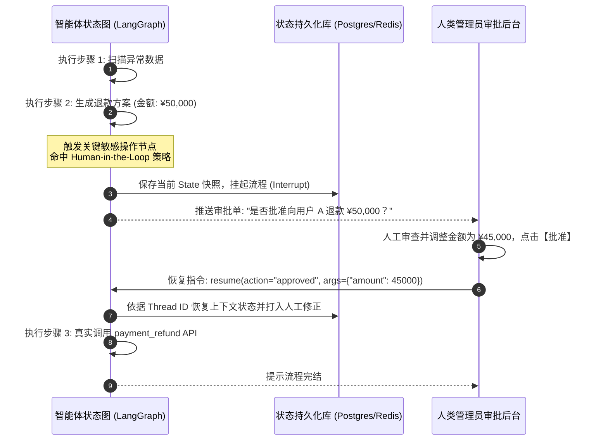

# 06 记忆系统设计与状态持久化

> 返回上级：[[00_智能体应用开发求职与学习路线总览]]

---

## 一、 智能体记忆系统分层模型

大语言模型原生是**无状态的（Stateless）**，每一次 API 请求对于模型而言都是一张全新的白纸。要让 Agent 具备长程任务处理能力并拥有“持续学习”的个性，必须构建一套分层记忆架构。

```mermaid
graph TD
    subgraph Memory Architecture [智能体分层记忆系统]
        direction TB
        
        subgraph Working Memory [短期 / 工作记忆 (Working Memory)]
            WM1[当前会话上下文 Window]
            WM2[工具执行临时缓冲]
            WM3[动态摘要压缩 Summary]
        end
        
        subgraph Long-Term Memory [长期记忆 (Long-term Memory)]
            LM1[实体与用户画像记忆 Entity/Profile<br/>偏好/习惯/关键事实 (SQL/KV)]
            LM2[情景经验记忆 Episodic Memory<br/>历史任务成功执行轨迹 (向量库)]
            LM3[语义知识记忆 Semantic Memory<br/>企业通用规章/制度/文档 (RAG)]
        end
    end
```

---

## 二、 短期与工作记忆管理工程

当会话轮次变长时，若直接把所有历史消息全量送入大模型，会迅速面临三大恶果：
1. **Token 费用与延迟飙升**；
2. **上下文超限（Context Limit Exceeded）**；
3. **注意力稀释（Lost in the Middle）**：模型在冗长的对话中逐渐遗忘最初设定的约束和目标。

### 常用短期记忆治理策略对比

| 治理策略 | 原理机制 | 优缺点分析 | 适用场景 |
| :--- | :--- | :--- | :--- |
| **滑动窗口（Sliding Window）** | 仅保留最近 $N$ 轮对话，超出部分直接丢弃。 | 实现极简、零额外延迟；但容易彻底遗失早期关键信息（如用户最初设定的核心要求）。 | 轻量闲聊助手、单一工具交互。 |
| **动态增量摘要（Summary Buffer）** | 设定 Token 阈值，当对话达到阈值时，触发后台小模型将早期对话提炼为一段摘要追加在上下文头部，保留最新 $K$ 条原始对话。 | 兼顾长上下文历史与低 Token 消耗；但需要额外的 LLM 调用开销，摘要可能遗漏极冷僻细节。 | 连续多轮复杂任务协商、项目管理助手。 |
| **工具结果精准剪枝（Tool Pruning）** | 工具执行产生的超大原始数据（如几万字的爬虫 HTML 或完整 SQL 数据集）不全量长期留在上下文中，仅保留精炼后的关键指标。 | 大幅压缩 Token，同时保留事实依据。 | 数据分析、爬虫信息提取 Agent。 |

---

## 三、 长期记忆（Long-term Memory）系统构建

长期记忆旨在跨越不同的会话 Session，使 Agent 具备“记住用户是谁、喜好是什么、上次遇到类似问题怎么解决”的能力。

### 1. 用户画像与实体记忆（Profile & Entity Memory）
- **实现机制**：
  1. **异步抽取监听**：在会话主链路之外，通过异步消息队列（如 Redis Stream / Kafka）消费对话记录。
  2. **事实提炼 Prompt**：让轻量模型分析当前对话中是否包含用户的永久性画像特征（例如“我不吃香菜”、“我习惯用 TypeScript 开发”、“我的公司在太原”）。
  3. **结构化持久化**：将提取到的键值对写入关系型数据库或 Redis Hash：
     ```json
     {
       "user_id": "usr_9527",
       "tech_stack": ["Python", "LangGraph", "Docker"],
       "preferred_language": "Chinese",
       "constraints": ["讨厌冗长废话", "需要给出可运行代码"]
     }
     ```
  4. **动态注入**：在用户开启新会话时，由网关拉取画像并自动注入到 System Prompt 的 `<user_preferences>` 标签中。

### 2. 情景经验记忆（Episodic Memory / Few-Shot 经验召回）
- **实现机制**：
  - 当 Agent 成功解决了一个极端复杂的排错任务或完成了长链路跨系统操作后，将该任务的 **`[原始需求 + 任务规划方案 + 工具调用序列 + 关键纠偏总结]`** 形成一个结构化复盘案例（Case）。
  - 将该 Case 转化为 Embedding 存入向量数据库。
  - **下次遇到相似复杂任务时**：通过语义检索召回 Top-2 最相关的历史成功经验，作为 Few-shot 注入给规划模型。使模型具备“越用越聪明”的自主进化能力。

---

## 四、 生产级状态持久化与人机在环（Human-in-the-Loop）

在金融交易、医疗诊断、企业审批等严肃领域，完全放任 Agent 自主做决策并直接执行高危工具（如删除服务器、批量转账、向外网客户群发邮件）是绝对无法接受的。**系统必须支持“人机协同中断与断点恢复”**。



### 1. LangGraph Checkpointer 机制
- **Thread ID（线程隔离）**：每个用户会话被分配唯一的 `thread_id`。
- **快照与回滚（Time-Travel）**：Checkpointer 会记录状态流转的每一个 Step 快照。如果某一步骤发生意料之外的错误，不仅可以从断点重试，甚至可以“时间旅行（Time-travel）”回退到任意历史节点重新执行分支。
- **后端持久化选型**：
  - 本地测试：`MemorySaver`（内存，进程关闭丢失）。
  - 生产高可用：`AsyncPostgresSaver` 或 `RedisSaver`。

---

## 五、 面试突围核心考核点

1. **“长期记忆如果不断累积，会不会把 Context 挤爆？如何设计长效淘汰与防膨胀机制？”**
   - *回答要点*：
     - ① **语义相似度检索筛选（Top-K RAG）**：不全量加载所有长期记忆，只在检索到与当前 Query 相似度高于 0.75 时才加载 Top 3~5 条；
     - ② **记忆时效衰减机制（Memory Decay）**：引入艾宾浩斯遗忘或时间衰减公式，根据“重要性评分（Importance）”与“最后访问时间（Recency）”计算综合分，淘汰长期未激活且低价值的陈旧记忆；
     - ③ **冲突事实覆盖**：当提取到相互矛盾的新记忆时（如“我已经换用 Go 开发”覆盖“我使用 Java”），触发实体状态更新而非无脑叠加。
2. **“什么是 Human-in-the-Loop？在智能体工程中具体如何落地？”**
   - *回答要点*：
     - 指智能体在执行具备不可逆破坏性或高价值外部操作前，主动触发状态中断（Suspend/Interrupt），将上下文持久化落盘，等待人工确认或修正参数后再唤醒推进；
     - 在 LangGraph 中可通过 `interrupt()` 原生方法挂起当前线程状态，结合持久化存储（如 PostgresSaver），通过前端审批界面注入用户修改后的状态命令继续流转。
