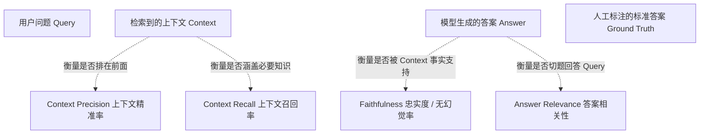

# 07 工程化落地、评测与可观测性（LLMOps）

> 返回上级：[[00_智能体应用开发求职与学习路线总览]]

---

## 一、 Agent 生产落地的“Demo 陷阱”与现实挑战

在实验室或本地跑通一个玩具级的 Agent Demo 只需要半天时间，但要将 Agent 部署到企业级生产环境服务百万用户，往往面临四大深水区痛点：
1. **非确定性（Non-deterministic）**：同样的输入，模型今天回答正确，明天升级小版本或采样微动后输出格式错乱。
2. **长链路排错黑盒**：一个经历 10 个步骤（思考 -> 调工具 -> 反思 -> 调工具）的长任务，如果在第 7 步由于输入参数漂移导致错误，传统日志只能看到“最终超时”或“输出错误”，极难快速定位病灶根因。
3. **成本与延迟失控**：复杂任务一次执行消耗数十万 Token，单次调用费用高达数元人民币，首字延迟甚至高达 30 秒。
4. **缺乏回归测试基准**：修改了一句 System Prompt，看似解决了一个 Bad Case，却悄无声息地破坏了原本正常的另外 20% 业务场景。

---

## 二、 链路追踪与全生命周期可观测性（Observability）

传统微服务 APM（如 Prometheus、SkyWalking）主要关注 CPU、内存、HTTP 状态码。而 **LLMOps 可观测性必须深入到 Token 级、Prompt 级与思维轨迹（Trace/Span）级**。

### 1. 行业主流可观测工具栈对比
- **Langfuse（生产首选、开源第一）**：
  - 支持 Docker 一键私有化部署（符合数据合规与金融安全要求）。
  - 核心抽象：**Trace（整个请求链路）**、**Span（具体执行单元/工具耗时）**、**Generation（LLM模型单次调用详情及Token消耗）**、**Score（用户反馈与自动评分）**。
- **Arize Phoenix**：支持 OpenInference 标准，深度集成可解释性分析。
- **LangSmith**：LangChain 官方托管云服务，开箱即用，但私有化部署成本较高。

### 2. Langfuse 最小化接入实战

```python
import os
from langfuse import Langfuse
from langfuse.openai import openai # 自动包装的官方 drop-in 替换

# 1. 环境变量配置
os.environ["LANGFUSE_PUBLIC_KEY"] = "pk-lf-..."
os.environ["LANGFUSE_SECRET_KEY"] = "sk-lf-..."
os.environ["LANGFUSE_HOST"] = "https://cloud.langfuse.com" # 或私有化部署地址

# 2. 像原生 OpenAI 一样调用，底层全自动记录 Trace、Token 计费与耗时
response = openai.chat.completions.create(
    model="gpt-4o-mini",
    name="financial_analyzer_agent",
    metadata={"user_id": "u_8848", "env": "production"},
    messages=[{"role": "user", "content": "分析山西汾酒2025年Q3财报营收增速"}],
    temperature=0.1
)

print(response.choices[0].message.content)
```

---

## 三、 智能体评估与基准体系（Evaluation）

**“没有可量化评测指标的 Agent 绝不能上线”**。企业级评测由 RAG 评测与 Agent 决策轨迹评测构成。

### 1. RAG 专属评测：Ragas 框架四大黄金指标



- **Faithfulness（忠实度）**：从生成的 Answer 中拆解出独立的陈述句（Claims），计算有多少比例的陈述句可以在 Context 中找到明确的事实支撑。若得分低，说明模型在**严重产生幻觉**。
- **Context Precision（精准率）**：高相关性的分块是否排在检索结果的前列。

### 2. Agent 轨迹与决策评测
- **Tool Selection Accuracy（工具选择准确率）**：面对特定测试场景，Agent 是否挑选了预期的正确工具。
- **Tool Parameter Validity（参数有效性）**：模型生成的参数是否符合强 Schema 约束，且符合业务语义边界。
- **Task Success Rate（端到端任务成功率）**：长链路执行最终是否正确达成目标。
- **Step Count Distribution（执行步数分布）**：用于识别 Agent 是否出现无效打转或步数过长。

### 3. LLM-as-a-Judge（大模型做裁判）实操规范
由于人工标注成本极高，工业界广泛使用能力更强大的模型（如 GPT-4o / Claude 3.5 Sonnet）担任裁判：
- **防范评判偏见**：
  1. **位置偏见（Position Bias）**：多项对比打分时交换顺序做两次评判取平均。
  2. **冗长偏见（Verbosity Bias）**：模型往往倾向于给字数多的长文本打高分。必须在 Judge Prompt 中严格限制“字数多少不纳入评分考量，只看论据充分性”。
  3. **明确 Rubrics（打分量表）**：给出 1~5 分的严格锚定标准与 Few-shot 评判案例。

---

## 四、 性能优化与成本控制（FinOps）

### 1. Prompt Caching（提示词前缀缓存）
- **核心原理**：大模型厂商（Anthropic、OpenAI、DeepSeek 等）提供 KV Cache 复用技术。只要请求的前缀 Token（如超长系统设定、数十页参考文档）与之前的请求保持字节级一致，模型服务器直接读取已缓存的 KV Cache。
- **收益**：缓存命中的 Token 计费通常**立减 50%~80%**，首字延迟（TTFT）缩减 50% 以上。
- **Agent 设计规范**：**将静态内容（System Prompt、标准工具定义、长期文档）放置在消息最前面**，将动态变量（时间戳、用户输入）放置在最尾部，最大化缓存命中率。

### 2. 动态模型分级路由（Model Cascading）
绝不能所有任务无脑全部请求高昂的顶级模型：
- **Tier 1 (小模型 / 本地模型)**：用于意图分类、实体抽取、敏感词审核、Query 改写、简单 SQL 生成（如 Qwen2.5-7B、GPT-4o-mini）。
- **Tier 2 (旗舰模型)**：仅在进入复杂全局任务拆解、多模态图表推理、代码自修复等高智力节点时动态调起。
- **收益**：在不牺牲最终任务准确率的前提下，整体系统成本降低 60%~80%。

---

## 五、 安全护栏（Guardrails）与合规治理

- **输入拦截（Input Guardrails）**：
  - 拦截越狱攻击（Jailbreaking）、SQL/Prompt 注入；
  - 敏感词字典匹配与轻量级分类模型（如 Llama Guard）。
- **输出拦截（Output Guardrails）**：
  - **PII（个人敏感隐私）实时脱敏**：使用正则和 NER 模型对输出文本中的手机号、身份证号、银行卡号做掩码替换（`138****0000`）。
  - 事实可信度阈值：若模型生成的回答置信度过低，拦截输出并触发兜底回复。

---

## 六、 面试突围核心考核点

1. **“如果上线后用户反馈 Agent 经常答非所问或者陷入卡死，你平时怎么排查和监控这类问题？”**
   - *回答要点*：
     - ① **调出 Langfuse 链路追踪 Trace**：通过 Trace ID 定位到具体会话，查看是在哪个 Step（哪一步模型推理或工具执行）出现分歧；
     - ② **分析 Generation 原始 Payload**：检查此时的 System Prompt、注入的 Context 是否有噪音污染，检查模型的 Thought 字段是否产生逻辑偏差；
     - ③ **检查工具执行返回 Observation**：确认外部 API 是否返回了超时错误或异常格式；
     - ④ **提炼 Bad Case 加入回归评测集**：修复 Prompt 或逻辑后，运行自动化评估流水线，验证本次修复未引入副作用。
2. **“在保证回答质量的前提下，你们团队是如何降低大模型 Token 成本的？”**
   - *回答要点*：
     - ① **落地 Prompt Caching**：合理设计 Prompt 结构，确保前缀静态化，利用服务商 KV Cache 降低 80% 静态前缀计费；
     - ② **意图分级与模型路由**：将分类、抽取等低熵任务分流给 Mini/Flash 小模型；
     - ③ **工具返回数据剪枝**：对 API 返回的大量 Raw JSON 做字段过滤再送给模型；
     - ④ **动态上下文滑动压缩**：采用增量摘要避免无限制无脑拼接多轮历史。
