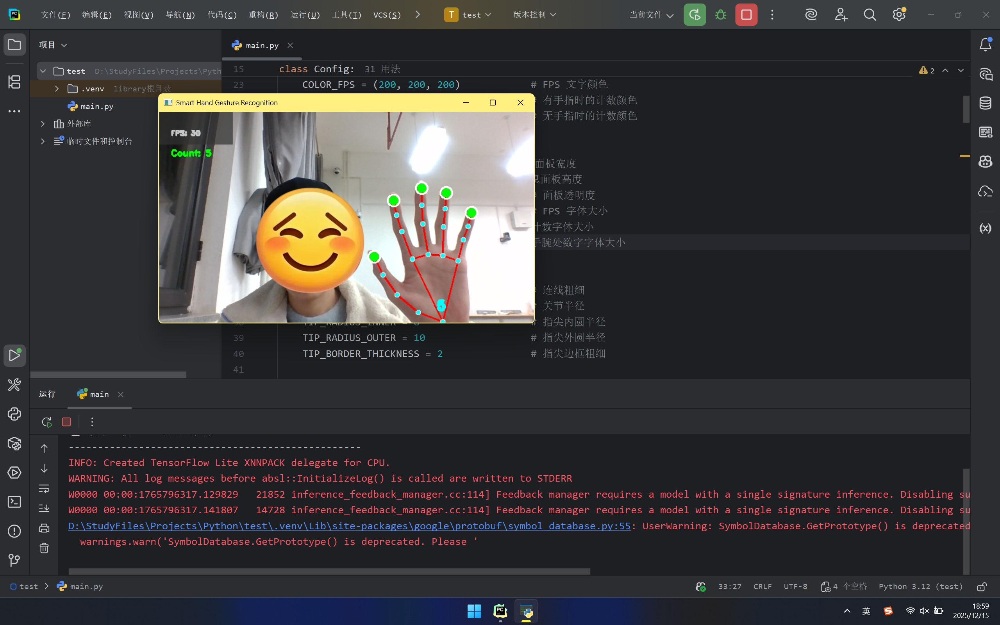
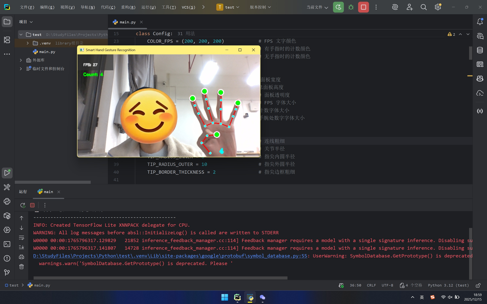
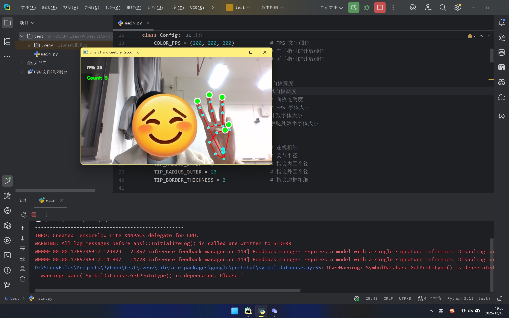
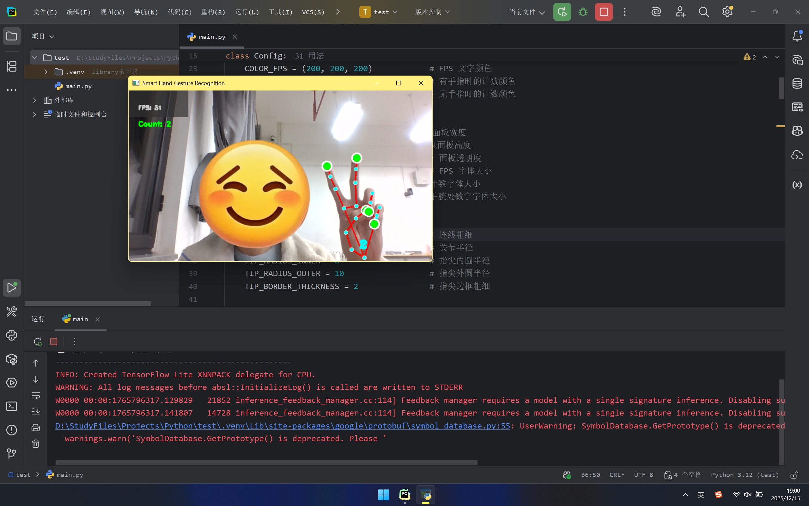
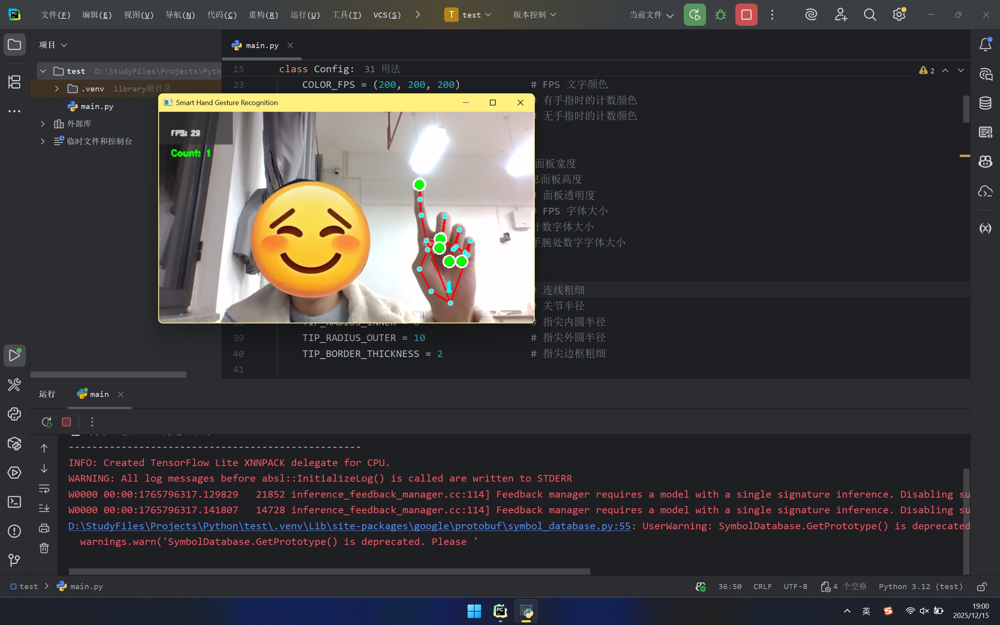

# 👋 手势识别系统 (Hand Gesture Recognition System)

> 基于 OpenCV 和 MediaPipe 的实时手势识别与手指计数应用。

本项目由**李煊烨**开发，旨在提供一个流畅、美观且高精度的手势识别解决方案。系统能够通过摄像头实时捕获手部动作，绘制骨骼关键点，并准确计算手指数量。

## ✨ 主要功能

- **🖐 多手检测**：支持同时检测和追踪多只手（默认为 2 只）。
  
- **🔢 实时计数**：精准的手指计数算法，针对拇指和其他四指采用了不同的几何判断逻辑，支持左右手自动识别。
  
- **🎨 精美 UI**：
  
    - **HUD 信息面板**：左上角半透明面板显示实时 FPS 和总手指计数。
      
    - **动态手腕显示**：在每只手的手腕处跟随显示当前手的手指数量。
      
    - **风格化骨骼**：自定义绘制风格，包含双层指尖圆圈特效和不同颜色的关节连线。
    
- **🚀 性能优化**：内置 FPS 平滑算法，计算 10 帧平均值，使数值显示更稳定。
  

## 🛠️ 依赖环境

在运行本项目之前，请确保您的环境中已安装 Python 3.x，并安装以下依赖库：

Bash

```
pip install opencv-python mediapipe
```

## 🚀 快速开始

1. **下载代码**：将本项目代码保存为 `main.py`（或其他您喜欢的名字）。
   
2. **连接摄像头**：确保您的电脑已连接摄像头。
   
3. **运行程序**：
   

Bash

```
python main.py
```

4. **操作说明**：
   
    - 程序启动后会自动打开摄像头窗口。
      
    - 将手放入画面中即可看到识别效果。
      
    - 按键盘上的 **`ESC`** 键退出程序。
      

## ⚙️ 配置说明

代码中内置了 `Config` 类，您可以根据需要直接在代码头部修改参数：

Python

```
class Config:
    # 界面颜色自定义 (BGR格式)
    COLOR_CONNECTIONS = (255, 255, 0)  # 骨骼连线颜色
    COLOR_TIPS = (0, 255, 0)           # 指尖颜色
    
    # 核心参数
    MAX_HANDS = 2                      # 最大检测手部数量
    DETECTION_CONFIDENCE = 0.75        # 检测置信度
    camera_width = 640                 # 摄像头分辨率宽
    # ... 更多配置请查看代码 Config 类
```

## 📂 项目结构

- **`Config`**: 集中管理所有常量、颜色、UI 尺寸和算法阈值。
  
- **`HandDetector`**: 核心检测类。封装了 MediaPipe 的 `hands` 解决方案，包含：
  
    - `find_hands()`: 处理图像并绘制自定义风格的骨骼。
      
    - `get_finger_count()`: 计算手指数量（包含左右手拇指方向判断逻辑）。
    
- **`FPSCalculator`**: 使用 `deque` 实现滑动窗口平均值计算，提供稳定的帧率显示。
  
- **`draw_ui`**: 负责绘制 HUD 面板、文字和动态数据。
  

## 📸 成果演示

下图展示了系统在实时运行中的效果，包括骨骼绘制、手指计数和 UI 面板：











---

**作者**: 李煊烨

**创建时间**: 2025/12/14

**技术栈**: Python, OpenCV, MediaPipe