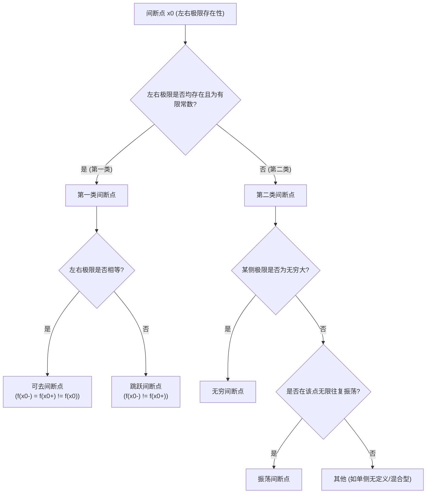

[[../数学 MOC|← 返回 数学 MOC]]

# 间断点分类及判定

> [!note]
> 间断点是考研数学高等数学部分（函数、极限与连续性）的高频核心考点，熟练掌握其定义、分类逻辑以及求法是解答该题型的关键。

---

## 一、 概念定义

设函数 $f(x)$ 在点 $x_0$ 的某去心邻域 $U(x_0, \delta)$ 内有定义。如果函数 $f(x)$ 在点 $x_0$ 处满足下列三种情况之一，则称 $x_0$ 为 $f(x)$ 的**间断点**（不连续点）：
1. 函数 $f(x)$ 在 $x = x_0$ 处**没有定义**；
2. 函数 $f(x)$ 在 $x = x_0$ 处有定义，但极限 $\lim_{x \to x_0} f(x)$ **不存在**；
3. 函数 $f(x)$ 在 $x = x_0$ 处有定义，且极限 $\lim_{x \to x_0} f(x)$ 存在，但该极限值**不等于**函数值，即 $\lim_{x \to x_0} f(x) \neq f(x_0)$。

---

## 二、 核心分类与判定

间断点的分类完全由该点处的左极限 $f(x_0^-) = \lim_{x \to x_0^-} f(x)$ 与右极限 $f(x_0^+) = \lim_{x \to x_0^+} f(x)$ 的存在性决定：

### 1. 第一类间断点

**定义条件**：**左右极限均存在（且均为有限常数）**。
- **可去间断点**：左右极限相等，但该极限值不等于函数值（或函数在该点无定义）。
  $$f(x_0^-) = f(x_0^+) = A \quad (\text{但 } A \neq f(x_0) \text{ 或 } f(x_0) \text{ 无定义})$$
- **跳跃间断点**：左右极限均存在，但不相等。
  $$f(x_0^-) = A, \quad f(x_0^+) = B \quad (A \neq B)$$
  跳跃度（跳跃高度）定义为：
  $$\Delta = |f(x_0^+) - f(x_0^-)|$$

### 2. 第二类间断点

**定义条件**：**左右极限至少有一个不存在（或为无穷大）**。
- **无穷间断点**：当 $x \to x_0$ 时（或单侧趋近时），函数极限为无穷大。即：
  $$f(x_0^-) = \infty \quad \text{或} \quad f(x_0^+) = \infty$$
- **振荡间断点**：当 $x \to x_0$ 时，函数值在两个常数之间无限次地往复振荡，极限不存在。例如 $y = \sin\frac{1}{x}$ 在 $x=0$ 处。
- **混合型间断点**：一侧属于第一类，另一侧属于第二类。例如 $f(x) = e^{\frac{1}{x}}$ 在 $x=0$ 处：
  - 左极限：$\lim_{x \to 0^-} e^{\frac{1}{x}} = 0$（存在）；
  - 右极限：$\lim_{x \to 0^+} e^{\frac{1}{x}} = +\infty$（不存在）。
  - 因右极限不存在，所以整体仍属于第二类间断点。

---

## 三、 考点与典型题型分析

### 1. 考研常见命题方式
- 给定一个具体初等函数或分段函数，求出其所有的间断点并指出其类型。
- 将间断点分类与导数的连续性、可导性问题结合考查。

### 2. 典型例题与解析

> [!example] 经典例题
> 求函数 $f(x) = \frac{e^{\frac{1}{x-1}} \cdot \ln(1+x)}{x^2 - 1}$ 在定义域范围内的所有间断点，并指出其具体类型。

**详细解析步骤**：
1. **确定无定义点（疑似间断点）**：
   - 考虑分母：$x^2 - 1 = 0 \implies x = \pm 1$；
   - 考虑指数分母：$x - 1 = 0 \implies x = 1$；
   - 考虑对数真数定义域：$1+x > 0 \implies x > -1$。
   - 综合上述条件，该函数的定义域为 $(-1, 1) \cup (1, +\infty)$。
   - 因此，在 $x > -1$ 的范围内，疑似间断点为：$x = -1$（左边界点，且分母为0）和 $x = 1$（分母为0）。

2. **讨论间断点 $x = -1$（由于定义域要求 $x > -1$，仅需讨论右极限）**：
   - 当 $x \to -1^+$ 时，分母 $x^2 - 1 \to 0^-$，分子中 $\ln(1+x) \to -\infty$，指数部分 $e^{\frac{1}{x-1}} \to e^{-1/2}$。
   - 计算极限：
     $$\lim_{x \to -1^+} f(x) = \lim_{x \to -1^+} \frac{e^{\frac{1}{x-1}} \ln(1+x)}{(x-1)(x+1)} = \frac{e^{-1/2} \cdot (-\infty)}{-2 \cdot 0^+} = +\infty$$
   - 因为右极限为无穷大，所以 $x = -1$ 是**第二类无穷间断点**。

3. **讨论间断点 $x = 1$**：
   - 需要分别计算其左极限与右极限。
   - **左极限 $f(1^-)$**：当 $x \to 1^-$ 时，$\frac{1}{x-1} \to -\infty \implies e^{\frac{1}{x-1}} \to 0$。
     考虑极限形式：
     $$f(1^-) = \lim_{x \to 1^-} \frac{e^{\frac{1}{x-1}}}{x-1} \cdot \frac{\ln(1+x)}{x+1}$$
     令 $t = \frac{1}{x-1} \to -\infty$，由幂指函数极限性质，$\lim_{t \to -\infty} t e^t = 0$，所以 $\lim_{x \to 1^-} \frac{e^{\frac{1}{x-1}}}{x-1} = 0$。
     又因为 $\lim_{x \to 1^-} \frac{\ln(1+x)}{x+1} = \frac{\ln 2}{2}$。
     因此，$f(1^-) = 0 \times \frac{\ln 2}{2} = 0$。
   - **右极限 $f(1^+)$**：当 $x \to 1^+$ 时，$\frac{1}{x-1} \to +\infty \implies e^{\frac{1}{x-1}} \to +\infty$。
     考虑极限形式：
     $$f(1^+) = \lim_{x \to 1^+} \frac{e^{\frac{1}{x-1}}}{x-1} \cdot \frac{\ln(1+x)}{x+1} = (+\infty) \cdot \frac{\ln 2}{2} = +\infty$$
   - 因为右极限不存在（为无穷大），所以 $x = 1$ 是**第二类无穷间断点**。

### 3. 常见避坑与防错

> [!warning] 易错点提示
> 1. **“极限为无穷大”属于极限不存在**！有些同学会误将无穷间断点归入第一类，切记第一类间断点的左右极限必须是**有限常数**。
> 2. **忽略方向性**：在分析含有 $e^{\frac{1}{x-1}}$、$\arctan\frac{1}{x-1}$ 等形式的极限时，一定要区分 $x \to x_0^+$ 和 $x \to x_0^-$，因为这左右两侧往往具有截然不同的极限行为。
