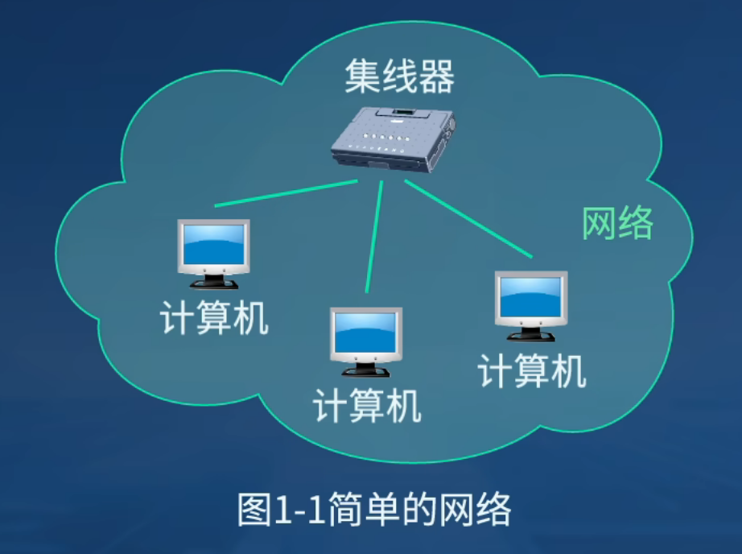
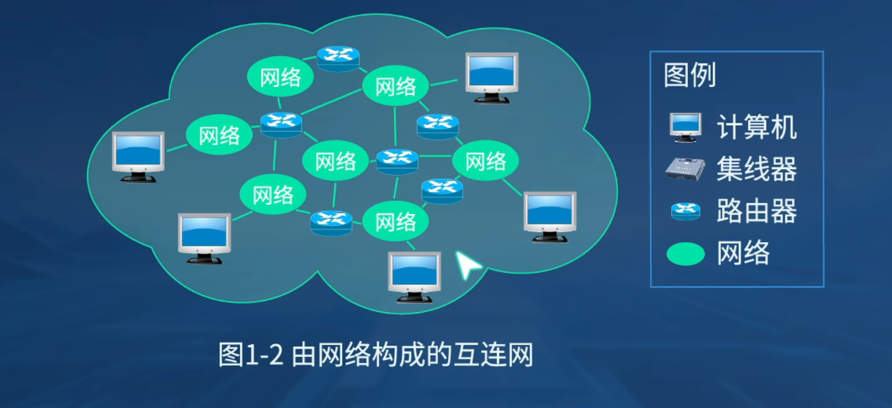
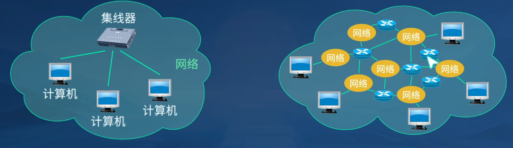
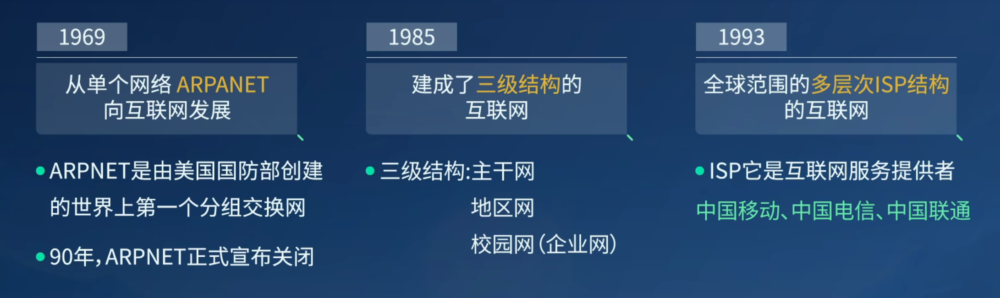
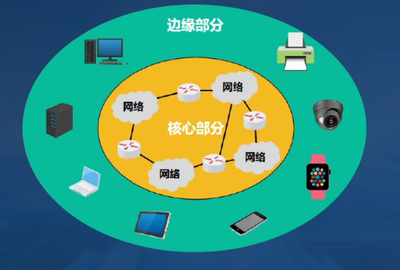
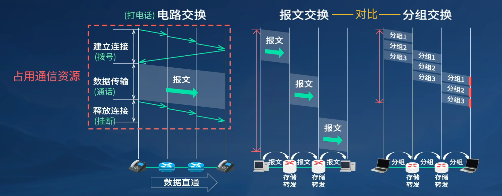
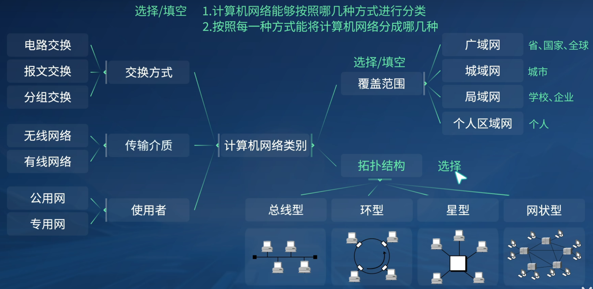
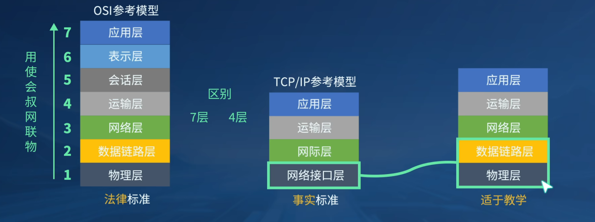

### 一、互联网概述

##### 1.1 网络

==**定义**==：有若干==节点==和链接这些节点的==链路==组成。

​	节点可以是==计算机、集线器、交换机或路由器==等

##### 1.2 互连网

==**定义：**== ==多个网络==通过一些==路由器==相互连接起来，构成了一个覆盖范围更大的计算机网络。

​	==“网络的网络”（network of networks）==

##### 1.3 网络与互连网

​	==**网络：**==把许多==计算机==连接在一起

​	==**互连网：**==把许多==网络==通过==路由器==连接在一起。
​			与网络相连的==计算机==常称为==主机==。

##### 1.4 互联网发展的三个阶段

### 二、互联网的组成

##### 2.1 互联网的组成

从互联网的==工作方式上==看，可以划分为两大块：

1. ==**边缘部分：**==由所有连接在互联网上的==主机==组成，由用户直接使用，用来进行==通信（传送数据、音频或视频）和资源共享==。
2. ==**核心部分：**==由大量==网络==和链接这些网络的==路由器==组成，为边缘部分提供服务（提供==连通性和交换==）

##### 2.2 电路交换、报文交换、分组交换

电路交换：从建立连接到释放连接，整个过程都是占用通信资源的，==网络资源利用率不高==，分组交换的效率==远远高于==报文交换

### 三、计算机网络的类别

### 四、计算机网络的性能

1. **速率**（bit/s || b/s || bps）：数据的传送速率

2. **带宽**（bit/s || b/s || bps）：网络的通信线路所能传送数据的能力，即在单位时间内从网络中的某一点到另一点所能通过的最高数据率

3. **吞吐量：**在单位时间内通过某个网络或接口的实际数据量

4. **时延：**数据从网络的一端传送到另一端所耗费的时间，也称为延迟或迟延
               种类：发送时延、传播时延、处理时延、排队时延。

5. **发送时延：**
   $$
   发送时延=\frac{数据帧长度(bit)}{发送速率(bit/s)}
   $$

6. **传播时延：**
   $$
   传播时延=\frac{信道长度(m)}{信号传播速率(m/s)}
   $$

7. **时延带宽积：**$时延带宽积=传播时延\times带宽$

8. **往返时间RRT：**从发送端发送数据分组开始，到发送端收到接收端发来的相应确认分组为止，总共耗费的时间 
   $$
   A \underset{\text{确认}}{\rightleftarrows} B
   $$

9. 

### 五、计算机网络体系结构

**协议：**协议即规则的集合，由==语法、语义和同步==三部分组成

**接口：**接口是==相邻两层==交换信息的连接点

**服务：**服务是指下层==为紧邻的上层==提供的功能调用。

​	**注意：**协议和服务在概念上是不一样的，只有本层协议的实现，才能保证向上层提供服务

##### 5.4 常见的三种计算机网络体系结构

|            | 功能描述                                                     |      协议数据单元      |
| :--------: | ------------------------------------------------------------ | :--------------------: |
|   应用层   | 解决通过应用进程间的交互来完成特定网络应用 对于不同的网络提供不同的应用层协议，例如HTTP协议、SMTP协议等 |          报文          |
|   运输层   | 负责进程之间基于网络的通信问题 传输控制协议TCP 用户数据报协议UDP | 报文段 用户数据段 |
|   网络层   | 解决数据包在多个网络之间传输和路由问题                       |        IP数据报        |
| 数据链路层 | 解决数据包在一个网络或者一段链路上的传输的问题               |           帧           |
|   物理层   | 解决使用何种信号来表示比特0和比特1的问题                     |          比特          |

