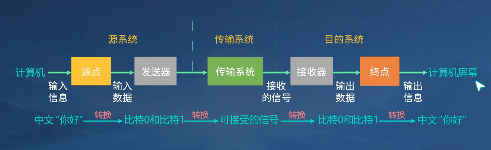
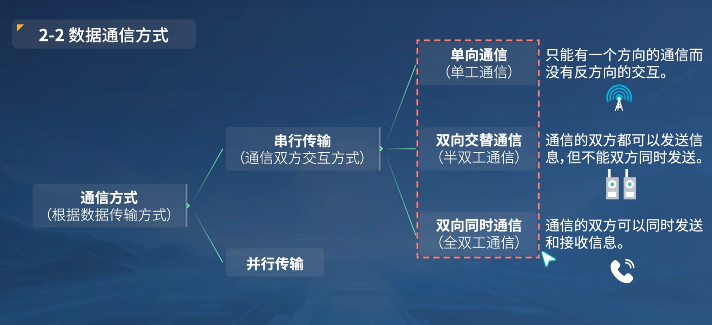
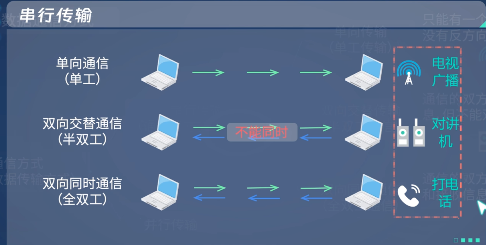
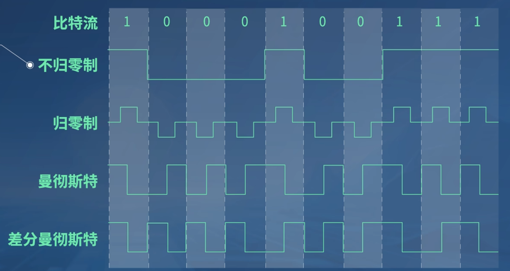
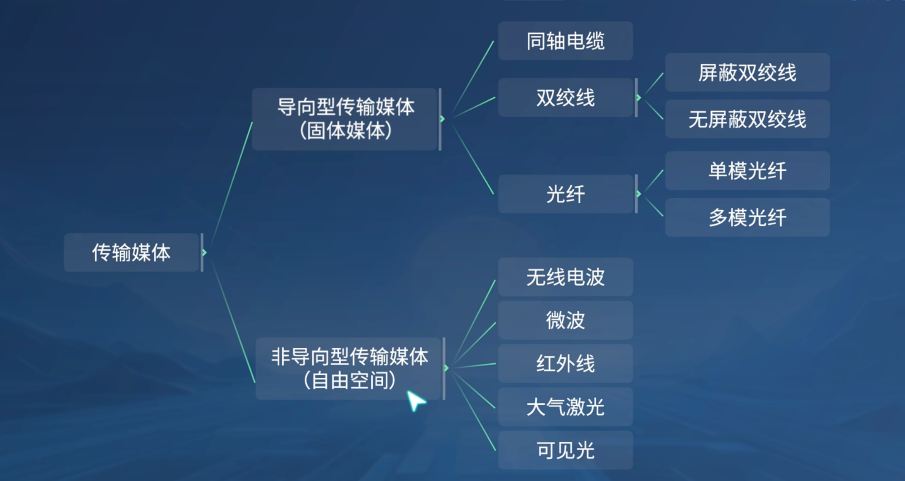
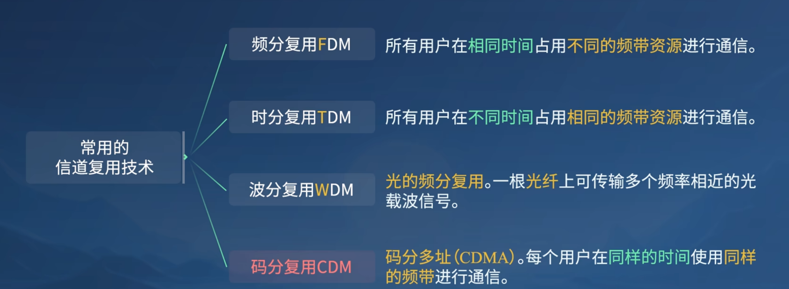

### 一、 物理层的基本概念

##### 1.1 物理层接口特性

* 机械特性
* 电气特性
* 功能特性
* 过程特性

### 二、数据通信的基础知识

##### 2.1 数据通信的系统模型

（考察：组成部分，各部分功能）

1. **源系统**
   1. 源点
   2. 发送器
2. **传输系统**
3. **目的系统**
   1. 接收器
   2. 终点

##### 2.2 数据通信方式

1. **单向通信**：只有一个方向的通信，而没有反方向的交互
2. **双向交替通信**：通信的双方都可以发送信息，但不能同时发送
3. **双向同时通信**：通信的双方可以同时发送和接收信息

##### 2.3 常用编码方式

1. **不归零制（没有自同步能力）**：正电平代表1，负电平代表0
2. **归零制**：正脉冲代表1，负脉冲代表0
3. **曼彻斯特**：位周期中心的向上跳变代表0，向下代表1，也可以反过来定义
4. **差分曼彻斯特** ：
   1. 在每一位的中心处始终都有跳变
   2. 位开始边界有跳变代表0，没有跳变代表1

> 考察：
> 1. 哪个编码方式没有自同步能力
> 2. 曼彻斯特编码和差分曼彻斯特编码

##### 2.4 信道的极限容量

==**奈氏准则：**==在带宽为W(HZ)的低通信道中，若不考虑噪声影响，则码元传输的最高速率是2W（码元/秒）。传输速率超过此上限，就会出现严重的码间串扰问题，使接收端对码元的判决（即识别）成为不可能。

==**信噪比：**== 信号的平均功率和噪声的平均功率之比，常记为S/N，单位为分贝（dB）	
$$
信噪比(dB)=10log_{10}(\frac{S}{N})(dB)
$$

==**香农公式：**== 信道的==极限信息传输速率，记为C。==
$$
C=Wlog_2(1+\frac{S}{N})(bit/s)
$$

### 三、物理层下面的传输媒体

### 四、信道复用技术

