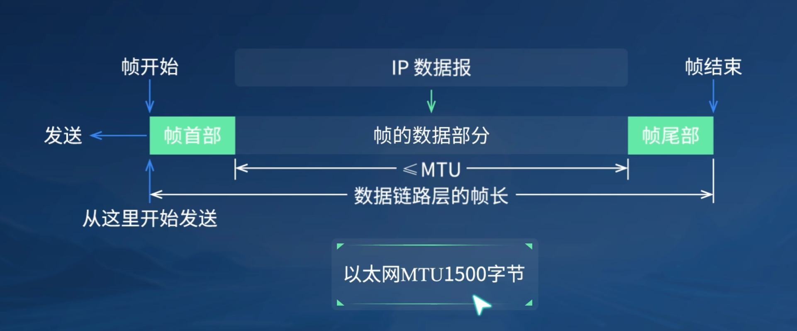
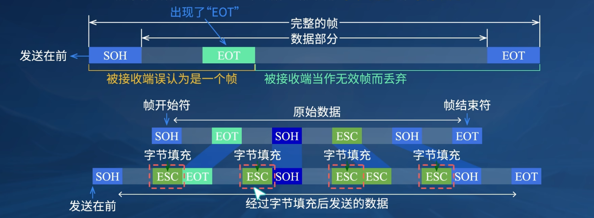
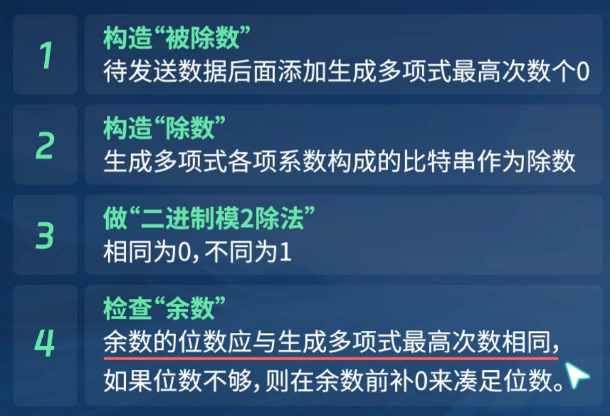

### 一、数据链路层的几个共同问题

##### 数据链路层使用的信道主要有两种类型

1. 点对点信道(1对1)
2. 广播信道(1对多)

==**链路:**== 指的从一个结点到相邻节点的一段物理链路,中间没有节点

##### ==数据链路层的三个基本问题==

1. ==**封装成帧**==
   IP数据报在该层被封装成帧
   

2. ==**透明传输**==
   "在数据链路层透明传送数据"表示":无论发送什么样的比特组合的数据,这些数据都能够按照原样没有差错的用过这个数据链路层,用"==字节填充=="或"==字符填充=="
   

3. ==**差错检测**==
   判断传输中是否会产生误码
   常用的检错技术: 循环冗余检验(CRC)
   算法:模2运算(异或运算: 相同为0,相异为1)

   被除数: $待发送的数据+x个0 \\x=除数个数-1$ 
   除数: (1) 直接给出
   	  (2) 多项式: 提取各项的系数,组合成除数
   $$
   G(X)=X^4+X^2+X+1\\=10111
   $$
   因此除数就是10111

   

### 二、点对点协议PPP

### 三、使用广播信道的数据链路层

