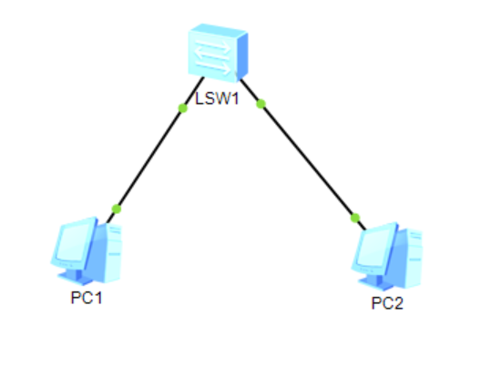
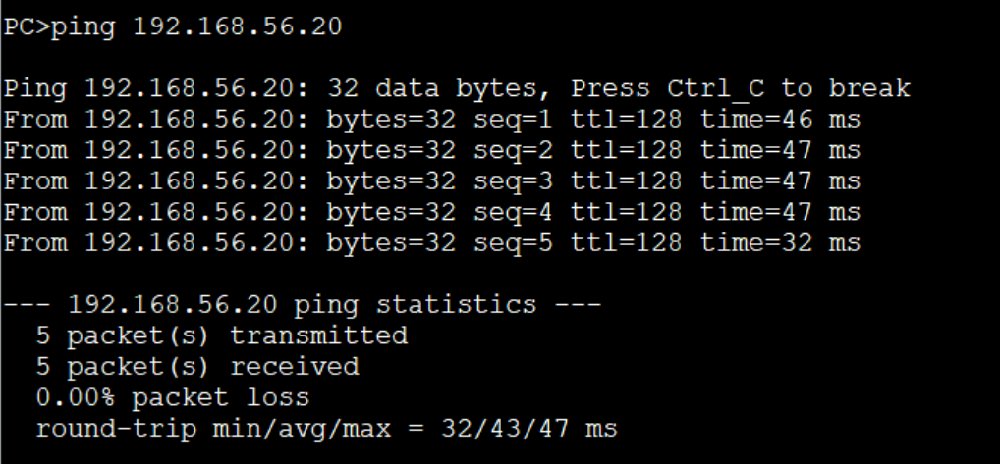
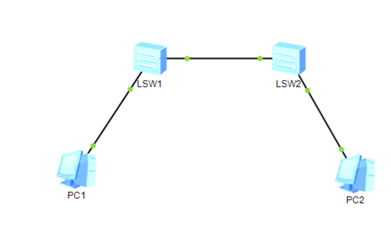
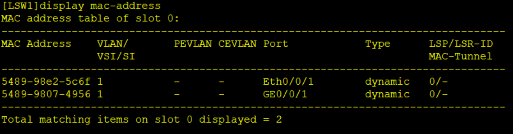
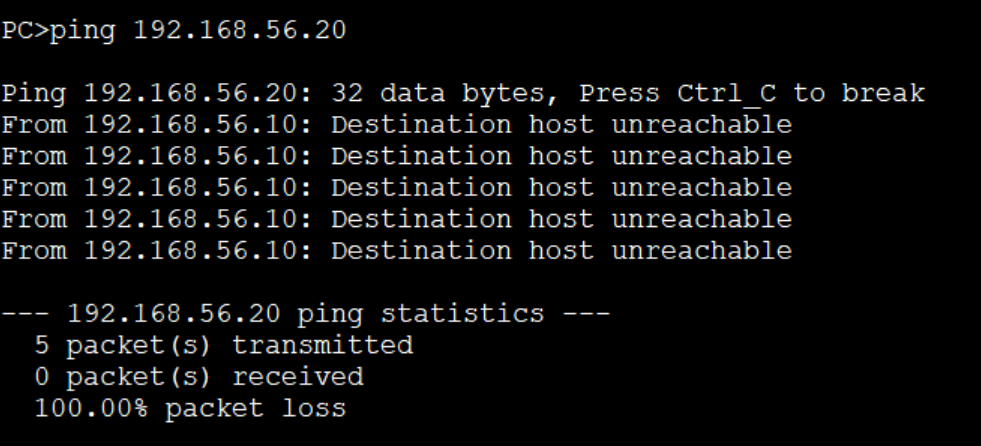
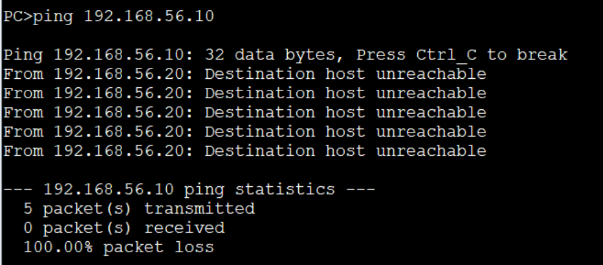
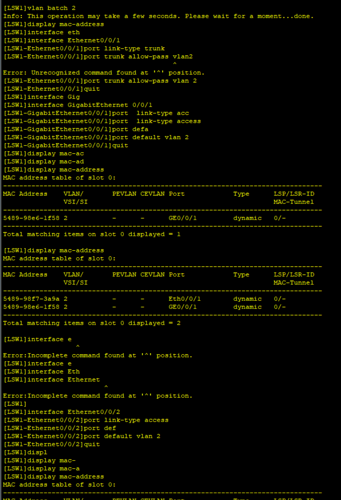
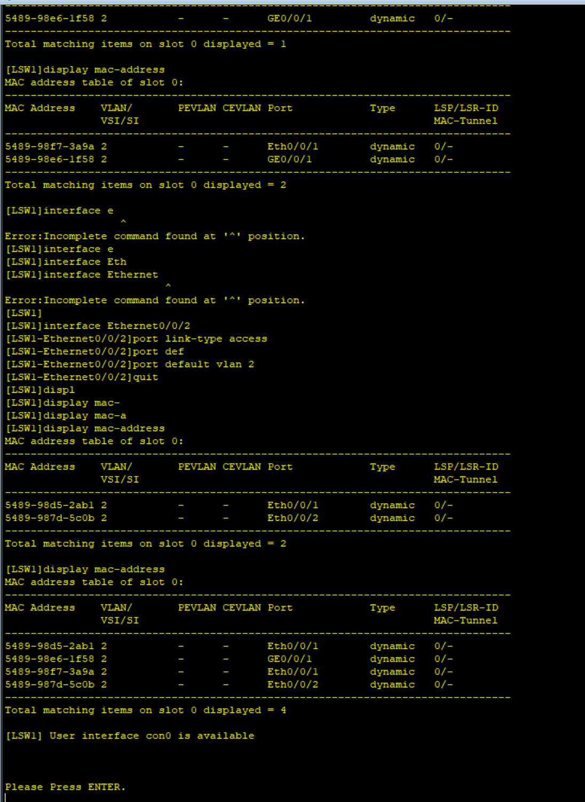

# 创建拓扑

### 创建两个PC终端 

设置ip分别为192.168.56.10和192.168.56.20

子网掩码为255.255.255.0

### 创建一个交换机S3700

连接两PC



### 交换数据

打开PC1命令行

```bash
# 向PC2发送数据,查看是否可以接收
ping 192.168.56.20
```



打开LSW1

```bash
# 使用系统视图
system-view
# 将名称改为LSW1
sysname LSW1
# 暂停消息
undo info-center enable
```

### 创建另一台交换机LSW2

按顺序依次连接PC1 LSW1 PC2 LSW2



### 查看VLAN

打开PC1终端向PC2发送数据

```bash
ping 192.168.56.20
```


```bash
# 首先查看此时的vlan
display mac-address
```



此时VLAN为1

### 将LSW1接口改为vlan2

```bash
# 创建一个vlan2
vlan batch 2
# 进入主干链路的接口
interface  GigabitEthernet0/0/1
port link-type trunk
port trunk allow-pass vlan 2
quit
# 进入与pc端连接的链路
interface Ethernet0/0/1
port link-type access
port default vlan 2
quit
```

此时发现pc1和pc2无法传输数据





### 将LSW2接口改为vlan2

此时可以传输数据


# VLAN

创建组

```bash
#创建组
port-group x(编号)
group-member 接口
```




