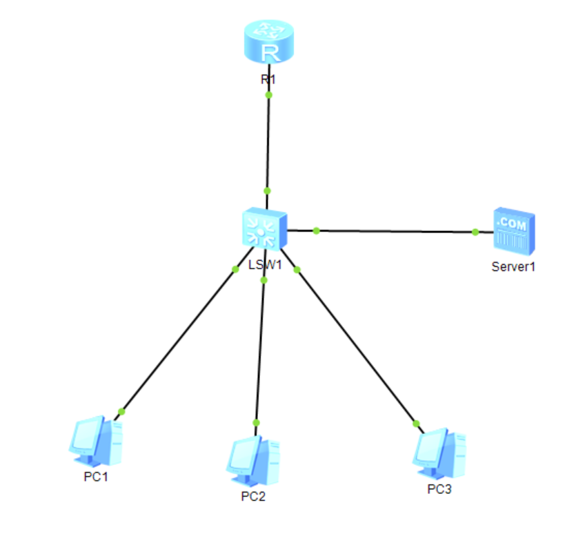

### 路由器相关命令

1. 选择端口,设置ip:
   ip address x.x.x.x
2. 查看路由表
   display ip  routing-table


### 查看当前配置

display this

display current-configuration (dis cu)


### DHCP: 动态主机配置协议 	C/S

相关命令

1. 开启dhcp服务:
   dhcp enable
2. dhcp选择端口
   选中端口后,dhcp select interface


### DNS 域名解析

##### 拓扑结构



##### 1. 配置

三个PC终端选择DHCP动态分配内存

##### 2. 开启设备

1. 双击打开路由器命令行
```bash
# 全局打开DHCP
dhcp enable
# 进入接口
int g 0/0/0
# 配置网关IP地址
ip a 1.1.1.2 24
# 开启接口 DHCP 模式 (让这个接口负责发 IP)
dhcp select interface
q
```

2. 打开server服务设备
   配置ip 1.1.1.10和网关 1.1.1.2

3. 打开服务器信息,添加域名和对应的ip

4. 打开路由器
   ```bash
   # 进入接口
   int g 0/0/0
   # 追加 DNS 配置：告诉 PC，DNS 服务器是1.1.1.10
   dhcp server dns-list 1.1.1.10
   q
   ```

   

5. 完成配置,检验

   * 打开终端,各自查验`ipconfig`查看
     * IPv4 address
     * Gateway
     * DNS server
   * ping 另外终端的域名,看是否ping通
     使用`ipconfig /renew`刷新


相关命令

1. 设置dns-list ( DNS的ip地址 )
   dhcp server  dns-list 1.1.1.10


1. 设置ip address
2. 开启dhcp
3. 选择dhcp口
4. 设置dns的ip

