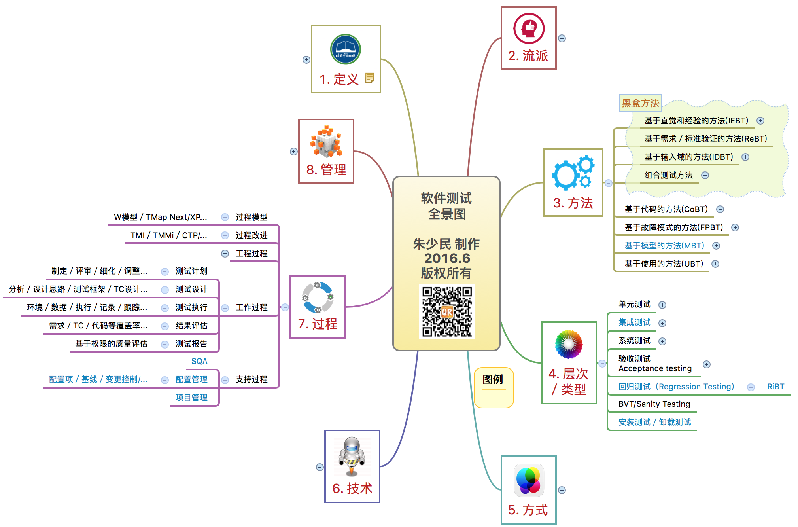
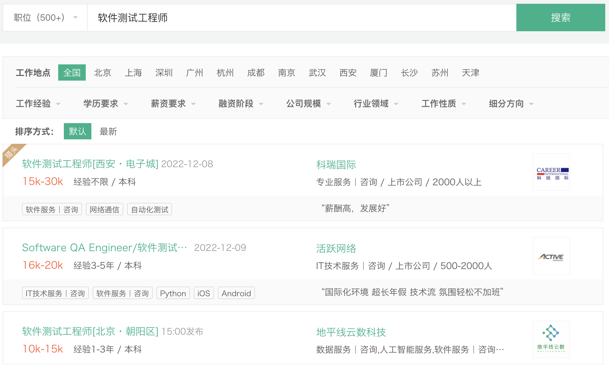
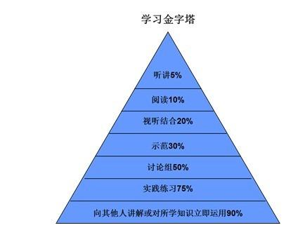
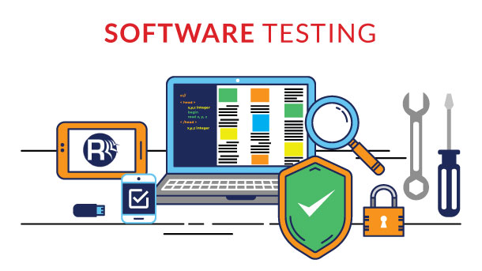
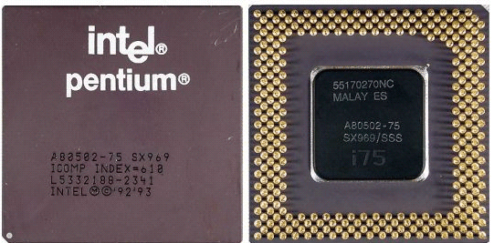
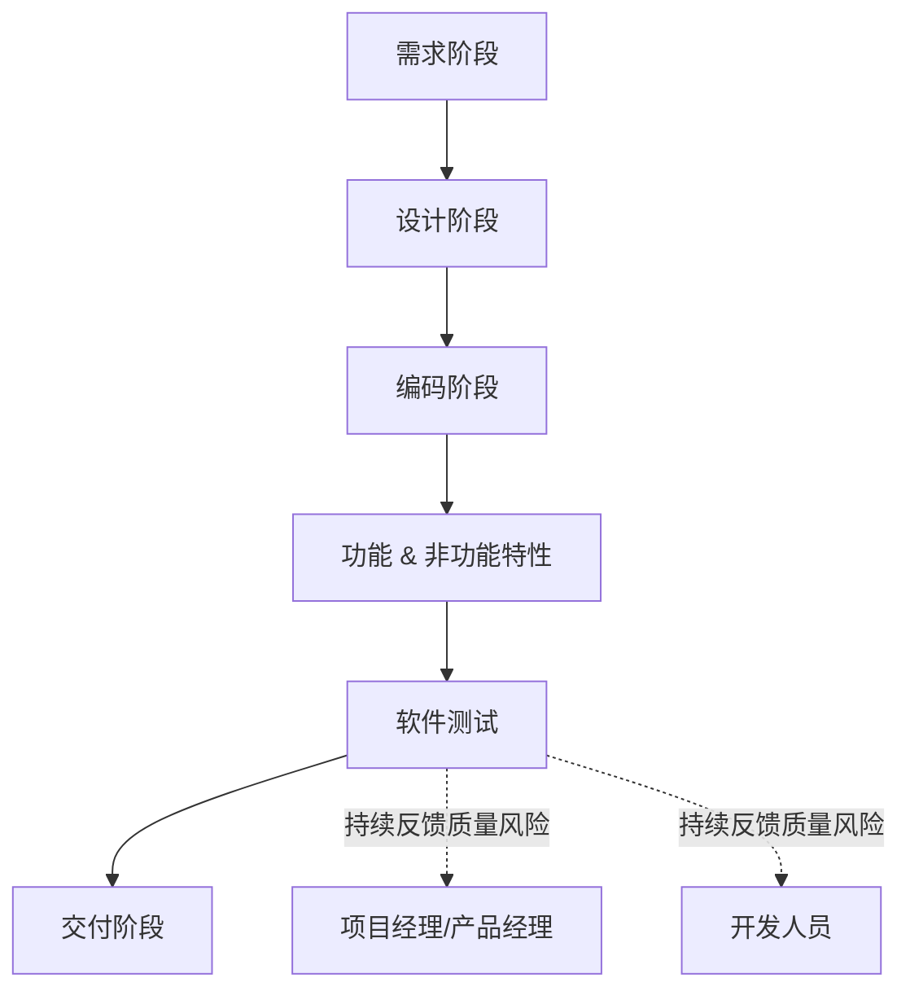
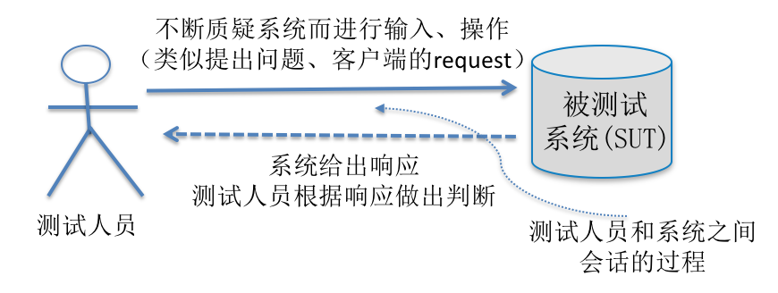
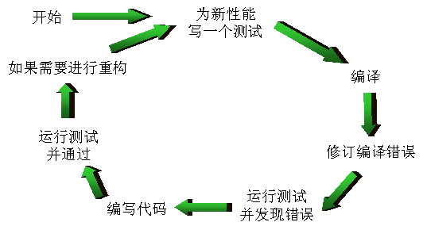

# 软件测试方法和技术——第1章 引论

---

<!-- Slide number: 1 -->
# 软件测试方法和技术 (课程介绍)

**同济大学 朱少民**  
版权所有©️ 仅限于教学使用

---

<!-- Slide number: 2 -->
## 课程概述：软件测试全景图

---

<!-- Slide number: 3 -->
## 系统地理解软件测试

- **核心内容**：方法、寻求、设计
- **主要目标**：确定与设计**测试用例**
- **测试实质**：发现并清除**软件**中的**缺陷**，从而提升**质量**
- **方法源泉**：思想、阶段
- **执行方式**：管理、指导、实施

---

<!-- Slide number: 4 -->
## 从就业市场看软件测试

---

<!-- Slide number: 5 -->
## 在敏捷时代，如何看待软件测试？

- **整个团队对质量负责**：敏捷开发模式中，提倡整个团队对质量、对测试负责。
- **开发与测试深度融合**：开发与测试越来越融合，例如微软测试人员的转型。
- **持续交付倒逼持续测试**：但测试也最容易成为交付瓶颈。
- **测试左移与前移**：测试左移、测试前移，让开发做更多的测试。
- **测试驱动开发（TDD）**：提倡测试在前、开发在后的思想。

---

<!-- Slide number: 6 -->
## 如何借助这门课培养学生的分析问题 and 解决问题的能力？

- **分析能力**：强调分析能力，如测试分析是基础。
- **批判性思维**：培养批判性思维，如探索式测试。
- **工程思维**：培养工程思维，如找到不同的解决方案，从中选出最优的解决方案。

---

<!-- Slide number: 7 -->
## 如何通过实验教学培养学生的实际能力？

- 软件测试是一门实践性很强的课程，提倡 **“做中学”**。
- 采用**问题驱动**的教学与实验。
- 实验过程本身就是分析问题、解决问题的过程。

---

<!-- Slide number: 9 -->
## 第1篇 软件测试的原理与方法

- 第1章 引论
- 第2章 软件测试的基本概念
- 第3章 软件测试方法
- 第4章 软件测试流程和规范

---

<!-- Slide number: 10 -->
# 第1章 引论

**同济大学 朱少民**  
版权所有©️ 仅限于教学使用

---

<!-- Slide number: 11 -->
## 章节目录与学习要点

1. [1.1 软件测试的必要性](#11-软件测试的必要性)
2. [1.2 为什么要进行软件测试？](#12-为什么要进行软件测试)
3. [1.3 什么是软件测试？](#13-什么是软件测试)
4. [1.4 测试和质量保证的关系](#14-测试与质量保证的关系)
5. [1.5 测试和开发的关系](#15-测试与开发的关系)
6. [1.6 测试驱动开发的思想](#16-测试驱动开发的思想)

### 详细目录与页码参考
- **1.1 软件测试的必要性** (P3)
  - 1.1.1 迪斯尼并不总是带来笑声 (P3)
  - 1.1.2 一个缺陷造成了数亿美元损失 (P3)
  - 1.1.3 火星探测飞船坠毁 (P4)
  - 1.1.4 软件测试走了捷径导致灾难再次发生 (P5)
  - 1.1.5 错误指令造成骑士资本集团损失4.4亿美元 (P6)
  - 1.1.6 AWS宕机整整4个小时 (P7)
  - 1.1.7 预定的酒店住不进去、露宿街头 (P8)
  - 1.1.8 Uber泄漏个人隐私，导致用户要求赔偿3亿多元 (P8)
  - 1.1.9 更多的悲剧 (P9)
- **1.2 为什么要进行软件测试？** (P10)
- **1.3 什么是软件测试？** (P11)
  - 1.3.1 软件测试学科的形成 (P11)
  - 1.3.2 正反两方面的争辩 (P12)
  - 1.3.3 软件测试的定义 (P13)
  - 1.3.4 软件测试的其它观点 (P14)
- **1.4 测试和质量保证的关系** (P15)
- **1.5 测试和开发的关系** (P16)
- **1.6 测试驱动开发的思想** (P18)
- **小结** (P20)
- **思考题** (P20)

---

<!-- Slide number: 12 -->
## 1.1 软件测试的必要性

> [!NOTE]
> **本章学习要点及方法要求：**
> - **概念**：介绍学习要点的概念，以及在工作中哪些场景会用到。
> - **讲解**：详细讲解在工作中胜任该能力需要掌握的知识、技术。
> - **举例**：举一个案例或 demo 帮助大家更好理解要学习的内容，以及知道怎么用。
> - **分享经验**：工作应用心得，特别是理论和实际差异的部分。
> - **学习建议**：给出一些相关学习或工作场景中使用的建议。
> - **实用工具**：提供该学习要点对应的一些工具模板（如果有）。

---

<!-- Slide number: 13 -->
### 案例 1：迪斯尼并不总是带来笑声

- **事件**：1994年圣诞节前夕，迪斯尼公司发布了第一个面向儿童的多媒体光盘游戏“狮子王童话”。
- **表现**：圣诞节后第一天，客户支持部电话不断，都在咨询、抱怨游戏无法成功安装或无法正常使用。
- **原因**：该游戏软件只能在极少数特定的电脑系统中正常运行。
- **性质**：**兼容性问题**。

---

<!-- Slide number: 14 -->
### 案例 2：一个缺陷造成了数亿美元损失

- **事件**：Intel Pentium CPU 浮点除法缺陷（FDIV Bug）。
- **计算错误**：在有缺陷的 CPU 上，运算 $\left(\frac{4195835}{3145727}\right) \times 3145727 - 4195835$ 结果不等于 0。
- **后果**：最后 Intel 公司付出很大代价，回收 CPU，造成 4 亿美元的巨额损失。
- **性质**：**浮点计算问题**。

---

<!-- Slide number: 15 -->
### 案例 3：火星探测飞船坠毁

- **事件**：火星登陆飞船在下坠 1800 米时，因为计算机提前关闭推进器而冲向地面撞成碎片。
- **原因**：机械震动在大多数情况下也会触发着地开关，设置错误的数据位。
- **分析**：两个开发小组本身的工作都没什么问题，就是**没有合在一起做集成测试**，其接口没有被测，而问题偏偏就发生在这里。
- **性质**：**集成测试不足**。

---

<!-- Slide number: 16 -->
### 案例 4：软件测试走了捷径导致灾难再次发生

- **事件**：波音公司载人飞船星际客机软件系统的程序存在严重缺陷，计划对测试程序进行修改。
- **原因**：造成该严重缺陷的主要原因就是软件测试**走了捷径**——公司缩短了对该飞行器软件的一次关键测试。他们将整个飞行过程分成了几个小单元分别进行测试，但最后却**没有做完整的、端到端的集成测试**（即没有进行时长为 25 小时的整体测试）。
- **性质**：**集成测试不足**。

---

<!-- Slide number: 17 -->
### 案例 5：错误指令造成骑士资本集团损失 4.4 亿美元

- **事件**：2012年8月1日上午9点，纽约证券交易所开盘交易，骑士资本的第一位散户投资者发出指令后，仅仅 45 分钟内，服务器就错误执行了 400 万笔交易，使公司损失了 4.6 亿美元，濒临破产。
- **性质**：**功能容错性问题**。

---

<!-- Slide number: 18 -->
### 案例 6：AWS 宕机整整 4 个小时

- **事件**：2017年3月2号，亚马逊云（Amazon S3 Cloud）出现严重的宕机（中断服务）！常规宕机通常在一个小时内解决，但这次宕机持续了整整四个小时。
- **性质**：**性能、稳定性问题**。

---

<!-- Slide number: 19 -->
### 案例 7：Uber 泄漏个人隐私，导致用户要求赔偿 3 亿多元

- **事件**：2017年2月，据法国费加罗报报道，一名法国商人起诉 Uber，要求该公司赔偿 4500 万欧元（约合人民币 3.33 亿），以弥补隐私漏洞对自己婚姻造成的伤害。其起诉理由是 Uber 专车 App 中存在此类安全性漏洞。
- **性质**：**安全性：隐私保护问题**。

---

<!-- Slide number: 20 -->
### 案例 8：预定的酒店住不进去、露宿街头

- **事件**：2019年国庆黄金周出行高峰期，通过某知名旅行网预定酒店的网友遭遇到达酒店却无法入住、已支付的订单显示未支付或订单不存在的问题。客服电话打不通，退房退不了，也难以重新预定。
- **性质**：**高并发环境下的可用性与可靠性问题**。

---

<!-- Slide number: 21 -->
### 更多软件缺陷悲剧

- **Therac-25 医疗事故**：放射性治疗仪 Therac-25 中的软件存在缺陷，导致几个癌症病人受到严重过量的放射性治疗，其中 4 人因辐射过量死亡。
- **爱国者导弹防御系统失效**：当爱国者导弹防御系统的时钟累计运行超过 14 小时后，系统的跟踪精度出现严重偏差。导致拦截伊拉克飞毛腿导弹多次失败，其中一枚坠落在沙特阿拉伯多哈爆炸，造成 28 名美国士兵死亡。

> [!IMPORTANT]
> **软件测试的必要性与启示**：
> 软件缺陷在实际生产环境中可能导致致命的后果，带来难以估量的财产和生命损失。单元测试即使完全通过，若缺乏**整体的、端到端的集成测试**（接口与系统协作测试），仍然会遗留致命的安全与可靠性隐患。

---

<!-- Slide number: 22 -->
## 1.2 为什么要进行软件测试？

> [!NOTE]
> **学习提示**：
> - 掌握软件质量的保障手段。
> - 理解预防和评估成本在控制劣质成本中的重要作用。

---

<!-- Slide number: 23 -->
### 为什么要进行软件测试？

- **为了保证软件质量**：这是进行软件测试最直接、最核心的原因。
- **清除缺陷的必要途径**：软件中总会存在缺陷。只有通过测试才可以发现缺陷，也只有发现了缺陷，才可以将软件缺陷从软件产品或软件系统中清理出去。
- **降低劣质成本 (COPQ)**：软件缺陷带来的损失巨大，软件测试是质量保证的关键步骤。测试作为一种 **“预防 and 评估成本”** 的投入，能够有效降低因缺陷导致的劣质成本。
- **行业最佳实践**：软件测试在产品开发中占据着相当重要的位置，这已被软件行业几十年的工程实践所证明。

> [!TIP]
> **劣质成本 (Cost of Poor Quality, COPQ)**：
> 是指由于软件质量达不到要求而产生的废品、返工、索赔及信誉损失等一切劣质成本。软件测试通过前期的评估和预防投入，能够以极小的代价避免后期高昂的缺陷修复与赔偿损失。

---

<!-- Slide number: 24 -->
## 1.3 什么是软件测试？

- 1.3.1 软件测试学科的形成
- 1.3.2 正反两方面的争辩
- 1.3.3 软件测试的定义
- 1.3.4 软件测试的其它观点

---

<!-- Slide number: 25 -->
### 1.3.1 软件测试学科的形成
- 狭义与广义的测试
- 软件测试学科的发展历程与阶段划分

---

<!-- Slide number: 26 -->
### 1.3.1 软件测试学科的形成

---

<!-- Slide number: 27 -->
### 从狭义的软件测试到广义的软件测试

- **狭义的软件测试 = 程序测试**：过去常常把测试等同于运行写好的程序。
- **广义的软件测试**：
  - 软件并非只包括可执行的程序，**“需求、设计和代码”** 都属于软件的组成部分。
  - 对“需求、设计和代码”进行评审，属于**静态测试**。
  - 既然业界公认“动态测试”，也自然认可“静态测试”，软件测试包含静态测试和动态测试。
- **测试成本规律**：测试进行得越早，成本越低；相反，缺陷发现得越迟，研发修复成本越高。

---

<!-- Slide number: 28 -->
### 广义的软件测试可以极大地降低研发成本

> [!IMPORTANT]
> **缺陷修复成本法则**：
> 缺陷在生命周期中被发现和修复得越迟，其修复成本就越高，而且呈**非线性（指数级）**增长。通过静态测试在需求和设计阶段拦截缺陷，能以最低的代价提升质量。

---

<!-- Slide number: 29 -->
### 软件测试学科的发展 (按思维导向划分)

- **1957～1978年 (以功能验证为导向)**：正向思维，认为测试是证明软件是正确的。
- **1978～1983年 (以破坏性检测为导向)**：逆向思维，认为测试是为了找到软件中的错误。
- **1983～1987年 (以质量评估为导向)**：测试是为了提供产品的评估和质量度量。
- **1988年起 (以缺陷预防为导向)**：测试不仅是展示软件符合设计要求、发现缺陷，更强调**预防缺陷**。

> [!TIP]
> **软件测试演进脉络**：
> 证明正确（正向验证） $\rightarrow$ 寻找错误（逆向破坏） $\rightarrow$ 质量评估 $\rightarrow$ 缺陷预防。

---

<!-- Slide number: 30 -->
### 软件测试学科的发展阶段 (按历史进程划分)

- **初级阶段（1957～1971）**：测试通常被认为是对产品进行事后检验，缺乏有效的测试方法。
- **发展阶段（1972～1982）**：以 1972 年第一次关于软件测试的正式学术会议为标志，促进了系统化软件测试的发展体系。
- **成熟阶段（1983 至今）**：国际标准 **Std 829-1983** 发布，形成了一门独立的学科和专业，成为软件工程学科中非常重要的组成部分。

---

<!-- Slide number: 31 -->
### 1.3.2 正反两方面的争辩

---

<!-- Slide number: 32 -->
### 软件测试的正向思维

- **代表人物**：Bill Hetzel 博士
- **核心观点**：
  - 软件测试就是为程序或系统能够按预期设想运行而建立信心的过程。
  - “软件测试是一系列 activity 以评价一个程序或系统的特性或能力并确定是否达到预期的结果”。
  - 测试是为了验证软件是否符合用户需求，即验证软件产品是否能正常工作。

---

<!-- Slide number: 33 -->
### 软件测试的反向思维

- **代表人物**：Glenford J. Myers
- **核心观点**：
  - 测试是为了证明程序有错，而不是证明程序无错误。
  - 一个好的测试用例在于它能发现至今未发现的错误。
  - 一个成功的测试是发现了至今未发现的错误的测试。

---

<!-- Slide number: 34 -->
### 认知决定着行为

| 维度 | 正向思维 (验证软件正常工作) | 逆向思维 (假定软件有错误) |
| :--- | :--- | :--- |
| **观点定义** | 评价一个程序或系统的特性或能力并确定是否达到预期的结果。 | 测试是为发现错误而针对某个程序或系统的执行过程。 |
| **行为方式** | 在设计规定的环境下运行软件的所有功能，直至全部通过。 | 寻找容易犯错误的地方和系统的薄弱环节，试图破坏系统，直至找不出问题。 |

> [!IMPORTANT]
> **双重思维的应用：**
> 在实际软件开发和测试过程中，正向思维（建立信心）与逆向思维（破坏并暴露缺陷）必须结合使用。只进行正向验证会遗漏大量隐蔽 Bug，而一味采取逆向思维则可能导致测试目标不明确，难以评估项目是否可以发布。

---

<!-- Slide number: 35 -->
### 1.3.3 软件测试的定义

---

<!-- Slide number: 36 -->
### 软件测试的多维度认识

- 检查、检验 Check ？
- 验证软件能否正常运行？
- 发现问题 Detect error ？
- 证明是对的 Correction proof ？
- 质量评估 Quality evaluation ？
- 质量保证 Quality Assurance？

---

<!-- Slide number: 37 -->
### 软件测试 IEEE / ISO 29119 的标准定义

> **IEEE / ISO 29119 定义：**
> *An activity in which a system or component is executed under specified conditions, the results are observed or recorded, and an evaluation is made of some aspect of the system or component.*  
> (在特定的条件下运行系统或组件，观察或记录结果，对系统或组件的某个方面做出评价。)
> 
> —— [ISO/IEC 24765, Systems & Software Engineering Vocabulary]

---

<!-- Slide number: 38 -->
### 软件测试 IEEE / ISO 29119 的标准定义 – 续

> *Testing is comparing what the test item does with what it is expected to do.*  
> (分析某个软件项以发现现存的和要求的条件之差别（即错误），并评价此软件项的特性。)

---

<!-- Slide number: 39 -->
### 软件测试的核心价值

1. **全面评估产品质量**：获得有关产品质量的全面、客观的评估信息。
2. **发现并解决问题**：督促缺陷的解决，从而提高产品最终质量。
3. **控制与管理风险**：持续提供质量反馈、及时揭示质量风险，有助于控制项目发布风险。
4. **预防缺陷**：通过缺陷分析总结缺陷模式，辅助开发在未来预防缺陷。

---

<!-- Slide number: 40 -->
### 1.3.4 软件测试的其它观点

---

<!-- Slide number: 41 -->
### 1. 从质量视角认知软件测试

- 软件测试被认为是对软件质量进行全面评估的活动，提供质量信息，从而确定质量是否满足设计和用户的要求与期望。

- 用户与产品设计对“质量”存在期望与矛盾的对立。

- 软件测试的主要过程包括发现 Bug 以及基于质量模型评估整体质量。

---

<!-- Slide number: 42 -->
### 2. 从风险视角认知软件测试

- 软件测试被认为是对软件系统中潜在的各种质量风险进行评估的活动。
- **不穷尽性**：测试是样本实验而不能穷尽所有输入路径，因此质量风险总是存在的。
- **基于风险的测试**：强调对软件开发全过程进行检测，随时发现问题、报告问题，减少对客户产生不利影响的风险。

---

<!-- Slide number: 43 -->
### 3. 从经济视角认知软件测试

- **核心原则**：以**最小的代价**获得**最高的软件产品质量**。
- **及早开展**：发现缺陷越早，返工的工作量就越小，所造成的损失就越小。
- **前提条件**：$\text{测试的成本} < \text{缺陷造成的损失}$，测试才有实际的经济学意义。

---

<!-- Slide number: 44 -->
### 4. 基于 Test Oracle 的认知

- 判断输出结果是否正确，必须有**判断准则**，即 **Test Oracle (测试判定依据)**。

---

<!-- Slide number: 45 -->
### 5. 基于批判性思维的认知

- 软件测试就是借助观察、经验、反思、推理或沟通等收集信息，并对软件产品相关的质量信息进行分析，以此评估软件质量，做出结论的过程。它是一个**不断探索的过程**。

---

<!-- Slide number: 46 -->
## 1.4 测试与质量保证的关系

---

<!-- Slide number: 47 -->
### 什么是 SQA (软件质量保证)？

- **SQA (Software Quality Assurance) 的定义**：
  - 软件质量保证活动是通过对软件产品有计划地进行评审和审计，来验证软件是否合乎标准的系统工程。
  - 通过协调、审查和跟踪以获取有用信息，形成分析结果以指导软件过程改进。
- **主要内容**：
  - 对软件工程各个阶段的进展、完成质量及出现的问题进行评审、跟踪。
  - 审查和验证软件产品是否遵守适用的标准、规程和要求，并最终确保符合标准、满足要求。
  - 建立软件质量要素的度量机制，了解各种指标的量化信息，向管理者提供可视信息。

---

<!-- Slide number: 48 -->
### SQA 活动的范围

- 技术方法的应用
- 正式技术评审的实施
- **软件测试** (是 SQA 实施的重要技术手段)
- 标准的执行
- 修改的控制（配置管理）
- 度量与分析
- 质量记录和记录保存

---

<!-- Slide number: 49 -->
### 软件测试 vs. SQA

- **测试与 SQA 的协作**：
  - SQA 指局指导、监督软件测试的计划和执行，督促测试工作的结果客观、准确和有效，并协助测试流程的改进。
  - 软件测试是 SQA 重要手段之一，为 SQA 提供所需的数据，作为质量评价的客观依据。
- **测试与 SQA 的区别**：
  - **SQA 是一项管理工作**，侧重于对**流程/过程**的评审和监控。
  - **测试是一项技术性的工作**，侧重于对**产品**进行评估和验证。

> [!IMPORTANT]
> **管理 vs. 技术；过程 vs. 产品**：
> - SQA 关注的是软件开发生命周期的“过程规范性”，即“有没有按规范做”。
> - 软件测试关注的是软件制品的“产品实体”，即“产品是否有漏洞和缺陷”。

---

<!-- Slide number: 50 -->
## 1.5 测试与开发的关系

---

<!-- Slide number: 51 -->
### 误区：测试不是开发的下一道工序

传统的线性瀑布模型：
$$\text{需求定义} \rightarrow \text{设计} \rightarrow \text{编程} \rightarrow \text{测试} \rightarrow \text{交付}$$
这只是一种局限的物理先后步骤认知，事实上测试应伴随整个软件周期。

---

<!-- Slide number: 52 -->
### 事实：测试与开发是并行、协作的关系

测试人员应当在需求和设计阶段及早介入（测试左移），协助开发人员澄清需求，尽早消除隐含在文档中的逻辑缺陷。

---

<!-- Slide number: 53 -->
## 1.6 测试驱动开发的思想

---

<!-- Slide number: 54 -->
### 测试驱动开发 (TDD) 的核心思想

- **TDD (Test Driven Development)**：核心在于 **“测试在前，开发在后”**。

---

<!-- Slide number: 55 -->
### TDD 实践起源

- TDD 的实践最早来自**极限编程 (XP, Extreme Programming)**。

---

<!-- Slide number: 56 -->
### TDD 与 UTDD、ATDD 的关系

- TDD 现已演化为一种顶层的开发思想。
- 在实际软件工程实践中，TDD 演化出两个主要分支：
  - **UTDD (Unit Test Driven Development)**：单元测试驱动开发，侧重代码级的实现。
  - **ATDD (Acceptance Test Driven Development)**：验收测试驱动开发，侧重用户需求和业务验收指标。

- **ATDD & UTDD 关系图**：
  - 用户验收指标 $\rightarrow$ 编写验收测试 $\rightarrow$ 编写单元测试 $\rightarrow$ 编写实现代码。

---

<!-- Slide number: 57 -->
### 思考题

> [!IMPORTANT]
> **开发人员自测障碍：**
> 1. 如果开发人员只测试自己的产品，心理上和思维上会有哪些障碍？
> 2. TDD 是如何有效克服这些障碍的？

---

<!-- Slide number: 58 -->
## 本章小结

- 理解测试的定义与价值。
- 掌握从质量、风险、经济、批判性思维等多重视角认识软件测试。
- 理解正向思维、逆向思维及其如何决定测试的实际行为方式。
- 理解并理顺测试、SQA、质量保证、开发之间的关系。
- 掌握先进的测试驱动开发（TDD）思想。

---

<!-- Slide number: 59 -->
## 提问、思考与练习

1. 在日常使用软件过程中，你遇到过哪些软件质量问题？
2. 软件测试的正反两方面观点（正向与逆向思维）会如何影响测试的具体工作？
3. 软件测试和软件开发的关系是怎样的？在实际工程中如何更好利用这种关系？
4. 软件测试和质量保证（SQA）之间的联系和区别是什么？

> [!TIP]
> 重点学习内容，可以通过留实操作业或思考讨论的方式，巩固学习成果。

---

<!-- Slide number: 60 -->
## 学习资源推荐

- 《软件测试方法和技术（第4版）》，清华大学出版社，2022
- 《全程软件测试（第3版）》，人民邮电出版社，2019
- 《致命Bug 软件缺陷的灾难与启示》，人民邮电出版社，2016

---

<!-- Slide number: 61 -->
# 感 谢 聆 听

**同济大学 朱少民**

> [!NOTE]
> 每课结束时提示：“以上是本节课的内容，这一章讲到这里。”

---

## 期末重点考点与概念提炼

### 核心术语

1. **软件缺陷 (Software Defect / Bug)**：
   - 存在于软件（包括需求定义、系统设计、程序代码等）中不符合期望或标准的偏差、错误或缺陷。
2. **广义的软件测试 (Broad Software Testing)**：
   - 软件测试不单指程序测试，还包含对“需求、设计和代码”的评审。广义测试由**静态测试**（如评审、走查）和**动态测试**（运行程序）共同组成。
3. **静态测试 (Static Testing)**：
   - 不实际运行软件程序，而是通过人工评审、走查或自动化静态分析工具，对软件的开发中间制品（文档、代码等）进行检查的活动。
4. **动态测试 (Dynamic Testing)**：
   - 通过在特定环境下执行软件，输入测试数据，观察并记录其运行结果以验证功能、性能等指标的测试活动。
5. **正向思维 (Positive Thinking)**：
   - 以功能验证为导向，认为测试是为了证明程序能正常工作，以按预期运行来建立信心的过程（代表人物：Bill Hetzel）。
6. **逆向思维 (Negative Thinking)**：
   - 以破坏性检测为导向，假定程序存在缺陷，认为测试是为了证明程序有错，寻找系统容易出错的地方和薄弱环节（代表人物：Glenford J. Myers）。
7. **软件质量保证 (SQA - Software Quality Assurance)**：
   - 一项管理性工程，通过有计划的评审和审计来监督开发过程的合规性，确保软件开发过程和产品均符合既定标准与规范。
8. **测试判定依据 (Test Oracle / 测试神谕)**：
   - 用于判定测试运行实际输出结果是否正确的参考准则或参考信息源（如需求说明书、已知正确结果、数学公式等）。
9. **测试驱动开发 (TDD - Test Driven Development)**：
   - 一种“测试在前、开发在后”的敏捷软件开发模式。开发人员先写测试用例，再编写刚好能通过测试的代码，最后对代码进行重构。主要包括 UTDD（单元测试驱动开发）和 ATDD（验收测试驱动开发）。

---

### 期末考点提炼

#### 简答题与概念对比

##### 1. 软件缺陷修复成本的非线性增长规律是什么？它对测试活动有什么指导意义？
*   **考点解析**：
    *   **规律**：缺陷在软件开发生命周期的不同阶段被发现，其修复成本随着阶段的推移呈**非线性（指数级）**急剧增长。在需求或设计阶段修复一个缺陷的成本极低，而如果到了产品交付或生产运行阶段才发现，其修复及造成的损失可能高达数万倍。
    *   **指导意义**：测试活动必须尽早开展（测试左移/前移），通过静态评审、需求分析等手段在早期捕获缺陷，从而最大限度地降低研发总成本。

##### 2. 简述广义软件测试与狭义软件测试的区别。
*   **考点解析**：
    *   **狭义测试**：关注范围仅限“可执行程序”，仅在编码完成后通过运行软件（动态测试）来验证质量。
    *   **广义测试**：关注范围覆盖“需求定义、系统设计、源代码”等软件生命周期的所有工作产物，采用静态测试（评审、审计）与动态测试相结合的方式。

##### 3. 比较分析软件测试的正向思维与逆向思维，并在实际项目中如何平衡？
*   **考点解析**：
    *   **正向思维**：
        *   目的：验证软件是否工作正常，建立质量信心。
        *   局限：容易漏掉边界、异常及极端情况下的隐蔽缺陷。
    *   **逆向思维**：
        *   目的：假定程序有错，寻找系统薄弱环节和破坏系统。
        *   局限：若过度使用，可能陷入无限测试的泥潭，因为测试无法穷尽，无法证明程序绝对无错。
    *   **项目平衡策略**：在单元测试、需求验收等阶段，先以正向思维验证核心功能是否通顺；在系统集成测试、安全测试和压力测试等阶段，重点采用逆向思维，寻找系统边界与抗压瓶颈。

##### 4. 软件测试与软件质量保证 (SQA) 的关系与区别是什么？
*   **考点解析**：
    *   **区别**：
        *   **SQA（软件质量保证）**：侧重**过程/流程**（Process-oriented），是一项**管理性**工作。它确保项目按照规范 and 标准流程进行，即“以正确的方法做正确的事”。
        *   **软件测试 (Testing)**：侧重**产品**本身（Product-oriented），是一项**技术性**工作。它通过执行或分析，评估软件质量、找出缺陷，即“判断产品是否做正确了”。
    *   **联系**：
        *   软件测试是 SQA 实施的重要技术手段之一，为 SQA 质量评估提供量化的客观数据。
        *   SQA 的过程审计指导并监督测试工作的计划与执行，促使测试流程不断优化。

##### 5. 什么是测试驱动开发 (TDD)？开发自测存在哪些心理和思维障碍？TDD 是如何解决的？
*   **考点解析**：
    *   **TDD**：测试在前，开发在后。其闭环为：编写失败的测试 $\rightarrow$ 编写最小实现代码使测试通过 $\rightarrow$ 代码重构（Refactor）。
    *   **开发自测障碍**：
        1.  **思维定势**：开发人员通常根据自己对代码逻辑的理解进行测试，容易沿用编写时的思路，漏掉考虑不周的逻辑分支。
        2.  **心理抗拒**：出于对自己劳动的保护心理，开发人员在潜意识里往往不愿承认、甚至抗拒找出自己代码中的错误（“自我否定”的抗拒感）。
        3.  **时间压力**：在项目工期紧张时，开发人员更倾向于把时间留给功能编写而非自测。
    *   **TDD 的克服手段**：
        1.  通过“先写测试用例”，使自测的目标由“找错并否定自己”转变成“编写代码来通过已经定义的指标”，将逆向寻找漏洞的压力转化为促使测试通过的正面成就感。
        2.  迫使开发人员在写代码前必须从用户/调用者角度思考其接口和设计，降低了后期修改架构的成本。