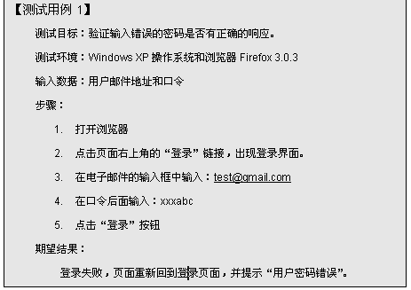
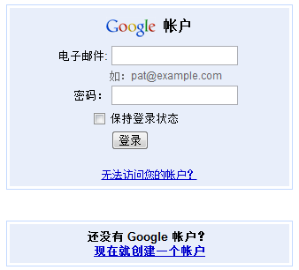
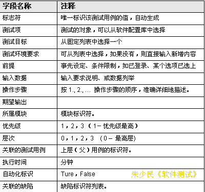
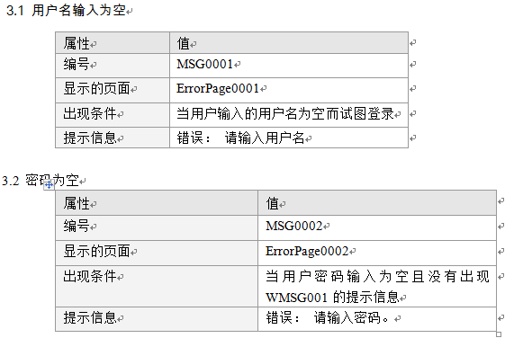
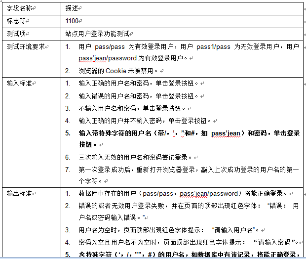
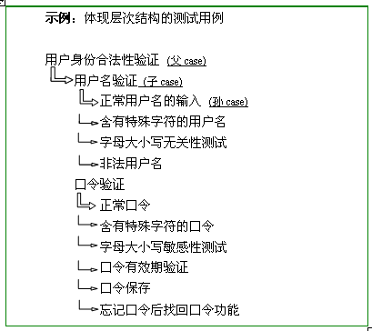

# 第11章 设计和维护测试用例

**软件测试方法和技术**
同济大学 朱少民
版权所有©️ 仅限于教学使用

## 本章要解决的问题

- 为什么我们要使用测试用例?
- 测试用例有哪些基本元素组成?
- 测试用例编写和设计时需要遵循哪些基本的原则?
- 测试用例结构和设计过程
- 跟踪和维护测试用例

注：测试用例设计的具体方法，在第3章已做介绍。

## 11.1 测试用例构成及其设计

### 传统的软件测试过程
- 11.1.1 测试用例的重要性
- 11.1.2 测试用例设计书写标准
- 11.1.3 测试用例设计考虑因素
- 11.1.4 测试用例设计的基本原则

### 如何描述测试行为？

### 示例

### 什么是测试用例？

> [!TIP]
> **测试用例**是可以独立进行测试执行的最小单元。测试内容的一系列情景和每个情景中必须依靠输入和输出，而对软件的正确性进行判断的测试文档，称为测试用例。测试用例就是将软件测试的行为活动转化为规范化的文档。

### 11.1.1 测试用例的重要性

- 如何以最少的人力、资源投入，在最短的时间内完成测试，发现软件系统的缺陷，保证软件的优良品质，则是软件公司探索和追求的目标。
- 软件测试是有组织性、步骤性和计划性的，为了能将软件测试的行为转换为可管理的、具体量化的模式，需要创建和维护测试用例。
- 测试用例是测试工作的指导，是软件测试的必须遵守的准则，更是软件测试质量稳定的根本保障。

### 测试用例的作用

重要参考依据，提高测试质量：
- 有效性
- 可复用性
- 易组织性
- 客观性
- 可评估性和可管理性
- 知识传递

### 11.1.2 测试用例设计书写标准

- 目的？
- 输入数据？
- 操作步骤？
- 期望结果？
- 还有呢？

#### 测试用例最基本的内容

- 前置条件
- 测试数据
- 测试环境
- 操作步骤
- 期望结果

详细见《软件测试方法和技术（第4版）》附录C

#### 测试用例的元素

#### 示例

### 良好测试用例的特征

> [!IMPORTANT]
> - 可以最大程度地找出软件隐藏的缺陷
> - 可以最高效率的找出软件缺陷
> - 可以最大程度地满足测试覆盖要求
> - 既不过分复杂、也不能过分简单
> - 使软件缺陷的表现可以清楚的判定
> - 待查的输出结果或文件必须尽量简单明了
> - 不包含重复的测试用例
> - 测试用例内容清晰、格式一致、分类组织

### 11.1.3 测试用例设计考虑因素

- 具有代表性、典型性
- 寻求系统设计、功能设计的弱点
- 测试用例需要考虑到正确的输入，也需要考虑错误的或者异常的输入
- 需要分析怎样使得这样的错误或者异常能够发生
- 考虑用户实际的诸多使用场景

#### 测试用例其它重要属性

- 测试目的、测试类型
- 优先级(高、中、低等)
- 层次（父、子、孙、…）
- 估计用时

#### 示例一

#### 示例二

### 11.1.4 测试用例设计的基本原则

> [!IMPORTANT]
> - 避免含糊的测试用例：Pass/Failed is clear, 操作环境，操作步骤
> - 将具有相类似功能的测试用例抽象并归类： 数据驱动的测试用例
> - 避免冗长和复杂的测试用例：例如：操作步骤<=7,  一个测试用例一个验证点

#### 单个测试用例的质量要求

- 具有可操作性
- 具备所需的各项信息
- 各项信息描述准确、清楚
- 测试目标针对性强
- 验证点完备，而且没有太多的验证点
- 没有太多的操作步骤
- 符合正常业务惯例。

#### 测试用例的颗粒度

- 细颗粒度
- 粗颗粒度

细颗粒度：输入不同的用户名和口令，其结果要满足设定的要求，如用户名、口令判断正确与否等。
粗颗粒度：Vs. （比较大范围的验证）

#### 整体测试用例的质量要求

> [!IMPORTANT]
> - 覆盖率：依据特定的测试目标，尽可能覆盖所有的测试范围、功能特性和代码
> - 易用性：设计思路清晰、组织结构层次合理，测试用例操作的连贯性好、执行顺畅
> - 易维护性：以较少的时间来完成测试用例的维护工作，包括易读性、一致性等
> - 粒度适中：既能覆盖各个特定的场景，保证测试覆盖率；又能处理好不同的测试数据、测试条件（数据驱动），提高测试用例的可维护性

## 11.2 测试用例的组织和跟踪

版权所有©️ 仅限于教学使用

### 测试用例组织和维护

- 11.2.1 测试用例的属性
- 11.2.2 测试套件及其构成方法
- 11.2.3 跟踪测试用例
- 11.2.4 维护测试用例
- 11.2.5 测试用例的覆盖率

### 11.2.1 测试用例的属性

#### 一些属性说明

- 目标性，包括功能性、性能、容错性、数据迁移等各方面的测试用例；
- 所属的范围，属于哪一个组件或模块
- 关联性，和软件产品特性相联系
- 阶段性，属于单元测试、集成测试、系统测试、验收测试中的某一个阶段
- 时效性，不同的版本所适用的测试用例可能不相同

### 11.2.2 测试套件及其构成方法

> [!TIP]
> **测试套件（Test Suite）**：即测试集。是由一系列测试用例并与之关联的测试环境组合而构成的集合，以满足测试执行的特定要求。建立合适的、可扩展的测试用例框架，有效地组织众多的测试用例，包括对测试用例的分类、清晰的层次结构等。通过测试套件，将服务于同一个测试目标、特定的测试任务或某一运行环境下的一系列测试用例有机地组合起来。

Test Case  Test Suite

#### 示例

#### 测试集/测试套件组织方式

1) 按程序功能模块组织
2) 按测试用例的类型组织
3) 按测试用例的优先级组织

#### 测试套件（Test suite）结构

- 测试计划
    - 系统性能测试目标
    - 功能回归测试目标
    - 新功能测试目标
    - 集成测试目标
- 测试套件
- 测试套件
- 测试套件
- 测试套件

#### 测试类型与测试用例设计

- 根据程序功能模块设计
- 根据测试类型设计
    - 功能测试
    - 回归测试
    - 安装/卸载测试
    - 联机注册测试
    - 易用性测试
    - 界面测试
    - 联机帮助测试
    - 文件操作测试
    - 配置测试
    - 文档测试
    - 软件更新测试
    - 数据备份测试
    - 压力测试
    - 国际化测试

（测试用例1、测试用例2、测试用例3...）

#### 测试用例的组织和测试过程的关系

#### 测试套件应用场合

> [!IMPORTANT]
> - 只是部分功能模块发生了变化，就可创建由这些改动模块的测试用例构成的测试套件
> - 在修改的模块中，也不需要选择所有的测试用例，针对不同的优先级创建不同的测试套件
> - 测试执行的第一阶段可以创建一个特定平台上的测试套件
> - 有必要为自动化测试、手工测试分别建立测试套件。
> - 可建立和测试人员相对应的、不同平台或模块的测试套件
> - 回归测试中，可以先运行曾经发现缺陷的测试用例，然后再运行从来没有发现的缺陷的测试用例

### 11.2.3 跟踪测试用例

用例执行的跟踪: 跟上进度？测试人员每天能执行多少个测试用例？“通过、未通过以及未测试的”各占多少？不能被执行的原因是什么？
工作量（需执行的测试用例数）
时间

### 11.2.4 维护测试用例

测试用例的维护是持续改进的过程

#### 测试用例维护流程示例

### 11.2.5 测试用例的覆盖率

> [!IMPORTANT]
> - 测试用例本身：发现缺陷后补充的测试用例数 / 总的测试用例数
> - 需求、功能点覆盖率：每个功能点都要有测试用例，平均>4个/FP
> - 代码覆盖率：借助工具跟踪执行过程，了解代码行、类、方法等覆盖率情况

### 测试用例框架的构成

更有效、有序地组织测试

## 本章小结

- 软件测试用例的基本属性、扩展属性
- 为了测试字目标，构建Test suite
- 测试用例框架、结构：层次关系、依赖关系等
- 测试用例评审、维护和持续改进

## 思考题

1. 在构造测试套件中，哪种方法是最常用的？
2. 如何有效地维护测试用例？
3. 有什么工具可以来度量测试用例的覆盖率？

---

## 期末重点考点与概念提炼

### 核心术语
- **测试用例（Test Case）**：可以独立进行测试执行的最小单元。将测试行为转化为规范化文档的产物。
- **测试套件（Test Suite）**：由一系列测试用例并与之关联的测试环境组合而构成的集合，以满足特定测试执行要求。

### 期末考点提炼
1. **测试用例最基本的内容**：前置条件、测试数据、测试环境、操作步骤、期望结果。
2. **测试用例设计基本原则**：避免含糊；抽象归类（数据驱动）；避免冗长复杂（操作步骤通常<=7，一个用例一个验证点）。
3. **整体用例质量要求**：覆盖率、易用性、易维护性、粒度适中。
4. **测试套件的应用场合**：改动模块的套件、不同优先级套件、特定平台套件、区分自动化/手工测试套件等。
5. **测试用例的覆盖率类型**：用例本身覆盖率（补充/总数）、需求与功能点覆盖率、代码覆盖率。