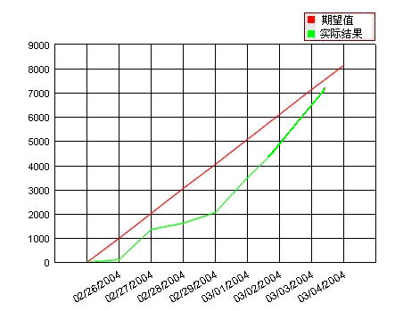
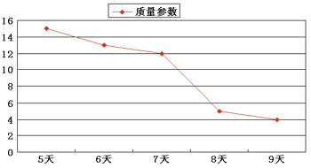
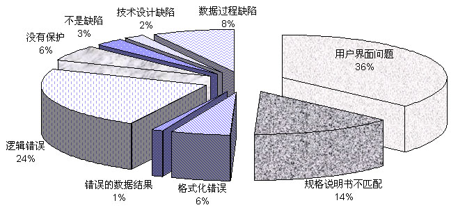
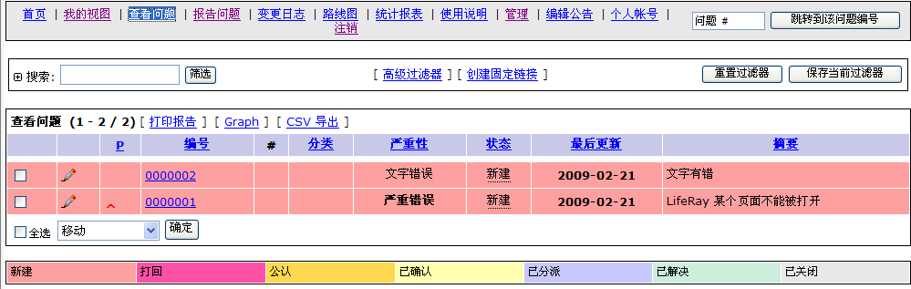

# 第13章 测试执行、缺陷报告与跟踪

## 第12章回顾
- 测试基础设施的重要性
- 测试基础设施的要素
- 虚拟机、容器及其集群管理
- 测试基础设施的自动部署

## 本章目录
- 13.1 软件测试执行与跟踪
- 13.2 软件缺陷的描述
- 13.3 软件缺陷跟踪和分析
- 13.4 产品质量评估与度量
- 13.5 测试的评估与报告

## 13.1 软件测试执行与跟踪

### 13.1.1 软件测试过程的要点

- 不同测试阶段的执行要点
- 测试用例执行
- 团队建设与沟通
- 测试执行结束

#### 测试执行实践
> [!IMPORTANT]
> - 执行前开一个动员会，严格审查测试环境
> - 抽查性质的探索式测试，验证高风险区域的测试质量
> - 交叉互换测试人员所测试的模块，可以发挥互补作用
> - 良好的沟通，如每周例会，以及和开发人员的及时沟通
> - 测试时间被压缩 → 测试策略的优化、计划调整 → 测试需求的优先级、调整测试范围
> - 常规的缺陷审查，及时发现问题、纠正问题，使整个测试进程在控制轨道上发展
> - 阶段性结果分析，保证阶段性测试任务得到完整的执行并达到预定的目标

### 13.1.2 测试项目进度的管理方法

- 进度与质量关系
- 进度与成本的关系

#### 测试进度的S曲线法
> [!TIP]
> 进度S曲线法通过对计划中、尝试的与实际的进度三者对比来实现的，其采用的基本数据主要是测试用例或测试点的数量。

#### 测试进度的NOB曲线法
> [!TIP]
> NOB：Number of Open Bug（未关闭缺陷数）

### 13.1.3 测试过程管理的工具
- **AgileTC** 是滴滴开源的一套敏捷的测试用例管理平台
- **Jira** 是 Atlassian 公司开发的项目管理工具，常常用于缺陷管理
- **MeterSphere** 是一站式开源持续测试平台，涵盖测试管理、接口测试、性能测试、团队协作等功能
- **PractiTest** 是一个端到端的测试管理系统，提供了测试用例管理，缺陷状态管理，具有可定制的仪表板，并附有详细报告。
- **TestLink** 是一个开源的用于项目管理、缺陷跟踪和测试用例管理的测试过程管理工具

## 13.2 软件缺陷的描述

### 缺陷关心的核心问题
- 描述？
- 是否严重？
- 是否需要修正？
- 当前状态？
- ……

### 13.2.1 缺陷生命周期
> [!TIP]
> - **发现-打开**：测试人员找到软件缺陷并将软件缺陷提交给开发人员。
> - **打开-修复**：开发人员再现、修复缺陷，然后提交给测试人员去验证。
> - **修复-关闭**：测试人员验证修复过的软件，关闭已不存在的缺陷。

#### 完整的缺陷生命周期与实例
1. **创建** -> Send email to DEV
2. **激活状态** -> 评估是否清楚、可再现？（不能再现、缺少信息 -> 需要处理 -> 缺陷评审）
3. **已处理状态** -> Unit test, code review -> Check in CVS
4. **已修正状态** -> Send email to QA -> 验证是否通过
5. **关闭状态**（或者是 延期、增强设计、无法解决、进入下一个版本）

**14 Steps 实例：**
1. Open a bug
2. Dev checks mail & Review bug
3. Duplicate the bug
4. Debug
5. Check out code
6. Fix bug
7. Code Review
8. Unit test
9. Check in code
10. Build a package
11. Upload package
12. Installation/configuration
13. Verify fixed bugs
14. Change bug status to close

### 13.2.2 严重性和优先级
> [!TIP]
> - **严重性 (Severity)**：衡量缺陷对客户满意度的影响程度（分为致命的 fatal、严重的 critical、一般的 major、微小的 minor）。
> - **优先级 (Priority)**：指缺陷被修复的紧急程度。

| 缺陷优先级 | 描述 |
| --- | --- |
| 立即解决 (P1级) | 缺陷导致系统几乎不能使用或测试不能继续，需立即修复 |
| 高优先级 (P2级) | 缺陷严重，影响测试，需要优先考虑 |
| 正常排队 (P3级) | 缺陷需要正常排队等待修复 |
| 低优先级 (P4级) | 缺陷可以在开发人员有时间的时候被纠正 |

> [!IMPORTANT]
> **优先级的计算公式：**
> 优先级 = （可重复性 + 可发生性）× 严重性

### 13.2.3 缺陷的其它属性
- **缺陷标识（ID）**
- **缺陷类型（type）**：如功能、UI、性能、文档
- **缺陷产生可能性（frequency）**：可再现的概率
- **缺陷来源（source）**：需求、设计、编码
- **缺陷原因（cause）**：数据格式、计算错误、接口参数、变量定义与引用等

### 13.2.4 完整的缺陷信息
> [!TIP]
> - **步骤**：提供了如何重复当前缺陷的准确描述，应简明而完备、清楚而准确。这些信息对开发人员是关键的，视为修复缺陷的向导。
> - **期望结果**：与测试用例标准或设计规格说明书或用户需求等一致，达到软件预期的功能。是验证缺陷的依据。
> - **实际结果**：实际执行测试的结果，不同于期望结果，从而确认缺陷的存在。

**还需要什么重要的信息？**
产品、版本信息、图片、Trace Log、录制操作过程等。

**缺陷完整的信息应包含：**
严重程度、优先级、类型、缺陷提交人、缺陷指定解决人、来源、产生原因、构建包跟踪、ID、标题、前提、环境、操作步骤、期望结果、实际结果、频率、版本跟踪、提交时间、修正时间、验证时间、所属项目/模块、产品信息、状态。

### 13.2.5 缺陷描述的基本要求
> [!IMPORTANT]
> - **单一准确**：每个报告只针对一个软件缺陷。
> - **可以再现**：提供缺陷的精确操作步骤。
> - **完整统一**：提供完整、前后统一的软件缺陷的步骤和信息。
> - **短小简练**：包括使用关键词。
> - **特定条件**：一定要注明。
> - **不做评价**：不加入主观评价。

### 13.2.6 缺陷报告示例
**优秀的缺陷报告**
- **重现步骤** :
  1. 打开一个编辑文字的软件并且创建一个新的文档。
  2. 在这个文件里随意录入一两行文字。
  3. 选中一两行文字，通过选择Font菜单然后选择Arial字体格式。
- **期望结果**：文本应该显示正确的文字格式，不会出现乱字符显示。
- **实际结果**：一两行文字变成了无意义的乱字符。如果改变文字格式成Arial之前保存文件，缺陷不会出现。缺陷仅仅发生在Windows98并且改变文字格式成其它的字体格式时文字是显示正常的。

**散漫的缺陷报告的示例**（反面教材）
- **重现步骤**：
  在Windows 11上打开一个编辑文字的软件并且编辑存在文件。文件字体显示正常，我添加了图片显示正常。在此之后，我创建了一个新的文档，随意录入了大量的文字。选择几行文字并且通过选择Font菜单然后选择Arial字体格式改变文字的字体。有三次我重现了这个缺陷。我在Solaris和Mac操作系统运行这些步骤，没有任何问题。
- **期望结果**：同上。
- **实际结果**：我试着选择少量的不同的字体格式，但是只有Arial字体格式有软件缺陷，不论如何，它可能会出现在我没有测试的其它的字体格式。

## 13.3 软件缺陷跟踪和分析

### 13.3.1 软件缺陷处理技巧
> [!IMPORTANT]
> - 确保被发现的缺陷能够被及时处理
> - 及时沟通（如 reopen bug 前，事先线下沟通）
> - **只有测试人员有关闭缺陷的权限**
> - 明确定义优先级和严重级衡量标准
> - 注释清楚、达成一致意见
> - 周期性的会诊Bug
> - 实时监控Bug Dashboard
> - 不要试图隐藏Bug
> - 收集缺陷数据，进行必要的缺陷分析

#### 缺陷处理的基本操作
- **审阅**：由测试管理员等进行，审阅缺陷报告的质量水平。
- **拒绝**：如果需要重大修改，应和测试人员讨论，由测试人员纠正后再次提交。
- **完善**：完整地描述了问题的特征并将其分离，审查者肯定报告。
- **分配**：分配给适当的开发人员或开发组长。
- **验证**：缺陷的修复需要得到测试人员的验证，同时进行回归测试检查是否引入新问题。
- **重新打开**：需要加注释说明、电话沟通等，避免开发测试人员产生矛盾。
- **关闭**：只有测试人员有关闭缺陷的权限，开发人员没有。
- **暂缓**：双方同意将缺陷移到以后处理（指定下个版本或日期），新版本开始时重新打开。

#### 缺陷的跟踪处理流程
- 确保每个被发现的缺陷都能被“解决”（修正、延迟或由于技术原因不能被修正）。
- 收集缺陷数据并根据缺陷趋势曲线识别当前处于测试的哪个阶段。
- 决定测试过程是否结束（通过缺陷趋势曲线确定是有效方式）。

#### 集体 review 缺陷：“三国会议”
> [!TIP]
> 参加者：项目经理、开发组长、测试组长
- 通过Bug数据库评估每个未解决的Bug。
- 决定 Bug fix 优先级。
- 决定可否等到下个里程碑或版本解决。
- 决定由谁解决，预测项目实际进度和发布时间。

### 13.3.2 缺陷趋势分析
监控（打开/关闭/已修正的）缺陷随时间的变化。
- 产品开发质量情况取决于累积打开/关闭曲线的趋势。
- 项目进度取决于累积关闭/打开曲线起点的时间差。
- 开发人员、测试人员的工作进度和效率也能得到反映。

#### 累积缺陷趋势与收敛点
> [!TIP]
> **收敛点**：报告的 Bug 曲线与解决的 Bug 曲线在不断反弹之中逐渐贴近或交叉，代表 Bug 开始收敛。

### 13.3.3 缺陷分布分析
缺陷分布报告：缺陷数量与缺陷属性（如测试需求、缺陷状态、严重性等）的函数分布情况。

#### 缺陷分析：从 Bug 中学习
围绕 **People、Process、Technology** 展开：
- **根因分析 (Root Cause Analysis)**：What's problem? What's root cause? What's solution?
- **案例分析与学习 (Case Study)**
- **缺陷预防**：代码规则、设计 Checklist

### 13.3.4 缺陷跟踪方法

#### Bug Dashboard 与缺陷报告
- **缺陷分布报告**：将缺陷计数作为缺陷参数的函数来显示。
- **缺陷趋势报告**：按各种状态将缺陷计数作为时间的函数显示（累计或非累计）。
- **缺陷年龄报告**：显示缺陷处于活动状态的时间，了解处理进度情况。
- **测试结果进度报告**：展示测试过程在不同版本中的执行结果及周期。

#### “Bug bash” 缺陷大扫除活动
集中时间进行找虫活动。

> [!IMPORTANT]
> **必须做的…**
> - 尽早定义和推广 Bug 管理流程
> - 明确定义优先级和严重级衡量标准
> - 清晰设置 Bug 提交必须的信息
> - 周期性的会诊 Bug
> - 周期性的检查 Bug 列表
> 
> **不要做的…**
> - 把 I18N Bug 和 L10N Bug 混为一谈
> - 试图隐藏你的 Bug
> - 解决和关闭你自己的 Bug
> - 未经诊断发布一个补丁

### 13.3.5 软件缺陷跟踪系统
**系统主要作用：**
- 推动团队内部的有效沟通。
- 提供报表和分析。
- 按照优先级排列重要 Bug。
- 跟踪任何一个 Bug 的整体生命周期。
- 纪录任何跟 Bug 有关的操作。
- 报告任何一个 Bug 的当前状态。

**开源缺陷跟踪系统代表：**
- **MantisBT**：http://mantisbt.sourceforge.net/
- **Bugzilla**：http://www.mozilla.org/projects/bugzilla/
- **Bugzero**：http://bugzero.findmysoft.com/
- **Scarab**：http://scarab.tigris.org/
- **TrackIT**：http://trackit.sourceforge.net/
- **Itracker**：http://www.itracker.org/

## 13.4 产品质量评估与度量

### 软件度量的分类与过程
- **分类**：软件过程度量、项目度量、产品质量度量
- **过程**：
  1. **识别目标**：分析出度量的工作目标和列表，由管理者审核确认。
  2. **定义度量过程**：定义收集要素、收集、分析、反馈过程及 IT 支持体系。
  3. **搜集数据**：应用 IT 工具收集，并按指定方式审查和存储。
  4. **数据分析与反馈**：按照已定义的分析方法进行分析，完成图表并反馈。
  5. **过程改进**：管理者基于度量数据做出决策。

### 13.4.1 基于缺陷的质量度量
- **代码的缺陷密度**：每千行代码（KLOC）的缺陷数（Bug# / KLOC）。
- **缺陷清除率**：各个阶段的缺陷清除率和总的缺陷清除率。
- **缺陷逃逸率**：未在研发阶段发现的缺陷意味着逃逸。
  *缺陷逃逸率 = 线上发现的缺陷数 / (线上发现的缺陷数 + 研发环境下发现的缺陷数)*
- 缺陷趋势是否良好、是否收敛。
- 缺陷分布是否符合正态分布，是否过于集中在少数模块。

**缺陷度量基线表**
| 度量项 | 目标 | 低水平 |
| --- | --- | --- |
| 缺陷清除效率 | >95% | <70% |
| 原有缺陷密度 | 每个功能点 <4 | 每个功能点 >7 |
| 缺陷数/KLOC | <2 | >=4 |
| 缺陷数/100 case | >3 | <1 |
| 缺陷数/Man-day | > 3 | < 1 |

### 13.4.2 经典的种子公式
> [!TIP]
> 假设：已测试出的种子 Bug (s)，已测试出的非种子 Bug (n)；
> 全部的种子 Bug (S)，全部的非种子 Bug (N)。
> 
> 则可以推算程序的**总 Bug 数**为：**N = S * (n / s)**

> [!IMPORTANT]
> 如果 n = N，说明所有的 Bug 已找出来，测试足够充分。
> **测试充分的信心指数 (C)**：
> - 如果 n > N，C = 1
> - 如果 n <= N，C = S / (S - N + 1)
> (值越大说明信心越高，最大值为1)

### 13.4.3 基于缺陷清除率的估算方法
- F 为软件功能点；
- D1 为开发过程中发现的所有缺陷数；
- D2 为发布后发现的缺陷数；
- D = D1 + D2 为发现的总缺陷数。

**核心公式**：
- **质量** = D2 / F
- **缺陷注入率** = D / F
- **整体缺陷清除率** = D1 / D

| 缺陷源 | 潜在缺陷 | 清除效率(%) | 被交付的缺陷 |
| --- | --- | --- | --- |
| 需求报告 | 1.00 | 77 | 0.23 |
| 设计 | 1.25 | 85 | 0.19 |
| 编码 | 1.75 | 95 | 0.09 |
| 文档 | 0.60 | 80 | 0.12 |
| 错误修改 | 0.40 | 70 | 0.12 |
| **合计** | **5.00** | **85** | **0.75** |

### 13.4.4 软件质量的度量
包括软件可靠性度量、复杂度度量、缺陷度量和规模度量。
公式：**Mi ＝ c1×f1 ＋ c2×f2 ＋ … ＋ cn×fn** 
（Mi 是软件质量因素，fn 是影响质量因素的度量值，cn 是加权因子）

#### 质量度量的统计方法
错误类型分类：
- IES：说明不完整或说明错误
- MCC：与客户交流不够所产生的误解
- IDS：故意与说明偏离
- VPS：违反编程标准
- EDR：数据表示有错
- IMI：模块接口不一致
- EDL：设计逻辑有错
- IET：不完整或错误的测试
- IID：不准确或不完整的文档
- PLT：将设计翻译成程序语言中的错误
- HCI：不清晰或不一致的人机界面
- MIS：杂项

| 错误分类 | 总计(Ei)数量 | 百分比 | 严重(Si) | 一般(Mi) | 微小(Ti) |
| --- | --- | --- | --- | --- | --- |
| IES | 296 | 22.3% | 55 | 95 | 146 |
| MCC | 204 | 15.3% | 18 | 87 | 99 |
| EDR | 182 | 13.7% | 38 | 90 | 54 |
| IET | 140 | 10.5% | 17 | 51 | 72 |
| ... | ... | ... | ... | ... | ... |
| **总计** | 1330 | 100% | 195 | 512 | 623 |

#### 质量度量计算公式
- **阶段错误度量**：PIi = Ws(Si/Ei) + Wm(Mi/Ei) + Wi(Ti/Ei)
- **总体质量度量**：Ep = Σ (i × PIi) / Ps
  - i 代表阶段权重（1, 2, 3, 4, 5 代表需求、设计、编码、测试、发布）
  - Ws, Wm, Wi 分别代表严重、一般、微小的权重（如0.6, 0.3, 0.1）

#### 度量及其指标的作用

度量可以推动测试流程的改进，但不良的度量也可以使测试流程的执行变形。

## 13.5 测试的评估与报告

### 13.5.1 测试过程的评估
> [!IMPORTANT]
> **测试过程评审**：结合测试计划进行评审，把计划活动和实际执行活动进行比较。常见评估提问：
> - 是否完成了测试计划所要求的各项测试内容？
> - 测试用例是否经过开发人员、产品经理的严格评审？
> - 系统测试是否包含了性能、兼容性、安全性等各项测试？执行结果如何？
> - 需要执行的测试用例是否百分之百地完成了？
> - 所有严重的 Bug 都修正了？

### 13.5.2 测试充分性的评估
通过了解测试覆盖率的值，可以知道测试是否充分、测试能否结束。
- **测试覆盖率**：用来衡量测试完成程度，或评估测试活动覆盖产品代码的一种量化结果。它是产品代码质量的间接度量方法。
- **覆盖率分析**：由业务需求、系统特性（功能/非功能特性）和代码等多个层次构成（三个层次、两种视角）。

### 13.5.3 测试报告
根据国家标准 GB/T 17544－1998（附录E），对测试纪录、结果如实汇总分析并形成报告：
- 产品标识；
- 用于测试的计算机系统；
- 使用的文档及其标识；
- 产品描述、用户文档、程序和数据的测试结果；
- 与要求不符的清单；
- 针对建议的要求不符的清单，产品未作符合性测试的说明；
- 测试结束日期。

## 实验与实践
- **实验9: 安装和使用缺陷跟踪系统 MantisBT**
  
- **实验10: 基于MeterSphere的综合实验**
  - 在线或离线安装 MeterSphere；
  - 创建项目及基础测试环境配置；
  - 完整的接口测试（定义、用例、自动化等）；
  - 完整的性能测试（场景、压力配置、分析）；
  - 完整的功能测试流程（用例评审、计划、管理、报告）。

## 期末重点考点与概念提炼

### 核心术语
- **Bug/缺陷**：软件未达到需求或规格说明书预期的状态或行为。
- **严重性 (Severity)**：衡量缺陷对客户满意度或系统功能的影响与破坏程度。
- **优先级 (Priority)**：指缺陷被修复的紧急程度或排队顺序。
- **缺陷生命周期**：一个 Bug 从被发现（发现-打开）、修复（打开-修复）到最终关闭（修复-关闭）的状态演变全过程。
- **缺陷密度**：每千行代码 (KLOC) 中所含有的缺陷数量。
- **缺陷清除率**：发现并清除的缺陷数占总缺陷数（含发布后发现）的比例。
- **缺陷逃逸率**：线上（生产环境）发现的缺陷数占总缺陷数（线上发现 + 研发环境发现）的比例。
- **种子公式 (Seed Formula)**：通过在软件中植入已知“种子缺陷”，根据测试发现的种子与非种子缺陷比例，估算程序中潜在总 Bug 数的经典方法。

### 期末考点提炼
1. **缺陷的生命周期与状态转换**
   - 掌握 Bug 的核心状态流转：“发现-打开”、“打开-修复”、“修复-关闭”。
   - 清楚各角色的权限：**只有测试人员有关闭缺陷的权限**；开发人员仅负责修复与验证反馈。
2. **严重性与优先级的区别与联系**
   - 严重性体现缺陷的破坏力（致命、严重、一般等）；优先级体现修复该缺陷的迫切程度。
   - 优先级的判定（如 P1 立即解决）不仅取决于严重性，还与缺陷发生频率（可重复性、可发生性）密切相关。
3. **缺陷描述的基本要求**
   - 必须满足单一准确、可以再现（提供精确操作步骤）、完整统一、短小简练、注明特定条件且**不做评价**。
   - 能够辨别优秀的缺陷报告（步骤清晰、有前置与期望对比）和散漫的缺陷报告（冗长主观）。
4. **缺陷趋势与分布分析**
   - 能够通过缺陷趋势图（如 S 曲线、NOB 曲线、累积趋势）判断测试进度、软件质量**收敛点**及项目潜在风险。
   - 了解“三国会议”（项目、开发、测试代表）的集体审阅机制。
5. **经典的质量度量方法**
   - 能够熟练运用“种子公式” **$N = S \times (n / s)$** 估算程序中隐藏的 Bug 总数以及计算测试信心指数。
   - 掌握基于缺陷清除率和缺陷逃逸率的质量评估公式及其在项目中的意义。