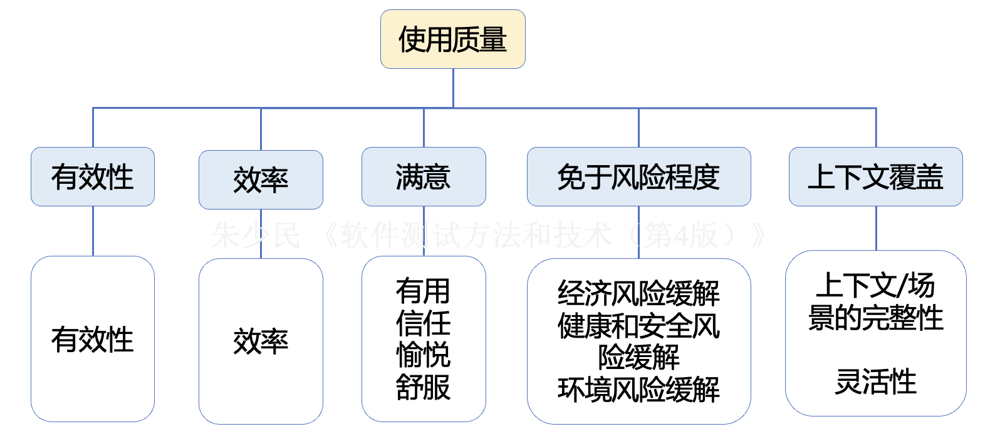
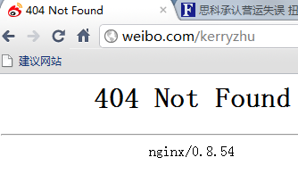
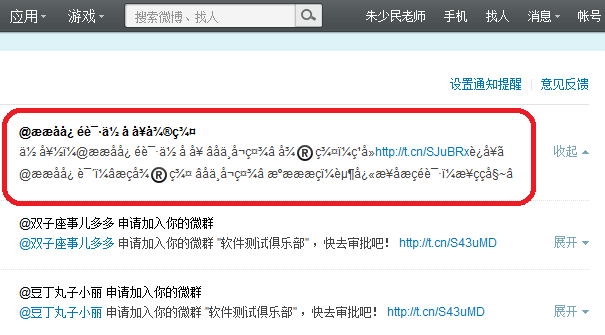
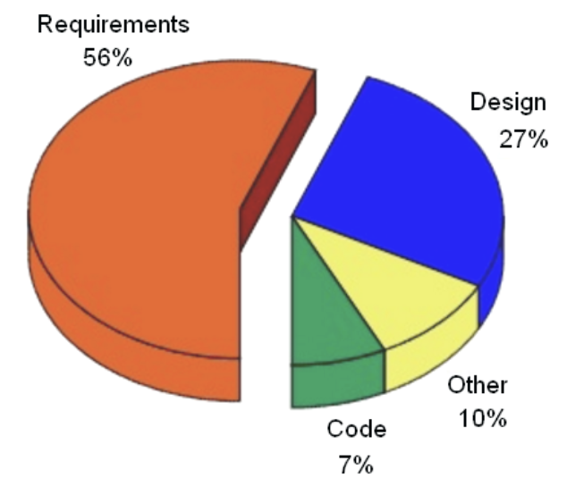
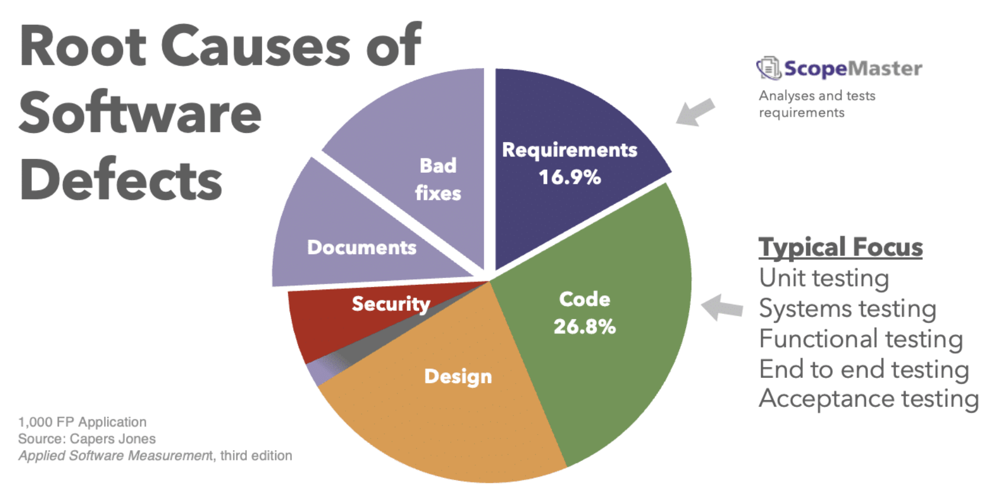
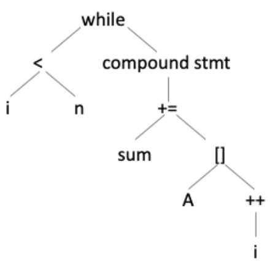
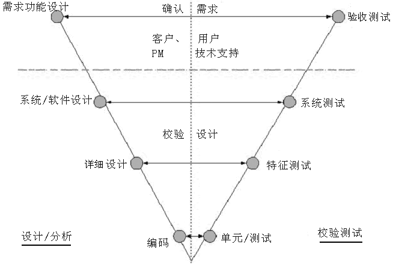
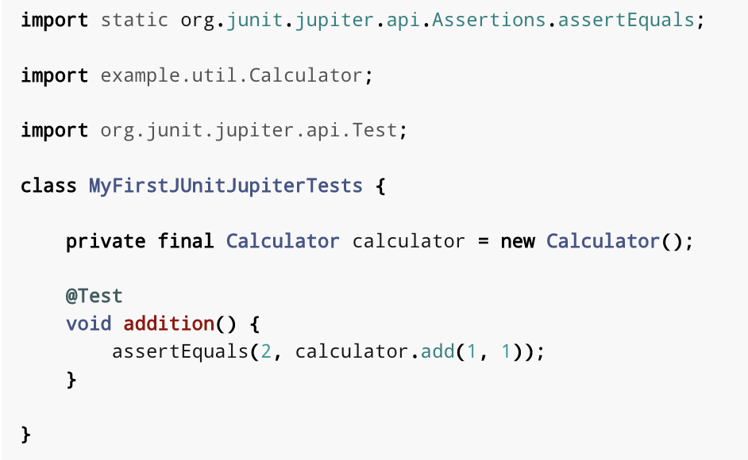
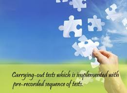

<!-- Slide number: 1 -->

# 软件测试方法和技术
第2章 软件测试的基本概念
同济大学  朱少民
版权所有©️ 仅限于教学使用

### Notes:

<!-- Slide number: 2 -->
# 第1章回顾
什么是软件测试
软件测试的正反两面性
验证软件
发现缺陷
V&V
软件测试和开发的关系
TDD

### Notes:

<!-- Slide number: 3 -->
2.1 软件缺陷
2.2 软件测试的分类
2.3 静态测试与动态测试
2.4 主动测试与被动测试
2.5 黑盒测试与白盒测试
2.6 软件测试层次
2.7 软件测试工作范畴
版权所有©️ 仅限于教学使用

### Notes:
四、测试方式

静态测试和动态测试
主动测试和被动测试
手工测试和自动化测试
基于脚本测试和探索式测试
五、结构化测试方法（ST）

语句覆盖于判定覆盖
条件覆盖
判定/条件覆盖
条件组合覆盖
MC/DC覆盖
基本路径覆盖
六、基于需求的测试方法（RBT）

等价类划分法
边界值分析法
判定表方法
因果图法
Pairwise方法 （工具ATCS）
正交试验法
基于场景的测试方法
重难点小结
数据流、控制流覆盖，不同层次的覆盖

<!-- Slide number: 4 -->

# 2.1 软件缺陷

### Notes:
列写本课时的学习要点，依次开始深入讲解。
如有学习要求，请列写在课时要点之后。
在保持内容版式整洁的前提下，重点的学习内容，请尽量详细的列写在讲义中，让大家在单独看讲义时也可以学习。
讲义非语音讲解辅助，而是学习的一个主体。

概念，学习要点的概念介绍，以及在工作中什么场景会用到
讲解，工作中胜任这个能力，需要掌握的知识、技术能详细讲解
举例，举一个案例或demo 帮助大家更好理解要学习的内容，以及知道怎么用
分享经验，你对这个学习要点的工作应用心得。特别是理论和实际的差异的部分。
学习建议，给出一些相关学习或工作场景中使用的建议
实用工具，这个学习要点对应的一些工具模板（如果有）

<!-- Slide number: 5 -->
# 缺陷是质量的对立面
要了解什么是缺陷(defect)，就必须清楚“质量(Quality)”概念，因为缺陷是相对质量而存在的，违背了质量、违背了客户的意愿，不能满足客户的要求，就会引起缺陷或产生缺陷
质量
矛盾/对立

要求/期望
用户

发现
Bug？

软件测试
评估
质量模型

### Notes:

<!-- Slide number: 6 -->
2.1.1 软件质量的内涵
2.1.2 软件缺陷的定义
2.1.3 软件缺陷的产生
2.1.4 软件缺陷的构成
2.1.5 修复软件缺陷的代价

### Notes:
四、测试方式

静态测试和动态测试
主动测试和被动测试
手工测试和自动化测试
基于脚本测试和探索式测试
五、结构化测试方法（ST）

语句覆盖于判定覆盖
条件覆盖
判定/条件覆盖
条件组合覆盖
MC/DC覆盖
基本路径覆盖
六、基于需求的测试方法（RBT）

等价类划分法
边界值分析法
判定表方法
因果图法
Pairwise方法 （工具ATCS）
正交试验法
基于场景的测试方法
重难点小结
数据流、控制流覆盖，不同层次的覆盖

<!-- Slide number: 7 -->
2.1.1 软件质量的内涵

<!-- Slide number: 8 -->
# 什么是“质量” ？

### Notes:

<!-- Slide number: 9 -->
# 什么是“质量” ？

“质量的概念很难定义，因为它不仅是可见的，而且在体现它的作品中以某种方式被直觉地呈现出来。”
质量与大众的审美、品味或风格无关;与地位、体面或奢华无关。相反，它是在一种接受、得体和克制的气氛中显露出来的

### Notes:
intuit

<!-- Slide number: 10 -->
# 质量 =品牌 =客户满意度

### Notes:

<!-- Slide number: 11 -->
# 软件质量 的内涵
IEEE： 质量是系统、部件或过程满足
明确需求
客户或用户需要或期望的程度不同
软件质量：软件产品具有满足规定的或隐含要求能力要求有关的特征与特征总和(ISO 8492)
软件质量：软件产品满足
	使用要求的程度

### Notes:

<!-- Slide number: 12 -->
# 高质量软件标准体系
产品质量
是人们实践产物的属性和行为，是可以认识，可以科学地描述的。并且可以通过一些方法和人类活动，来改进质量.
质量模型:  McCall 模型, Boehm 模型, ISO 9126 模型
过程质量:
软件能力成熟度模型 CMM ( Capability Maturity Model)
 国际标准过程模型 ISO 9000
 软件过程改进和能力决断  SPICE
( Software Process Improvement and   Capability dEtermination)
在商业过程中有关的质量内容:
    培训、成品制作、宣传、发布日起、客户、风险、成本、业务等

流程
产品
商业环境

### Notes:

<!-- Slide number: 13 -->
# 产品质量的标准
- 功能性 Functionality
- 可用性 Usability
- 可靠性 Reliability
- 性能 Performance
- 容量 Capacity
- 可伸缩性 Scalability
- 可维护性 Service manageability
- 兼容性 Compatibility
- 可扩展性 Extensibility

非功能特性

### Notes:

<!-- Slide number: 14 -->
# 软件质量特征 (ISO 9126)
功能：与一组功能及其指定性质有关的一组属性，而功能是能满足明确或隐含的需求的能力
可靠：在规定的一段时间和条件下，软件维持其性能水平的能力有关的属性
易用：规定或潜在的用户为使用软件所需作的努力和所作的评价有关的属性
效率：与在规定条件下软件的性能水平与所使用资源量之间关系有关的属性
可维护：与进行指定的修改所需的努力有关的属性
可移植：与软件从一个环境转移到另一个环境的能力有关的属性
其中每一个质量特征都分别与若干子特征相对应

### Notes:

<!-- Slide number: 15 -->
# ISO 9126软件质量三层模型

### Notes:

<!-- Slide number: 16 -->
# Boehm软件质量模型
正确性
可靠性
效率
完整性
可用性
可维护性
可测试性
灵活性
可移植性
重复性
互用性
阐述性
正确性
连贯性
容错性
执行效率/储存效率
存取控制/存取检查
可操作性
可训练
沟通良好
简单性
易操作的
工具
自我操作性
扩展性
一般性
模块性
软件系统独立性
机器独立性
通讯公开性
数据公开性

产品操作

产品修改

产品维护

### Notes:

<!-- Slide number: 17 -->
# 最新质量标准：ISO25000系列

ISO/IEC25000 SE-软件产品质量要求和评定(SQuaRE)

### Notes:

<!-- Slide number: 18 -->
# 内部质量外部质量使用质量

使用质量
外部质量
内部质量
影响
影响
使用语境
依赖于
依赖于
在使用中度量
外部度量
内部度量
18

### Notes:
一篇博客，整理了质量模型的演变：http://www.cnblogs.com/gaochundong/p/software_quality_models.html

<!-- Slide number: 19 -->

# 内部度量

### Notes:
Economic risk mitigation （缓解、减轻）

按照ISO／IEC 9126-1:2001，软件质量模型可以分为：内部质量和外部质量模型、使用质量模型

<!-- Slide number: 20 -->
# 产品质量模型

https://www.iso.org/obp/ui/#iso:std:iso-iec:25010:ed-1:v1:en
GB/T 25000:10 2016 质量模型

### Notes:
整理了质量模型的演变：http://www.cnblogs.com/gaochundong/p/software_quality_models.html

<!-- Slide number: 21 -->
# 使用质量模型

21

### Notes:
Economic risk mitigation （缓解、减轻）

按照ISO／IEC 9126-1:2001，软件质量模型可以分为：内部质量和外部质量模型、使用质量模型

<!-- Slide number: 22 -->
# 示例：Web Portal的使用的质量

22

### Notes:

<!-- Slide number: 23 -->
2.1.2 软件缺陷的定义
任何程序、系统中的问题，如与产品设计书的不一致性、不能满足用户的需求

<!-- Slide number: 24 -->
# First Bug

Grace Hopper （1906-1992）

<!-- Slide number: 25 -->
# 缺陷 – Defect, Bug
缺点（defect）               偏差 （variance）
谬误（fault）                  失败 （failure）
问题（problem）            矛盾（inconsistency）
错误（error ）                毛病 （incident ）
异常（anomy）

### Notes:

<!-- Slide number: 26 -->
# 软件缺陷
IEEE (1983) 729 软件缺陷一个标准的定义：
 从产品内部看，软件缺陷是软件产品开发或维护过程中所存在的错误、毛病等各种问题；
 从外部看，软件缺陷是系统所需要实现的某种功能的失效或违背。
ISO 29119
a flaw in a component or system that can cause it to fail to perform its required function.
any condition that deviates from expectation based on requirements specifications, design documents

NOTE Defects may be found during, but not limited to, reviewing, testing, analysis, compilation, or use of software products or applicable documentation

### Notes:

<!-- Slide number: 27 -->
# 软件缺陷的现象
功能、特性没有实现或部分实现
设计不合理，存在缺陷
实际结果和预期结果不一致
运行出错，包括运行中断、系统崩溃、界面混乱
数据结果不正确、精度不够
用户不能接受的其他问题，如存取时间过长、界面不美观

### Notes:

<!-- Slide number: 28 -->
# 2.1.3 软件缺陷的判断准则
Test Oracle就是决定一项测试是否通过的（判断）的一种机制。Test Oracle的使用会要求将被测试系统的实际输出与所期望的输出进行比较，从而判断是否有差异，即是否为缺陷
需求规格说明书和其它需求、设计规范文档
竞争对手的产品
启发式测试预言（Heuristic oracle）
统计测试预言（Statistical oracle）
一致性测试预言（Consistency oracle）
基于模型的测试预言（Model-based oracle）
人类预言（Human oracle）

<!-- Slide number: 29 -->
2.1.4 软件缺陷的产生
技术问题
算法错误、计算和精度问题
接口参数传递不匹配

团队工作
沟通不充分，误解

软件本身
文档错误、用户使用场合(user scenario)，
时间上不协调、或不一致性所带来的问题
系统的自我恢复或数据的异地备份、灾难性恢复等问题

### Notes:
https://www.neverletdown.net/2014/10/defect-driven-process-improvement.html

<!-- Slide number: 30 -->
# 2.1.5 软件缺陷的构成

https://www.scopemaster.com/blog/root-causes-of-software-bugs/
Requirements-based testing process in practice
January 2010，International Journal of Industrial Engineering and Management 1(4):155-161

### Notes:

<!-- Slide number: 31 -->
# 软件缺陷在不同阶段的分布

在真正的程序测试之前，通过审查、评审会可以发现更多的缺陷。
需求的缺陷会在需求评审、设计、编码、测试等过程中会逐步发现，很能在需求分析一个阶段发现

### Notes:

<!-- Slide number: 32 -->
# 2.1.6 修复软件缺陷的成本

缺陷带来的成本被称为“劣质成本（COPQ）”
非线性增长，不及时处理所带来的成本很高

### Notes:

<!-- Slide number: 33 -->

# 2.2 软件测试的分类

### Notes:
列写本课时的学习要点，依次开始深入讲解。
如有学习要求，请列写在课时要点之后。
在保持内容版式整洁的前提下，重点的学习内容，请尽量详细的列写在讲义中，让大家在单独看讲义时也可以学习。
讲义非语音讲解辅助，而是学习的一个主体。

概念，学习要点的概念介绍，以及在工作中什么场景会用到
讲解，工作中胜任这个能力，需要掌握的知识、技术能详细讲解
举例，举一个案例或demo 帮助大家更好理解要学习的内容，以及知道怎么用
分享经验，你对这个学习要点的工作应用心得。特别是理论和实际的差异的部分。
学习建议，给出一些相关学习或工作场景中使用的建议
实用工具，这个学习要点对应的一些工具模板（如果有）

<!-- Slide number: 34 -->
# 软件测试的分类

### Notes:

<!-- Slide number: 35 -->
# 不同维度的分类
按测试的对象或范围分类，如底层测试/单元测试、接口测试/集成测试、系统测试、业务层的验收测试等
按测试目的分类（测试类型），如功能测试、性能测试、可靠性测试、安全性测试、兼容性测试、回归测试等
根据测试过程中被测软件是否被执行，分为静态测试和动态测试
根据是否针对系统的内部结构和具体实现算法来完成测试，可分为白盒测试和黑盒测试
按测试方法分类：精准测试、变异测试、蜕变测试、MBT等

### Notes:

<!-- Slide number: 36 -->
# 软件测试方式
静态测试 vs. 动态测试
主动测试 vs. 被动测试
手工测试 vs. 自动化测试
基于脚本的测试 vs. 探索式测试

<!-- Slide number: 37 -->
# 静态测试 vs. 动态测试
主持人
内审员

作者

列席人员

技术专业人员

记录员
用户代表

不执行程序，而是通过人工评审、代码扫描/静态分析发现错误
通过运行程序发现错误

### Notes:

<!-- Slide number: 38 -->
# 主动测试 vs. 被动测试

主动测试
被动测试

### Notes:

<!-- Slide number: 39 -->
# 手工测试 vs.  自动化测试

### Notes:

<!-- Slide number: 40 -->
# 基于脚本的测试 vs.  探索式测试
学习

探索式测试
测试设计

分析

测试执行

Scripted
Testing

### Notes:

<!-- Slide number: 41 -->

# 2.3 静态测试和动态测试

### Notes:
列写本课时的学习要点，依次开始深入讲解。
如有学习要求，请列写在课时要点之后。
在保持内容版式整洁的前提下，重点的学习内容，请尽量详细的列写在讲义中，让大家在单独看讲义时也可以学习。
讲义非语音讲解辅助，而是学习的一个主体。

概念，学习要点的概念介绍，以及在工作中什么场景会用到
讲解，工作中胜任这个能力，需要掌握的知识、技术能详细讲解
举例，举一个案例或demo 帮助大家更好理解要学习的内容，以及知道怎么用
分享经验，你对这个学习要点的工作应用心得。特别是理论和实际的差异的部分。
学习建议，给出一些相关学习或工作场景中使用的建议
实用工具，这个学习要点对应的一些工具模板（如果有）

<!-- Slide number: 42 -->
# 静态测试
静态测试包括对软件产品的需求和设计文档、代码的评审（技术评审、文档评审等），以及对代码的静态分析等；
管理评审、流程评审不属于静态测试，而是属于质量保证（QA）；
评审的主要形式：互为评审 (Peer review)、走查 (walk-through)、会议评审 (Inspection)；
代码的静态分析主要采用工具进行，但人工的代码评审也不可或缺。

### Notes:

<!-- Slide number: 43 -->
# 2.3.1 产品评审
评审的对象：需求文档、设计和代码
通过软件评审，可以更早地发现需求工程、软件设计等各个方面的问题，大大减少大量的后期返工，将质量成本从昂贵的后期返工转化为前期的缺陷发现。
评审是对软件元素或者项目状态的一种评估手段，以确定其是否与期望的结果保持一致，并使其得到改进。

<!-- Slide number: 44 -->
# 需求评审解决的问题

不正确的需求认识
丢掉的需求点
模糊的描述
多余的或没意义的需求
不一致的理解

<!-- Slide number: 45 -->
# 需求评审的标准
正确性
完备性
易理解性
一致性
易测试性
易追溯性

### Notes:

<!-- Slide number: 46 -->
# 如何做好需求评审？
检查需求定义是否合理、清楚，是否具有可测试性
有明确的评审标准（如需求质量checklist）
熟悉评审内容，为评审做好准备
该参加的人都需要参加
针对问题阐述观点，而非针对个人
从客户角度想问题，多问几个为什么
在会前或会后提出自己建设性的意见
对发现的问题跟踪到底
针对需求文档等报告问题

### Notes:

<!-- Slide number: 47 -->
# 设计评审

设计评审
保证需求能在设计中得到准确和完整的表示，即保证系统架构设计和产品功能规格说明书的质量
可测试性

系统部署
系统架构
从高层
到
底层
不断从
测试角度去问开发
设计规格说明书
借助UML等建模工具

### Notes:

<!-- Slide number: 48 -->
# 设计评审解决的问题
 是否有设计规范？
 系统架构设计的不合理
 单点失效
 数据不完整性、不一致性
 缺乏可测试性
 具体功能设计的问题
……

<!-- Slide number: 49 -->
# 2.3.2 静态分析

<!-- Slide number: 50 -->
# 静态分析分为两种情况
人工检测：人工检测偏重于编码风格、质量的检验，对设计、代码进行分析，有效地发现逻辑设计和编码错误。
计算机辅助静态分析：利用静态分析工具对被测程序进行特性分析，从程序中提取一些信息，以便检查程序逻辑的各种缺陷和可疑的程序构造。

### Notes:

<!-- Slide number: 51 -->
# 代码静态分析
通过词法分析（Lexer）、语法分析（parser）、控制流分析、数据流分析等技术对程序代码进行扫描，验证代码是否满足规范性、质量要求等。
静态分析技术可以采用模拟程序执行的技术，如符号执行、抽象解释、值依赖分析等，并采用数学约束求解工具进行路径约减或者可达性分析以减少误报、增加效率

Token

词法分析

语法分析

程序
中间表示 IR
抽象语法树AST

### Notes:
程序源代码经过词法分析器（Lexer）得到各种不同种类的单词（Token），再由语法分析器（Parser）分析和语法检查后得到抽象语法树(AST)
通常会使用控制流图（Control Flow Graph，CFG）来表示程序的控制流，使用静态单赋值（Static Single Assignment，SSA）来表示程序中数据的使用-定义链（Use-Def Chain）
https://wizardforcel.gitbooks.io/antlr4-short-course/content/line-between-lexer-and-parser.html
https://decaf-lang.github.io/minidecaf-tutorial-deploy/docs/lab1/part1.html
https://blog.csdn.net/csdnnews/article/details/105592032

<!-- Slide number: 52 -->
# 2.3.3 验证与确认（V&V）
软件测试是由“验证（Verification）”和“有效性确认（Validation）”活动构成的整体
Verification：Are we building the product right？是否正确地构造了软件？即是否正确地做事，验证开发过程是否遵守已定义好的内容。验证产品满足规格设计说明书的一致性
Validation： Are we building the right product? 是否构造了正是用户所需要的软件？即是否正在做正确的事。验证产品所实现的功能是否满足用户的需求

### Notes:

<!-- Slide number: 53 -->
# 验证和确认

### Notes:

<!-- Slide number: 54 -->
# 2.4 主动测试 vs. 被动测试
被动测试：测试人员不干预产品的运行，而是被动地监控产品在实际环境中运行而获得系统运行的数据，然后进行分析
主动测试：测试人员主动操作被测对象，如输入数据、发送请求等来驱动被测对象，从而验证被测对象的响应或输出结果

### Notes:

<!-- Slide number: 55 -->
# 实例：在线测试(Product-in Testing)

### Notes:

<!-- Slide number: 56 -->
# 2.5 黑盒测试方法和白盒测试
客户需求

输出
输入

事件驱动

结构化测试
逻辑驱动测试
基于需求的测试
数据驱动测试

### Notes:

<!-- Slide number: 57 -->
# 小结

### Notes:

<!-- Slide number: 58 -->

# 2.6 软件测试层次

### Notes:
列写本课时的学习要点，依次开始深入讲解。
如有学习要求，请列写在课时要点之后。
在保持内容版式整洁的前提下，重点的学习内容，请尽量详细的列写在讲义中，让大家在单独看讲义时也可以学习。
讲义非语音讲解辅助，而是学习的一个主体。

概念，学习要点的概念介绍，以及在工作中什么场景会用到
讲解，工作中胜任这个能力，需要掌握的知识、技术能详细讲解
举例，举一个案例或demo 帮助大家更好理解要学习的内容，以及知道怎么用
分享经验，你对这个学习要点的工作应用心得。特别是理论和实际的差异的部分。
学习建议，给出一些相关学习或工作场景中使用的建议
实用工具，这个学习要点对应的一些工具模板（如果有）

<!-- Slide number: 59 -->
# 软件测试4个层次

集成测试

验收测试
系统承载的用户业务

由单元构成的系统

系统测试

单元之间接口

集成测试
组件／模块／类／函数

单元测试

### Notes:

<!-- Slide number: 60 -->
# 不同测试层次的任务
功能及用户界面安全性 效率用户的可接受性

验收测试

系统功能 安全性 健壮性效率
系统测试

集成测试
组件之间的接口

单元测试

组件功能健壮性效率

<!-- Slide number: 61 -->
# 单元测试
单元测试针对程序系统中的最小单元---模块或组件进行测试，一般和编码同步进行。主要采用白盒测试方法，从程序的内部结构出发设计测试用例，检查程序模块或组件的已实现的功能与定义的功能是否一致、以及编码中是否存在错误。通常要编写驱动模块和桩模块
单元测试一般由编程人员和测试人员共同完成，而以开发人员为主
单元测试包括代码评审，代码评审可以发现程序50%～70%代码的缺陷。

### Notes:

<!-- Slide number: 62 -->
# 示例

<!-- Slide number: 63 -->
# 集成测试
集成测试，也称联调，在单元测试的基础上，将模块按照设计要求组装起来同时进行测试，主要目标是发现与接口有关的模块之间问题。现在提倡持续集成测试

### Notes:

<!-- Slide number: 64 -->
# 持续集成、持续测试

<!-- Slide number: 65 -->
# 示例

### Notes:
DotNetNuke:一套非常优秀的基于asp.net的开源门户网站程:http://www.dotnetnuke.com/

<!-- Slide number: 66 -->
# 系统功能测试
一般在完成集成测试后进行系统功能测试，而且基于产品功能说明书，针对产品所实现的功能，从用户角度来进行功能验证，以确认每个功能是否都能正常使用

### Notes:

<!-- Slide number: 67 -->
# 系统非功能性测试
系统非功能性测试是将软件放在整个计算机环境下，包括软硬件平台、某些支持软件和数据等，在实际运行环境下验证系统的非功能性，
包括：
性能测试
安全性测试
稳定性测试
兼容性测试
……

### Notes:

<!-- Slide number: 68 -->
# 验收测试
验收测试的目的是向未来的用户表明系统能够像预定要求那样工作，验证软件的功能和性能如同用户所合理期待的那样

安装测试（部署验证）是指按照软件产品安装手册或相应的文档，在一个和用户使用该产品完全一样的环境中或相当于用户使用环境中，进行一步一步的安装操作性的测试

### Notes:

<!-- Slide number: 69 -->
# α、β测试 &在线测试
Alpha testing is simulated or actual operational testing by potential users/customers or an independent test team at the developers‘ site；Is a form of internal acceptance testing
Beta testing comes after α testing. Versions of the software, known as beta versions, are released to a limited users outside of the programming team.
Testing in production
http://blogs.msdn.com/b/seliot/
http://www.thetestingplanet.com/2011/11/the-future-of-software-testing-part-one-testing-in-production/

### Notes:

<!-- Slide number: 70 -->

# 2.7 软件测试工作范畴

### Notes:
列写本课时的学习要点，依次开始深入讲解。
如有学习要求，请列写在课时要点之后。
在保持内容版式整洁的前提下，重点的学习内容，请尽量详细的列写在讲义中，让大家在单独看讲义时也可以学习。
讲义非语音讲解辅助，而是学习的一个主体。

概念，学习要点的概念介绍，以及在工作中什么场景会用到
讲解，工作中胜任这个能力，需要掌握的知识、技术能详细讲解
举例，举一个案例或demo 帮助大家更好理解要学习的内容，以及知道怎么用
分享经验，你对这个学习要点的工作应用心得。特别是理论和实际的差异的部分。
学习建议，给出一些相关学习或工作场景中使用的建议
实用工具，这个学习要点对应的一些工具模板（如果有）

<!-- Slide number: 71 -->
# 软件测试自身工作流程

### Notes:

<!-- Slide number: 72 -->
# 测试需求分析

明确测试范围，了解哪些功能点要测试、哪些功能点不需要测试；
知道哪些测试目标优先级高、哪些目标优先级低；
要完成哪些相应的测试任务才能确保目标的实现。

### Notes:

<!-- Slide number: 73 -->
# 软件测试策略
制定或选择更合适、更有效的测试方式、测试方法和技术等，其目的是为了以最低的时间或人力成本达到最大程度地揭示产品的质量风险、尽快完成测试等。
基于下列这些因素的考虑做出决定：
测试方式，包括手工方式与自动化方式、静态方式与动态方式等的选择与平衡，探索式测试或基于脚本的测试、自己团队测试还是众测、外包等平衡；
测试方法，包括黑盒测试还是白盒测试方法、基于数据流还是基于控制流的方法、完全组合测试方法还是组合优化测试方法等平衡；
测试过程，先测什么、后测试什么，对测试阶段的不同划分等。

<!-- Slide number: 74 -->
# 测试计划

目标和范围
测试项及其优先级
测试风险识别与分析
指定测试策略
进度安排
资源配置
跟踪和控制机制

### Notes:

<!-- Slide number: 75 -->
# 测试设计
测试设计是解决“如何测”的问题，可以分为测试总体设计和测试详细设计:
测试总体设计则主要指测试方案的设计、测试结构的设计
测试详细设计主要是指测试用例的设计。

在测试方案的设计中，测试工作涉及的范围比较大，包括选择测试方法、明确测试策略、设计测试技术路线、选择测试工具和规划测试环境等，

### Notes:

<!-- Slide number: 76 -->
# 测试用例
测试用例是测试人员在测试过程中的重要参考依据
测试用例将有助于节约测试时间，提高测试效率。
良好的测试用例不断地被重复使用，使得测试过程事半功倍
测试用例是一个知识积累的过程

### Notes:

<!-- Slide number: 77 -->
# 测试执行
手工执行：基于详细设计的测试用例来完成测试，也可以在没有测试用例的情况下进行的探索式测试。
自动化执行：指采用测试工具来完成，一般都需要开发自动化测试脚本，然后工具执行脚本，在后续“单元测试与集成测试、系统测试和自动化测试框架”等各章会进行详细讨论。

<!-- Slide number: 78 -->
# 基于脚本的测试
有什么开发就有什么测试
分析

设计

执行

报告
Scripted Testing (ST)
先设计后执行
Script: 手工测试 的Test case/自动化的Test Script
阶段性明显，属于较传统的测试方式

### Notes:
Customer Benefit: “With WebEx Meeting Center, you can speed up business decision making and at the same time reduce travel cost and time”

<!-- Slide number: 79 -->
探索式测试定义

1983年

2006.6.6
探索式测试是一种软件测试风格(Style)，它强调独立测试人员(Individual Tester) 的个人自由和职责(Personal Freedom and Responsibility)，为了持续优化其工作的价 值(Value)，将测试相关学习(Test-related Learning)、测试设计（test Design）、测试执行（execution）和测试结果分析（analysis）作为相互支持的活动，在整个项目过程中并行地执行
79

### Notes:
Exploratory Testing After 23 Years Cem Kaner, J.D., Ph.D. Keynote at the Conference of the Association for Software Testing June 6, 2006

Interpretation：解释、说明
Mutually：互为、相互地

<!-- Slide number: 80 -->
# 基于脚本的测试 vs.  探索式测试
Product Exploration

Test Execution
Test Design
ExploratoryTesting
Fully
Scripted
Testing
Ad-hoc
Testing

Bug
Hunting
Automated
Tests
规范
完全自由的探索
规范的脚本
松散的测试用例
测试场景
角色扮演测试
自由

### Notes:

<!-- Slide number: 81 -->
ET vs. ST -2

Exploratory Testing

Scripted Testing

学习、设计和执行并行
上下文驱动
强调个人能力
Test Oracle
关注与产品的交互
拥抱变化、乐趣
先设计、后执行
强调逻辑分析
关注需求和测试文档
有明确的测试标准
强调评审、可控
严谨、规范
81

<!-- Slide number: 82 -->
# 测试结果和过程评估
测试结果评估：对测试结果进行分析，如分析测试覆盖率，以了解测试是否充分；也可以基于缺陷的趋势分析和分布分析，了解缺陷是否已收敛，以及基于缺陷来评估当前被测试的版本的质量 。
测试过程评估，结合测试计划来进行评审，相当于把计划的测试活动和实际执行的活动进行比较，了解测试计划执行的情况和效果 。

<!-- Slide number: 83 -->
# 本章小结
缺陷是质量的对立面，首先要理解质量的内涵，借助产品质量模型、使用质量模型来理解质量
缺陷是内部错误，在外部表现为失效，缺陷产生的原因很多，来源于需求定义、设计和代码。缺陷要尽早发现、尽早修正，否则带来的劣质成本越大
软件测试方式：静态 vs 动态、主动 vs 被动、手工测试 vs. 自动化测试、基于脚本的测试 vs. 探索式测试…
软件测试方式：单元测试、集成测试、系统测试和验收测试
软件测试工作范畴：测试需求分析、测试策略指定、测试计划、测试设计、测试执行、测试结果和过程评估
帮助同学们建立软件测试的整体全景图

<!-- Slide number: 84 -->
# 作业
选择同类某2～3个产品（如词典类、视频播放器等），并针对这个产品进行质量比较：
详细地分析它们的外部质量和使用质量
列出它们之间有明显差异的质量属性；
列出这类软件需求评审需要关注的功能点
列出这类软件设计评审需要关注的非功能特性

### Notes:

<!-- Slide number: 85 -->
# 思考题
为何说缺陷是质量的对立面？
为什么静态测试和 动态测试是一对对立统一体？
为什么说测试需求分析是测试计划、测试设计的基础？

### Notes:
重点学习内容，可以通过留实操作业或提问的方式，巩固学习成果

<!-- Slide number: 86 -->
实验：完成一个简单的测试过程
详见教材P40-P41
基于软件工程或其它课程开发的软件系统，选定1-2个功能模块。如果没有，就针对https://www.saucedemo.com/ 或 http://automationpractice.com/index.php
先做一些初步的功能测试·分析，如了解功能操作的路径、输入哪些数据？有哪些特殊、异常的数据或操作；
基于上述的分析，像用户使用产品操作软件，进行手工测试，发现缺陷并记录。
完成一个非规范的测试报告。

<!-- Slide number: 87 -->
# 感 谢 聆 听
朱少民 / 同济大学

### Notes:
每课结束时使用“以上是本节课的内容”“这一章讲到这里”