<!-- Slide number: 1 -->


# 第3章 软件测试基本方法

朱少民 / 同济大学
*版权所有©️ 仅限于教学使用*

---

<!-- Slide number: 2 -->
## 3.0 回顾与导言

### 第2章 回顾
* **软件缺陷与软件质量**：软件缺陷是软件质量的对立面。
* **什么是软件缺陷 (Bug)**。
* **软件测试的分类**：按测试层次、测试类型和测试方法分类。
  * 静态测试 与 动态测试
  * 主动测试 与 被动测试
  * 黑盒测试 与 白盒测试
* **测试层次**：单元测试、集成测试、系统测试、验收测试。
* **软件测试工作范畴**：测试需求分析、测试计划与设计、测试执行、测试结果评估。

---

<!-- Slide number: 3 -->
### 本章目录
* 3.1 基于直觉和经验的方法
* 3.2 基于输入域的方法
* 3.3 基于组合及其优化的方法
* 3.4 基于逻辑覆盖的方法
* 3.5 基于缺陷模式的测试
* 3.6 基于模型的测试
* 3.7 形式化测试方法

> [!NOTE]
> **详细大纲与页码参考：**
> - 3.1 基于直觉和经验的方法 (P35)
>   - 3.1.1 Ad-hoc测试方法和ALAC测试 (P36)
>   - 3.1.2 错误推测法 (P37)
> - 3.2 基于输入域的方法 (P38)
>   - 3.2.1 等价类划分法 (P38)
>   - 3.2.2 边界值分析法 (P41)
> - 3.3 基于组合及其优化的方法 (P45)
>   - 3.3.1 判定表方法 (P45)
>   - 3.3.2 因果图法 (P47)
>   - 3.3.3 Pair-wise方法 (P50)
>   - 3.3.4 正交试验法 (P51)
> - 3.4 基于逻辑覆盖的方法 (P53)
>   - 3.4.1 判定覆盖 (P54)
>   - 3.4.2 条件覆盖 (P55)
>   - 3.4.3 判定条件覆盖 (P56)
>   - 3.4.4 条件组合覆盖 (P57)
>   - 3.4.5 基本路径覆盖 (P59)
> - 3.5 基于缺陷模式的测试 (P62)
>   - 3.5.1 常见的缺陷模式 (P64)
>   - 3.5.2 DPBT的测试过程/自动化实现 (P65)
> - 3.6 基于模型的测试 (P65)
>   - 3.6.1 功能图法 (P67)
>   - 3.6.2 模糊测试方法 (P69)
> - 3.7 形式化测试方法 (P71)
>   - 3.7.1 形式化方法
>   - 3.7.2 形式化验证
>   - 3.7.3 扩展有限状态机方法

---

<!-- Slide number: 4 -->
## 3.0.1 方法论和具体方法

从方法论看，更多体现了一种哲学的思想，例如辩证统一的方法，在测试中有许多对立统一体，如静态测试和动态测试、白盒测试和黑盒测试、自动化测试和手工测试等。

软件测试的方法论来源于软件工程的方法论，例如有面向对象的开发方法，就有面向对象的测试方法；有敏捷方法，就有和敏捷方法对应的敏捷测试。

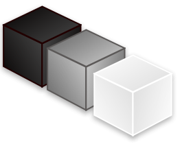

---

<!-- Slide number: 5 -->
## 3.0.2 黑盒测试方法和白盒测试


* **客户需求驱动**：基于需求的测试、数据驱动测试、事件驱动测试。
* **结构化与逻辑驱动**：结构化测试、逻辑驱动测试。
* **输入与输出的映射**：关注输入与输出，无需了解程序内部逻辑。

---

<!-- Slide number: 6 -->
## 3.0.3 过去常提的“黑盒和白盒”方法

* **黑盒方法**：
  * 等价类划分法
  * 边界值分析法
  * 判定表方法
  * 因果图法
  * Pairwise方法
  * 正交试验法
  * 功能图法
  * 基于需求的测试方法
* **白盒方法**：
  * 语句覆盖
  * 判定覆盖
  * 条件覆盖
  * 判定条件覆盖
  * 条件组合覆盖
  * 基本路径覆盖
  * 结构化测试方法

---

<!-- Slide number: 7 -->
## 3.0.4 现代方法论：测试方法

* 上下文驱动方法
* 基于需求验证的方法
* 基于场景的测试方法
* 基于模型的方法
* 基于经验的方法

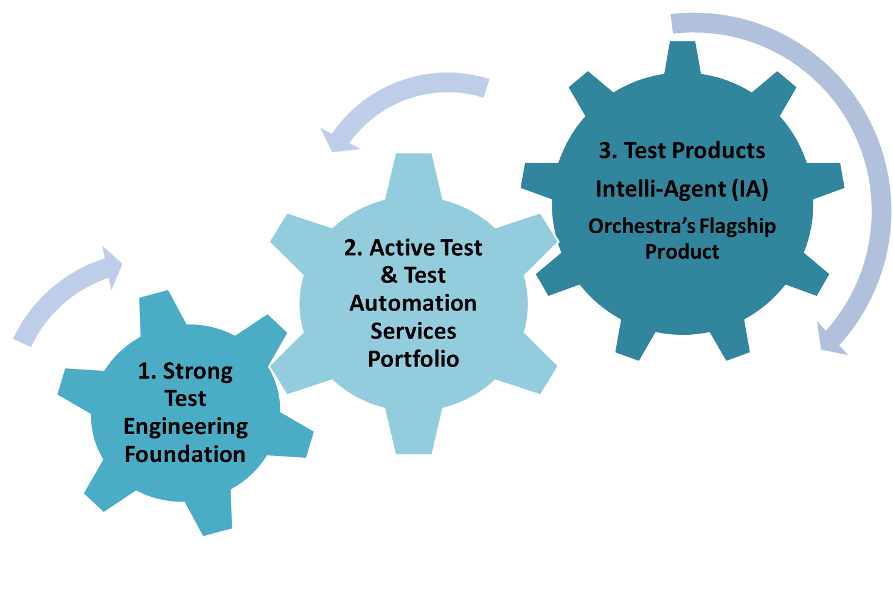

---

<!-- Slide number: 8 -->
## 3.0.5 SWBOK对测试方法的分类

> [!TIP]
> **SWBOK (Software Engineering Body of Knowledge) 分类：**
> * **基于输入域的测试（IDBT）**：等价类、边界值、两两组合（pairwise）、随机测试（归于**黑盒测试**）。
> * **基于代码的测试（CBT）**：基于控制流的标准、基于数据流的标准、CBT参考模型（归于**白盒测试**）。
> * **基于故障模式的测试（FBT）**：故障模型、错误猜测法、变异测试。
> * **基于使用的测试（UBT）**：操作配置（operational profile）、用户观察启发（归于**黑盒测试**）。
> * **基于模型的测试（MBT）**：决策表、有限状态机、形式化验证、TTCN3、工作流模型。
> * **基于应用特性的测试（TBNA）**：OOS、web、real-time、SOA、embedded、safe-critical（针对特定**应用领域**）。

---

<!-- Slide number: 9 -->
## 3.1 基于直觉和经验的方法

* 3.1.1 Ad-hoc测试方法和ALAC测试
* 3.1.2 错误推测法

---

<!-- Slide number: 10 -->
### 3.1.1 ALAC测试和随机测试

> [!TIP]
> **ALAC (Act-like-a-customer，像客户那样做)**：
> 一种基于客户使用产品的知识开发出来的测试方法。它的出发点是著名的 **Pareto 80/20规律**（即80%的用户只使用软件中20%的核心功能，测试应主要集中在用户最常使用的20%功能上）。

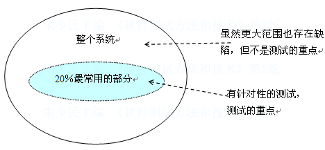

---

<!-- Slide number: 11 -->
### 3.1.2 错误猜测法

> [!TIP]
> **错误推测法 (Error Guessing)**：
> 测试者根据经验、知识和直觉来发现软件错误，推测程序中可能存在的各种错误，从而有针对性地进行测试用例设计。

**发现程序经常出现的错误的方法（经验来源）：**
* 单元测试中发现的模块错误。
* 产品的以前版本曾经发现的错误。
* 输入数据为 `0` 或字符为空。
* 当软件要求输入时（比如在文本框中），不是没有输入正确的信息，而是根本没有输入任何内容，单单按了 `Enter` 键。
* ……

---

<!-- Slide number: 12 -->
## 3.2 基于输入域的方法

* 3.2.1 等价类划分法
* 3.2.2 边界值分析法

---

<!-- Slide number: 13 -->
### 3.2.1 等价类划分法

> [!IMPORTANT]
> **等价类划分法 (Equivalence Partitioning)**：
> - **等价类定义**：是某个输入域 of 子集，在该子集中每个输入数据的作用是等效的。
> - **核心思想**：将输入数据分成若干个等价类，从每个等价类中选取一个代表性的数据作为测试用例。
> - **分类**：
>   1. **有效等价类**：对于程序的规格说明来说是合理的、有意义的输入数据构成的集合。
>   2. **无效等价类**：对于程序的规格说明来说是不合理的、无意义的输入数据构成的集合。

#### 等价类图示：
* `all inputs` (所有输入)
  * `i1`
  * `i2`
  * `i3`
  * `i4`

---

<!-- Slide number: 14 -->
### 等价类划分的应用规则

> [!IMPORTANT]
> **等价类划分三条黄金规则：**
> 1. 如果输入条件规定了**取值范围**或**值的个数**，则可以划分为**一个有效等价类**和**两个无效等价类**（例如：低于范围边界值、范围内边界值、高于范围边界值）。
> 2. 如果输入条件规定了**输入值的集合**（例如必须是某个特定集合中的成员），可以确立**一个有效等价类**（集合内成员）和**一个无效等价类**（非集合内成员）。
> 3. 如果规定了输入数据**必须遵守的规则**，则可以确立**一个有效等价类**和**数个无效等价类**（从不同角度违反规则）。

- `greater than range` (大于范围值)
- `in range` (在范围内)
- `less than range` (小于范围值)
- `greater than value` (大于设定值)
- `less than value` (小于设定值)
- `value` (具体值)
- `member of set` (集合成员)
- `not member of set` (非集合成员)

---

<!-- Slide number: 15 -->
### 练习：等价类划分设计


针对包含以下特性的输入进行划分：
* 有效等价类如何划分？
* 无效等价类呢？
  * **等价类 1**: Integer (整数)
  * **等价类 2**: Decimal fraction (小数)
  * **等价类 3**: Negative (负数)
  * **等价类 4**: Invalid input (无效输入，如字母、特殊字符)

---

<!-- Slide number: 16 -->
### 3.2.2 边界值分析法

> [!IMPORTANT]
> **边界值分析法 (Boundary Value Analysis, BVA)**：
> 很多错误发生在输入或输出范围的边界上，因此针对各种边界情况设置测试用例，可以更有效地发现缺陷。
> - **设计方法**：
>   1. 确定边界情况（输入或输出等价类的边界）。
>   2. 选取正好等于、刚刚大于或刚刚小于边界值作为测试数据。

---

<!-- Slide number: 17 -->
### 边界值设计示例 1

> [!IMPORTANT]
> - 如果输入条件规定了值的范围，应取**刚达到这个范围的边界的值**，以及**刚刚超越这个范围边界的值**作为测试输入数据。
>   - *例如*：区间 `(1,20]` 即 `1 < x <= 20`。边界点 `a` 和 `b` 的测试值应包括边界本身及其临近点（如：`1`, `2`, `20`, `21`）。
> - 如果输入条件规定了值的个数，则用**最大个数、最小个数、比最小个数少一、比最大个数多一**的数作为测试数据。
>   - *例如*：可选集合限制 `{X} = (1, 5, 10, 15, 20)`，测试其边界个数。

- `a` (下界)
- `b` (上界)
- `（1,20] 即 1< x <= 20`
- `a`, `b`
- `{X} =（1，5，10，15，20）`

---

<!-- Slide number: 18 -->
### 边界值设计示例 2

**对列表/多选选项的测试用例设计 (Test Cases)：**
* **任意的正常值**：随机选择几个选项。
* **边界值**：选择所有选项。
* **边界值**：一个都不选。
* **边界值**：仅选择一个选项。

---

<!-- Slide number: 19 -->
### 一些特殊的边界值

#### 1. ASCII 字符边界值
| 字符 (Character) | ASCII 值 | 字符 (Character) | ASCII 值 |
| --- | --- | --- | --- |
| Null | 0 | B | 66 |
| Space | 32 | Y | 89 |
| / | 47 | Z | 90 |
| 0 | 48 | [ | 91 |
| 1 | 49 | ` | 96 |
| 2 | 50 | a | 97 |
| 9 | 57 | b | 98 |
| ; | 58 | y | 121 |
| @ | 64 | z | 122 |
| A | 65 | { | 123 |

#### 2. 二进制数据边界值
| 术语 (Term) | 取值范围 / 边界点 |
| --- | --- |
| Bit | 0 or 1 |
| Nibble (半字节) | 0 - 15 |
| Byte (字节) | 0 - 255 |
| Word (字) | 0 - 65535 或 0 - 4294967295 |
| Kilo | 1024 |
| Mega | 1048576 |
| Giga | 1073741824 |
| Tera | 1099511627776 |

---

<!-- Slide number: 20 -->
### 一些特殊的边界值 – 续

> [!TIP]
> 常见的特殊边界测试值可从以下维度获取：
> * **数值**：`Min/Max`、`Min-1/Max+1`、缺省值、`0`、`Null`、空格等。
> * **字符**：空字符串、单个字符、最大长度限制。
> * **位置**：`First/Last`、`First-1/Last+1`。
> * **时间/速度**：`Slower/Faster`、`Start/Finish`、`Start-1/Finish+1`。
> * **容量**：`Empty/Full`、`Less than empty/More than full`。
> * **物理尺寸**：`Largest/Smallest`、`Shortest/Longest`。
> * **状态**：`Over/Under`、`Just Over/Just Under`。


* 缺省值、空格、`(none)`、`0`、`Null` 等。

---

<!-- Slide number: 21 -->
### 练习：基于边界值方法设计测试数据

#### 1. Username
* **规则**：
  * 12 个字符以内，不能为空。
  * 只能用字母、数字、`_` 、`-`，不能用空格。
  * 以字母开始。
  * 大大小写不敏感。

#### 2. Password
* **规则**：
  * 不少于 6 个字符。
  * 大小写敏感。

---

<!-- Slide number: 22 -->
## 3.3 基于组合及其优化的方法

* 3.3.1 判定表方法
* 3.3.2 因果图法
* 3.3.3 Pair-wise方法
* 3.3.4 正交试验法

---

<!-- Slide number: 23 -->
### 3.3.1 判定表方法

> [!IMPORTANT]
> **判定表法 (Decision Table Method)**：
> 在实际应用中，许多输入是由多个因素构成，而不是单一因素，这时就需要多因素组合分析。
> 对于多因素，有时可以直接对输入条件（成立或不成立）进行组合设计，不需要进行因果分析，此时直接采用判定表方法。
> 判定表由**“条件和活动”**两部分组成，即列出一个测试活动执行所需的条件组合，所有可能的条件（输入）组合定义了一系列的选择，而测试活动（结果输出）需要考虑每一个选择。

---

<!-- Slide number: 24 -->
### 判定表方法术语及应用

> [!IMPORTANT]
> **判定表的组成结构：**
> * **条件桩 (Condition Stub)**：问题的所有条件/输入。
> * **动作桩 (Action Stub)**：针对问题可能采取的动作/输出。
> * **条件项 (Condition Entry)**：所列条件的具体取值（如 `Y/N` 或 `T/F`）。
> * **动作项 (Action Entry)**：在条件项组合情况下应采取的动作。
> * **规则 (Rule)**：任何一个条件组合的特定取值及其相应的动作。在判定表中，每一列代表一条规则，每一条规则都需要设计一个测试用例。


* 结构：条件桩 + 条件项；动作桩 + 动作项。
* 最后每一列需要设计一条测试用例覆盖，有几条规则（组合）就有几条测试用例。

---

<!-- Slide number: 25 -->
### 判定表组合优化讨论


* 判定表可通过“合并无关项（如用 `-` 表示不影响动作的选择）”来简化规则，减少用例数量。
* 条件桩、动作桩优化。

---

<!-- Slide number: 26 -->
### 判定表方法示例

| 判定表结构 | ID | 项目名称 | R1 | R2 | R3 | R4 | R5 |
| --- | --- | --- | --- | --- | --- | --- | --- |
| **条件项** | C1 | 此商品在经营范围 | N | Y | Y | Y | Y |
|  | C2 | 此商品可以发货 | - | Y | Y | N | N |
|  | C3 | 此客户没有拖欠过付款 | - | Y | N | Y | N |
| **动作项** | A1 | 货到后允许客户转账 |  | 1 |  |  |  |
|  | A2 | 货到客户必须立即付款 |  |  | 1 |  |  |
|  | A3 | 重新组织货源 |  |  |  | 1 | 1 |
|  | A4 | 电话通知 |  |  |  | 1 |  |
|  | A5 | 书面通知 | 1 |  |  |  | 1 |

---

<!-- Slide number: 27 -->
### 3.3.2 因果图方法

> [!IMPORTANT]
> **因果图法 (Cause-Effect Graphing)**：
> 针对更为复杂的“多种输入条件、产生多种结果”设计组合测试用例的方法。
> - **设计步骤**：
>   1. **分析 Spec**：找出原因（输入条件）和结果（输出），并给每个原因和结果赋予一个标识符。
>   2. **建立因果图**：找出原因与结果、原因与原因之间的对应关系，画出因果图。
>   3. **标注约束**：在因果图上标明哪些不可能发生的因果关系（即添加约束条件）。
>   4. **转化为判定表**：根据因果图，创建判定表，将复杂的逻辑关系转化为简单的组合矩阵。
>   5. **转化为测试用例**：把判定表的每一列转化为一条测试用例。

---

<!-- Slide number: 28 -->
### 因果图的基本符号

> [!TIP]
> **原因 (i) 与结果 (j) 的基本关系符号：**
> * **恒等（有因必有果）**：若 $i$ 发生，则 $j$ 发生。
> * **非 (NOT) 关系**：只有当因 $i$ 不存在时，果 $j$ 才出现。
> * **或 (OR - $\vee$) 关系**：如果因 $i_1$ 或因 $i_2$ 或……因 $i_n$ 存在时，结果 $j$ 才出现。
> * **与 (AND - $\wedge$) 关系**：只有当因 $i_1$ 与因 $i_2$ 与……因 $i_n$ 同时存在时，结果 $j$ 才出现。

- `i -> j` (恒等)
- `i -[非]-> j` (非)
- `i1, i2 -[∨]-> j` (或)
- `i1, i2 -[∧]-> j` (与)

---

<!-- Slide number: 29 -->
### 条件之间的关系

> [!IMPORTANT]
> **因果图中的6种核心约束符号：**
> * **E (互斥, Exclusive)**：最多只能有一个条件被满足（可以一个都不满足）。
> * **I (包含, Inclusive)**：至少有一个条件被满足。
> * **O (唯一, One and only one)**：正好（有且仅有）一个条件满足。
> * **R (要求, Require)**：若满足了条件 $a$，则必须满足条件 $b$。
> * **M (屏蔽, Mask)**：若满足了条件 $a$，则隐含要求不能满足条件 $b$。
> * **IR (无关, Irrelevant)**：若满足了条件 $a$，条件 $b$ 就无关紧要。

- 约束符号：`E` (互斥), `I` (包含), `O` (唯一), `R` (要求), `M` (屏蔽), `IR` (无关)

---

<!-- Slide number: 30 -->
### 因果图示例

公式关系：`(A or B or C) And (D or E)`，其中条件 `A, B, C` 满足互斥约束 `E`；`D, E` 满足要求约束 `R`。

| 因素/结果 | R1 | R2 | R3 | R4 | R5 | R6 | R7 | R8 | R9 | R10 |
| --- | --- | --- | --- | --- | --- | --- | --- | --- | --- | --- |
| **A** | 1 | 1 | 1 | 1 | 1 | 1 | 0 | 0 | 0 | 0 |
| **B** | 0 | 0 | 0 | 0 | 1 | 1 | 1 | 1 | 0 | 0 |
| **C** | 0 | 1 | 0 | 0 | 0 | 0 | 0 | 0 | 1 | 1 |
| **D** | 0 | 0 | 0 | 1 | 0 | 1 | 0 | 1 | 0 | 1 |
| **E** | 0 | 0 | 1 | 1 | 0 | 1 | 0 | 1 | 0 | 1 |
| **结果** | 0 | 0 | 0 | 0 | 0 | 1 | 0 | 1 | 0 | 1 |

---

<!-- Slide number: 31 -->
### 因果图方法设计工具

* **BenderRBT Cause-Effect Graphing**：支持从因果图直接推导测试用例。


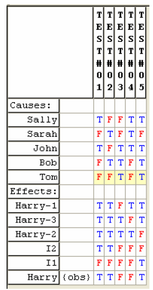
* 相关链接：http://www.benderrbt.com/bendersoftware.htm#over

---

<!-- Slide number: 32 -->
### 3.3.3 Pairwise (两两组合) 方法

> [!TIP]
> **Pair-wise 方法**：
> - **背景**：软件的大部分缺陷是在**两个变量取值冲突**时被发现的。
> - **应用场景**：多个变量、每个变量有多个取值的组合数太大时。
> - **定义**：确保任意两个变量的各种取值对都至少出现一次。
> - **效果**：可大幅度降低测试用例的数量，提高组合测试的性价比。


---

<!-- Slide number: 33 -->
### Pairwise 具体示例

**三个变量的取值情况：**
* 变量 A：`{A1, A2, A3}`
* 变量 B：`{B1, B2, B3}`
* 变量 C：`{C1, C2, C3}`
* *完全组合数*：$3 \times 3 \times 3 = 27$ 种测试用例。

**两两组合设计（仅需 9 个测试用例）：**
1. A1、B1、C1
2. A1、B2、C2
3. A1、B3、C3
4. A2、B1、C2
5. A2、B2、C3
6. A2、B3、C1
7. A3、B1、C3
8. A3、B2、C1
9. A3、B3、C2

---

<!-- Slide number: 34 -->
### Pairwise 处理更复杂的情况

* **曝光值**：-2.0、-1.5、-1、-0.5 和 +0.5、+1、+1.5、+2 (8个水平)
* **白平衡**：白炽灯、荧光灯、闪光灯、阴天等 (4个水平)
* **感光度**：自动，100，200，400，800，1600，3200 (7个水平)
* **分辨率**：低，中，高，超高 (4个水平)
* **效果**：无，负片，灰度，深褐色 (4个水平)

- **完整组合**：$8 \times 4 \times 7 \times 4 \times 4 = 3584$ 种。
- **Pairwise 组合**：仅需 $8 \times 7 = 56$ 个用例（占完整组合的 1.56%）。


---

<!-- Slide number: 35 -->
### Pairwise 方法经验数据

大部分缺陷是在两个变量取值冲突的测试时被发现的，而不需要测试所有的完整组合。


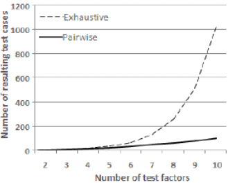

* 参考资料：
  - http://msdn.microsoft.com/en-us/library/cc150619.aspx
  - https://hexawise.com/case-studies/bcbsnc

---

<!-- Slide number: 36 -->
### Pairwise 方法经验数据 – 续


* 不同强度的组合故障覆盖率。

* 参考资料：
  - http://msdn.microsoft.com/en-us/library/cc150619.aspx
  - https://hexawise.com/case-studies/bcbsnc

---

<!-- Slide number: 37 -->
### Pairwise 方法工具


* 常用工具列表：http://www.pairwise.org/tools.asp

* 参考资料：
  - http://msdn.microsoft.com/en-us/library/cc150619.aspx
  - https://hexawise.com/case-studies/bcbsnc

---

<!-- Slide number: 38 -->
### Pairwise 工具推荐：ACTS

ACTS (Advanced Combinatorial Testing System) 是由 NIST 开发的一款高效组合测试生成工具。


* 参考资料：
  - http://msdn.microsoft.com/en-us/library/cc150619.aspx
  - https://hexawise.com/case-studies/bcbsnc

---

<!-- Slide number: 39 -->
### 3.3.4 正交实验法

> [!TIP]
> **正交实验法 (Orthogonal Experimental Design)**：
> - **思想**：依据 **Galois 理论**，利用标准化“正交表”从大量的试验点中挑选适量的、有代表性的点安排试验。
> - **步骤**：
>   1. 确定影响功能的因子（自变量/因素）与状态（取值/水平）。
>   2. 选择一个合适的正交表。
>   3. 利用正交表构造测试数据集。


* 正交表资源：https://www.york.ac.uk/depts/maths/tables/orthogonal.htm

---

<!-- Slide number: 40 -->
### 正交实验法示例

与两两组合一致，利用正交排布可以生成以下用例组合：
* `A1, B1, C1`
* `A1, B2, C2`
* `A1, B3, C3`
* `A2, B1, C2`
* `A2, B2, C3`
* `A2, B3, C1`
* `A3, B1, C3`
* `A3, B2, C1`
* `A3, B3, C2`


---

<!-- Slide number: 41 -->
### 正交表生成工具

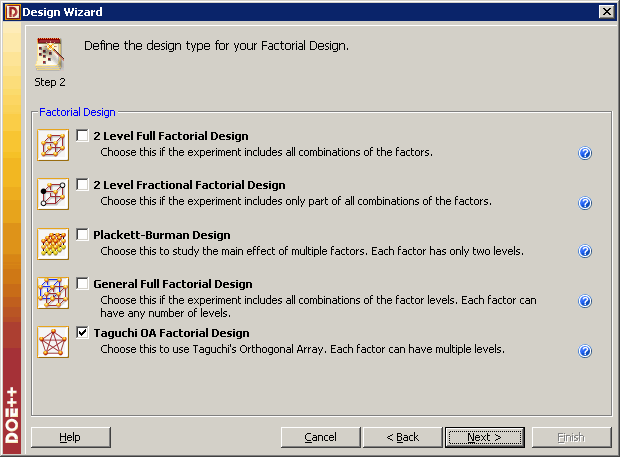


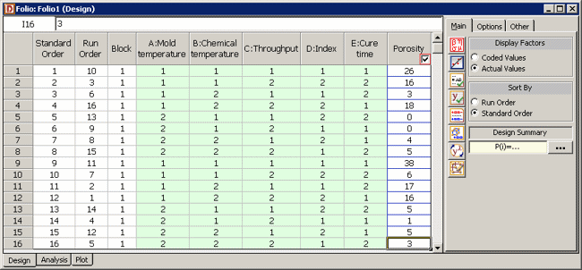
* 学习网站：https://www.weibull.com/hotwire/issue131/hottopics131.htm
* Minitab DOE 支持：https://support.minitab.com/en-us/minitab/21/help-and-how-to/statistical-modeling/doe/supporting-topics/basics/orthogonal-designs/

---

<!-- Slide number: 42 -->
### 黑盒测试方法小结

* **单因素方法**：等价类划分、边界值分析。
* **多因素组合方法**：判定表法、因果分析法、正交试验法、Pairwise两两组合。
* **基于业务需求的方法**：基于需求的测试方法、功能图、有限状态机。
* **静态与其他方法**：错误推测法。

---

<!-- Slide number: 43 -->
## 3.4 基于逻辑覆盖的方法 (白盒测试)

* 3.4.1 判定覆盖
* 3.4.2 条件覆盖
* 3.4.3 判定条件覆盖
* 3.4.4 条件组合覆盖
* 3.4.5 基本路径覆盖

---

<!-- Slide number: 44 -->
### 3.4.0 结构化测试方法

常见的白盒逻辑覆盖级别从弱到强（或不同侧重点）包括：
1. 语句覆盖 (Statement Coverage)
2. 判定覆盖 (Decision Coverage / 分支覆盖)
3. 条件覆盖 (Condition Coverage)
4. 判定/条件覆盖 (Decision/Condition Coverage)
5. 条件组合覆盖 (Multiple Condition Coverage)
6. MC/DC 覆盖 (Modified Condition/Decision Coverage)
7. 基本路径覆盖 (Basis Path Coverage)


---

<!-- Slide number: 45 -->
### 逻辑覆盖 vs. 路径覆盖

> [!TIP]
> - **逻辑覆盖**：以程序或系统的内部逻辑结构为基础，分为语句覆盖、判定覆盖、判定-条件覆盖、条件组合覆盖等。
> - **基本路径测试**：在程序或业务控制流程的基础上，分析控制构造的**环路复杂性 (圈复杂度)**，导出基本可执行路径集合，从而设计出测试用例。

---

<!-- Slide number: 46 -->
### 3.4.1 语句覆盖

> [!IMPORTANT]
> **语句覆盖 (Statement Coverage)**：
> 设计若干测试用例，运行被测程序，使程序中的**每个可执行语句至少被执行一次**。
> - **特点**：是最弱的逻辑覆盖标准。

#### 示例程序源代码：
```vb
1. dim a, b as integer
2. dim c as double
3. if (a > 0 and b > 0) then
4.      c = c / a
5. end if
6. if (a > 1 or c > 1) then
7.      c = c + 1
8. end if
9. c = b + c
```

#### 用例设计：
* 输入用例 `(a, b, c) = (1, 1, 2)`，即可覆盖所有可执行语句。

* 控制流路径描述：
  - `a -> IF (3) -> b -> c -> (4) -> d -> ENDIF (5)`
  - `e -> IF (6) -> f -> j -> (7) -> h -> ENDIF (8) -> i -> (9)`

---

<!-- Slide number: 47 -->
### 语句覆盖不能发现的问题

> [!WARNING]
> 即使达到了 100% 语句覆盖，也有可能无法发现程序逻辑判断中的错误。

#### 假设开发在编码时将逻辑运算符写错：
* 原本的逻辑是：`(a > 0 and b > 0)` 和 `(a > 1 or c > 1)`。
* 误写后的代码：
  ```vb
  if (a > 0 or b > 0) then     ' and 被写成了 or
       c = c / a
  end if
  if (a > 1 and c > 1) then    ' or 被写成了 and
       c = c + 1
  end if
  c = b + c
  ```
* 此时若依然使用用例 `(a, b, c) = (1, 1, 2)`，程序依然能够执行所有可执行语句，达到 100% 语句覆盖，但**完全无法发现**此处的逻辑缺陷。

---

<!-- Slide number: 48 -->
### 3.4.2 判定覆盖 (分支覆盖)

> [!IMPORTANT]
> **判定覆盖 (Decision Coverage / 分支覆盖 Branch Coverage)**：
> 设计若干用例，运行被测程序，使得程序中**每个判断的取真分支和取假分支至少经历一次**。

#### 示例设计 (基于 3.4.1 源代码)：
1. 用例 1：`(a, b, c) = (1, 1, 2)` -> 使得两个判定均取真。
2. 用例 2：`(a, b, c) = (-1, 1, 0)` -> 使得两个判定均取假。


---

<!-- Slide number: 49 -->
### 3.4.3 条件覆盖

> [!IMPORTANT]
> **条件覆盖 (Condition Coverage)**：
> 设计若干测试用例，运行被测程序，使得程序中**每个判定中的每个子条件（原子条件）的可能取值（真/假）至少满足一次**。

* 判定中的条件：例如判定 `(a > 0 and b > 0)` 包含两个子条件 `a > 0` 和 `b > 0`。

---

<!-- Slide number: 50 -->
### 示例：拆分所有原子条件


* **判定 M** `(a > 0 and b > 0)`：
  - 条件 `a > 0`：取真为 $T_1$，取假为 $F_1$。
  - 条件 `b > 0`：取真为 $T_2$，取假为 $F_2$。
* **判定 N** `(a > 1 or c > 1)`：
  - 条件 `a > 1`：取真为 $T_3$，取假为 $F_3$。
  - 条件 `c > 1`：取真为 $T_4$，取假为 $F_4$。

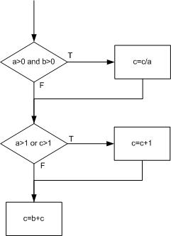

---

<!-- Slide number: 51 -->
### 示例续：覆盖所有条件的用例设计


**设计以下两个用例：**
* 用例 1：`(a, b, c) = (2, -1, 0)` -> 覆盖条件 $T_1, F_2, T_3, F_4$。
* 用例 2：`(a, b, c) = (-1, 1, 2)` -> 覆盖条件 $F_1, T_2, F_3, T_4$。

> [!WARNING]
> **条件覆盖的局限性**：上述用例满足了 100% 的条件覆盖，但它们使得判定 M 在两个用例中均判定为“假”，判定 N 在两个用例中均判定为“真”。即它们**未能实现判定覆盖**。

---

<!-- Slide number: 52 -->
### 3.4.4 判定-条件覆盖

> [!IMPORTANT]
> **判定-条件覆盖 (Decision/Condition Coverage)**：
> 判定覆盖和条件覆盖的交集。
> - **要求**：设计足够的用例，使得**所有判定中的所有条件可能取值至少执行一次**，同时**所有判定的真假分支结果也至少执行一次**。

#### 用例设计：
| 用例编号 | 输入值 | 覆盖原子条件 | 覆盖判定分支 |
| --- | --- | --- | --- |
| 用例 1 | `(a, b ,c) = (2, 1, 2)` | $T_1$, $T_2$, $T_3$, $T_4$ | 判定 M=真，判定 N=真 |
| 用例 2 | `(a, b ,c) = (-1, 0, 1)` | $F_1$, $F_2$, $F_3$, $F_4$ | 判定 M=假，判定 N=假 |

---

<!-- Slide number: 53 -->
### 3.4.5 条件组合覆盖

> [!IMPORTANT]
> **条件组合覆盖 (Multiple Condition Coverage, MCC)**：
> 设计足够的测试用例，使得**每个判定中原子条件的所有可能取值组合都至少出现一次**，并且每个判断本身的判定结果也至少出现一次。

例如，对于复合条件 `(a > 0 and b > 0)`，其原子条件组合有 4 种：
1. `(a>0, b>0)` -> 真，真 `(1, 1)`
2. `(a>0, b<=0)` -> 真，假 `(1, -1)`
3. `(a<=0, b>0)` -> 假，真 `(-1, 1)`
4. `(a<=0, b<=0)` -> 假，假 `(-1, -1)`

---

<!-- Slide number: 54 -->
### 条件组合覆盖 vs. 路径覆盖


**满足条件组合覆盖的测试用例：**
| 测试用例 (输入/预期输出) | 覆盖条件 | 覆盖路径 | 覆盖条件组合 |
| --- | --- | --- | --- |
| 输入 `(2,1,6)` -> 输出 `(2,1,5)` | $T_1$, $T_2$, $T_3$, $T_4$ | $P_1$ (1-2-4) | 组合 1, 5 |
| 输入 `(2,-1,-2)` -> 输出 `(2,-1,-2)` | $T_1$, $F_2$, $T_3$, $F_4$ | $P_3$ (1-3-4) | 组合 2, 6 |
| 输入 `(-1,2,3)` -> 输出 `(-1,2,6)` | $F_1$, $T_2$, $F_3$, $T_4$ | $P_3$ (1-3-4) | 组合 3, 7 |
| 输入 `(-1,-2,-3)` -> 输出 `(-1,-2,-5)` | $F_1$, $F_2$, $F_3$, $F_4$ | $P_4$ (1-3-5) | 组合 4, 8 |

> [!WARNING]
> 即使达成了 100% 的条件组合覆盖，依然可能存在未覆盖的执行路径（例如本例中的路径 $P_2$ `1-2-5` 未被执行）。

---

<!-- Slide number: 55 -->
### 逻辑覆盖的效率考量

* 条件组合覆盖效率不高，用例数量随条件数量呈指数增长，部分组合不必要。
* 判定-条件覆盖虽然简单，但覆盖强度依然不足。

---

<!-- Slide number: 56 -->
### 3.4.6 修正条件/判定覆盖 (MC/DC)

> [!IMPORTANT]
> **修正条件/判定覆盖 (Modified Condition/Decision Coverage, MC/DC)**：
> 安全关键系统（如航天航空软件 DO-178B/C 标准）的强制覆盖指标。要求：
> 1. 每个判定的所有可能结果至少能取值一次。
> 2. 判定中的每个原子条件的所有可能结果至少取值一次。
> 3. **判定中的每个原子条件能够独立地对结果产生影响**（即在其他条件保持不变的情况下，仅改变当前条件的值，判定结果就会发生改变）。
> 4. 每个入口和出口至少执行一次。
> 
> **用例数量规律**：对于含有 $n$ 个条件的单一判定，MC/DC 的用例数最少只需 **$n + 1$** 个（最多 $2n$ 个）。

对于判定 `(a > 0 and b > 0)`，其独立影响测试集：
1. `(T, T)` -> 结果为真。
2. `(T, F)` -> 结果为假（测试条件 2 的独立影响）。
3. `(F, T)` -> 结果为假（测试条件 1 的独立影响）。

* 学习链接：
  - http://www.dsl.uow.edu.au/~sergiy/MCDC.html
  - http://en.wikipedia.org/wiki/Modified_Condition/Decision_Coverage

---

<!-- Slide number: 57 -->
### 3.4.7 基本路径覆盖

> [!IMPORTANT]
> **基本路径覆盖 (Basis Path Coverage)**：
> 设计测试用例覆盖程序中线性独立的基本路径集合。

#### 测试用例设计集：
| 测试用例 (输入/预期输出) | 覆盖路径 | 覆盖条件 | 覆盖组合 |
| --- | --- | --- | --- |
| 输入 `a=2, b=1, c=6` -> 输出 `a=2, b=1, c=5` | $P_1$（1-2-4） | $T_1$, $T_2$, $T_3$, $T_4$ | 1, 5 |
| 输入 `a=1, b=1, c=-3` -> 输出 `a=1, b=1, c=-2` | $P_2$（1-2-5） | $T_1$, $T_2$, $F_3$, $F_4$ | 1, 8 |
| 输入 `a=2, b=-1, c=-2` -> 输出 `a=2, b=-1, c=-2` | $P_3$（1-3-4） | $T_1$, $F_2$, $T_3$, $F_4$ | 2, 6 |
| 输入 `a=-1, b=2, c=3` -> 输出 `a=-1, b=2, c=6` | $P_3$（1-3-4） | $F_1$, $T_2$, $F_3$, $T_4$ | 3, 7 |
| 输入 `a=-1, b=-2, c=-3` -> 输出 `a=-1, b=-2, c=-5` | $P_4$（1-3-5） | $F_1$, $F_2$, $F_3$, $F_4$ | 4, 8 |

---

<!-- Slide number: 58 -->
### 基本路径覆盖的设计过程

> [!IMPORTANT]
> **设计基本路径测试用例的四大步骤：**
> 1. 依据源代码绘制**控制流图 (Flow Graph)**。
> 2. 计算控制流图的**圈复杂度 (Cyclomatic Complexity)**。
> 3. 确定线性独立路径的**基本集合 (Basis Set)**。
> 4. 设计测试用例覆盖每条基本路径。

---

<!-- Slide number: 59 -->
### 示例 – 从源代码到控制流图

#### 过程结构（以 process records 伪代码为例）：
```vb
Procedure: process records
1.  Do While records remain
2.      Read record;
3.      If record field 1 = 0 Then
4.          store in buffer;
5.          increment counter;
6.      Else If record field 2 = 0 Then
7.              reset counter;
8.          Else store in file;
9.          End If
10.     End If
11. End Do
End
```

流图节点：`1`, `2`, `3`, `6`, `4`, `7`, `8`, `5`, `9`, `10`, `11`

---

<!-- Slide number: 60 -->
### 控制流图的简化

将顺序执行且没有分支的代码行进行节点合并：
* 例如，合并前：`1` -> `2` -> `3`，可将 `2,3` 合并；`4` -> `5` 可将 `4,5` 合并。
* 简化后的控制流图节点：`1`、`2,3`、`6`、`9`、`8`、`7`、`4,5`、`10`、`11`。

---

<!-- Slide number: 61 -->
### 计算圈复杂度

> [!IMPORTANT]
> **圈复杂度 (Cyclomatic Complexity) $V(G)$**：
> 用于度量代码逻辑复杂度，提供了被测代码线性无关基本路径数量的上限。复杂度越高，出错概率越大。
> 
> **三种计算公式：**
> 1. **区域数**：$V(G) = \text{控制流图区域数量}$ (含外部大区域)。
> 2. **边点法**：$V(G) = E - N + 2$（$E$ 为控制流图的连线数，$N$ 为节点数）。
> 3. **判定节点法**：$V(G) = P + 1$（$P$ 为控制流图中简单判定节点的数量）。对于复合条件，每个布尔算子贡献一个判定点。

---

<!-- Slide number: 62 -->
### 圈复杂度计算示例

结合前文简化的 `process records` 流图：
* **方法 1（区域法）**：图形区域包含 Region 1, Region 2, Region 3, 以及外部的 Region 4，共 4 个区域 -> $V(G) = 4$。
* **方法 2（边点法）**：简化流图中连线数 $E = 11$，节点数 $N = 9$，则 $V(G) = 11 - 9 + 2 = 4$。
* **方法 3（判定节点法）**：图中的判定节点有 `1` (循环条件), `3` (If 条件), `6` (Else If 条件) 共 3 个简单判定节点。则 $V(G) = 3 + 1 = 4$。

- Region 1, Region 2, Region 3, Region 4
- $V(G) = 4$
- $11 - 9 + 2 = 4$

---

<!-- Slide number: 63 -->
### 确定线性独立路径集合

> [!TIP]
> - **独立路径 (Independent Path)**：指至少引入一系列新的处理语句或条件的任何路径。
> - **基本集 (Basis Set)**：由线性独立路径构成的集合。由其导出的用例可保证每行代码至少执行一次。
> - 基本集合不一定唯一。
> - 对所有模块/单元进行基本路径测试是推荐的，对关键组件是绝对必要的。

---

<!-- Slide number: 64 -->
### 示例：基本路径测试用例

为确保每条基本路径被执行一次，设计 4 条基本路径：
* **Path 1**: `1-2-3-6-7-9-10-1-11`
* **Path 2**: `1-2-3-6-8-9-10-1-11`
* **Path 3**: `1-2-3-4-5-10-1-11`
* **Path 4**: `1-11`

---

<!-- Slide number: 65 -->
### 逻辑覆盖小结

* **强度等级**：语句覆盖 $\le$ 判定覆盖 $\le$ 判定条件覆盖 $\le$ 条件组合覆盖。
* **基本白盒覆盖标准简称**：
  * **CC** - Condition Coverage (条件覆盖)
  * **DC** - Decision Coverage (判定覆盖)
  * **MCC** - Multiple Condition Coverage (条件组合覆盖)
  * **MC/DC** - Modified Condition/Decision Coverage (修正条件/判定覆盖)

---

<!-- Slide number: 66 -->
### 拓展：控制流覆盖与数据流覆盖

* **控制流覆盖**：关注业务控制流程，覆盖基本路径及代码逻辑分支。
* **数据流覆盖**：通过数据流程图，关注代码中变量的定义（Define）与引用（Use）覆盖。

---

<!-- Slide number: 67 -->
## 3.5 基于缺陷模式的测试 (DPBT)

* 3.5.1 常见的缺陷模式
* 3.5.2 DPBT的自动化实现

---

<!-- Slide number: 68 -->
### 3.5.1 常见的缺陷模式

> [!TIP]
> **基于缺陷模式的测试 (Defect-Pattern-Based Testing, DPBT)**：
> 根据软件中历史常见的缺陷和漏洞模型（如 OWASP、CWE 规范等），建立相应的检测模式，针对性地进行安全、性能和代码缺陷静态/动态扫描。

**常见缺陷模式模型：**
* 故障模型
* 安全漏洞模型
* 性能模型
* 并发故障模型
* 不良习惯模型
* 代码国际化模型
* 易诱骗代码模型


---

<!-- Slide number: 69 -->
### 3.5.2 DPBT的静态分析与自动化实现

**DPBT 静态扫描的主要流程步骤：**
1. **预处理/预编译**
2. **词法分析 (Lexical Analysis)**
3. **语法分析 (Parsing) 和语义处理 (Semantic Analysis)**
4. **抽象语法树 (AST) 生成**
5. **控制流图 (CFG) 生成**
6. **IP 扫描**
7. **人工确认**

---

<!-- Slide number: 70 -->
### DPBT 实现的通用框架

```
                       ┌──────────────┐
                       │ 被测源程序代码│
                       └──────┬───────┘
                              │
                       ┌──────▼───────┐
                       │ 词法/语法解析  │
                       └──────┬───────┘
                              │
                       ┌──────▼───────┐
                       │ 抽象语法树AST │
                       └──────┬───────┘
                              │ (多态分析/数据流分析/符号执行)
                       ┌──────▼───────┐
                       │ 控制流图/SSA  │
                       └──────┬───────┘
                              │ (SMT 求解器)
                       ┌──────▼───────┐
                       │ 缺陷表达式求解│
                       └──────┬───────┘
                              │ (根据 CWE/OWASP 缺陷模式)
                       ┌──────▼───────┐
                       │   检测结果   │
                       └──────────────┘
```

* **SSA**：Static Single-Assignment (静态单赋值)
* **SMT**：satisfiability modulo theories (可满足性模理论)
* **CWE**：Common Weakness Enumeration (通用缺陷枚举)

> [!NOTE]
> * **CWE**：是由美国国土安全部支持的软件安全缺陷枚举词典。
> * **SAT**：布尔可满足性问题，是第一个被证明的 NP 完全问题。
> * **SMT 求解器**：被广泛集成于 `HOL/Isabelle`、`ESC/Java2`、`ACL2`、`UCLID`、`BLAST`、`CUTE`、`PEX` 等形式化分析工具中。

---

<!-- Slide number: 71 -->
## 3.6 基于模型的测试 (MBT)

* 3.6.1 功能图法
* 3.6.2 模糊测试方法
* 3.6.3 变异测试

---

<!-- Slide number: 72 -->
### 什么是 MBT？

> [!TIP]
> **基于模型的测试 (Model-based testing, MBT)**：
> 通过构建能够正确描述被测软件系统功能特性的行为模型，然后基于这个模型（自动/半自动）产生测试用例并执行的过程。


---

<!-- Slide number: 73 -->
### MBT 基本原理（实施过程）

> [!IMPORTANT]
> **基于模型的测试 (MBT) 五大基本过程：**
> 1. **为被测试系统 (SUT) 建模**。
> 2. **基于模型产生测试用例**（生成抽象测试用例）。
> 3. **将抽象测试具体化**：添加具体的数据，使其具有可执行性。
> 4. **执行测试**。
> 5. **分析与评估测试结果**。


---

<!-- Slide number: 74 -->
### MBT 架构


* 典型的 TEMA 自动化模型测试框架架构。

---

<!-- Slide number: 75 -->
### 常见的 MBT 方法与技术

* **有限状态机 (FSM)** 与扩展的有限状态机 (EFSM)。
* **符号执行 (Symbolic Execution)**：使用符号值代替具体数值运行程序的程序分析技术。
* **定理证明 (Theorem proving)**：通过能够定义系统行为的逻辑谓词表达式完成模型构建与证明。
* **模型检验 (Model checking)**：检验系统属性在模型中是否有效，无法通过时给出反例。
* **随机/半随机模型**：如模糊测试方法、变异测试、马尔科夫链等。
* **其他方法**：基于 UML 的 MBT、因果图方法等。

---

<!-- Slide number: 76 -->
### 3.6.1 功能图法

> [!IMPORTANT]
> **功能图法 (Functional Graph Method)**：
> 用于解决系统动态说明的一种测试用例设计方法。
> - **基本思想**：程序的功能通常由静态说明（输入和输出对应关系）和动态说明（数据次序及状态转移）组成。功能图法将两者结合。
> - **构成**：功能图由**状态迁移图 (STD)** 和**逻辑功能模型 (LFM，如判定表/因果图)** 构成。

---

<!-- Slide number: 77 -->
### 状态迁移图 (STD)

状态迁移图描述系统状态变化的动态信息。由状态（State）和迁移（Transition）描述，状态指出数据输入的位置，迁移指明状态的改变。

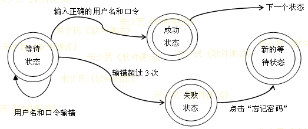

---

<!-- Slide number: 78 -->
### 功能图法如何设计测试用例

> [!IMPORTANT]
> **功能图法测试设计步骤：**
> 1. **局部测试用例设计**：从**逻辑功能模型**（决策表或因果图）导出局部测试用例，覆盖各个状态的各种输入数据组合（体现**黑盒方法**）。
> 2. **整体测试用例设计**：从**状态迁移图**导出整体的测试用例，覆盖系统控制的逻辑路径（体现**白盒方法**——如路径、分支和条件覆盖）。
> 
> **总结**：功能图法是综合运用黑盒与白盒思想的动态用例设计方法。

---

<!-- Slide number: 79 -->
### 3.6.2 模糊测试方法 (Fuzz Testing)

> [!TIP]
> **模糊测试 (Fuzz Testing)**：
> 是一种向被测试程序输入大量的随机、畸形、半正确的输入数据，通过观察被测程序是否发生崩溃 (Crush) 或异常退出来定位软件深层缺陷和安全漏洞的自动化方法。
> - **优势**：测试用例生成简单，无需复杂桩模块，易于自动化。


---

<!-- Slide number: 80 -->
### 几种不同模糊器的构造

> [!IMPORTANT]
> **模糊器的三大分类：**
> 1. **黑盒随机模糊 (Mutation-based Fuzzing)**：对正确格式的输入数据进行随机变异后运行。适用于应用从未进行过模糊测试时的快速漏洞挖掘。
> 2. **基于语法的模糊 (Generation-based Fuzzing)**：依据输入语法的定义来生成满足特定格式约束的畸形输入。
> 3. **白盒模糊处理 (White-box Fuzzing / 智能模糊)**：通过符号执行动态收集代码分支的输入约束，系统否定约束并用约束求解器求解，映射出能走通全新执行路径的新输入，以极大提高代码覆盖率。

---

<!-- Slide number: 81 -->
### American Fuzzy Lop (AFL) 方法

> [!TIP]
> **AFL (American Fuzzy Lop)**：
> 当今最广泛使用的开源 Fuzzer。其核心是在编译前对程序源码进行插桩 (Instrumentation)，以在运行时实时反馈分支覆盖率；并利用**遗传算法**变异测试输入。

**AFL 核心演进算法：**
1. 将用户提供的初始测试用例加载到队列中。
2. 从队列中获取下一个输入文件。
3. 试图将测试用例修剪 (Trim) 到不改变程序分支覆盖行为的最小尺寸。
4. 使用多种传统的模糊策略对文件进行变异。
5. 如果任何产生的变异导致插桩记录了新的状态分支转换，将变异输出作为新用例加入队列。
6. 重复步骤 2。

* 相关链接：
  - 官方文档：https://afl-1.readthedocs.io/en/latest/
  - 源码仓库：https://github.com/google/AFL

---

<!-- Slide number: 82 -->
### 3.6.3 变异测试 (Mutation Testing)

> [!TIP]
> **变异测试 (Mutation Testing)**：
> 是一种白盒用例质量评估技术。其核心是通过故意在源程序代码中进行细节修改（模拟典型的人为缺陷，生成变异体 Mutants），来检验现有测试用例集能否检测出这些人工引入的缺陷。

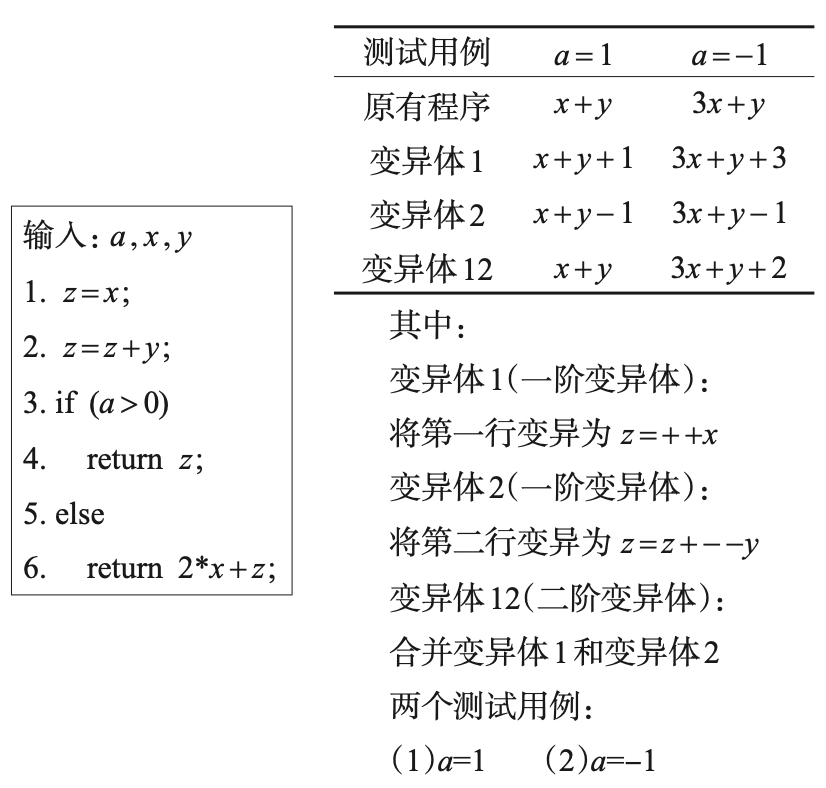

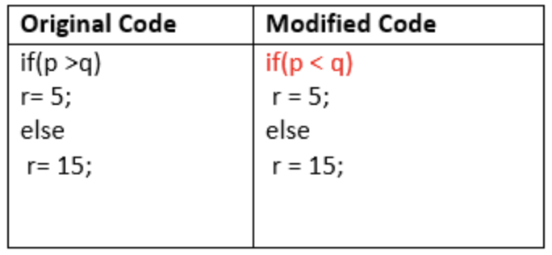

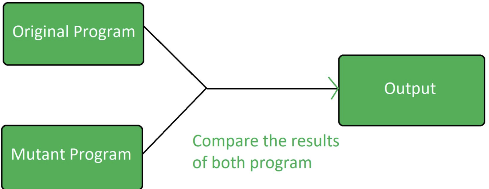

---

<!-- Slide number: 83 -->
### 变异测试的方法与流程

```
           ┌──────────────┐
           │ 原始程序代码 │
           └──────┬───────┘
                  │ (应用变异算子修改代码)
           ┌──────▼───────┐
           │  生成变异体  │
           └──────┬───────┘
                  │ (运行现有测试用例集)
       ┌──────────┴──────────┐
       ▼                     ▼
 [变异体被杀死]         [变异体存活]
(现有用例能发现此缺陷) (需补充用例以覆盖并杀死此存活体)
```


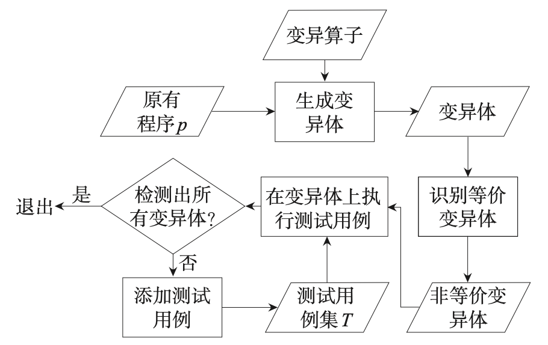

---

<!-- Slide number: 84 -->
## 3.7 形式化方法与形式化验证

* 3.7.1 形式化方法
* 3.7.2 形式化验证
* 3.7.3 有限状态机方法 (FSM)

---

<!-- Slide number: 85 -->
### 3.7.1 形式化方法

> [!TIP]
> **形式化方法 (Formal Methods)**：
> 基于数学的表示和精确的数学语义来描述目标软件系统规格属性的一种工程化方法。由语法、语义和一组关系构成。
> - **分类**：面向模型的形式化方法（描述系统静态结构）和面向属性的形式化方法（描述系统动态逻辑特征）。

* 学习链接：http://en.wikipedia.org/wiki/Formal_method

---

<!-- Slide number: 86 -->
### 形式化表示示例：巴科斯范式 (BNF)

巴科斯范式（Backus–Naur Form, BNF) 是一种常用于定义程序设计语言语法的规范化元语言。

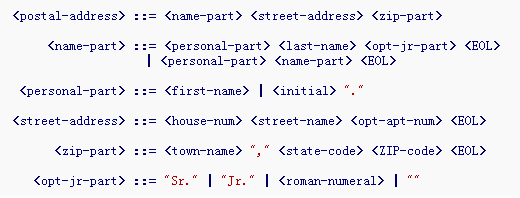

---

<!-- Slide number: 87 -->
### 形式化三部曲

> [!IMPORTANT]
> **形式化工程实施的三个阶段：**
> 1. **形式化描述** (Formal Specification)：使用严谨的数学语言描述规格说明。
> 2. **形式化开发** (Formal Development)：从描述出发逐步细化和精化出目标代码。
> 3. **形式化验证** (Formal Verification)：数学证明开发所得代码的语义与数学描述完全一致。


---

<!-- Slide number: 88 -->
### 形式化的具体分类方法

* **基于模型的方法**：如 Z 语言、B 语言等。
* **代数方法**：如 OBJ、CLEAR、ASL、ACT 等。
* **过程代数方法**：如 CSP、CCS、ACP、LOTOS、TPCCS 等。
* **基于逻辑的方法**：如区间时序逻辑、Hoare 逻辑、模态逻辑、时序逻辑等。
* **基于网络的方法**：如 Petri 网等。

---

<!-- Slide number: 89 -->
### 3.7.2 形式化验证

> [!IMPORTANT]
> **形式化验证 (Formal Verification)**：
> 依据形式规范，使用严格的数学逻辑推理，来证明代码实现与规格说明之间是否存在不一致（正确性或非正确性证明）。
> - **局限**：不能完全证明系统“无缺陷”，因为我们无法定义绝对的“无缺陷”。但能证明系统“不存在我们能想到的缺陷”。

---

<!-- Slide number: 90 -->
### 形式化验证的一些具体方法

* 有限状态机（FSM）或扩展有限状态机（EFSM）。
* SPIN 和线性时态逻辑 (LTL) 证明。
* UML 语义转换。
* 标准 RBAC 模型、扩展的 RBAC 模型和基于粒计算的 RBAC 模型验证。
* 符号模型检验 (Symbolic Model Checking)。
* BAN 逻辑模型。

---

<!-- Slide number: 91 -->
### 3.7.3 有限状态机 (FSM)

> [!TIP]
> **有限状态机 (Finite State Machine, FSM)**：
> 是一种描述系统在其生命周期中状态序列以及如何响应外界输入事件产生迁移的对象行为建模工具。


---

<!-- Slide number: 92 -->
### FSM 示例：堆栈的状态图

以典型堆栈（Stack）的状态迁移为例，定义 `empty`、`filled`、`full` 等状态以及状态转移触发的动作。

```
              pop [height = 1]
         ┌────────────────────────┐
         │                        │
    ┌────▼────┐   push       ┌────┴────┐   push [height = max - 1]   ┌─────────┐
    │  empty  ├─────────────►│ filled  ├────────────────────────────►│  full   │
    └─────────┘              └────▲────┘                             └────┬────┘
                                  │           pop [height > 1]            │
                                  └───────────────────────────────────────┘
```

* **状态变化事件描述**：
  * `push`、`pop [height > 1]`、`push [height < max-1]`、`init`、`delete`。
  * 状态：`empty`、`filled`、`full`。
  * 来源: nach Spillner, Linz: Basiswissen Softwaretest, 2005。

---

<!-- Slide number: 93 -->
### 状态图转化为树结构并生成测试用例

通过将有限状态机展开为一颗树（状态生成树），可以识别出控制状态的所有边界与分支路径（包含 ERROR 情况），并自动生成测试用例。

#### 状态生成树结构梳理：
* **initial** (初始化起点)
  * **init** (构造)
    * **empty** (栈空状态)
      * `pop` -> `ERROR` (异常分支)
      * `delete`
      * `top` -> `ERROR`
      * `push` -> **filled** (栈有元素状态)
        * `delete` -> `ERROR`
        * `pop` -> **empty**
        * `top` -> **filled**
        * `push` -> **filled**
          * `pop` -> **filled**
          * `top` -> **filled**
          * `push [height = max-1]` -> **full** (栈满状态)
            * `delete` -> `ERROR`
            * `push` -> `ERROR` (溢出)
            * `pop [height = 1]` -> **filled**
            * `top` -> **full**

---

<!-- Slide number: 94 -->
### 状态图测试用例生成工具：Spec Explorer

Spec Explorer 是一款由微软开发的 Visual Studio 建模和测试生成工具。


---

<!-- Slide number: 95 -->
### FSM 建模示例：ATS4_AppModel


* 详情参考：http://ats4appmodel.sourceforge.net/

---

<!-- Slide number: 96 -->
## 3.8 补充：基于场景的测试方法

> [!IMPORTANT]
> **基于场景的测试方法 (Scenario-based Testing)**：
> 模拟用户在真实业务流程中的行为来设计测试用例。
> - **测试用例构成公式**：
>   $$\text{测试用例} = \text{用户故事(行为)} + \text{场景} + \text{测试数据}$$
> - **场景**：系统执行的前提条件、触发机制和周边运行环境。
> - **数据**：输入参数与各业务节点的预期输出。


---

<!-- Slide number: 97 -->
### 基于场景的测试组成元素

* **典型用户**：首次安装使用的新用户、熟练用户、随便浏览的游客。
* **业务上下文（场景）**：首次安装、特定触发时间（如 12:00/20:00）、预订成功后、取消订单后、异常退出后。
* **用户目标**：查找符合自己要求的酒店、预订酒店、入住酒店、办理离店。

---

<!-- Slide number: 98 -->
### 练习：列出测试场景和数据


* 针对用户故事切分 3 个不同类型的测试场景，并填写对应的输入与预期数据。

---

<!-- Slide number: 99 -->
### 场景流分析：事件流图

以业务流程“作为承兑人，根据委托收款请求，签发承兑”为例，要重点考虑各种异常分支与限制约束：

* **事件流决策点**：
  * 是否有条件支付？是否不得转让？是否已经转让？收款人是否清楚？收款人是否破产？金额是否超过上限？
  * 对应状态变化：超过上限、已转让、有条件支付、不得转让、不符合条件、收款人破产等。

* 票据的自助式受理，完成票据的存入、存储、记账。功能上要考虑身份认证、防伪识别。

---

<!-- Slide number: 100 -->
### 基于场景的测试方法 – 银行ATM取款示例

* **基本流（正常场景）**：从账户中成功取款的常规交易。
* **备选流（异常/可选场景）**：
  1. 银行卡号被拒绝，ATM 无法识别该卡。
  2. 用户连续输入错误密码达 3 次。
  3. 密码错误 3 次以上，ATM 发生吞卡。
  4. 用户选择了存款或转账，而不是取款。
  5. 用户在插入的卡上选择了一个非正确的账户。
  6. 用户输入的取款金额不正确。
  7. ATM 机中可用现金不足。
  8. 用户输入了一个不存在的数额（如非整百数）。
  9. 用户输入的金额超出了每日取款上限。
  10. 用户的账户内余额不足。

---

<!-- Slide number: 101 -->
### 银行ATM取款场景分析 – 续

利用场景矩阵分析 ATM 的基本流与各个备选流的转移。


---

<!-- Slide number: 102 -->
### 生成银行ATM取款的测试用例

* **用例 1 (成功取款)**：覆盖 $U_1, S_{1.1}, U_2, S_{2.1}, U_{3.1}, U_4, S_{4.1}, U_5, S_{5.1}, S_6, S_7, S_8, S_9, U_6$。
* **用例 2 (卡无法识别)**：覆盖 $U_1, S_{1.2}, S_9$。
* **用例 3 (密码输入错误 < 3次)**：覆盖 $U_1, S_{1.1}, U_2, S_{2.2}$。
* **用例 4 (密码输入错误 3次吞卡)**：覆盖 $U_1, S_{1.1}, U_2, S_{2.2}, U_2, S_{2.3}, S_3$。
* **用例 5 (ATM 机现金不足)**：覆盖 $U_1, S_{1.1}, U_2, S_{2.1}, U_{3.1}, U_4, S_{4.1}, U_5, S_{5.3}$。
* **用例 6 (账户余额不足)**：覆盖 $U_1, S_{1.1}, U_2, S_{2.1}, U_{3.1}, U_4, S_{4.1}, U_5, S_{5.6}$。
* **用例 7 (取款金额不正确)**：覆盖 $U_1, S_{1.1}, U_2, S_{2.1}, U_{3.1}, U_4, S_{4.1}, U_5, S_{5.2}$。
* **用例 8 (输入不存在的数额)**：覆盖 $U_1, S_{1.1}, U_2, S_{2.1}, U_{3.1}, U_4, S_{4.1}, U_5, S_{5.4}$。
* **用例 9 (超出每日限额限制)**：覆盖 $U_1, S_{1.1}, U_2, S_{2.1}, U_{3.1}, U_4, S_{4.1}, U_5, S_{5.5}$。
* **用例 10 (选择存款/转账)**：覆盖 $U_1, S_{1.1}, U_2, S_{2.1}, U_{3.2}, S_{10}$。

---

<!-- Slide number: 103 -->
### 逻辑覆盖实战练习一


#### 1. 语句覆盖用例设计
| 用例名称 | 用例描述 | 测试路径 |
| --- | --- | --- |
| **CASE 1** | 投保成功：年龄 20，男性，健康体、有医疗保险 | ABC |
| **CASE 2** | 投保成功：年龄 20，男性，非健康体且没有基本医疗 | ABE |

#### 2. 判定覆盖用例设计
| 用例名称 | 用例描述 | 覆盖判定分支 |
| --- | --- | --- |
| **CASE 3** | 投保成功：年龄 20，男性，健康体，有医疗保险 | 判定 A=“真”，判定 B=“真” |
| **CASE 4** | 投保不成功：年龄 15，男性 | 判定 A=“假” |
| **CASE 5** | 投保成功：年龄 20，男性，健康体，没有医疗保险 | 判定 A=“真”，判定 B=“假” |

*（请参考《软件测试实验教程》（清华大学出版社，2019））*

---

<!-- Slide number: 104 -->
### 逻辑覆盖实战练习二


#### 条件覆盖用例设计
请根据流程图完成条件覆盖的测试用例：
| 用例名称 | 测试用例描述 | 测试条件 |
| --- | --- | --- |
| **CASE 1** | | |
| **CASE 2** | | |
| **CASE 3** | | |

*（请参考《软件测试实验教程》（清华大学出版社，2019））*

* Notes:
  - 启发思考：Debbie 老是迟到，给其改变迟到情况提建议。需要获取哪些信息？（探讨可变因素、不可变因素等）。

---

<!-- Slide number: 105 -->
## 本章小结

1. **方法分类**：黑盒方法（等价类、边界值、判定表、因果图、组合测试）、结构化白盒方法（逻辑覆盖、控制流与路径覆盖）、基于场景的测试。
2. **测试维度**：控制流覆盖（基于程序逻辑路径的覆盖）、数据流覆盖（基于变量定义与引用的覆盖）。
3. **三层覆盖标准**：代码行/指令级覆盖、功能/非功能需求覆盖、业务流/场景覆盖。
4. **最常用的逻辑覆盖**：语句覆盖、分支/判定覆盖和 MC/DC 覆盖。

---

<!-- Slide number: 106 -->
## 思考题

1. **为何在航空航天应用软件中会强制使用 MC/DC 代码覆盖率标准？**
2. **为什么敏捷测试（如敏捷开发模式）中非常适合使用基于场景的测试设计方法？**

---

<!-- Slide number: 107 -->
## 课后作业一：逻辑覆盖工具实操

找一个合适的函数代码，选择一款覆盖率工具，完成以下三种覆盖率测试：**分支覆盖**、**MC/DC 覆盖**和**基本路径覆盖**。

**常用覆盖工具推荐：**
1. Testwell CTC++
2. CoverageMeter
3. BullseyeCoverage
4. GCT
5. CppUnit
6. Dynamic Code Coverage
7. TCAT C/C++
8. COVTOOL
9. gocv
10. xCover

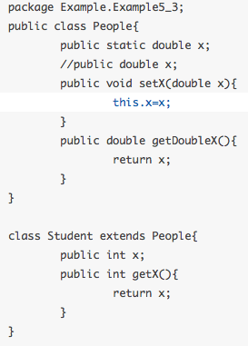

---

<!-- Slide number: 108 -->
## 课后作业二：Pairwise 组合测试实操

针对下列多因素变量，使用 **ACTS** 工具生成不同强度的组合测试用例集（若存在约束条件，请在工具中添加相应约束后计算）：

* **司机的驾龄**：`<= 1年`、`<= 3年`、`<= 5年`、`<= 10年`、`> 10年`。
* **驾驶记录**：过去五年内没有违规，过去三年内没有违规，过去三年内违规小于3次，过去三年内违规3次或三次以上，过去一年内违规3次或三次以上。
* **汽车型号**：一般国产车、高档国产车 (>=20万)、进口车、高档进口车 (>=100万)。
* **使用汽车的方式**：出租车、商务车、私家车。
* **所住的地区**：城市中心地带、市区、郊区、农村。
* **受保的项目**：全保、自由组合、最基本保险。
* **保险方式**：首次参保、第2次参保、连续受保 (>=3次)。

---

<!-- Slide number: 109 -->
# 感 谢 聆 听

朱少民 / 同济大学

---

## 期末重点考点与概念提炼

### 核心术语

1. **ALAC (Act-like-a-customer) 测试**：一种基于客户使用产品的知识开发出来的测试方法。其核心理论是 Pareto 80/20 规律（80% 的用户只使用 20% 的功能）。
2. **错误推测法 (Error Guessing)**：测试人员根据自身的经验、直觉与知识储备，推测软件容易出现缺陷的场景或位置，针对性地设计测试用例的方法。
3. **等价类划分法 (Equivalence Partitioning)**：将软件输入域划分为若干子集，每个子集（等价类）的数据对发现错误是等效的。等价类可分为**有效等价类**（合理输入）与**无效等价类**（不合理/异常输入）。
4. **边界值分析法 (Boundary Value Analysis, BVA)**：在等价类划分的基础上，专门选择边界点、刚刚越界点和边界内邻近点作为测试输入以检测系统边界的处理能力。
5. **判定表法 (Decision Table)**：一种多因素组合静态设计方法。由条件桩、条件项、动作桩、动作项构成，通过“规则”（每列代表一个条件组合及动作）来生成对应的测试用例。
6. **因果图法 (Cause-Effect Graphing)**：一种分析多种输入条件（原因）与多种输出动作（结果）之间逻辑关系和约束关系的图形设计法。通常用于将复杂的规格说明转化为判定表。
7. **Pairwise (两两组合) 测试**：基于经验数据的多因素组合优化设计技术。确保任意两个输入参数的各种取值对都至少被测试覆盖一次，大幅度削减多水平多参数完全组合的测试用例数。
8. **正交试验法 (Orthogonal Experimental Design)**：依据 Galois 理论，利用标准化正交表合理安排多因素多水平实验的科学分析方法。
9. **逻辑覆盖 (Logic Coverage)**：白盒控制流测试的一组指标体系，包括语句覆盖（Statement Coverage）、判定覆盖（Decision Coverage）、条件覆盖（Condition Coverage）、判定条件覆盖、条件组合覆盖等。
10. **修正条件/判定覆盖 (MC/DC)**：一种高强度的逻辑覆盖指标。对于判定中的每个原子条件，需证明其能独立影响判定的输出结果。对于 $n$ 个条件的判定，最少需要 $n+1$ 个测试用例。
11. **圈复杂度 (Cyclomatic Complexity, V(G))**：定量度量程序逻辑复杂性的控制流指标，代表线性无关基本路径的上限。
12. **基本路径覆盖 (Basis Path Coverage)**：分析程序控制流图计算圈复杂度，并据此导出线性无关的基本路径集合，进而设计用例覆盖所有基本路径的白盒设计方法。
13. **基于模型的测试 (Model-Based Testing, MBT)**：根据系统期望功能特征构建抽象的行为模型（如有限状态机），然后基于模型自动/半自动产生、翻译并执行测试用例的生命周期过程。
14. **功能图法 (Functional Graph Method)**：将状态迁移图（描述系统动态说明）与逻辑功能模型（如判定表，描述静态说明）相结合，综合黑盒与白盒思想的动态系统测试设计方法。
15. **模糊测试 (Fuzz Testing)**：自动向被测程序注入大量的随机、畸形、半正确的输入数据（Fuzz），监控程序的异常表现（如崩溃、挂起、内存泄漏）以挖掘深层漏洞与缺陷的技术。
16. **变异测试 (Mutation Testing)**：一种用以评估和改进现有测试用例集完备性的白盒评估技术。通过故意引入代码微改（变异算子）制造变异体，观察变异体是否被测试用例“杀死”。
17. **形式化验证 (Formal Verification)**：基于严谨的数理逻辑与形式规范证明系统满足期望质量属性的一组静态数学推理技术。
18. **基于场景的测试 (Scenario-Based Testing)**：通过模拟用户真实业务场景和事件流来设计测试用例的动态测试法。用例由用户故事（User Story）、场景（上下文条件）及测试数据三部分组成。

### 期末考点提炼

#### 1. 简答题：不同逻辑覆盖标准的强弱关系与局限性
* **语句覆盖**：最弱。即使达到 100% 覆盖，也无法发现条件判断运算符写错的情况（如 `and` 错写成 `or`）。
* **判定覆盖与条件覆盖**：判定覆盖保证每个判断的分支走向，但忽略了子条件的真实覆盖；条件覆盖保证每个原子条件的真假，但不能保证判定分支覆盖。两者互不包含。
* **判定条件覆盖**：同时满足判定覆盖和条件覆盖，但依旧无法覆盖全部条件组合。
* **条件组合覆盖**：覆盖判定中所有原子条件的真假取值组合。强度高，但用例数随条件呈指数级增长；且即使完成了 100% 条件组合覆盖，也**不代表**完全覆盖了程序中的所有执行路径。

#### 2. 简答题：为何航空航天软件强制采用 MC/DC 覆盖标准？
* **安全性与高强度**：航空航天等安全关键系统对代码逻辑缺陷是零容忍的。MC/DC 能证明每一个原子条件都在“独立对判定结果产生影响”，测试完备性高。
* **高性价比与抗用例爆炸**：若采用条件组合覆盖，对于含有 $n$ 个原子条件的判定，需要 $2^n$ 个用例（呈指数级暴增）；而 MC/DC 的测试用例数只有线性量级（$n+1$ 到 $2n$），在极高覆盖强度的前提下实现了非常低的测试代价。

#### 3. 计算题：控制流图简化、圈复杂度计算与基本路径设计
* **控制流图简化**：绘制时可将顺序执行无分支的多个语句合并为单一流图节点（如把代码第 2 行和第 3 行合并为节点 `(2,3)`）。
* **圈复杂度 $V(G)$ 的三种等价计算公式**：
  1. $V(G) = \text{控制流图的面/区域数}$（注意：外部大区要算作 1 个区域）。
  2. $V(G) = E - N + 2$（$E$ 为连线数，$N$ 为简化后的节点数）。
  3. $V(G) = P + 1$（$P$ 为简单判断节点数。若判断条件中存在布尔算子如 `and` / `or`，复合条件在计算时需拆分为多个简单判断）。
* **基本路径集与用例**：通过得到的 $V(G)$ 值，写出对应数量的线性独立路径，并分别为其设计一组具体数据（用例）。

#### 4. 综合设计题：等价类与边界值设计
* 边界值测试时，不仅要覆盖输入域的上界 $b$ 和下界 $a$（称为边界点/在界值），还要覆盖稍微偏离边界的值（如刚超边界的 $a-1, b+1$，以及刚在边界内的 $a+1, b-1$）。
* 划分等价类时需遵守三个规则，分别针对“取值范围与个数”、“特定集合”及“必须遵守的规则”，同时考虑**有效等价类**（正常功能）和**无效等价类**（系统容错与异常处理能力）。

#### 5. 综合设计题：因果图法与判定表转换
* 步骤：分析需求 $\rightarrow$ 找出原因与结果 $\rightarrow$ 画出因果图并标明输入间的约束（E、I、O、R 等） $\rightarrow$ 转换并化简判定表 $\rightarrow$ 转化测试用例。
* 注意 E 约束（互斥，最多只有一个原因成立）、R 约束（要求，原因 $a$ 成立则 $b$ 必须成立）等在实际判定表简化与排他设计中的应用。