<!-- Slide number: 1 -->

# 软件测试方法和技术
第4章 软件测试流程和规范
同济大学  朱少民
版权所有©️ 仅限于教学使用

### Notes:

<!-- Slide number: 2 -->
# 第3章回顾
基于直觉和经验的方法
基于输入域的方法：等价类划分、边界值分析
基于组合及其优化的技术：判定表、因果图、两两组合、正交实验
基于逻辑覆盖的方法：判定覆盖、条件覆盖、判定/条件覆盖、条件组合覆盖、基本路径覆盖
基于故障模式的测试方法
基于模型的测试方法
形式化方法

### Notes:

<!-- Slide number: 3 -->
4.1 传统的软件测试过程
4.2 敏捷测试过程
4.3 软件测试流派
4.4 测试过程改进
4.5 软件测试标准与规范

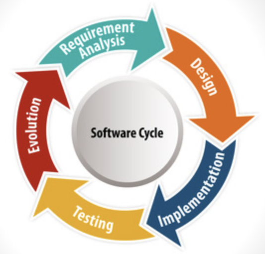
版权所有©️ 仅限于教学使用

### Notes:
4.1 传统的软件测试过程
4.1.1 W模型
4.1.2 TMap NEXT
4.2 敏捷测试过程
4.2.1 敏捷测试的价值观和原则
4.2.2 传统测试和敏捷测试的区别
4.2.3 敏捷测试流程
4.2.4 SBTM
4.3 软件测试流派
4.4 测试过程改进
4.4.1 TMMi	89
4.4.2 TPI NEXT
4.4.3 CTP
4.4.4 STEP
4.5 软件测试标准与规范

小结	102

思考题	103

<!-- Slide number: 4 -->
# 软件测试贯穿全生命周期
测试左移：不仅让开发人员做更多的测试，而且需要做需求评审、设计评审，以及第1章介绍的验收测试驱动开发（ATDD）；
测试右移：是在线测试（Test in Production，TiP），包括在线性能监控与分析、A/B测试和日志分析等，可以和现在流行的DevOp联系起来。

<!-- Slide number: 5 -->
# 测试左移和测试右移
专业化
服务化
需求
向需求、设计转移
BDD、ATDD
运维
易用性、性能、
场景测试客户化
测试
 高度的可视化、集成化的全过程监控
 数据驱动质量：客户质量实时反馈

<!-- Slide number: 6 -->
# 测试左移

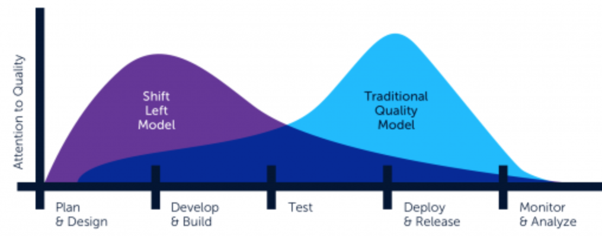
需求评审、设计评审等
测试计划、测试设计可以在更早时候开始
TDD、ATDD

<!-- Slide number: 7 -->
4.1 传统的软件测试过程
4.1.1  W模型
4.1.2  TMap Next

<!-- Slide number: 8 -->
# 传统的软件测试过程

单元与集成测试

验收测试

系统测试

需求评审

设计评审

计划

设计

开发

执行

评估

报告
8

### Notes:

<!-- Slide number: 9 -->
# 软件测试的生命周期

需求评审
设计评审
单元与集成测试
系统测试
验收测试

系统缺陷
其它各种
缺陷
需求缺陷
设计缺陷
代码和接口
缺陷

<!-- Slide number: 10 -->
# 系统测试的层次
验证业务需求
需求定义

验收测试

系统设计的验证
系统设计

系统测试

功能（规格）的验证
功能规格
详细设计

集成测试

代码验证

编程
单元测试

<!-- Slide number: 11 -->
# 4.1.1  W模型

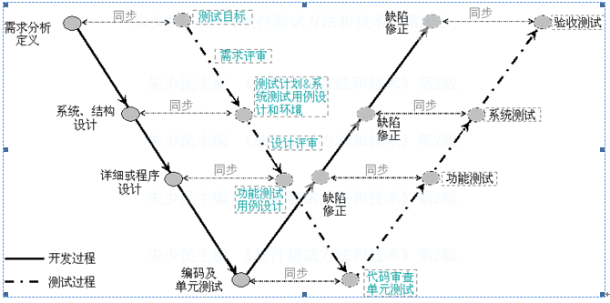

### Notes:

<!-- Slide number: 12 -->
# 4.1.2  TMap
TMap (Test Management Approach，测试管理方法)是一种结构化的、基于风险策略的测试方法体系, 目的能更早地发现缺陷，以最小的成本、有效地、彻底地完成测试任务，以减少软件发布后的支持成本。
TMap所定义的测试生命周期由计划和控制、准备、说明、执行和完成等阶段组成
参考： http://eng.tmap.net/Home/

### Notes:

<!-- Slide number: 13 -->
# TMap描述的生命周期模型

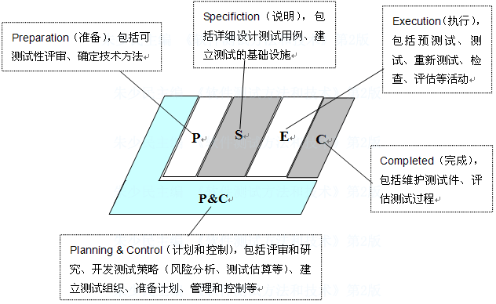

### Notes:

<!-- Slide number: 14 -->

# TMap基本内容
一个基于风险的测试方法
基于风险的测试策略，来有效的分配测试投入
在测试规划的各个时间点进行商业投入

### Notes:

<!-- Slide number: 15 -->
# TMap三大基石
与软件开发生命周期一致的测试活动生命周期（L）
坚实的组织融合（O）
正确的基础设施和工具（I）
可用的技术（T）

技术
流程

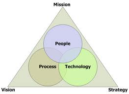
测试环境
人/组织

### Notes:

<!-- Slide number: 16 -->
# TMap NEXT之背景
测试的独立性  和开发更紧密的融合
更多种类的测试组织，包括测试工厂
BDTM, Business Driven Test Management
新的测试方法、技术，特别测试设计方法
测试的基础设施、支持流程
测试估算、风险分析
增加测试类型

<!-- Slide number: 17 -->
# TMap NEXT

业务驱动测试管理方法BDTM
结构化的测试流程
完整的工具包
自适应的测试方法
http://www.tmap.net/en/tmap-next

<!-- Slide number: 18 -->
# Tmap NEXT生命周期模型

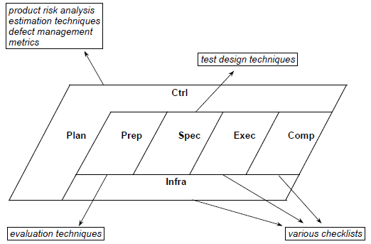

Setting up & maintaining infrastructure

<!-- Slide number: 19 -->

# BDTM
客户

<!-- Slide number: 20 -->
4.2 敏捷测试过程
4.2.1 敏捷测试的价值观和原则
4.2.2 传统测试和敏捷测试的区别
4.2.3 敏捷测试流程
4.2.4 SBTM

<!-- Slide number: 21 -->
# 4.2.1 敏捷测试的价值观和原则

敏捷宣言体现了价值观

### Notes:

<!-- Slide number: 22 -->
# 深入敏捷宣言背后的原则（1）
尽早和持续地交付有价值的软件来满足客户
欢迎需求变更——即使是在项目开发后期。要善于利用需求变更，帮助客户获得竞争优势
要不断交付可用的软件，周期从几周到几个月不等，且越短越好
项目过程中，业务人员与开发人员必须在一起工作

### Notes:
1) 软件测试如何支撑或协助“持续不断地及早交付有价值的软件”？如何在非常有限的时间内进行充分的测试？
2) “欣然面对需求变化，即使在开发后期也一样” ，那么测试如何适应这种变化？如何快速地完成回归测试？
3) 敏捷开发强调开发和测试一起工作，“项目中的每一天都不例外”，在这样的原则下，如何去做敏捷测试？

<!-- Slide number: 23 -->
# 深入敏捷宣言背后的原则（2）
要善于激励项目人员，给他们以所需要的环境和支持，并相信他们能够完成任务
无论是团队内还是团队间，最有效的沟通方法是面对面的交谈
可用的软件是衡量进度的主要指标
敏捷过程提倡可持续的开发。项目方、开发人员和用户应该能够保持长期稳定的开发速度

### Notes:
“可工作的软件是进度的首要度量标准”，谁做的测试不重要，关键是要有准备好的测试，随时验证已完成的工作。

<!-- Slide number: 24 -->
# 深入敏捷宣言背后的原则（3）
对技术的精益求精、对设计的不断完善将提升敏捷性
简单——尽最大可能减少不必要的工作——一门艺术
最佳的架构、需求和设计出自于自组织的团队
团队要定期反省如何能够做到更有效，并相应地调整团队的行为

### Notes:
“坚持不懈地追求技术卓越和良好设计”，在处理每个测试任务时，都应该找到最有效的办法

<!-- Slide number: 25 -->
# 敏捷测试特征
尽早和持续地开展测试
能及时完成对软件质量全面评估
软件本身是测试研究和分析最主要的对象
在满足所要求的质量，测试进行得越快越好
测试人员必须和项目干系人保持密切协作
对测试人员足够信任和尊重
测试计划、设计和执行力求简单
对测试技术精益求精
不断反思，持续优化测试设计

<!-- Slide number: 26 -->
# 4.2.2 传统测试和敏捷测试的区别
传统测试
敏捷测试
以人为本，强调个人技能
TDD、ATDD
持续测试
侧重产品的测试
ET、TA
整个团队对测试负责
拥抱变化
批判性思维能力
自我学习能力
重流程
阶段性明确
测试团队独立性
测试人员职责细化
关注需求/测试文档
分析/文档能力
严谨、规范
缺陷预防
测试过程改进

### Notes:
1) 软件测试如何支撑或协助“持续不断地及早交付有价值的软件”？如何在非常有限的时间内进行充分的测试？
2) “欣然面对需求变化，即使在开发后期也一样” ，那么测试如何适应这种变化？如何快速地完成回归测试？
3) 敏捷开发强调开发和测试一起工作，“项目中的每一天都不例外”，在这样的原则下，如何去做敏捷测试？

<!-- Slide number: 27 -->
4.2.3 敏捷测试流程
# 敏捷测试=持续的质量反馈
产品经理
质量问题持续反馈
用户需求
需求
设计
代码
功能
非功能特性
质量问题持续反馈
开发人员
交付价值

### Notes:

<!-- Slide number: 28 -->
# 敏捷Scrum测试流程

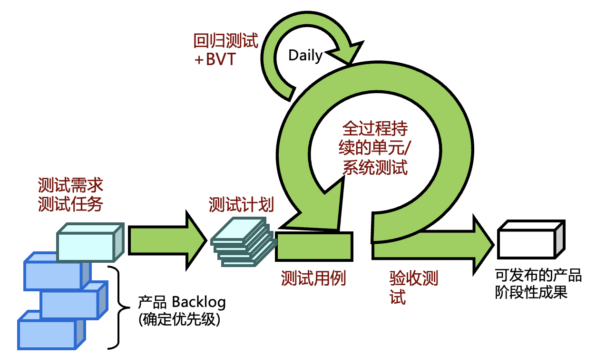

### Notes:

<!-- Slide number: 29 -->
# 4.2.4 基于会话的测试管理（SBTM）

测试目标
测试项
测试风险
测试策略
设计
测试点
场景列表

<!-- Slide number: 30 -->
SBTM
Session(会话)是一段不受打扰的测试时间（通常是90分钟），是测试管理的最小单元。
每个session关联一个特定的、目标明确的测试任务（mission）
Charter (章程，即测试指导) ：对每个session如何执行进行简要的描述，相当于每个session需要一个简要的计划（提纲）
一系列Session相互支持，有机地组合在一起，周密地测试了整个产品。

30

### Notes:
Charter还具有什么重要属性？ 优先级
Session 可以看成一个更具体的测试任务，Mission：任务，Session是为了完成Mission的子任务

<!-- Slide number: 31 -->
SBTM – 续
A session sheet (测试报告) ： 相当于测试报告，供第三方（如测试经理、ScrumMaster等）进行检查的材料。它最好能被工具扫描、解析和合成。
Debriefing（听取口头报告）：口头汇报，更准确地说，是测试人和其lead/Manager之间的对话。

31

### Notes:
简洁的文档，
面对面沟通更重要

<!-- Slide number: 32 -->

计划-mission-session

测试计划
目标
测试 Mission 1
测试 Mission 2
……
测试 Mission n

test suite
任务
……
Charter 1
Charter 2
Charter m
Time-Box = Session
追加Session
32

### Notes:
传统的测试计划可以分成什么？测试任务、test suite、test cases
还是能对应起来的

<!-- Slide number: 33 -->

示例

33

### Notes:

<!-- Slide number: 34 -->
Charter：进一步明确测试范围和策略
Charter 清晰指导Session执行任务（Mission）：要测什么、怎么测试（强调策略，不是详细测试步骤）、寻找什么样的缺陷、哪些产品质量风险等
可以看做一个或一组用例（User Case）的体现，相对用例（use case）的测试思路

By testing ...through ... to ...
示例
通过数据的多样性变化来测试 B 流程对各种数据的容错能力;
通过检查 UI 来测试 C 模块是否符合 UI 规范
34

### Notes:
我们“As a ..., I want to ..., so that ...”标准格式描述user story 。
为了让 Charter 的制定更有效和简洁, 一种标准格式"By testing ...through ... to ..."来规范 Charter 的制定。
通过这样的格式,可以强迫你在开始测试前就明确本次测试中核心的 三个元素:
     测试范围、测试方法、测试目标。
按照这样的格式,我们可以较容易地制定出有效的 Charter。比如,
通过参考需求文档测试 A 功能来熟悉此功能与其它系统的交互;
通过数据的多样性变化来测试 B 流程对各种数据的容错能力;
通过检查 UI 来测试 C 模块是否符合 UI 规范

<!-- Slide number: 35 -->
Charter 规范模板
角色/主题
测试目标
优先级
参考
测试判断依据
环境配置
测试数据
如何测试
去哪儿VIP用户，“积分兑换”功能测试
异常操作、互操作和大数据的测试
优先级一般
参考产品愿景、用户故事等文档
根据用户故事验收标准等判断
Windows/IE、Mac OS/Safari…
引用备份的测试数据库
登录、查询积分、去积分商场查询合适商品、兑换、物流选择、补充性支付等
35

### Notes:
比较规范，

<!-- Slide number: 36 -->
示例

36

<!-- Slide number: 37 -->
结果报告：Session Sheet -1

只要遵循简单的格式，就可产生易于自动分析的报表，通过特定工具汇总，产生测试报告和图表

TSB
37

### Notes:
Opportunity testing is any testing that doesn’t fit the charter of the session. Since we’re in doing exploratory testing, we remind and encourage testers that it’s okay to divert from their charter if they stumble into an off-charter problem that looks important

<!-- Slide number: 38 -->
Session Sheet -2
Session charter (包含任务陈述、测试范围等)
Tester name(s)/测试执行者
Task breakdown :TBS（Test/Bug/Setup）度量（耗时），这些数据配合简报有助于估算测试速度、评估测试效率
测试数据、数据文件：为测试数据复用提供了基础
Note/ 测试笔记：测试过程中随时记录的有价值的信息，叙述了测试故事：为什么测试，如何测，为什么这样的测试已足够好
Issues/ 问题/风险：测试过程中的问题和疑惑（未来测试的参考资料）
缺陷：测试的直接产出
38

### Notes:
只要遵循简单的格式（如“#”标记各项内容），就可以产生易于自动分析的报表，通过特定工具汇总，产生测试报告和图表。

<!-- Slide number: 39 -->
任务报告 （ Debriefing ）
PROOF
Past（已做了哪些测试）：What happened during the session?
Results（测试结果）： What was achieved during the session?
Obstacles （障碍）： What got in the way of good testing?
Outlook （未来要做哪些测试）：What still needs to be done?
Feelings （感觉）：How does the tester feel about all this?
每个session结束后有一个口头汇报
每天测试人员有 4+ 次沟通
Note: 3 same Questions in Daily Scrum meeting
39

<!-- Slide number: 40 -->
# SBTM 实践框架

40

<!-- Slide number: 41 -->
4.3 软件测试流派

<!-- Slide number: 42 -->
# 五大软件测试流派
质量流派
分析流派

标准流派

上下文驱动流派
敏捷流派

### Notes:

<!-- Slide number: 43 -->
# 各测试流派的特征
分析流派：认为测试是严格的和技术性的，在学术界有许多支持者
标准流派：将测试视为衡量进度的一种方法，强调成本和可重复的标准
质量流派：强调过程规范性，监督开发人员并充当质量的看门人
上下文驱动流派：强调人的价值，寻找涉众关心的bug
敏捷流派：强调自动化测试，使用测试来快速验证开发是完整的
敏捷流派可以从上面 4.2小节得到更多的信息

### Notes:

<!-- Slide number: 44 -->

# 上下文驱动测试方法
CDT: Context-driven Testing
任何实践活动的价值依赖于它所处的上下文
在某个上下文中只有好的实践，没有最佳实践
一起工作的人，才是项目的最重要组成部分
项目的发展往往难以预料
产品是问题的解决方案，如果问题没得到解决，产品是无用的
好的软件测试时一个富有挑战性的智力过程。
只有通过判断和技能，并在整个项目过程中协同练习它们，我们才能在正确的时间做正确的事，以有效地测试我们的产品

### Notes:

<!-- Slide number: 45 -->
4.4 软件测试改进
4.5.1  TMMi (Testing Maturity Model integration)
4.5.2  TPI (Test Process Improvement)
4.5.3  CTP (Critical Test Process)
4.5.4  STEP (Systematic Test & Evaluation Process)

<!-- Slide number: 46 -->
# 4.4.1  TMMi
过程能力描述了遵循一个软件测试过程可能达到的预期结果的范围。TMMi的建立，得益于以下3点：
充分吸收、CMM/CMMi的精华；
基于历史演化的测试过程；
业界的最佳实践。

5个别级的一系列测试能力成熟度的定义，每个级别的组成包括到期目标、到期子目标活动、任务和职责等。
一套评价模型，包括一个成熟度问卷、评估程序和团队选拔培训指南。

### Notes:

<!-- Slide number: 47 -->
# TMMi 5个级别简述

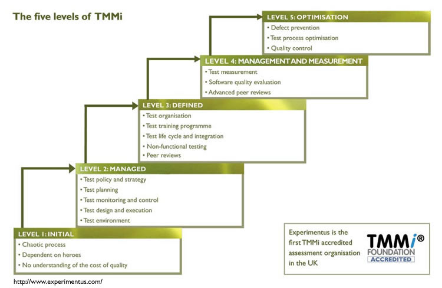

### Notes:

<!-- Slide number: 48 -->
# TMMi 2～5级别内容
目标
特征
描述

### Notes:

<!-- Slide number: 49 -->
# TMMi结构

<!-- Slide number: 50 -->
# 4.4.2  TPI NEXT
TPI（Test Process Improvement）是基于连续性表示法的测试过程改进的参考模型，是在软件控制、测试知识以及过往经验的基础上开发出来的

### Notes:

<!-- Slide number: 51 -->
# TPI 20个关键域
测试策略
生命周期模型
介入时间
估计和计划
测试规格技术
静态测试技术
度量
测试自动化
测试环境
办公环境
承诺与动力
测试功能与培训
方法的范围
沟通
报告
缺陷管理
测试件管理
测试过程管理
评估
底层测试

### Notes:

<!-- Slide number: 52 -->
# TPI 级别
为了了解过程在每个关键域所处的状态，即对关键域的评估结果，通过级别是来体现。模型提供了4个级别，由A到D，A是最低级。根据测试过程的可视性改善、测试效率的提高、或成本的降低以及质量的提高，级别会有所上升。
详见表4-3

### Notes:

<!-- Slide number: 53 -->
# TPI 检查点和建议
为了能客观地决定各个关键域的级别，TPI模型提供了一种度量工具——检查点。每个级别都有若干个检查点，测试过程只有在满足了这些检查点的要求之后，才意味着它达到了特定的级别
检查点帮助我们发现测试过程中的问题，而建议会帮助我们解决问题，最终改进测试过程。建议不仅包含对如何达到下个级别的指导，而且还包括一些具体的操作技巧、注意事项等。

### Notes:

<!-- Slide number: 54 -->
# TPI成熟度矩阵

### Notes:

<!-- Slide number: 55 -->
# TPI NEXT
商业驱动作为测试过程提升的基础
为改进目标和度量设定优先级
确保商业可以引导和控制改进的过程

<!-- Slide number: 56 -->
# TPI Next

<!-- Slide number: 57 -->
（关键域）TPI  vs.  TPI Next

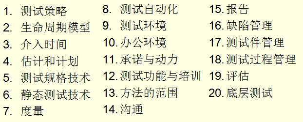

### Notes:
没有：生命周期模型、测试规格技术、静态测试技术、办公环境、测试功能与培训、评估、底层测试

不同的：介入时间 – Degree of Involvement， 测试自动化 -  Test tools, 承诺与动力 – Stakeholder commitment
        方法的范围 – Methodology practice

新增：Test Organization, Test case design, Tester professionalism

<!-- Slide number: 58 -->
# 4.4.3  CTP
关键测试过程（Critical Test Process，CTP）:内容参考模型、上下文相关的方法，并能对模型进行裁剪
使用CTP的过程改进，始于对现有测试过程的评估，通过评估以识别过程的强弱，并结合组织的需要提供改进的意见
计划（Plan）、准备（Prepare）、执行（Perform）和完善 (Perfect)；计划和完善主要是管理工作，准备和执行是实践工作

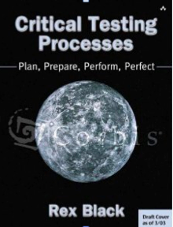

### Notes:

<!-- Slide number: 59 -->
# CTP  12个关键过程

测试策略
生命周期模型
介入时间
估计和计划
测试规格技术
静态测试技术
度量
测试自动化
测试环境
办公环境
承诺与动力
测试功能与培训
方法的范围
沟通
报告
缺陷管理
测试件管理
测试过程管理
评估
底层测试

测试
建立上下文关系和测试环境
质量风险评估
测试估算
测试计划
测试团队开发
测试（管理）系统开发
测试发布管理
测试执行
缺陷报告
测试结果报告
变更管理

### Notes:

<!-- Slide number: 60 -->
# 4.5.4  STEP
STEP（Systematic Test and Evaluation Process，系统化测试和评估过程）是一个内容参考模型

基于需求的测试策略
在生命周期初始开始进行测试
测试用作需求和使用模型
由测试件设计导出软件设计（测试驱动开发）
及早发现缺陷或完全的缺陷预防
对缺陷进行系统分析
测试人员和开发人员一起工作

### Notes:

<!-- Slide number: 61 -->
# STEP 强调度量
已定义的测试过程使用
客户满意度

不同时期的测试状态
测试需求和风险覆盖
缺陷趋势，包括发现、等级和分类分项数据
缺陷密度、缺陷移除效率、缺陷发现率
缺陷引进、发现和移除等阶段
测试成本，包括时间、工作量和资金

### Notes:

<!-- Slide number: 62 -->
# STEP 比较
STEP与CTP比较类似，而不像TMMI和TPI，并不要求改进需要遵循特定的顺序。
某些情况下，STEP评估模型可以与TPI成熟度模型结合起来使用

### Notes:

<!-- Slide number: 63 -->
4.5 软件测试标准与规范

<!-- Slide number: 64 -->
# 概述
ISO9000-3 Quality management and quality assurance standards
ISO/IEC 12119 Information technology - Software packages - Quality requirements and testing
GBT 15532-2008 《计算机软件测试规范》
IEEE Std 1008 单元测试标准
IBM 程序设计开发指南
 国际标准
 国家标准
 行业标准
 企业(机构)规范
 项目规范

### Notes:

<!-- Slide number: 65 -->
# 标准和质量体系认证

### Notes:

<!-- Slide number: 66 -->
# 从SC7标准集了解软件工程标准的结构

### Notes:

<!-- Slide number: 67 -->
# 主要软件质量标准
对应ISO29119系列标准：
GB/T 38634.1-2020  系统与软件工程 软件测试 第1部分：概念和定义
GB/T 38634.2-2020  系统与软件工程 软件测试 第2部分：测试过程
GB/T 38634.3-2020  系统与软件工程 软件测试 第3部分：测试文档
GB/T 38634.4-2020  系统与软件工程 软件测试 第4部分：测试技术

… …

与测试直接相关的标准还有：
GB/T 15532-2008  计算机软件测试规范；
GB/T 9386-2008  计算机软件测试文档编制规范
GB/T 33447-2016  地理信息系统软件测试规范；
GB/T 37715-2019  公安物联网基础平台与应用系统软件测试规范

### Notes:

<!-- Slide number: 68 -->
# 软件测试行业标准
JR/T 0175—2019  《证券期货业软件测试规范》；
JR/T 0101-2013  银行业软件测试文档规范；
JR/T 0191—2020  证券期货业软件测试指南 软件安全测试
GA/T 1765-2021  公安视频图像信息应用平台软件测试规范；
DL/T 2031-2019  电力移动应用软件测试规范
JT/T 966 -2015  收费公路联网收费系统软件测试方法（多个子标准）

<!-- Slide number: 69 -->
# 完整的软件测试规范是怎样的
规范目的
范围
文档结构
词汇表
参考信息
可追溯性
方针
过程/规范
指南
模板
检查表
培训
工具
参考资料等

### Notes:

<!-- Slide number: 70 -->
# 制定测试规范需要考虑的内容
 角色的确定
 进入的准则
 输入项
 活动过程
 输出项
 验证与确认
 退出的准则
 度量

### Notes:

<!-- Slide number: 71 -->
# GBT 15532-2008 《计算机软件测试规范》

### Notes:

<!-- Slide number: 72 -->
 银行业软件测试规范

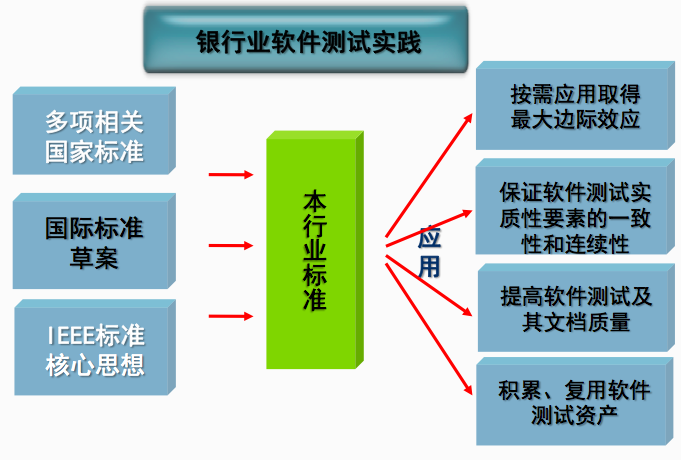

<!-- Slide number: 73 -->
环境信息系统的测试规范
计划
确定测试充分性要求。确定测试应覆盖的范围及每一范围所要求的覆盖程度。
确定测试终止的要求。指定测试过程正常终止的条件(如测试充分性是否达到要 求),并确定导致测试过程异常终止的可能情况。
确定环境信息系统测试的质量目标。
确定用于测试的资源要求,包括软件、硬件、人员数量和人员技能等。
确定需要测试的环境信息系统特性。根据合同或系统/子系统设计文档的描述,确
定系统的功能、性能、状态、接口、数据结构、设计约束等内容和要求。并从中确
定需测试的环境信息系统特性。
确定测试需要的技术和方法,如测试数据生成和验证技术、测试数据输入技术、测
试结果获取技术、是否使用标准测试集等。
根据合同或项目计划的要求和环境信息系统的特点,确定测试准出条件。 h) 确定由资源和被测系统决定的测试活动的进度。
对测试工作进行风险分析与评估,并制订应对措施。
设计
设计测试用例。将需测试的环境信息系统特性分解,针对分解后的每种情况设计测试用例。
获取测试数据,包括获取现有的测试数据和生成新的数据,并按照要求验证所有数据。
确定测试顺序,可从资源约束、风险以及测试用例失效造成的影响或后果几个方面考虑。
获取测试资源,对于支持测试的软件,有的需要从现有的工具中选定,有的需要开发。
编写测试程序,包括开发测试支持工具。
建立和确认测试环境。
编写测试说明。

<!-- Slide number: 74 -->
# 本章小结
传统软件测试流程：W模型、TMap Next
敏捷测试流程：敏捷宣言、敏捷开发12项原则、TDD、SBTM
五大测试流派：重点理解上下文驱动测试流派
软件测试改进：重点TMMi和TPI next
软件测试标准与规范

<!-- Slide number: 75 -->
# 思考题
进一步理解传统测试和敏捷测试 不同点和共同点
测试改进的核心是什么？在4个模型中，哪个模型更适合自己的自我改善？

### Notes:
重点学习内容，可以通过留实操作业或提问的方式，巩固学习成果

<!-- Slide number: 76 -->
# 感 谢 聆 听
朱少民 / 同济大学

### Notes:
每课结束时使用“以上是本节课的内容”“这一章讲到这里”