<!-- Slide number: 1 -->
# 第5章 单元测试与集成测试


# 第2篇 软件测试技术
第5章 单元测试与集成测试
第6章 系统功能测试
第7章 专项测试
第8章 国际化和本地化测试
第9章 软件测试自动化及其框架
版权所有©️ 仅限于教学使用

### Notes:
列写本课时的学习要点，依次开始深入讲解。
如有学习要求，请列写在课时要点之后。
在保持内容版式整洁的前提下，重点的学习内容，请尽量详细的列写在讲义中，让大家在单独看讲义时也可以学习。
讲义非语音讲解辅助，而是学习的一个主体。

概念，学习要点的概念介绍，以及在工作中什么场景会用到
讲解，工作中胜任这个能力，需要掌握的知识、技术能详细讲解
举例，举一个案例或demo 帮助大家更好理解要学习的内容，以及知道怎么用
分享经验，你对这个学习要点的工作应用心得。特别是理论和实际的差异的部分。
学习建议，给出一些相关学习或工作场景中使用的建议
实用工具，这个学习要点对应的一些工具模板（如果有）

<!-- Slide number: 2 -->

# 软件测试方法和技术
第5章 单元测试与集成测试
同济大学  朱少民
版权所有©️ 仅限于教学使用

### Notes:
第5章 单元测试与集成测试	107

5.1 代码静态测试	108

5.1.1 编码的标准和规范	109

5.1.2 代码评审	112

5.2 代码评审案例分析	116

5.2.1 空指针保护	116

5.2.2 格式化数字错误	117

5.2.3 字符串或数组越界错误	118

5.2.4 资源不合理使用	119

5.2.5 不当使用synchronized导致系统性能下降	120

5.3 代码静态检测工具	121

5.3.1 FindBugs检查代码缺陷	122

5.3.2	PMD检查代码缺陷	123

5.3.3 CheckStyle检查代码风格	124

5.3.4 SonarQube构建自动的代码扫描	125

5.4 单元测试的目标和任务	127

5.4.1 为何要进行单元测试	127

5.4.2 单元测试的目标和要求	128

5.4.3 单元测试的任务	129

5.4.4 驱动程序和桩程序	131

5.4.5 类测试	133

5.5 分层单元测试	134

5.5.1 Action层的单元测试	134

5.5.2 数据访问层的单元测试	137

5.5.3 Servlet的单元测试	139

5.6 单元测试工具	141

5.6.1 JUnit介绍	141

5.6.2 IntelliJ IDEA中JUnit应用举例	144

5.6.3 mock框架Mockito	148

5.6.4 测试覆盖率工具Jacoco	149

5.6.5 构建自动的单元测试	150

5.6.6 其它开源的单元测试工具	152

5.7 系统集成的模式与方法	154

5.7.1 单体架构的集成测试	155

5.7.2 微服务架构的集成测试	158

5.8 持续集成及其测试	159

5.8.1 持续集成中的测试活动	160

5.8.2 CI测试工具	161

小结	163

思考题	163

【实验2】单元测试实验	164

<!-- Slide number: 3 -->
5.1 代码静态测试
5.2 代码评审案例分析
5.3 代码静态检测工具
5.4 单元测试的目标和任务
5.5 分层单元测试
5.6 单元测试工具
5.7 系统集成的模式与方法
5.8 持续集成及其测试
教材内容
版权所有©️ 仅限于教学使用

<!-- Slide number: 4 -->
5.1：代码评审与分析
5.2：单元测试
5.3：持续集成测试
小结：重点、难点解析
练习：基于JUnit的单元测试实验等


现在整合优化为3部分，内容更紧凑些。如果不调整，可在第3版基础上进行修改，这部分第4版变化不大

### Notes:
七、代码评审与分析
编码规范与代码评审
代码的静态检测工具及其应用（FindBugs、PMD、CheckStyle、SourceMonitor、SonarQube等）

八、单元测试
为何要进行单元测试
单元测试的目标和要求
驱动程序和桩程序
单元测试工具及其实践（Junit、TestNG）
Mock技术与框架（如Mockito）
测试覆盖率工具Jacoco
九、持续集成测试
单体架构的集成测试
微服务架构的集成测试
持续集成及其测试
CI/CD流水线
容器技术与Docker
集群管理与Kubernetes
基础设施即代码（IaaC）
基础架构的自动部署
应用程序容器化及集群部署
重难点小结
微服务架构的集成测试、CI/CD流水线、IaaC和自动部署
课后实践练习
基于JUnit的单元测试实验
Jenkins+Docker实现Java应用的持续构建

<!-- Slide number: 5 -->
## 5.1 代码评审与分析


# 5.1 代码评审与分析

### Notes:
列写本课时的学习要点，依次开始深入讲解。
如有学习要求，请列写在课时要点之后。
在保持内容版式整洁的前提下，重点的学习内容，请尽量详细的列写在讲义中，让大家在单独看讲义时也可以学习。
讲义非语音讲解辅助，而是学习的一个主体。

概念，学习要点的概念介绍，以及在工作中什么场景会用到
讲解，工作中胜任这个能力，需要掌握的知识、技术能详细讲解
举例，举一个案例或demo 帮助大家更好理解要学习的内容，以及知道怎么用
分享经验，你对这个学习要点的工作应用心得。特别是理论和实际的差异的部分。
学习建议，给出一些相关学习或工作场景中使用的建议
实用工具，这个学习要点对应的一些工具模板（如果有）

<!-- Slide number: 6 -->
### 5.1.1 代码评审的价值与关注点

# 代码评审的价值

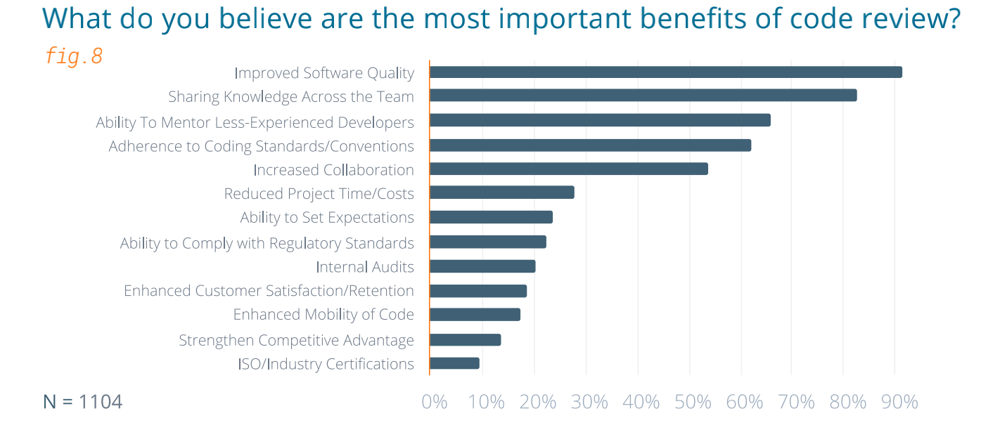
改善代码质量
跨团队共享知识
辅导缺少经验的程序员
坚持遵守代码规范
增强协作
减少项目代价
……

<!-- Slide number: 7 -->
# 关注代码评审

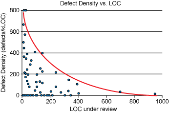
是否符合代码规范、代码风格？
圈复杂度： e-n+2p
信息流复杂度：（扇入*扇出）2
模块耦合性：功能/数据相关联模块数比例
……


> [!IMPORTANT]
> **代码评审关注的度量指标公式**：
> - **圈复杂度 (Cyclomatic Complexity)**：$V(G) = e - n + 2p$
> - **信息流复杂度 (Information Flow Complexity)**：$(\text{扇入} \times \text{扇出})^2$
> - **模块耦合性**：功能/数据相关联模块数比例

<!-- Slide number: 8 -->
### 5.1.2 代码规范与互查实践

# 首推代码规范


https://google.github.io/styleguide/cppguide.html
http://google.github.io/styleguide/javaguide.html

<!-- Slide number: 9 -->
# 代码互查的优秀实践
一次检查少于200～400行代码
努力达到一个合适的检查速度：300～500LOC/hour
有足够的时间、以适当的速度、仔细地检查，但不宜超过60～90分钟
在复审前，代码作者应该对代码进行注释
使用检查表（checklist）肯定能改进双方（作者和复审者）的结果
验证缺陷是否真正被修复
 ……


Best Practices for Peer Code Review

### Notes:


> [!IMPORTANT]
> **代码评审与互查优秀实践标准**：
> - **单次检查量**：一次检查少于 **200～400 行** 代码（LOC）。
> - **检查速度**：保持在 **300～500 LOC/小时** 的合适速度。
> - **时间控制**：每次评审时间不宜超过 **60～90 分钟**。
> - **流程原则**：复审前作者先行对代码进行注释，使用检查表 (Checklist) 改进质量，并严格验证缺陷是否被修复。

<!-- Slide number: 10 -->
# 工具支持：Collaborating with pull requests @GitHub

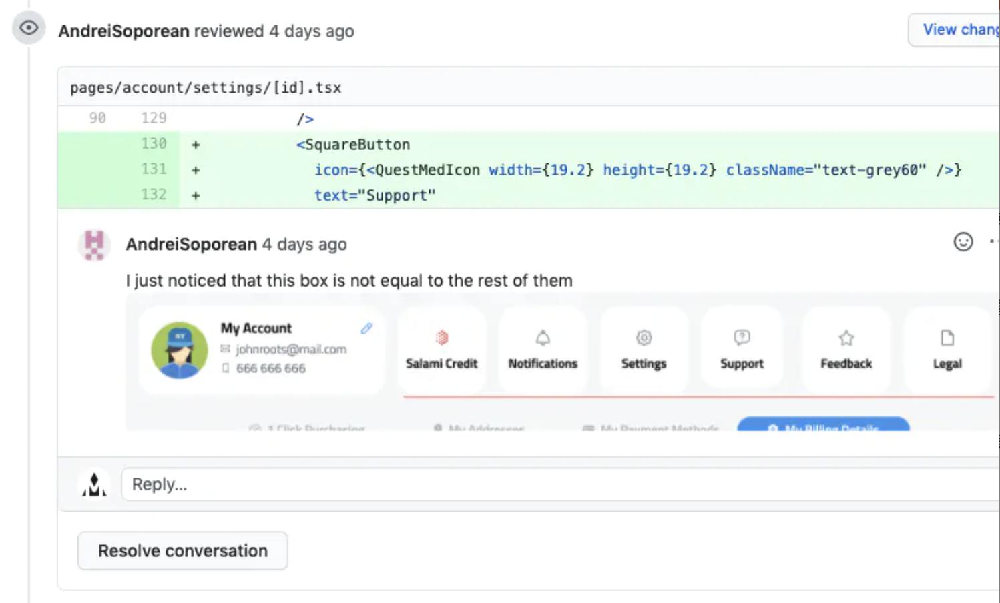

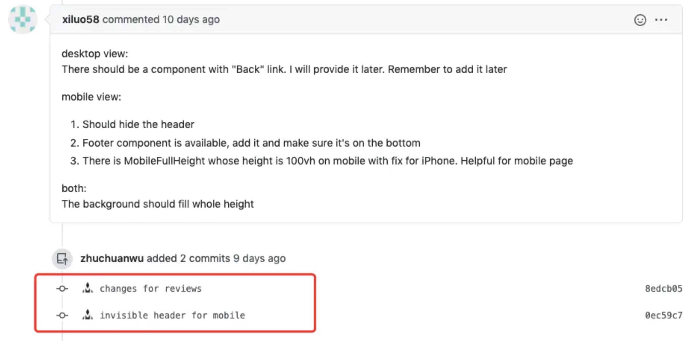
https://docs.github.com/en/pull-requests/collaborating-with-pull-requests

<!-- Slide number: 11 -->
# 示例：change review

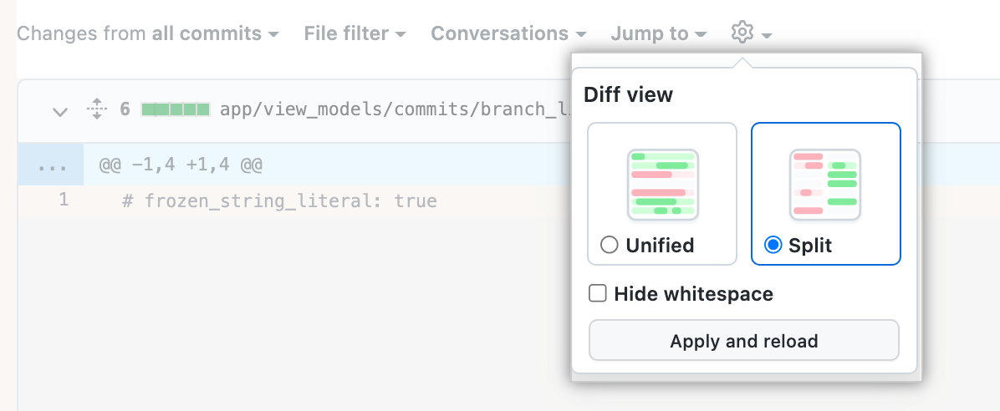

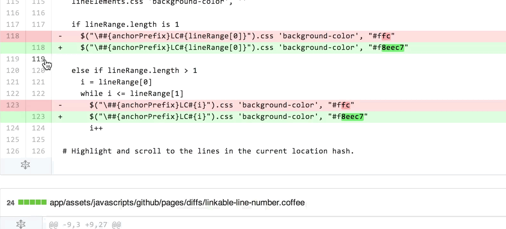

<!-- Slide number: 12 -->
# 缺陷示例：空指针保护案例分析

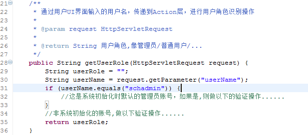

### Notes:

<!-- Slide number: 13 -->
开发人员走上台介绍其代码


每个人都有机会
随机抽取
现场展示

<!-- Slide number: 14 -->
# 其它优秀实践


 关键代码的集体评审
 代码评审作为一种文化
 借助工具更有效
 流程定义
 培训

<!-- Slide number: 15 -->
### 5.1.3 代码静态分析工具

代码静态分析工具

<!-- Slide number: 16 -->
代码静态分析工具


SonarLint
Java：FindBugs、PMD、Checkstyle等
C/C++：Clint/Oclint/Cpplint、TestC++
Python：Pylint、 PySonar2等
安全：Coverity、Fortify等
更多的参考：
https://owasp.org/www-community/Source_Code_Analysis_Tools


> [!TIP]
> **多语言代码静态分析工具汇总**：
> - **多语言通用/IDE集成**：SonarLint / SonarQube
> - **Java 静态分析**：FindBugs（已停止更新，基本被IDE原生分析代替）、PMD、Checkstyle（代码风格与规范检测）
> - **C/C++ 静态分析**：Clint/Oclint/Cpplint、TestC++
> - **Python 静态分析**：Pylint、PySonar2
> - **代码安全扫描 (SAST)**：Coverity、Fortify

<!-- Slide number: 17 -->
# 首推


https://www.sonarsource.com/products/sonarlint/
几乎支持所有流行的语言和IDE


学习


修正缺陷
发现缺陷

<!-- Slide number: 18 -->
# 示例：在IntelliJ应用SolarLint插件

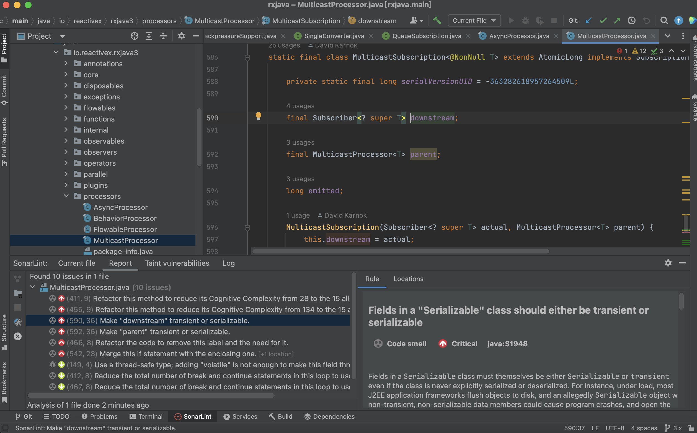

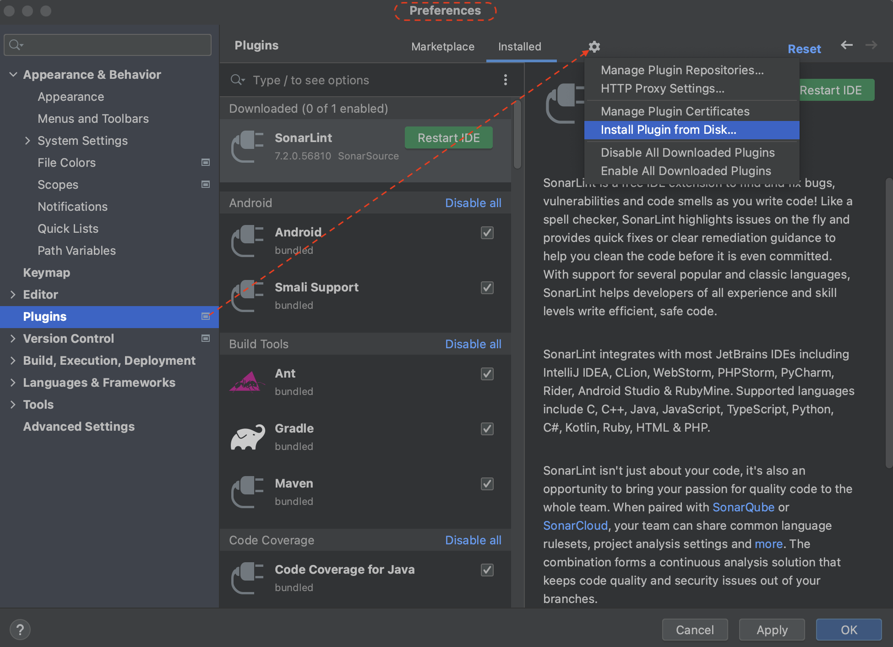


https://plugins.jetbrains.com/plugin/7973-sonarlint

<!-- Slide number: 19 -->
# 可以和SolarQube集成使用


<!-- Slide number: 20 -->
# 来自大学的FindBugs


http://findbugs.sourceforge.net/
 2015年3月
FindBugs 3.0.1发布之后
就没有更新了

<!-- Slide number: 21 -->
# FindBugs @ IntelliJ


IntelliJ IDEA 2021.2 发布之后就基本干掉 了FindBugs

### Notes:
Malicious 恶意的

<!-- Slide number: 22 -->
# IntelliJ分析功能代替了FindBugs


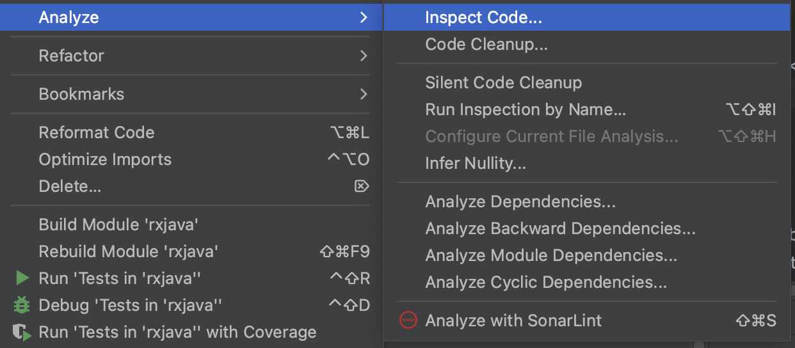

<!-- Slide number: 23 -->
# 代码风格检查 CheckStyle
https://checkstyle.org/


CI/CD集成

mvn checkstyle:checkstyle

apply from: 'checkstyle.gradle’

配置文件
config/checkstyle/checkstyle.xml

运行任务
./gradlew check

检查结果
build/reports/checkstyle/main.html

<!-- Slide number: 24 -->
# CheckStyle 规则


<!-- Slide number: 25 -->
# checkstyle结果显示

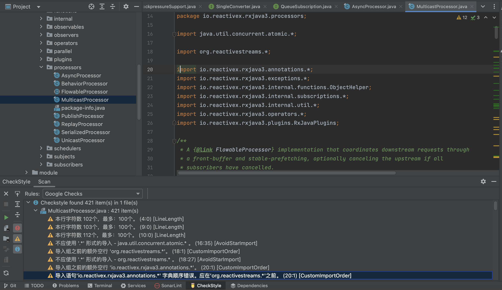

<!-- Slide number: 26 -->
# SourceMonitor检测代码复杂度


<!-- Slide number: 27 -->
### 5.1.4 第三方库风险与安全分析

软件第三方库风险巨大


98% 的正在使用开源第三方库的公司并不了解它们

10%
90%
30%
开源第三方库使用比例急速上升
2020
2010
2015

每年有4000个新增开源第三方库漏洞被报告

<!-- Slide number: 28 -->
代码级安全分析对象

### Chart

| Category | 销售额 |
|---|---|
| 自编代码 | 0.2 |
| 开源框架 | 0.45 |
| 第三方库 | 0.35 |SAST工具
未知漏洞
CWE标准
20%
35%
45%
SCA工具
已知漏洞
CVE标准


> [!IMPORTANT]
> **代码级安全分析技术对比**：
> - **SAST (静态应用安全测试)**：主要针对**自编代码**（约占代码量的20%），基于 **CWE 缺陷模式标准**检测未知漏洞。
> - **SCA (软件成分分析)**：主要针对**开源框架与第三方库**（约占代码量的80%），基于 **CVE 公开漏洞标准**检测已知漏洞。

<!-- Slide number: 29 -->
# SCA工具


29

<!-- Slide number: 30 -->
代码分析工具常见的使用场景

使用方式
在IDE中实时进行分析
代码每次提交时进行
与CI/CD流水线集成

检测项举例
SQL注入
跨站脚本攻击
资源泄露
硬编码凭据
配置审查

使用目的
为开发者快速返回检查结果
及时消除常见的安全问题

规则集
可选有限个检测项

检测耗时
几秒～几分钟

### Notes:

<!-- Slide number: 31 -->
SAST工具通用框架
函数调用
Mod-effect

被测源程序
抽象解释
SSA
解析
抽象
语法树
多态分析
数据流等基本分析方法
符号执行
指向分析
全局变量分析
前后支配
图可达
程序状态空间
SMT
OWASP
CWE
基于缺陷模式的
逻辑表达式
缺陷模式
逻辑表达式求解
CERT
检测结果
SSA：Static Single-Assignment
CWE：Common Weakness Enumeration

### Notes:
CWE（Common Weakness Enumeration，通用缺陷枚举），是一个安全漏洞词典,是由美国国土安全部国家计算机安全部门资助的软件安全战略性项目，枚举了上千种最新的漏洞(缺陷)模式，通过该认证代表了产品或服务与“CWE”兼容，证明产品能够支持国际上主要漏洞(缺陷)模式的检测


> [!TIP]
> **SAST 与代码安全核心术语定义**：
> - **CWE (Common Weakness Enumeration - 通用缺陷枚举)**：描述软件安全缺陷模式的行业字典与标准。
> - **SSA (Static Single-Assignment - 静态单赋值)**：一种中间表示（IR）形式，每个变量仅被赋值一次，利于静态数据流分析。

<!-- Slide number: 32 -->
## 5.2 单元测试


# 5.2 单元测试

### Notes:
为何要进行单元测试
单元测试的目标和要求
驱动程序和桩程序
单元测试工具及其实践（Junit、TestNG）
Mock技术与框架（如Mockito）
测试覆盖率工具Jacoco

<!-- Slide number: 33 -->
### 5.2.1 单元测试的价值与目标

# 单元测试内容
为何要进行单元测试
单元测试的目标和要求
驱动程序和桩程序
单元测试工具JUnit及其实践
Mock技术与框架（如Mockito）
测试覆盖率工具JaCoCo


### Notes:

<!-- Slide number: 34 -->
# 为何要进行单元测试?
编程与编译运行结束后，每1000行代码中大约残留有2-6个Bug
寻找与修改程序错误的代价占总体开发投资的30% -60%
尽早发现错误，成本越低
发现问题比较容易
修正问题更容易
单元质量是系统质量的基石，单元测试可以比系统测试测得更彻底


0.830 =0.00123
0.9930 = 0.740

### Notes:


> [!TIP]
> **单元测试的经济性与必要性**：
> - 编程与编译结束后，每 1000 行代码中约残留 **2-6 个 Bug**。
> - 寻找与修改程序错误的代价占总体开发投资的 **30%～60%**。
> - **越早发现错误，修复成本越低**。在单元测试阶段定位和修复问题是最容易、成本最低的。

<!-- Slide number: 35 -->
# 单元测试的其它价值
支持扩展：如果没有各种类型测试的支持，软件开发无法支持扩展，单元测试就是其基础
引导更好的设计：能够支持单元测试的代码总是不会被人遗弃。单元测试的存在，甚至实现程序可测试性的意识，可避免“方法有太多参数、Monster Methods（巨型方法）、过多的依赖”等问题
支持变化：任何人修改系统的一部分，就必须了解其它哪些部分需要运行验证，以确保不破坏程序。单元测试，提供了所需要的安全网，我们在进行代码修改的时候，无需担心无法预料的破坏。
避免回归缺陷：当集成为一个庞大系统后，靠系统测试穷尽所有的回归测试几乎是不可能的
保证工作的平稳步调：如果代码编写能够与单元测试配合，就很少会引起意外或最后一分钟问题。
节省测试时间：单元测试是最简单、最快和最廉价的方式实现基础检查，例如边界值验证、输入验证或程序主逻辑路径调用等。
规范行为和记录代码：理想状态下，单元测试是被测代码的行为描述。它也是一个例子，解释代码是如何工作或如何实现一个特定的业务逻辑
1. 人们总是愿意写“工作完全正确” 的代码，而不是写“按照预期的设想工作”的代码，但是证明一个程序的正确性几乎是不可能的，除非是大学教材中有关形式化方法的非常简单的代码片段。

### Notes:
支持扩展(Scaling)，如果没有各种类型测试的支持，软件开发无法支持扩展，单元测试就是其基础。没有单元测试，很难形成集体的代码负责制度。没有测试覆盖的代码库总是会导致一些事故：代码被覆盖、回归缺陷、组与组之间的职责冲突、最糟糕的，由于数天的手工测试而导致的发布延期。
引导更好的设计-- 能够支持单元测试的代码总是不会被人遗弃。当开发人编写测试部分的时候，他们总是使这一部分尽可能的小，且抓住重点，并细心处理它的各种依赖。单元测试的存在，甚至在单元级别实现程序可测试性的意识，可以帮助代码避免“方法有太多参数、Monster Methods（巨型方法）、过多的依赖”等问题
支持变化—如果增加和删除软件功能都需要重新设计和重构，那么我们应该从更小的变化做起。任何人修改系统的一部分，他就必须了解其它哪些部分需要运行验证，以确保不破坏程序。这一点会让团队中的新程序员不敢对系统关键部分进行修改，因为他们不知道应该重新测试什么、运行什么用例。 不仅如此，如果冒着很大的潜在风险，一些有经验的老程序员也会害怕修改和重构代码。自动化测试，特别是其中的单元测试，提供了所需要的安全网，我们在进行代码修改的时候，无需担心无法预料的破坏。
避免回归缺陷----如果没有测试，唯一的实践验证方式就是运行软件，看看软件是否正常。这种方法有些问题。首先，一次次运行软件以验证某一部分正常工作（部分仅仅指新编写或修改的）是非常单调和枯燥的。其次，前面也提到过，我们并非总是很清楚需要运行哪一部分。第三，时间不是无限的。当系统变大后，手工测试能覆盖的功能变成越来越小的一部分，穷尽所有的回归测试几乎是不可能的。当代码被修改时，用构建服务器连续的执行开发人员编写的单元测试集，如果有缺陷被引入，我们可以发现一些被测试所覆盖的回归缺陷，。
保证工作的平稳步调---编写单元测试是一种使工作保持平稳步调的方法。如果代码编写能够与单元测试配合，那么这种安排很少会引起意外或最后一分钟问题。如果所有代码都通过单元测试，那么软件至少在功能层面能正常工作。进一步来说，如果一个缺陷在单元测试中被发现，我们可以修复这个问题，并且增加一个新的单元测试，而无需大规模调整代码，并且避免由于最后一分钟手工回归测试导致的延期。
节省测试时间-- 单元测试是最简单、最快和最廉价的方式实现基础检查，例如边界值验证、输入验证或程序主逻辑路径调用等。单元测试也支持手工执行，以发现一些非常重要的问题，例如差一错误(Off-by One Error)。另外一方面，缺少单元测试的团队和组织不得不通过手工形式弥补测试的不足，也就是手工检查。
规范行为和记录代码--理想状态下，单元测试是被测代码的行为描述。它也是一个例子，解释代码是如何工作或如何实现一个特定的业务逻辑

<!-- Slide number: 36 -->
# 单元测试的目标
单元模块被正确实现（主要指编码），包括功能、性能、安全性等，但一般主要介绍单元功能测试。
（参数）输入是否正确传递和得到保护（容错），输出是否正常
内部数据能否保持其完整性，包括变量的正确定义与引用、内存及时释放、全局变量的正确处理和影响最低
代码行、分支覆盖或MC/DC达到要求，如高于80%或95%

### Notes:


> [!IMPORTANT]
> **单元测试的核心目标**：
> 1. **功能正确性**：验证单元模块在功能、性能、安全性等方面被正确实现。
> 2. **输入保护与容错**：确保输入参数得到妥善的保护与容错（不崩溃），输出正常。
> 3. **数据完整性**：保证内部数据完整性（变量正确定义/引用、内存及时释放、全局变量处理）。
> 4. **覆盖率指标**：确保代码行、分支覆盖或 MC/DC（修改条件/判定覆盖）达到目标要求（如高于 80% 或 95%）。

<!-- Slide number: 37 -->
# 一个小练习
实现功能：实现两个正整数或零的加法，如果其中有1个数小于或等于0，则返回0。错误在哪里？通过怎样的测试数据可以发现？
package  study.myconnect.cn;
public  class  Calculator{
    public int add(int num1, int num2){
    if(num1>=0 && num2>0){
        return num1 + num2;
        }
        else{
            return 0;
            }
    }
}

### Notes:
注意：其中有意加入了一个缺陷， num1>=0 应为num1>0

<!-- Slide number: 38 -->
### 5.2.2 驱动程序与桩程序

驱动程序与桩程序

<!-- Slide number: 39 -->
# 驱动程序与桩程序


Driver


Function under test

Stub

### Notes:
注意：其中有意加入了一个缺陷， num1>=0 应为num1>0


> [!TIP]
> **驱动程序与桩程序概念对比**：
> - **驱动程序 (Driver)**：用以模拟被测模块的**上级调用模块**。它负责向被测模块输入测试参数，并接收、验证其输出。
> - **桩程序 (Stub)**：用以模拟被测模块所调用的**下级/邻级依赖模块**。它接收被测模块的调用，并返回特定的预设值（假数据）以使测试能够继续。

<!-- Slide number: 40 -->
# 桩程序的灵活性
class ParameterizedStub : ICollaborator
{
    private int value;
    public ParameterizedStub (int value)
    {
        this.value = value;
    }

    public int ComputeAndReturnValue()
    {
if (value < 10)
        {
            throw new InvalidOperationException();
        }
        return value;
    }
}
不会像上一页返回一个硬编码数值，让一个桩对象返回单个数值是最简单，但也是最不聪明的做法，因为其它测试迟早都需要返回一个不同的数值

### Notes:
注意：其中有意加入了一个缺陷， num1>=0 应为num1>0

<!-- Slide number: 41 -->
### 5.2.3 单元测试工具：JUnit

单元测试工具及其应用


<!-- Slide number: 42 -->
# 单元测试工具
https://en.wikipedia.org/wiki/List_of_unit_testing_frameworks


42

<!-- Slide number: 43 -->
# 最常用的单元测试工具
Java、C++和Python语言的单元测试中，受欢迎的测试工具包括单元测试框架、两个智能化的单元测试用例自动生成工具、以及Mock工具、代码覆盖率工具
JUnit、TestNG
GoogleTest
pytest
unittest
Coverage.py
EvoSuite
Diffblue Cover


JMockit
JaCoCo
gcov、lcov、gcovr
详见公众号文章

<!-- Slide number: 44 -->
# JUnit 4 工作原理


<!-- Slide number: 45 -->
# JUnit工作原理 – 续
JUnit成员三重唱共同产生测试结果：

一个TestRunner运行一个TestSuite，该TestSuite可以由一个或多个TestCase（或者由其他TestSuite）所组成。运行结果由TestResult收集，由TestRunner来报告结果。


> [!TIP]
> **JUnit 工作原理与核心成员**：
> - 一个 **TestRunner**（运行器）运行一个 **TestSuite**（套件）。
> - **TestSuite** 可以由一个或多个 **TestCase**（测试用例）组成。
> - 测试运行结果由 **TestResult** 收集，并由 **TestRunner** 进行报告。

<!-- Slide number: 46 -->
# JUnit 5架构
JUnit 5 = JUnit Platform + JUnit Jupiter + JUnit Vintage（复古）

JUnit Platform：基于JVM的执行测试的基础框架及其Test-Engine API，还提供了一个控制台启动器（以命令行启动平台），为Gradle和 Maven构建插件支持CI/CD，同时提供基于JUnit 4的Runner。
JUnit Jupiter：在JUnit 5中编写测试和扩展的新编程模型和扩展模型的组合。Jupiter子项目提供了Test-Engine在平台上运行基于Jupiter的测试。
JUnit Vintage：提供了TestEngine在平台上运行基于JUnit 3和JUnit 4的测试


https://junit.org/junit5/docs/current/user-guide/

### Notes:
Vintage：复古、特定年份， jupiter：木星


> [!IMPORTANT]
> **JUnit 5 的三层架构组成**：
> - **JUnit Platform**：底层的测试执行基础框架，提供 Test-Engine API 并为构建工具（Gradle/Maven）提供 CI/CD 支持。
> - **JUnit Jupiter**：支持 JUnit 5 新编程模型与扩展模型的开发库和核心测试引擎。
> - **JUnit Vintage**：向后兼容库，用于在平台上运行旧版的 JUnit 3 和 JUnit 4 测试。

<!-- Slide number: 47 -->
# 需要了解JUnit的关键组件
Assert类
Assert（断言）类是JUnit框架中非常重要的类，用于判断所返回的实际结果与预期结果是否相符。
Annotation （注释）
JUnit中以@引导标注测试类中不同方法的功能。
Runner（运行器）
JUnit通过运行器Runner和显示测试执行结果。

<!-- Slide number: 48 -->
# 注释 Annotation


Annotation 清晰地表达测试程序的逻辑结构和功能
常用的JUnit Annotation 包括@Test、@ParameterizedTest、@Beforeeach、@Aftereach、@BeforeAll、@AfterAll、@RepeatedTest、@TestFactory、@TestTemplate、@TestClassOrder、@TestMethodOrder、@DisplayName、@Nested、@Tag、@Disabled、@Timeout、@ExtendWith、@RegisterExtension、@TempDir
更详细参考：https://junit.org/junit5/docs/current/user-guide/#writing-tests

<!-- Slide number: 49 -->
# Assert类


检查并判断程序的运行结果是软件测试中的一项重要工作。测试程序必然会包含一些断言条件，程序运行时不满足这些条件，则表明程序的运行状态/结果与期望不一致，程序中存在缺陷
JUnit通过Assert类提供了一系列断言方法来判断程序的运行结果，该类位于junit.framework包中。断言方法中的参数包括期望变量varexpected 和实际变量varactual 。若varexpected 与varactual 的值相等，则表明程序运行结果与期望相符；否则表明程序运行结果与期望相异，测试用例运行失败。

<!-- Slide number: 50 -->
# TestCase、 TestSuite和TestResult类
TestCase类是JUnit框架中为测试用例提供服务的核心类，同样位于junit.framework包中，并继承自Assert类，因此可直接使用Assert类中的相关方法。单元测试所编写的测试类均需直接或间接继承于TestCase类，依靠其提供的方法来实现测试用例（ @Test所注解的测试方法）的运行与判断。
TestSuite类 实现了JUnit Test接口，用于管理JUnit中的每一个测试用例
TestResult类 收集并记录所有测试用例的运行结果。测试用例的运行结果可分为成功、失败、错误等三类


### Notes:

<!-- Slide number: 51 -->
# 单元测试脚本（以Junit 5为例）


### Notes:
https://junit.org/junit5/docs/current/user-guide/#writing-tests

<!-- Slide number: 52 -->
### 5.2.4 Mock 技术与测试替身

Mock技术


<!-- Slide number: 53 -->
# Fake、Dummy、Double等


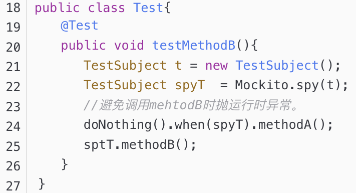
Dummy Object、Test Spy可归为Stub
Fake：伪对象（伪造、假货），反义词: real

Dummy：哑对象（仿制品、哑巴、傀儡）
对被测对象的模拟，特别是缺乏原有的特性或功能而实现欺骗性地替换（完全听命行事，不在具体测试里面起任何作用）
Double：测试替身，有相同的行为和响应
Spy：测试间谍，能够接收参数并返回值
几乎和产品代码做同样的工作（伪装成跟真的一样），但为了满足测试要求，更简单的实现

### Notes:
Fake Object是指一个假的，但完整的实现。如， InMemoryBlogDao，相对于 SqlBlogDao，它不真的访问数据库，但它是一个对 BlogDao 接口 的完整实现
但其实并不一样：用能，部分实行测试替代

Dummy：傀儡的意思非常贴切，也即和真的很像，但是没有自己的思想，完全听命行事，不在具体测试里面起任何作用
Double：替身的意思非常贴切，就像电影替身一样，替代真身，但要体现出相同的行为，可以有一定的自我意识和行为调整

测试桩(Stub) - 只是能返回帮助测试的值

测试间谍(Spy) - 目的是测试被测单元接收到的值，也能返回值。Test Spy里肯定是要增加取参数的函数，用于测试

仿制对象(Mock object) - 主要目的是测试函数调用、调用顺序。同时具备Stub， Spy功能。
Mock不是仿真器，但是一个Mock Case的确可以仿真在某一个特定场景下被测模块与其他模块的交互


> [!IMPORTANT]
> **测试替身 (Test Double) 分类与定义**：
> - **Dummy (哑对象)**：傀儡，不具备真实逻辑，在具体测试中仅用于填充参数列表以通过编译，不起实质作用。
> - **Stub (测试桩)**：硬编码返回预设的模拟数据，用于为被测单元提供所需的输入数据或外部依赖状态。
> - **Spy (测试间谍)**：拦截并记录真实的调用参数和次数，既能返回值，又能验证被测单元传出了什么数据。
> - **Fake (伪对象)**：具有真实业务逻辑的轻量级实现（如使用内存数据库 HSQLDB 代替真实数据库 MySQL），避免持久化等高成本操作。
> - **Mock (模拟对象)**：最强大的替身，核心关注**行为与交互验证**（如验证方法是否被调用、调用了多少次、调用顺序等）。

<!-- Slide number: 54 -->
# 伪对象
public Invoice MakePurchase(Customer customer,
         Product product, Discount discount)
{
    var purchase = purchaseFacade.CreatePurchase(customer);
    purchaseFacade.AddProduct(purchase, product);
    var invoice = purchaseFacade.CreateInvoice(purchase);

    if (discount != null)
    {
        invoice.ApplyDiscount(discount);
    }
    return invoice;
}
在某些情况下，插桩不够用。被桩对象替换掉的行为是被测对象所需要的。在这种情况下，伪对象（fake）可能是一种合理的折衷。伪对象是协作者的轻量级实现

### Notes:
CreatePurchase，AddProduct以及CreateInvoice都会导致数据以某种方式创建和持久化。将它们置于“外观模式”中的意图在于，模仿一些遗留下来的讨厌的持久化机制（persistence mechanism）。一旦与支付相关的所有数据被持久化，就可以随意使用折扣。ApplyDiscount方法基于数据库数据和提供的折扣刷新了发票对象，因此，它等价于一个查询操作。像这样的代码通常包含旧系统中的许多神奇功能，并且成为应用faking（伪造）的主要候选者。在本例中，puschaseFacade就是一个伪对象实现，它将会产生足够正确的发票，同时避免持久化操作和所有复杂的业务规则的实现，这些规则管控着这类实体的创建

<!-- Slide number: 55 -->
# Fake 示意图


round-trip test
Round-trip test
直接输入
Public interface
 “front door”
DOC：Depend-on Component
SUT：System Under Test

### Notes:
From Book: xUnit Test Pattern P.130

<!-- Slide number: 56 -->
# Fake 示例1


### Notes:
http://blog.testdouble.com/posts/2014-01-25-the-failures-of-intro-to-tdd.html

<!-- Slide number: 57 -->
# Fake 示例2
fake  object = enhanced stub


验证DAO ( Data Access Object)能正常工作，就构造fake object 代替数据库


HSQLD 是流行的 in-memory database
DBUnit

### Notes:

<!-- Slide number: 58 -->
# 模拟对象
模拟对象（Mock）在某种程度上是游戏的改变者，因为它们将测试的焦点从状态转换到行为。像fake会聚焦于状态的测试以断言(assertion)结束，该断言会核对返回值或以某种方式查询被测对象的状态（属性）。而基于行为的测试是完全不同的，能够验证模拟对象和被测代码或另一协作者之间特定的交互(interaction)行为，会关注被测对象是否被调用、调用了多少次以及是否查询了Value属性。

@Test
public void useLenientMock() {
    LenientMock campaignMock = new LenientMock();
    new PurchaseWorkflow(campaignMock)
            .addItem(getBookByTitle("Developer Testing"))
            .usingExistingCustomer(1234567)
            .enterDiscountCode("DEAL");
    campaignMock.verify();
}

### Notes:
模拟对象在某种程度上是游戏的改变者，因为它们将测试的焦点从状态(state)转换到行为(behavior)。聚焦于状态的测试以断言(assertion)结束，该断言会核对返回值或以某种方式查询被测对象的状态，它们的典型形式如下：

assertEquals(expectedValue, tested.computeSomething())

或者

Assert.AreEqual(expectedValue, tested.Value).

从根本上讲，基于行为的测试是完全不同的，其目的在于验证模拟对象和被测代码或另一协作者之间特定的交互(interaction)已经发生。上述的两个断言关注的是方法会返回什么、属性有哪些取值，而一个利用模拟对象的、基于行为的测试则关注tested.computeSomething是否被调用，可能还关注调用了多少次以及是否查询了Value属性。

<!-- Slide number: 59 -->
# Mock vs. Stub


59

### Notes:
From Book: xUnit Test Pattern P.120

<!-- Slide number: 60 -->
# Stub和mock小结
Stub最弱，只是参与测试，为了让测试跑起来
Dummy/Spy 强些，Test Spy 参与测试，还要验证产生的某种结果。Dummy是简单、原始的测试替身, 如Dummy server, 给它不同的输出会有不同的相应，但其内部没有实质计算，是接口或基类的衍生
Mock更强，要求如何参与，且比较灵活，视情况而定，其行为可能会像 Dummy 、Stub 或 Spy
够用就行，如果Stub够用，就不要用Mock

### Notes:
Test Stub 参与测试， 但你不在乎它是何时何地以何种方式参与测试的，它的存在是为了让测试跑起来


> [!IMPORTANT]
> **测试替身选用黄金法则**：
> - 基于行为的验证（Mock）通常比基于状态的验证（Stub）更加复杂和脆弱。
> - 在编写测试时，应遵循**够用就行**原则。如果使用 **Stub 能够满足数据输入和隔离的需要，就不要引入复杂的 Mock**。

<!-- Slide number: 61 -->
### 5.2.5 Mock 框架与 Mockito

# Mock 框架


JMock
EasyMock
Mockito
Moco （Java API、独立服务器）
61

### Notes:
http://www.infoq.com/cn/news/2013/07/zhengye-on-moco

<!-- Slide number: 62 -->
# EasyMock
通过简单的方法对于给定的接口生成 Mock 对象的类库。它提供对接口的模拟，能够通过录制、回放、检查来完成测试过程，可验证方法的调用种类、次数、顺序，可令 Mock 对象返回指定的值或抛出指定异常
IMocksControl control = EasyMock.createControl();
java.sql.Connection mockConnection = control.createMock(Connection.class);
java.sql.Statement mockStatement = control.createMock(Statement.class);
java.sql.ResultSet mockResultSet = control.createMock(ResultSet.class);
62

<!-- Slide number: 63 -->
# Mockito


设置依赖性


验证交互性操作

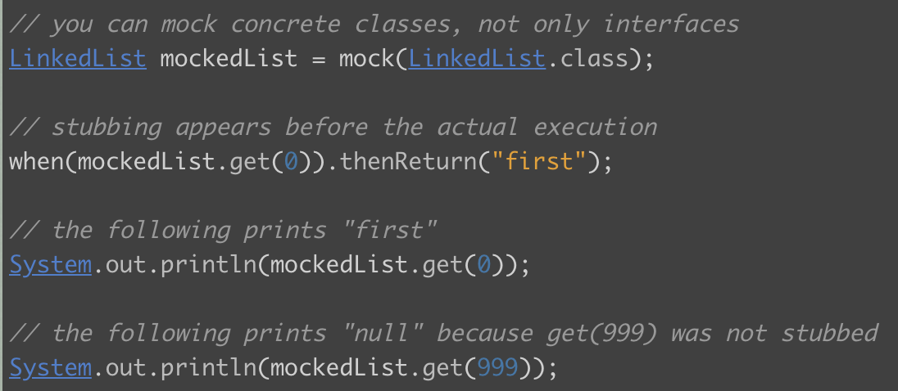
Stub方法调用
63

<!-- Slide number: 64 -->
# Mockito 主要功能
mock()/@Mock: 创建mock
可以通过Answer/MockSettings指定其行为方式
when()/given()来指定mock如何行动
如果提供的返回不符合需求，可以自己写一个返回接口的扩展。
spy()/@Spy：部分模拟，调用真实的方法，但仍然可以被验证
@InjectMocks：自动注入带有@Spy或@Mock注释的mocks/spies字段。
verify(): 检查方法是否用给定的参数调用。
可以使用灵活的参数匹配，例如，通过any()的任何表达式
或使用@Captor来捕获哪些参数被调用。

<!-- Slide number: 65 -->
# Annotation Type Mock


将一个字段标记为Mock
允许速记的Mock创建
尽量减少重复的Mock创建代码。
使测试类、验证错误更具可读性
自动检测MockedStatic类型的静态Mock

### Notes:
因为字段名被用来识别模拟
并推断出类型参数的静态模拟类型。
https://javadoc.io/doc/org.mockito/mockito-core/latest/org/mockito/Mock.html
https://javadoc.io/doc/org.mockito/mockito-core/latest/org/mockito/InjectMocks.html

<!-- Slide number: 66 -->
# 支持BDD


### Notes:
https://javadoc.io/doc/org.mockito/mockito-core/latest/org/mockito/BDDMockito.html

<!-- Slide number: 67 -->
### 5.2.6 测试覆盖率度量与 JaCoCo

测试覆盖率工具


<!-- Slide number: 68 -->
# 代码覆盖率分析工具
JaCoCo通过对编译后的Java class文件进行统计代码的插装，测试覆盖率的收集与报告。
BullseyeCoverage是一种获取C/C++的代码覆盖率的工具，支持分支覆盖率（Branch Coverage）的分析
Testwell CTC++, Parasoft Jtest/C++Test, CoverageMeter, Jcov, CodeCover, Coverage.py……

### Notes:
cobertura是jcoveage的分支;内部原理是通过ASM 在编译的时候代码插入. cobertura使用instrument修改编译后的class文件，在代码里面加入cobertura的统计代码,并生成一个.ser文件（用于覆盖率数据的输出）。
在使用instrument执行的过程中，Cobertura Instrumenter会首先调用分析监听器分析给定的编译好的.class，获得touchPoint（可以认为对应于源代码中的待覆盖行）以及需要的其他信息。
然后调用注入监听器将信息注入到新的.class中，保存到\target\generated-classes目录下。

<!-- Slide number: 69 -->
# 实现覆盖率度量：Jacoco
https://www.eclemma.org/jacoco/
覆盖率分析维度：指令、分支、行、方法、类、圈复杂度
基于java二进制码，无需源文件
基于on-the-fly instrumentation 的java agent的集成
框架：基于java VM的应用集成，如OSGI框架、web容器和EJB服务器
兼容所有的java class file版本、支持不同的JVM语言
多种报告形式：HTML、CSV、XML
远程协议和JMX控制可随时从覆盖率代理获取执行数据
ANT tasks/ Maven-plugin收集执行数据并创建覆盖率报告
69

### Notes:
基本语句块：没有if-else分支的代码区域
由JVM加载并初始化


> [!IMPORTANT]
> **JaCoCo 代码覆盖率度量要点**：
> - **度量维度**：包含指令 (Instructions)、分支 (Branches)、行 (Lines)、方法 (Methods)、类 (Classes) 及圈复杂度。
> - **插桩原理**：基于 Java 字节码，支持 `on-the-fly` 动态插桩（利用 Java Agent 在 JVM 加载类时动态修改字节码）与离线插桩，无需源文件。

<!-- Slide number: 70 -->
# on-the-fly instrumentation
//接受jvm參數

package org.jacoco.agent.rt.internal.PreMain

public static void premain(final String options, final Instrumentation inst)
      throws Exception {

   final AgentOptions agentOptions = new AgentOptions(options);

   final Agent agent = Agent.getInstance(agentOptions);

   final IRuntime runtime = createRuntime(inst);
   runtime.startup(agent.getData());
   inst.addTransformer(new CoverageTransformer(runtime, agentOptions,
         IExceptionLogger.SYSTEM_ERR));
}


70

<!-- Slide number: 71 -->
# on-the-fly instrumentation –续
//ASM 注入class method

public byte[] instrument(final ClassReader reader) {
   final ClassWriter writer = new ClassWriter(reader, 0) {
      @Override
      protected String getCommonSuperClass(final String type1,
            final String type2) {
         throw new IllegalStateException();
      }
   };
   final IProbeArrayStrategy strategy = ProbeArrayStrategyFactory
         .createFor(reader, accessorGenerator);
   final ClassVisitor visitor = new ClassProbesAdapter(
         new ClassInstrumenter(strategy, writer), true);
   reader.accept(visitor, ClassReader.EXPAND_FRAMES);
   return writer.toByteArray();
}


71

### Notes:
ASM 是一个 Java 字节码操控框架。它能被用来动态生成类或者增强既有类的功能。
ASM 可以直接产生二进制 class 文件，也可以在类被加载入 Java 虚拟机之前动态改变类行为。
Java class 被存储在严格格式定义的 .class 文件里，这些类文件拥有足够的元数据来解析类中的所有元素：类名称、方法、属性以及 Java 字节码（指令）。
ASM 从类文件中读入信息后，能够改变类行为，分析类信息，甚至能够根据用户要求生成新类。

<!-- Slide number: 72 -->
# on-the-fly instrumentation –续
//ASM回調方法，同时jacoco调用分析方法

Override
public final MethodVisitor visitMethod(final int access, final String name,
      final String desc, final String signature, final String[] exceptions) {
   final MethodProbesVisitor methodProbes;
   final MethodProbesVisitor mv = cv.visitMethod(access, name, desc,signature, exceptions);

   if (mv == null) {
         methodProbes = EMPTY_METHOD_PROBES_VISITOR;
   } else {
         methodProbes = mv;
   }

   return new MethodSanitizer(null, access, name, desc, signature,
         exceptions) {

 @Override
      public void visitEnd() {
         super.visitEnd();
         LabelFlowAnalyzer.markLabels(this);
         final MethodProbesAdapter probesAdapter = new MethodProbesAdapter(
               methodProbes, ClassProbesAdapter.this);
         if (trackFrames) {
            final AnalyzerAdapter analyzer = new AnalyzerAdapter(
                  ClassProbesAdapter.this.name, access, name, desc,
                  probesAdapter);
            probesAdapter.setAnalyzer(analyzer);
            methodProbes.accept(this, analyzer);   //注入数据分析
         } else {
            methodProbes.accept(this, probesAdapter);
         }
      }
   };
}
72

### Notes:
// Need to visit the method in any case, otherwise probe ids
// are not reproducible
重写是子类对父类的允许访问的方法的实现过程进行重新编写, 返回值和形参都不能改变。即外壳不变，核心重写！
重写的好处在于子类可以根据需要，定义特定于自己的行为。 也就是说子类能够根据需要实现父类的方法。

<!-- Slide number: 73 -->
# 示例

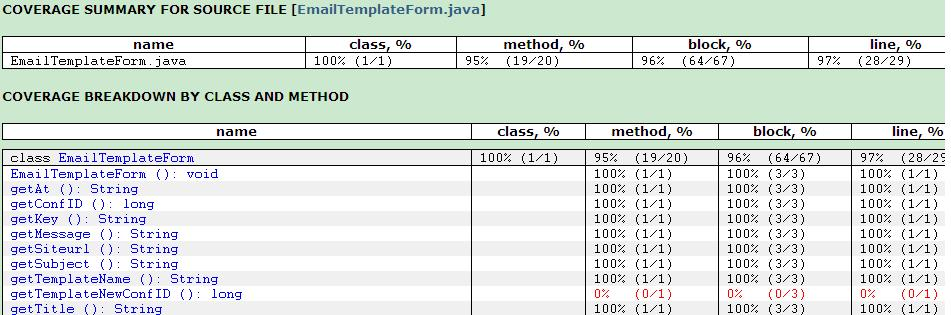


### Notes:

<!-- Slide number: 74 -->
# 代码覆盖率度量


EclEmma
EclEmma 是基于 JaCoCo 的 Eclipse 插件
74

### Notes:
作为一个容器来运行要度量的程序，监控程序的一举一动
修改.class文件，添加监控代码/修改字节码文件，让程序执行一段监控代码来达到效果。

<!-- Slide number: 75 -->
## 5.3 持续集成测试


# 5.3 持续集成测试

### Notes:
单体架构的集成测试
微服务架构的集成测试
持续集成及其测试
CI/CD流水线
容器技术与Docker
集群管理与Kubernetes
基础设施即代码（IaaC）
基础架构的自动部署
应用程序容器化及集群部署

<!-- Slide number: 76 -->
### 5.3.1 单体架构的集成测试

# 持续集成测试内容


单体架构的集成测试
微服务架构的集成测试
持续集成及其测试
CI/CD流水线

<!-- Slide number: 77 -->
# 单体架构的集成测试


自底向上


自顶向下


> [!IMPORTANT]
> **单体架构集成测试策略**：
> - **自顶向下集成 (Top-Down)**：从主控制模块开始逐步向下结合测试。需要编写大量的**桩程序 (Stub)** 来模拟下层未实现的模块。
> - **自底向上集成 (Bottom-Up)**：从最低层叶子模块开始逐步向上结合测试。需要编写大量的**驱动程序 (Driver)** 来模拟上层的调用。

<!-- Slide number: 78 -->
# 单体架构的集成测试 –混合策略


> [!TIP]
> **三明治集成测试 (Sandwich Integration)**：
> - **混合策略**：将自顶向下和自底向上策略结合起来。
> - **优势**：兼顾上层业务功能与底层基础组件的测试，折中了两者的开发工作量，减少了所需的桩程序与驱动程序的编写量。

<!-- Slide number: 79 -->
### 5.3.2 微服务架构的集成测试与契约测试

# 微服务架构


<!-- Slide number: 80 -->
# 微服务架构的集成测试


测试外部的通信以确认通信是否通畅，检查核心功能即可，有助于发现任何协议层次的错误，如丢失 HTTP 报头、SSL 使用错误，以及请求/响应不匹配等

数据库访问测试旨在确保微服务所使用的数据结构与数据库相符，以及检查 ORM 中 设置的映射关系、数据库访问模块能否妥善地处理网络出错等
ORM：Object Relational Mapping

### Notes:
https://blog.csdn.net/weixin_41918841/article/details/94440269

<!-- Slide number: 81 -->
# 微服务架构的集成测试 – 续
另一种观点：用契约测试或协议测试来做集成测试


消费者驱动的契约测试（Consumer Driven Contract Testing, CDC testing）
而契约规定的是接口的调用者（Consumer/消费者）和被调用者（Provider/提供者）之间约定的 Request 和 Response 数据交互格式
一份契约
从Consumer的需求出发设计测试用例并产生一份契约，然后验证provider端的功能

### Notes:


> [!TIP]
> **消费者驱动的契约测试 (Consumer Driven Contract Testing - CDC)**：
> - **定义**：由接口的调用方（Consumer）根据实际需求设计测试用例并产生一份契约（规定 Request 和 Response 的交互格式），然后用这份契约来验证被调用方（Provider）是否符合规范。
> - **核心优势**：将微服务集成测试降维解耦为本地的单元/接口测试，实现离线验证，把联调成本降到最低。

<!-- Slide number: 82 -->
# 契约测试及其优势、工具
降低服务集成的难度，将其分解为单元测试和接口测试
团队能以一种离线的方式完成验证，并将联调的成本几乎降到零
基于契约让接口的变更有迹可循
常用的CDT框架 Janus、Pact、Pacto和Spring Cloud Contract


### Notes:

<!-- Slide number: 83 -->
# 示例：CDC测试框架


https://docs.pact.io/

### Notes:
https://arquillian.org/guides/getting_started_zh_cn/#%E7%BC%96%E5%86%99_arquillian_%E6%B5%8B%E8%AF%95
https://cloud.tencent.com/developer/article/1082275

<!-- Slide number: 84 -->
# Consumer 测试
Stub server


<!-- Slide number: 85 -->
# Provider 测试
Contract verifier tests


Auto- generate
Call API


Contract.groovy
https://github.com/pact-foundation/pact-provider-verifier/

<!-- Slide number: 86 -->
# 示例


Client side：service concumer


Server side：service provider

<!-- Slide number: 87 -->
# 如何获取接口信息


Swagger 生成的动态接口文档示例

### Notes:

<!-- Slide number: 88 -->
# 利用 Mock 技术解除微服务之间的依赖


微服务B

Mock
Service B
API Test

微服务A
（SUT）

Mock
Service C

微服务C
Mock 请求和响应信息示例

### Notes:

<!-- Slide number: 89 -->
### 5.3.3 CI/CD 流水线与持续测试

CI/CD与持续测试

<!-- Slide number: 90 -->
# CI/CD 流水线

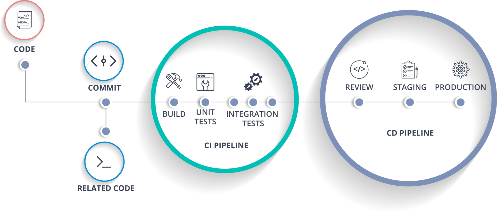

<!-- Slide number: 91 -->
# CD倒逼持续测试

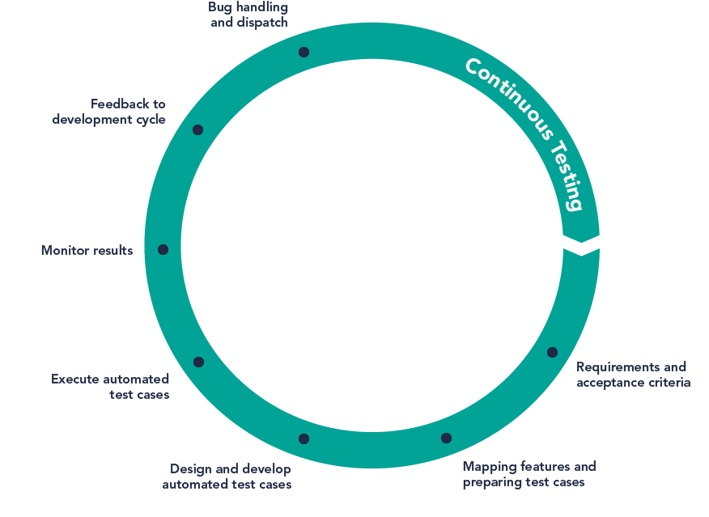

持续交付

持续测试

持续部署

持续构建

持续集成

<!-- Slide number: 92 -->
# CI/CD 流水线


<!-- Slide number: 93 -->
# 示例：Amazon CI/CD


<!-- Slide number: 94 -->
CI/CD 流水线

编译结果预推送
代码跨数据
中心同步

静态扫描

测试
编译

安全扫描

单元测试


自动化测试

代码提交

定时触发

事件触发
人工触发

排队限流

动态扩容

部署STG
质量门禁
发布

灰度环境

生产环境

制品预推送

Sonar增量扫描

<!-- Slide number: 95 -->
# 持续测试的特点
与CI/CD集成
足够快
准确且有效
平滑有序
打通整个测试过程：测试左移到测试右移、单元测试到系统测试、静态测试到动态测试
与研发的持续构建、持续集成、持续部署、运维等环境的集成
整个测试过程要快，一方面高度自动化测试，另方面业务端到端的探索式测试
被测系统往往很复杂，不可能做全回归测试，而是要推行精准测试


> [!IMPORTANT]
> **持续测试 (Continuous Testing) 核心特征**：
> - 与 CI/CD 流水线深度集成，贯穿持续构建、集成、部署、运维的每个环节。
> - 测试前移（左移到静态和开发自测）与后移（右移到线上监控和探索式测试）打通。
> - 高度自动化与精准测试结合，对复杂系统进行选择性、针对性回归，保证反馈极其快速。

<!-- Slide number: 96 -->
# 持续测试实践框架


扫码下载
《持续测试白皮书》

<!-- Slide number: 97 -->
## 5.4 本章总结与实验

### 5.4.1 本章小结

# 本章小结
深刻理解代码规范和代码评审的价值，持续进行代码评审，采用互为评审、集体评审，团队有多方面的收益
代码分析工具的使用，今天很流行，包括开发本地扫描代码、与CI/CD流水线集成等。
深刻理解单元测试（UT）的价值和xUnit框架实现的机制，重视单元测试，掌握JUnit这类工具和mock工具的使用技巧
单元测试是否充分，需要衡量代码语句/分支覆盖率，一般会使用覆盖率工具进行自动分析
今天提倡持续测试，以促进持续交付；契约测试值得关注，从开发自测开始，比较彻底保证质量

<!-- Slide number: 98 -->
### 5.4.2 实验2：单元测试

实验2 ：单元测试
使用JUnit工具，针对Spring Unit Testing控制器代码中ItemController类进行测试，编写对应的测试类以完成单元测试，最终提交测试代码。


### Notes:

<!-- Slide number: 99 -->
### 5.4.3 学习资源推荐

学习资源推荐

《程序开发人员测试指南：构建高质量的软件》，人民邮电出版社，2018.5
《敏捷测试》，人民邮电出版社，2021.8
《 Java微服务测试》， 电子工业出版社，2019.7
https://junit.org/junit5/
https://docs.pact.io/

<!-- Slide number: 100 -->
# 感 谢 聆 听
朱少民 / 同济大学

### Notes:
每课结束时使用“以上是本节课的内容”“这一章讲到这里”


## 期末重点考点与概念提炼

### 核心术语
1. **代码静态测试 (Static Code Testing)**: 指在不实际运行程序的情况下，通过人工审查（如代码评审、互查）或自动分析工具对源代码进行静态分析，查找语法错误、风格违规、结构缺陷与潜在安全隐患的测试方法。
2. **代码评审 (Code Review)**: 团队成员之间相互检查源代码，以改善代码质量、跨团队共享知识、遵守代码规范并减少项目缺陷代价的协同质量保证活动。
3. **圈复杂度 (Cyclomatic Complexity)**: 衡量代码控制流复杂程度的软件度量指标，公式为 $V(G) = e - n + 2p$（其中 $e$ 为边数，$n$ 为节点数，$p$ 为连接组件数）。
4. **SCA (Software Composition Analysis - 软件成分分析)**: 针对软件所引用的第三方开源组件、框架与依赖包进行安全漏洞（CVE标准）及合规性检测的技术工具。
5. **SAST (Static Application Security Testing - 静态应用安全测试)**: 在不运行代码的前提下，分析自编源代码中的潜在安全风险、漏洞（CWE标准）和编码缺陷的技术工具。
6. **单元测试 (Unit Testing)**: 对软件中的最小可测试单元（如类、函数、方法）进行检查和验证的测试阶段，目的是确保每个独立单元的逻辑和功能均能正确实现。
7. **驱动程序 (Driver)**: 在单元测试中，用于模拟被测模块的上级调用模块。它负责接收测试数据、传参给被测模块并输出验证结果。
8. **桩程序 (Stub)**: 在单元测试中，用于模拟被测模块调用的下级或邻级依赖模块。它接收调用并返回预设的模拟数据以确保被测模块的测试顺利运行。
9. **测试替身 (Test Double)**: 测试中用于替代真实外部依赖组件的对象的泛称，包括 Dummy（哑对象）、Stub（桩）、Spy（间谍）、Fake（伪对象）和 Mock（模拟对象）。
10. **Mock (模拟对象)**: 一种专注于**行为与交互验证**的测试替身，能够验证被测对象是否按预期方式（如调用次数、调用顺序）调用了协协作对象的特定方法。
11. **代码覆盖率 (Code Coverage)**: 度量测试用例集执行时对被测程序代码覆盖程度的指标，包括指令、分支、行、方法、类及圈复杂度覆盖率。
12. **消费者驱动的契约测试 (Consumer Driven Contract Testing - CDCT)**: 一种微服务集成测试方法，由服务调用方（消费者）编写期望的请求和响应契约，提供方必须满足该契约要求，用以实现微服务接口的解耦离线测试。
13. **持续测试 (Continuous Testing)**: 深度集成于 CI/CD 流水线中，贯穿开发、集成、部署到运维各阶段，通过高度自动化和精准测试手段，实现即时、持续反馈软件质量的实践活动。

---

### 期末考点提炼
#### 一、简答题与核心概念对比
1. **简述代码评审与互查的优秀实践指标。**
   - **单次检查量**：每次评审的代码行数控制在 **200～400 行** LOC 之间。
   - **检查速度**：保持在 **300～500 LOC/小时** 左右。
   - **时间控制**：单次评审会议不宜超过 **60～90 分钟**。
   - **辅助策略**：作者在复审前应先行自查并写好关键注释；评审双方必须基于检查表（Checklist）进行指导；必须对修复缺陷进行二次回归验证。

2. **简述 SAST 与 SCA 工具的技术异同与应用场景。**
   - **SAST (静态应用安全测试)**：主要针对**自编代码**（约占代码量 20%），核心关注代码中的逻辑漏洞与质量问题。采用 **CWE 标准**检测未知漏洞，检测耗时一般为几秒到几分钟。
   - **SCA (软件成分分析)**：主要针对**开源框架与外部第三方库**（约占代码量 80%），核心关注第三方组件的依赖安全性。采用 **CVE 标准**匹配已知漏洞与许可证合规性。

3. **对比分析单元测试中“驱动程序 (Driver)”与“桩程序 (Stub)”的作用。**
   - **相同点**：都是用于隔离被测单元、提供受控测试环境的测试辅助程序。
   - **不同点**：
     - **驱动程序**模拟的是被测单元的**上级调用者**，负责驱动测试、传递测试用例数据给被测单元，并断言其输出是否符合期望。
     - **桩程序**模拟的是被测单元的**下级或邻级被调用者**，负责接收被测单元发送过来的调用，并反馈预设的模拟数据以让测试执行流能够走下去。
   - **集成测试应用**：**自顶向下 (Top-Down)** 集成测试主要需要编写**桩程序**；**自底向上 (Bottom-Up)** 集成测试主要需要编写**驱动程序**。

4. **请梳理 Dummy、Stub、Spy、Fake、Mock 五种测试替身的演进与选用策略。**
   - **Dummy (哑对象)**：仅用于填充参数列表，没有任何逻辑或返回值，纯粹用来通过编译。
   - **Stub (测试桩)**：能够对调用进行硬编码返回特定的测试数据，提供状态支持。
   - **Spy (测试间谍)**：在具备 Stub 能力的基础上，能够记录方法被调用的参数、频次等，供断言检查。
   - **Fake (伪对象)**：具有轻量化的真实业务逻辑实现（如内存数据库 HSQLDB），不进行复杂的持久化。
   - **Mock (模拟对象)**：主要基于行为的验证，检查被测对象是否对依赖项进行了符合预期的调用，兼顾 Stub 和 Spy 的能力。
   - **选用策略**：行为验证比状态验证开销更大且更脆弱。遵循“**够用就行**”黄金法则，如果 Stub 足够完成隔离和数据输入验证，则优先选择 Stub，避免过度设计 Mock。

5. **简述微服务架构下消费者驱动的契约测试 (CDC) 及其核心优势。**
   - **核心定义**：由服务消费者设计接口用例并定义请求（Request）和期望响应（Response）规范形成契约，利用契约生成工具校验服务提供者的接口一致性。
   - **优势**：
     - 将庞杂的多服务集成测试解耦为两端（Consumer端、Provider端）的本地单元/接口测试。
     - 实现团队间的离线独立验证，把昂贵的集成联调成本几乎降到零。
     - 接口的修改有契约版本记录，使得接口变更可追溯、安全。

#### 二、综合设计与分析题
1. **测试用例与缺陷定位分析**
   - **题目**：现有加法计算器代码如下：
     ```java
     public class Calculator {
         public int add(int num1, int num2) {
             if (num1 >= 0 && num2 > 0) {
                 return num1 + num2;
             } else {
                 return 0;
             }
         }
     }
     ```
     如果预期目标是“**实现两个正整数或零的加法，如果其中有1个数小于或等于0，则返回0**”。
     1) 请指出该段代码中隐藏的 Bug 及其原因。
     2) 请给出至少一组测试用例数据，要求能检测出该缺陷并使该用例测试失败。
   - **解答**：
     1) **Bug 所在与原因**：判定条件 `num2 > 0` 存在缺陷。按预期目标，`num2` 应该是“正整数或零”（即 $num2 \ge 0$），而代码中使用了严格大于 $0$ 的限制，导致当 `num2 == 0` 且 `num1 >= 0` 时，本应返回 $num1 + 0$ 的计算结果，程序却因未满足条件走入 `else` 分支返回了 $0$。
     2) **测试用例设计**：
        - 输入数据：`num1 = 5`, `num2 = 0`
        - 预期输出：`5` (因为 5 和 0 均不小于等于 0，预期执行 $5 + 0 = 5$)
        - 实际输出：`0` (由于程序判定条件 `num2 > 0` 为假，走入 `else` 分支返回了 0)
        - 结果分析：预期输出与实际输出不一致，测试用例执行失败，成功暴露并捕捉到了该缺陷。
