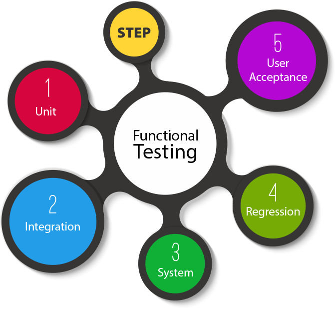
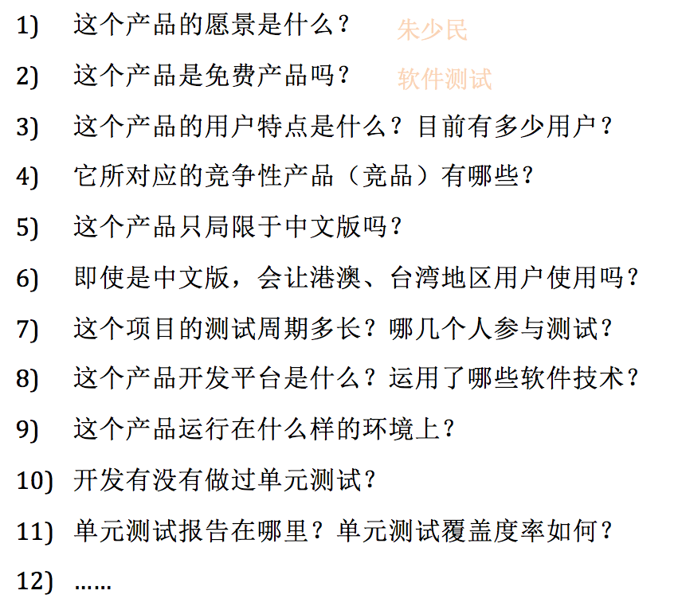
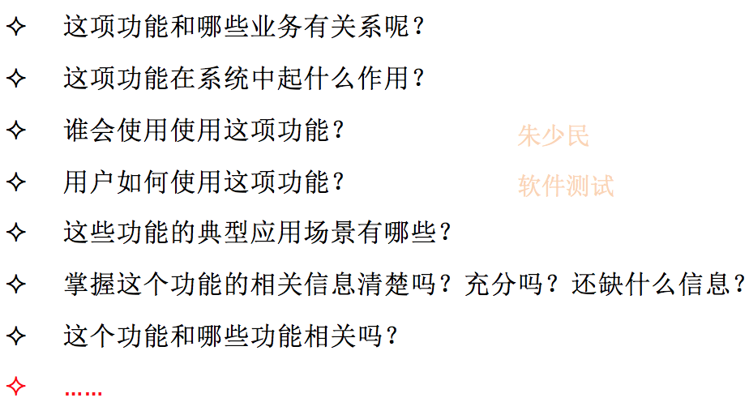
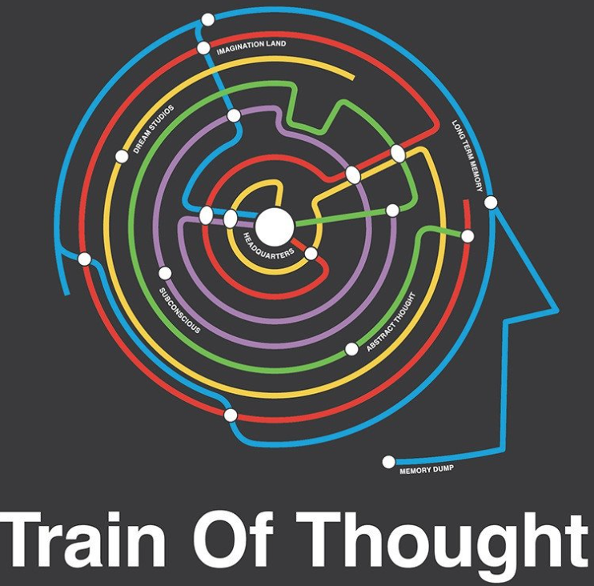
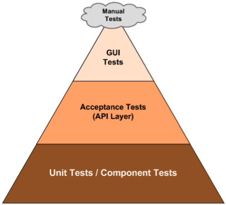
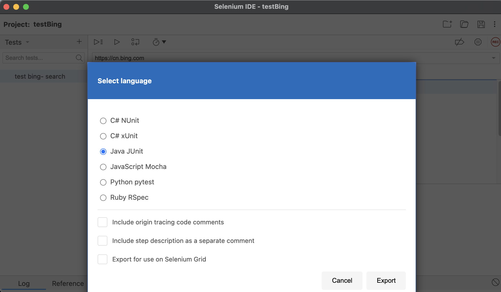
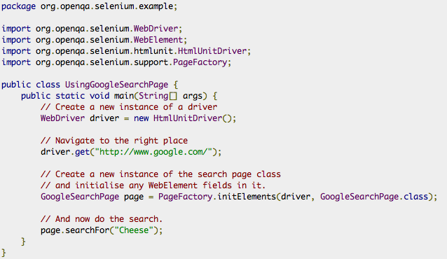
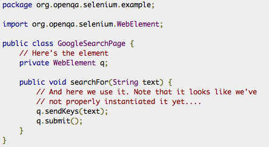
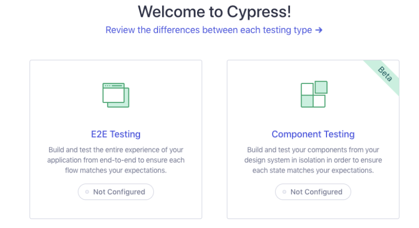

<!-- Slide number: 1 -->


# 第6章 系统功能测试
同济大学 朱少民
版权所有©️ 仅限于教学使用

---

<!-- Slide number: 2 -->
## 本章学习要点
- **6.1 功能测试方法与过程**
- **6.2 功能测试自动化**
- **6.3 回归测试**
- **6.4 精准测试**

> [!NOTE]
> **重难点小结**
> - 测试需求分析、探索式测试、SBTM、自动化测试脚本开发与维护
> 
> **课后实践练习**
> - 基于Selenium的系统功能测试实验
> - 部署自动化测试框架

---

<!-- Slide number: 3 -->

## 6.1 功能测试方法与过程

> [!NOTE]
> **Notes**:
> - 列写本课时的学习要点，依次开始深入讲解。
> - 如有学习要求，请列写在课时要点之后。
> - 在保持内容版式整洁的前提下，重点的学习内容，请尽量详细的列写在讲义中，让大家在单独看讲义时也可以学习。
> - 讲义非语音讲解辅助，而是学习的一个主体。
> 
> **学习要点结构**：
> - **概念**：学习要点的概念介绍，以及在工作中什么场景会用到
> - **讲解**：工作中胜任这个能力，需要掌握的知识、技术能详细讲解
> - **举例**：举一个案例或demo 帮助大家更好理解要学习的内容，以及知道怎么用
> - **分享经验**：你对这个学习要点的工作应用心得。特别是理论和实际的差异的部分。
> - **学习建议**：给出一些相关学习或工作场景中使用的建议
> - **实用工具**：这个学习要点对应的一些工具模板（如果有）

---

<!-- Slide number: 4 -->
### 功能测试方法与应用
本节主要内容包括：
- 功能测试要求和基本思路
- 测试需求分析方法
- 探索式测试及其测试实践
- SBTM
- 回归测试及其策略
- 精准测试



> [!NOTE]
> 十、功能测试方法与过程
> 功能测试要求和基本思路
> 测试需求分析方法
> 探索式测试及其测试实践
> SBTM
> 回归测试及其策略
> 精准测试

---

<!-- Slide number: 5 -->
### 系统功能测试究竟测什么？
系统功能测试应从以下七大维度进行分析和覆盖：
- 功能（Function）
- 逻辑（Logic）
- 接口（API）
- 界面（UI）
- 数据（Data）
- 操作（Operation）
- 平台（Platform


> [!IMPORTANT]
> **功能测试的七个维度 (核心考点)**
> 系统功能测试不能仅仅停留在界面的操作上，必须覆盖这七个方面（功能、逻辑、接口、界面、数据、操作、平台），在实际设计用例时应作为一个全面检查的检查单（Checklist）。

---

<!-- Slide number: 6 -->
### 系统功能测试应该考虑哪些问题？





> [!NOTE]
> 十、功能测试方法与过程
> 功能测试要求和基本思路
> 测试需求分析方法
> 探索式测试及其测试实践
> SBTM
> 回归测试及其策略
> 精准测试

---

<!-- Slide number: 7 -->
### 系统功能测试的基本思路




> [!NOTE]
> 十、功能测试方法与过程
> 功能测试要求和基本思路
> 测试需求分析方法
> 探索式测试及其测试实践
> SBTM
> 回归测试及其策略
> 精准测试

---

<!-- Slide number: 8 -->
### 系统功能测试的基本思路（续）


# 系统功能测试的基本思路

> [!NOTE]
> 十、功能测试方法与过程
> 功能测试要求和基本思路
> 测试需求分析方法
> 探索式测试及其测试实践
> SBTM
> 回归测试及其策略
> 精准测试

---

<!-- Slide number: 9 -->
### 面向接口的功能测试


---

<!-- Slide number: 10 -->
### HTTP协议
HTTP协议的请求与响应格式如下：
- ＜request-line＞ ＜headers＞ ＜blank line＞ [＜request-body＞
请求
- ＜status-line＞ ＜headers＞ ＜blank line＞ [＜response-body＞]
响应

参考规范：https://www.w3.org/Protocols/


---

<!-- Slide number: 11 -->
### Webservice 接口
- WebService是一个不依赖于语言、平台的SOA的架构，可以实现基于Http协议、不同语言（通过 xml 描述）间的相互调用、网络应用间的交互。
- Soap(Simple Object Access Protocol)，XML Web Service 的通信协议（调用方法的规范），支持不同的底层接口，如HTTP(S)、SMTP
- WSDL(Web Services Description Language) ， XML 文档——用于说明一组 SOAP 消息以及如何交换这些消息
- UDDI (Universal Description, Discovery, and Integration) 根据描述文档来引导系统查找相应服务的机制。UDDI利用SOAP消息机制（标准的XML/HTTP）来发布、编辑、浏览以及查找注册信息。采用XML格式来封装各种不同类型的数据，发送到注册中心或者由注册中心返回所需数据

> [!TIP]
> **WebService核心组件定义**
> SOAP 规定了通信格式规范；WSDL 负责接口内容契约说明；UDDI 则是注册与查找服务的机制。这三者共同构成了经典的传统 WebService 接口测试 and 交互基石。

---

<!-- Slide number: 12 -->
### 面向 UI 的功能测试
面向 UI 层的测试主要通过以下途径开展：
- 重点测试功能逻辑，按功能、子功能、功能点等层次展开测试
- 基于输入域和组合测试等方法（见第3章）进行输入的设计，驱动测试，并观察输出
- 扮演用户角色，从应用场景来遍历用户使用产品的主要操作路径
- 针对不同设置进行测试
- 用户界面测试


---

<!-- Slide number: 13 -->

## 6.2 功能测试自动化

> [!NOTE]
> 十一、功能测试自动化
> 面向接口的自动化测试
> Web客户端的UI自动化测试
> 基于Cypress的UI自动化测试
> Android应用的UI自动化测试
> 数据驱动/关键字驱动
> 自动化测试框架

---

<!-- Slide number: 14 -->
### 功能测试自动化主要内容
- 面向接口的自动化测试
- Web客户端的UI自动化测试
- 基于Cypress的UI自动化测试
- Android应用的UI自动化测试
- iOS 和 Appium 内容，可以在第9章进行讨论
或让学生参考教材6.2.5和6.2.6 小节在课外实践、自主学习


---

<!-- Slide number: 15 -->
### 分层自动化测试
分层测试能够优化测试资源的分配，提高自动化测试的性价比：
- 单元测试更容易实现自动化测试，RoI也更高（收益显著）
- API自动化测试也基本能做到100%
- 适当加强手工端到端测试（业务层）
- 概括起来：以底层测试、接口测试、功能逻辑测试等为主，尽量避免UI测试



| 测试层级 | 主要优势 |
| :--- | :--- |
| **底层/接口测试等** | 缺陷更易定位、效率更高 |
| **UI/端到端测试等** | 更加接近业务、反映真实需求 |

> [!IMPORTANT]
> **测试自动化金字塔 (Test Automation Pyramid)**
> 自动化测试策略应遵循“金字塔”分布：底层单元测试数量最多，中间层接口测试次之，顶层UI测试数量最少。因为越往底层，测试运行速度越快、维护成本越低、缺陷定位越精准，ROI 较高。

---

<!-- Slide number: 16 -->
### API自动化测试

---

<!-- Slide number: 17 -->
### API 的 TA (测试自动化) 架构
API 自动化测试的架构设计包含以下维度：

| 维度 | 主要内容与构成 |
| :--- | :--- |
| **回归 (Regression)** | 定时回归、即时触发、事件触发、按需回归 (触发回归 ➔ 执行 ➔ 结果展示) |
| **用例 (Use Case)** | 场景设定、选择和组装API (手工组装、HAR 批量生成、代码迁移) ➔ 基于场景 of 测试用例 |
| **API 来源** | 文档化工具、手工录入、程序扫描、HAR 导入 |
| **API 定义** | RAML、Swagger、Markdown |

> [!TIP]
> - **RAML (RESTful API Modeling Language)**：RESTful API描述性语言。
> - **HAR (HTTP Archive)**：基于JSON、储存HTTP请求/响应信息的文件格式。

---

<!-- Slide number: 18 -->
### API 测试流程与动态测试
API 自动化测试流程如下：


API的接入步骤-批量生成
脚本的修改
过滤与保存
HAR文件

动态测试
Thrift
Thrift code_gen
Dynamic Class
Loading
Dynamic Call Method

---

<!-- Slide number: 19 -->
### Swagger UI 测试示例


---

<!-- Slide number: 20 -->
### API 测试示例


---

<!-- Slide number: 21 -->
### 基于 API 的 TA (测试自动化) 工具


---

<!-- Slide number: 22 -->
### 基于 API 的 TA 工具（续）
常见的接口测试与 Mock 工具：
- **Mockbin**：可从HAR文件生成一个模拟桩
- **RAP**：淘宝开发的API管理工具
- **Swagger**：流行的API定义工具、规范
- **Easy Mock**：从swagger生成数据
- **Doclever**：编写REST接口文档，生成测试数据
- **Mocky**：无需登录，直接生成response
- **kristofa/mock-http-server**
- **wiremock**
- **SoapUI**
- **Rest-Assured**
- **SOAtest**
- **APIfortress**

---

<!-- Slide number: 23 -->
### Rest-Assured 接口测试利器
- **官方网站**：http://rest-assured.io/
- **项目仓库**：https://github.com/rest-assured/rest-assured
- **定义**：REST-assured 是一个用于测试和验证RESTful服务的Java DSL, 使得为基于HTTP的RESTful服务编写测试变得更加简单

#### 接口响应数据示例 (JSON)
请求的 URL：`http://localhost:8080/lotto/{id}`
```json
{ "lotto":
   { "lottoId":5,
"winning-numbers":[2,45,34,23,7,5,3], "winners":[
{
"winnerId":23, "numbers":[2,45,34,23,3,5]
},
{
"winnerId":54, "numbers":[52,3,12,11,18,22]
}
]
}
}
```

#### Rest-Assured 测试代码示例
```java
@Test public void lotto_resource_returns_200_with_expected_id_and_winners()
 {
when().
get("/lotto/{id}", 5).
then().
statusCode(200).
body("lotto.lottoId", equalTo(5),
"lotto.winners.winnerId", hasItems(23, 54));
}
```

---

<!-- Slide number: 24 -->
### Rest-Assured 参数化
Rest-Assured 提供了直观的参数化传递方法：

- **传递常规查询参数**：
  ```java
  given().
  param("param1", "value1").
  param("param2", "value2").
  when().
  get("/something");
  ```

- **区分表单参数 (Form Param) 与查询参数 (Query Param)**：
  ```java
  given().
  formParam(“formParamName”, “value1”). queryParam(“queryParamName”, “value2”).
  when().
        post(“/something”);
  ```

- **直接在 GET 请求中通过 Query String 传参**：
  ```java
  ..when().get("/name?firstName=John&lastName=Doe");
  ```

---

<!-- Slide number: 25 -->
### Rest-Assured + JUnit 的集成


---

<!-- Slide number: 26 -->
### REST API 测试实践示例


---

<!-- Slide number: 27 -->
### UI 自动化测试
Web客户端 of UI自动化测试
基于Cypress的UI自动化测试
Android应用的UI自动化测试

---

<!-- Slide number: 28 -->
### Web UI 的自动化测试 - Selenium IDE
Selenium IDE 是一款启动 Chrome 的插件，提供录制和回放功能。
- **设定参数**：
  - Project name
  - Base URL


> [!NOTE]
> ，有时绕不过去，有时无需绕过去

---

<!-- Slide number: 29 -->
### Web UI 的自动化测试 - 续


> [!NOTE]
> ，有时绕不过去，有时无需绕过去

---

<!-- Slide number: 30 -->
### Selenium 支持不同脚本语言
录制的测试脚本可以导出为多种不同的编程语言并在不同的测试环境中执行。




---

<!-- Slide number: 31 -->
### Selenium + WebDriver


---

<!-- Slide number: 32 -->
### WebDriver 架构
WebDriver 提供了直接与浏览器引擎交互的 API，避免了 JS 沙箱的限制。


---

<!-- Slide number: 33 -->
### UI Object
UI Object 是对页面上各控件 and DOM 元素的抽象封装。


---

<!-- Slide number: 34 -->
### Page Objects (页面对象模式)
- **官网介绍**：http://code.google.com/p/selenium/wiki/PageObjects
- **博客参考**：http://blog.activelylazy.co.uk/2011/07/09/page-objects-in-selenium-2-0/


> [!TIP]
> **Tests with Page Objects**
> The page object encapsulates all the logic about how to perform certain actions. Our test now only needs to deal with what to actually do – so what does our test look like now?
> ```java
> AmazonHomePage homePage = AmazonHomePage.navigateTo(driver);
> AmazonSearchResultsPage resultsPage =
>     homePage.searchFor("iain banks");
> assertThat(resultsPage.getTopResultTitle(), is("Transition"));
> ```
> This is a pretty neat specification for our test: given a user on the amazon home page, when the user searches for ‘iain banks’, then the title of the top result is ‘Transition’.
> There’s no implementation details in our test now. If any of the implementation details around searching change – we only need to change our page object.

---

<!-- Slide number: 35 -->
### PageFactory
- **官网介绍**：http://code.google.com/p/selenium/wiki/PageFactory





> [!NOTE]
> In order to support the PageObject pattern, WebDriver's support library contains a factory class.

---

<!-- Slide number: 36 -->
### 基于 Cypress 的 UI 自动化测试
Cypress 专注于更高效、可靠的 Web 测试。


官方地址：https://www.cypress.io/

---

<!-- Slide number: 37 -->
### Cypress 架构
Cypress 直接在浏览器同一个进程的生命周期中运行，消除了网络通信带来的延迟 and 不稳定性。


---

<!-- Slide number: 38 -->
### 安装 and 使用简单

#### 安装步骤
```bash
cd /your/project/path
npm install cypress --save-dev
```

#### 打开测试界面
```bash
npx cypress open
```

- **视频安装指南**：https://docs.cypress.io/_nuxt/videos/installing-cli.3465fe6.mp4
- **官方指南**：https://docs.cypress.io/guides




---

<!-- Slide number: 39 -->
### Cypress 脚本


---

<!-- Slide number: 40 -->
### Cypress 执行


---

<!-- Slide number: 41 -->
### Android App UI 自动化测试工具
在 Android 平台上，常见的自动化测试工具有：
- Robotium （native/web)
- UIAutomator
- MonkeyRunner （Android SDK tool）
- Appium
- Espresso
- Selendroid （native）
- ATAF
- TestComplete


---

<!-- Slide number: 42 -->
### 两种基本的移动端自动化测试机制


> [!IMPORTANT]
> **移动端两大自动化测试机制的本质区别 (考试重难点)**
> 1. **基于 UIAutomator 框架 (如 Appium)**：
>    - Appium是基于UIAutomator框架实现的。Appium测试进程与目标应用进程是分开的，所以不能直接访问目标应用元素属性进行操作，只能模拟触发事件对目标应用进行操作
> 2. **基于 Instrumentation 框架 (如 Robotium, Espresso, Selendroid)**：
>    - Robotium、Espresso、Seledroid是基于Instrumentation框架的，其测试进程与目标应用是在同一个进程中作为两个不同的线程运行的

> [!NOTE]
> **Appium 机制细化**：Appium是基于UIAutomator框架实现的。Appium测试进程与目标应用进程是分开的，所以Appium不能直接访问目标应用的各种element属性进行copy&paste，而只能模拟触发相应的事件对目标应用进行操作。这就好比触摸屏监控驱动和目标应用的关系：驱动监控到用户点击屏幕的事件后，驱动就会去判断点击的位置是否是一个文本框，如果是的话，就去打开系统键盘给用户进行输入。
> **Robotium 机制细化**：Robotium是基于Instrumentation框架的。Robotium测试进程与目标应用是在同一个进程中作为两个不同的线程运行的。也就是说Robotium测试线程是有办法直接访问目标应用的各种element属性的，可以访问浮层，Intent之类的。所以它根本不需要触发任何事件，直接就可以在内部修改相应的数据

---

<!-- Slide number: 43 -->
### 几款常见的测试工具比较


> [!NOTE]
> Appium是基于UIAutomator框架实现的。Appium测试进程与目标应用进程是分开的，所以Appium不能直接访问目标应用的各种element属性进行copy&paste，而只能模拟触发相应的事件对目标应用进行操作。这就好比触摸屏监控驱动和目标应用的关系：驱动监控到用户点击屏幕的事件后，驱动就会去判断点击的位置是否是一个文本框，如果是的话，就去打开系统键盘给用户进行输入。
> 　　Robotium是基于Instrumentation框架的。Robotium测试进程与目标应用是在同一个进程中作为两个不同的线程运行的。也就是说Robotium测试线程是有办法直接访问目标应用的各种element属性的，可以访问浮层，Intent之类的。所以它根本不需要触发任何事件，直接就可以在内部修改相应的数据

---

<!-- Slide number: 44 -->
### Instrumentation 框架
- 以通过从签名来实现让系统认为测试App和被测App是同一个进程
- myAppTests.apk通过Instrumentation 技术控制被测myApp.apk
- myAppTests.apk文件是由InstrumentationTestRunner 进行控制各种方法运行


---

<!-- Slide number: 45 -->
### InstrumentationTestRunner
编写 TestCases，对软件包中的类进行单元/功能/性能测试。一般来说，这些都是从下列类继承而来 :
- ActivityInstrumentationTestCase2、ActivityUnitTestCase
- AndroidTestCase 、ApplicationTestCase
- InstrumentationTestCase
- ProviderTestCase、ServiceTestCase
- SingleLaunchActivityTestCase

> [!IMPORTANT]
> **InstrumentationTestRunner 的命令行执行 (期末必考)**
> 1. 在测试包的清单中设置 `<instrumentation>` 元素的 `android:targetPackage` 属性，将该属性值设置为AUT的包名
> 2. 使用 "adb shell am instrument -w "运行instrumentation ，没有可选参数，以运行所有测试（除了性能测试）
> 3. 参数为'-e func true'，运行所有功能测试。这些是源自  InstrumentationTestCase的测试
> 4. 参数'-e unit true'运行所有单元测试。这些是不从 I InstrumentationTestCase派生的测试（不是性能测试）
> 5. 参数'-e class'设置为运行单个TestCase
> *AUT：App under test*
> 官方参考：https://developer.android.com/reference/android/test/InstrumentationTestRunner

---

<!-- Slide number: 46 -->
### 示例1：Monkeyrunner
- **定义**：基于 Python 脚本实现复杂测试用例的 UI 测试工具。
- **机制**：通过坐标、控件 ID 来操作应用的 UI 元素，截取测试执行的 UI 界面，进行图像比较分析来发现问题。
- **基本构成**：
  - InstrumentationTestRunner 是针对被测 app 而运行测试脚本的执行器
  - Test tools：即与 Eclipse IDE 集成的、构建测试的 SDK tools
  - MonkeyRunner: 提供 API 开发测试脚本，以便能在 Android 代码之外来控制设备
  - Test package被组织在测试项目中，遵守命名空间
  - Test case classes

---

<!-- Slide number: 47 -->
### 示例1：Monkeyrunner - 续
monkeyrunner API 可以跨多个设备或模拟器应用一个或多个测试套件，可以基于API和python开发一整套自动化系统。
核心 API 类：
1. **MonkeyRunner**：此class提供了用于将 monkeyrunner 连接到设备或模拟器的方法，也提供了用于为 monkeyrunner 程序创建界面以及显示内置帮助的方法。
2. **MonkeyDevice**：代表设备或模拟器，提供了用于安装 and 卸载软件包、启动 Activity 以及向应用发送键盘或轻触事件的方法、运行测试软件包。
3. **MonkeyImage**：提供了用于截屏、将位图转换为各种格式、比较两个 MonkeyImage 对象以及将图片写入文件的方法。

---

<!-- Slide number: 48 -->
### 示例1：Monkeyrunner - 续


---

<!-- Slide number: 49 -->
### 示例2：Robotium
- **核心特点**：
  - 能够对各种控件进行操作，模拟各种手势操作、查找 and 断言机制的API
  - 支持对native和WebView 的操作
  - 能自动的支持多个安卓Activities；
  - 有单独的录制回放工具
  - 可以和Mave、Gradle、Ant等工具进行集成

项目主页：https://github.com/RobotiumTech/robotium


---

<!-- Slide number: 50 -->
### Robotium 脚本示例


---

<!-- Slide number: 51 -->
### UI Automator 测试框架
UI Automator 是 Android SDK 的一部分，主要提供了以下支持：
- 用于检查布局层次结构的查看器
- 用于检索状态信息并在目标设备上执行操作的 API
- 支持跨应用界面测试的 API

---

<!-- Slide number: 52 -->
### UI Automator Viewer
通过 UI Automator Viewer，可以获取当前屏幕的快照及控件树，从而辅助测试用例编写。


---

<!-- Slide number: 53 -->
### 访问设备状态 - UiDevice
UI Automator 测试框架提供了一个 UiDevice 类，用于在运行目标应用的设备上访问和执行操作，包括设备属性（屏幕方向或显示屏尺寸等），还能执行以下关键操作：
- 改变设备的旋转
- 按硬件键，如“音量调高按钮”
- 按返回、主屏幕或菜单按钮
- 打开通知栏
- 截取当前窗口的屏幕截图

官方文档：https://developer.android.google.cn/reference/androidx/test/uiautomator/UiDevice?hl=zh-cn

---

<!-- Slide number: 54 -->
### Espresso 测试框架与对比
- **与 UI Automator 的关联**：Espresso 可以写出类似白盒测试那样的、更美观的自动化测试脚本，可充分利用被测app所实现的程序代码，而且能够实现 UI 线程同步，解决了可能存在的并发问题，能够改进测试的可靠性。

#### Espresso 核心 API 三剑客
- **View matching (ViewMachers)**：为View 构建的、灵活的API，借助onView方法来定位UI layout view，且支持多层次view的定位。
- **Action APIs (ViewActions)**：一系列扩展的、以完成UI交互操作API集，即借助ViewInteraction.perform方法来完成view的操作。
- **ViewAssertions**：借助ViewInteraction.check方法来判定当前所选定view的状态，以完成测试所需的验证。

官方文档：https://developer.android.com/tools/testing-support-library/index.html

---

<!-- Slide number: 55 -->
### UI Automator API 核心类
- **UiCollection**：枚举容器的界面元素，目的是为了计数，或者按可见文本或内容说明属性来定位子元素。
- **UiObject**：表示设备上可见的界面元素。
- **UiScrollable**：支持搜索可滚动界面容器中的项目。
- **UiSelector**：表示对设备上的一个或多个目标界面元素的查询。
- **Configurator**：可设置用于运行 UI Automator 测试的关键参数。

---

<!-- Slide number: 56 -->
### UI Automator 代码示例


---

<!-- Slide number: 57 -->

## 6.3 回归测试

---

<!-- Slide number: 58 -->
### 为什么需要进行回归测试？
以前都正常的，新的版本反而不正常了
—— **回归缺陷 (Regression bug)**


---

<!-- Slide number: 59 -->
### 为什么要有回归测试？


---

<!-- Slide number: 60 -->
### 回归测试 (Regression Testing)
- **定义**：一旦程序某些区域被修改了，就可能影响原来正常工作的区域，导致受影响 the 区域出现回归缺陷。
- **回归缺陷**：原来正常工作的功能，没有发生需求变化，而由于受其它改动影响而产生的问题。
- **核心目的**：回归测试就是为了发现回归缺陷而进行的测试。如果没有回归测试，产品就带着回归缺陷被发布出去了，造成严重后果。

> [!TIP]
> **回归测试与再测试 (Re-testing) 的区别**
> - **再测试**：主要是指为了验证被发现的缺陷是否确实被成功修复而重复执行的测试。
> - **回归测试**：则是为了确保修改或修复缺陷的操作没有给系统的其他未修改部分带来负面的副作用（回归缺陷）而进行的测试。

---

<!-- Slide number: 61 -->
### 如何进行回归测试？


范围？策略？

---

<!-- Slide number: 62 -->
### 回归测试策略
常见的回归测试用例选择策略：
- **再测试全部用例 (Retest All)**：重新执行所有的测试用例。
- **基于风险选择测试**：评估系统的业务影响和技术风险，选择受影响风险最高的用例。
- **基于操作剖面选择测试**：根据软件在实际运行环境下的典型用户操作频率比例来选择测试用例。
- **再测试修改的部分**：仅针对修改了的代码模块以及与其有依赖关系的旧功能点进行重新测试。


> [!IMPORTANT]
> **回归用例选择的工程实践**
> 实际工业实践中，除了对安全性要求极高的系统采用 "Retest All" 之外，通常都结合基于风险、操作剖面或精准测试的手段，以平衡测试成本与覆盖面。

---

<!-- Slide number: 63 -->

## 6.4 精准测试

---

<!-- Slide number: 64 -->
### 精准测试 (Precision Testing)
精准测试的核心在于精准地完成回归测试：
- **测试覆盖率分析**
- **代码和测试用例之间的关系**
- **代码依赖性分析**
- 基于上述工作，可以精准地完成回归测试


---

<!-- Slide number: 65 -->
### 测试用例与代码映射关系
双向映射机制包括：
- 代码 ➔ 测试用例
- 测试用例 ➔ 代码


---

<!-- Slide number: 66 -->
### 代码依赖性分析


---

<!-- Slide number: 67 -->
### 测试覆盖率分析


---

<!-- Slide number: 68 -->
### 本讲小结
- 基于需求、启发式测试策略进行功能测试需求分析
- 先要明确测试目标，再进行测试范围、测试项和风险等进行分析，采用分解方法，内容涉及功能、场景、数据等
- 探索式测试四要素、IAPE、生态建设以及SBTM
- 回归测试策略、精准测试

---

<!-- Slide number: 69 -->
### 提问与思考
- 自动化测试中录制脚本轻松搞定，为何没有成为功能测试自动化脚本开发的主流？
- 采用开源自动化测试框架还是自己开发自动化测试框架好呢？
- 大家都重视自动化测试，但往往效果不够好，问题在哪里？

> [!NOTE]
> 重点学习内容，可以通过留实操作业或提问的方式，巩固学习成果。

---

<!-- Slide number: 70 -->
## 6.5 课后实践与推荐资源

### 实验 3: 针对某 Web 应用系统进行功能测试
- **实验应用链接**：https://www.saucedemo.com/
- **实验要求**：
  1. 基于本模块所学的测试方法，进行测试需求分析，按优先级列出主要的测试项以及识别出测试风险
  2. 设计20+个相对关键的测试用例，以发现更多的缺陷，并能说明测试用例的设计思路和方法。
  3. 基于Selenium＋webdriver 将之前设计的10个测试用例转化为测试脚本，如Java格式的脚本，在JUnit框架上执行和调试这些脚本。


---

<!-- Slide number: 71 -->
### 学习资源推荐
- 《接口自动化测试项目实战》，清华大学出版社，2021.11
- 《从零开始学Selenium自动化测试》，机械工业出版社，2020
- 《前端自动化测试框架——Cypress 从入门到精通》，电子工业出版社，2020.4
- 《Robot Framework自动化测试精解》 ，人民邮电出版社，2020.4

---

<!-- Slide number: 72 -->
# 感 谢 聆 听
朱少民 / 同济大学

> [!NOTE]
> 每课结束时使用“以上是本节课的内容”“这一章讲到这里”

---

## 期末重点考点与概念提炼

### 核心术语
1. **系统功能测试 (System Functional Testing)**：根据软件的需求规格说明，测试系统的各个功能是否符合设计要求。包括对功能逻辑、接口、界面、数据、物理操作以及平台适配性等维度的验证。
2. **分层自动化测试 (Layered Test Automation)**：一种自动化测试策略。其核心思想是根据测试金字塔（Test Pyramid）模型，将自动化测试合理分配在不同软件层级（单元层、服务/接口层、UI层）。主张“重底轻顶”，以高ROI、易维护的单元测试和接口自动化为主，尽量减少易破碎的UI自动化测试。
3. **API (Application Programming Interface，应用程序接口)**：软件系统间或内部模块间交互的契约和通道。常见的有基于 HTTP 协议 of RESTful API 和传统的 WebService 接口。
4. **WebService**：一种跨平台、跨语言的面向服务（SOA）架构技术。基于 XML 和 HTTP 协议进行通信，其三大核心技术支柱为：**SOAP**（通信协议规范）、**WSDL**（服务描述语言/接口描述）和 **UDDI**（统一描述、发现和集成协议/服务注册中心）。
5. **REST-Assured**：一个用于测试 and 验证 RESTful API 服务的 Java DSL（领域特定语言）框架，采用 BDD 风格的 `given().when().then()` 链式调用，极大地简化了基于 HTTP 的接口自动化测试脚本编写。
6. **Page Object 模式 (PO模式)**：Web UI自动化测试中经典的设计模式。将页面上的控件元素及其交互操作封装为页面对象类（Page Class），使得测试脚本（TestCase）只关注业务流而屏蔽页面元素定位的底层细节，从而实现界面变动时只修改PO类而不用大量重写脚本，大幅提升自动化用例的可维护性。
7. **Instrumentation 框架 (Android)**：Android 官方提供的测试框架之一（如 Robotium、Espresso 基于此实现）。测试脚本所在进程与被测应用（AUT）处于**相同进程（不同线程）**下。测试代码能够直接在内存中读取、修改被测应用的内部元素属性（如浮层、Activity、Intent），无需模拟发送系统物理事件。
8. **UIAutomator 框架 (Android)**：Android 官方提供的另一个跨应用 UI 测试框架（如 Appium 核心基于此实现）。测试进程与被测应用进程**完全隔离**。测试端无法直接获取被测应用的内部内存属性，只能通过系统的 Accessibility 辅助功能向目标应用模拟发送物理点击、滑动、输入等事件。
9. **回归缺陷 (Regression Bug)**：在软件进行了新功能上线、代码重构或缺陷修复后，无意中对系统原本正常运行 of 已有模块产生副作用，导致旧功能出现故障的新缺陷。
10. **回归测试 (Regression Testing)**：在代码发生变更后，为了确认这些改动没有在系统其他未直接修改的部分引入回归缺陷而重复执行的测试。
11. **精准测试 (Precision Testing)**：一种借助程序静态/动态分析技术，建立“代码 ➔ 测试用例”和“测试用例 ➔ 代码”**双向映射关系**的测试方法。核心在于通过分析代码调用树（Call Graph）与测试覆盖率，在代码被修改时智能计算受影响的方法，精准推荐并执行最小化的回归测试用例集，大幅提升回归测试效率。

### 期末考点提炼

#### 核心简答题梳理

##### 1. 系统功能测试的核心测试内容涵盖哪些维度？请简要列举。
*   **答**：系统功能测试不仅仅是测试界面的业务逻辑，而是应该从以下七个维度进行全面验证：
    1.  **功能 (Function)**：基本业务功能的正确性。
    2.  **逻辑 (Logic)**：业务规则、条件分支以及控制流。
    3.  **接口 (API)**：系统模块间或系统外部的接口调用与协议符合度。
    4.  **界面 (UI)**：布局、易用性、美观度及用户体验。
    5.  **数据 (Data)**：数据的完整性、边界值、格式以及存储正确性。
    6.  **操作 (Operation)**：硬件与物理按键的响应、系统操作流程。
    7.  **平台 (Platform)**：不同操作系统、浏览器、设备 and 环境的兼容性适配。

##### 2. 简述分层自动化测试的核心思想及其在实际工程中的意义。
*   **答**：
    *   **核心思想**：遵循测试金字塔（Test Pyramid）模型。倡导将测试资源倾斜于低层测试，即建立大量的单元测试（底座），适量且全面的服务/API测试（中层），以及极少量的端到端 Web/App UI测试（顶层）。避免由于过多维护脆弱且运行慢的UI自动化用例而形成的倒金字塔。
    *   **工程意义**：
        1.  **高 ROI (投资回报率)**：底层单元测试和接口测试开发维护成本低，但收益显著。
        2.  **更快的反馈速度**：API 和单元测试运行极其迅速，能够瞬间将结果反馈给开发。
        3.  **缺陷定位精准**：底层测试失败能直接锁定出问题的代码行或方法，缩短修复时间。
        4.  **稳定性强**：UI 元素由于变化频繁极易导致自动化用例运行失败，降低 UI 层的占比能够增加自动化测试套件的整体可靠性。

##### 3. 对比分析 Android 平台上 Instrumentation 与 UIAutomator 两大测试机制 durable 的原理与差异。
*   **答**：
    *   **Instrumentation 机制 (如 Robotium, Espresso)**：
        *   **原理**：测试包与被测应用 (AUT) 签名保持一致，操作系统将其调入**同一个进程**中作为两个独立的线程（测试线程与UI主线程）运行。
        *   **优势**：测试线程由于与 AUT 共享同一块进程内存，能够通过 API 直接反射读取被测应用的内部数据、属性、正在运行的 Activity、Intent 及弹窗，可深度干预和改变程序状态，运行速度快。
        *   **局限**：不能跨应用进行测试。
    *   **UIAutomator 机制 (如 Appium)**：
        *   **原理**：测试进程与被测应用进程**完全独立**，它们在操作系统层面是物理隔离的。
        *   **机制**：由于无法直接操作目标应用的内存属性，测试框架通过安卓系统的 Accessibility 辅助功能，在外部检索屏幕上的控件布局树并模拟生成系统物理事件（如点击、滑动、按键等）来驱动应用。
        *   **优势**：支持跨应用（Cross-app）测试。
        *   **局限**：执行速度相对慢，无法在内部深层访问内存状态。

##### 4. 简述 Page Object (页面对象) 设计模式的设计思想，并说明其如何提升 UI 自动化测试的可维护性。
*   **答**：
    *   **设计思想**：将 Web/App 的每个独立页面（或局部组件）封装成一个 Page Object 类。类中声明该页面独有的私有元素定位器（如 XPath, ID 等），并公开这些元素对应的业务操作方法（如输入、点击搜索等）。测试用例脚本（TestCase Class）中只编写顶层的业务流调用代码，不包含任何具体的元素定位字符 and 底层操作指令。
    *   **提升可维护性的原因**：
        1.  **单一职责与复用**：页面元素的定位方式只在对应的 Page Class 中定义一次，若多个测试用例需要操作该页面，直接复用其公开方法即可，消除代码冗余。
        2.  **解耦与隔离**：将“UI 元素定位”与“测试业务逻辑”完全剥离。当网页布局或元素定位器发生变动时，仅需更新对应的 Page Class 的定位配置，而所有的测试用例（TestCase）代码不需要修改，大大降低了维护脚本的成本。

##### 5. 什么是回归测试？在项目交付中，我们通常采用哪些主要的回归用例选择策略？
*   **答**：
    *   **定义**：在软件更新、需求变更或缺陷修复后，为了验证这些改动没有破坏原本正常工作的已有旧功能（没有引入回归缺陷）而进行的重复测试。
    *   **用例选择策略**：
        1.  **再测试全部用例 (Retest All)**：不经过滤，将已有的测试套件全部执行一遍。最安全，但效率低下且资源消耗高，只适用于极端核心的安全模块。
        2.  **基于风险选择**：评估各功能模块的商业风险和受影响概率，优先筛选高风险核心路径进行测试。
        3.  **基于操作剖面选择**：根据用户在实际生产环境中各种业务操作的分布比例，选择被频繁使用和流转的关键功能用例进行回归。
        4.  **再测试修改部分**：通过分析代码变更或设计依赖，仅重新执行被直接或间接改动的关联用例。

#### 核心应用设计分析题

##### 6. 精准测试平台是如何实现智能推荐回归测试用例的？请描述其工作机理。
*   **答**：精准测试的智能推荐主要通过构建**用例与代码的双向映射**以及**代码依赖链分析**来实现，具体流程如下：
    1.  **运行插桩与追踪**：在测试用例执行时，精准测试平台通过动态代码插桩技术（Instrumentation），记录每个黑盒测试用例在执行过程中所触碰到的后台代码块、类、方法及具体行号，建立“测试用例 ➔ 代码方法”的映射库。
    2.  **获取代码变更集**：当开发提交新代码（如通过 Git 提交）时，平台提取本次提交的差异分析结果，精准定位到被修改的类及方法。
    3.  **代码依赖性分析**：利用静态分析或动态调用图（Call Graph）技术，对被改动的方法进行上游调用链追溯，找出所有依赖了该改动方法的潜在受波及模块。
    4.  **精准匹配与推荐**：在双向映射库中，检索所有曾经覆盖过上述“被修改方法”以及“受波及模块”的测试用例。平台将这些用例打包成一个“精准回归测试用例集”，只执行这些用例，剔除其余无关用例，从而实现高效的精准回归。
