<!-- Slide number: 1 -->

# 第7章 专项测试
## 软件测试方法和技术
第7章 专项测试
同济大学  朱少民
版权所有©️ 仅限于教学使用

#### Notes:

<!-- Slide number: 2 -->
7.1 性能测试
7.2 安全性测试
7.3 兼容性测试
7.4 可靠性测试
7.5 易用性测试

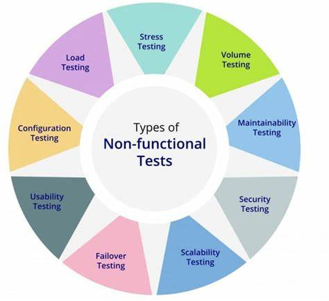
版权所有©️ 仅限于教学使用

#### Notes:
十二、性能测试
系统性能指标和测试类型（含压力测试、容量测试）
系统负载及其模式
性能测试的基本过程
前端/后端性能测试工具
十三、安全性测试
威胁模型与安全漏洞模式
安全性测试的范围与方法
贯穿研发生命周期的安全性测试
Web安全性测试
安全性测试工具
十四、兼容性测试和易用性测试
软件兼容性测试
全链路压测
混沌工程
A/B测试
重难点小结
系统负载模式、后端性能测试、威胁模型与安全漏洞模式、安全性测试方法、A/B测试
课后实践练习
基于JMeter的性能测试的实验
基于ZAP的安全性测试

<!-- Slide number: 3 -->

## 7.1 性能测试
本节内容进行了优化，压力测试、容量测试和工具等具体内容可以参考教材，但核心内容都已涵盖

#### Notes:
1. 系统性能指标和测试类型（含压力测试、容量测试）
2.系统负载及其模式
3.性能测试的基本过程
前端/后端性能测试工具

<!-- Slide number: 4 -->
### 性能测试
性能问题是常见的问题，特别是在今天SaaS时代、万物互联时代
压力测试、容量测试等也并入性能测试
性能测试也可以分为静态测试和动态测试，通常意义指动态测试
性能测试一般只能通过工具来实现
性能测试的结果分析有挑战，需要良好的技术功底
性能测试与性能调优相辅相成，循环往复、不断提升性能

<!-- Slide number: 5 -->
### 性能问题

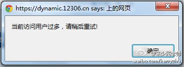

<!-- Slide number: 6 -->
### 性能问题外部表现和内因
启动系统、打开页面越来越慢
查询数据，很长时间才显示列表
网络下载速度很低，如5k/s
资源耗尽,如CPU使用率达到100%
资源泄漏,如内存泄漏 ，最终会导致资源耗尽
资源瓶颈,如线程、GDI、DB连接等资源变得稀缺

<!-- Slide number: 7 -->
### 什么是性能测试？
性能测试（performance test）就是为了发现系统性能问题或获取系统性能相关指标而进行的测试。一般在真实环境、特定负载条件下，通过工具模拟实际软件系统的运行及其操作，同时监控性能各项指标，最后对测试结果进行分析以确定系统的性能状况。
性能测试目标
获取系统性能某些指标数据
为了验证系统是否达到用户提出的性能指标
发现系统中存在的性能瓶颈，优化系统的性能

<!-- Slide number: 8 -->
### 负载（Workload）

> [!TIP]
> **负载（Workload）**的三个核心要素：
> - **每次请求发送的数据量 (Request Per Second, RPS)**
> - **并发连接数 (Simultaneous Connections, SC)**
> - **思考时间（Thinking Time）**：用户发出请求之间的间隔时间。

> [!IMPORTANT]
> **并发用户数关系式**：
> `RPS + SC + Thinking Time = Concurrent users` (并发用户数)

每次请求发送的数据量 (Request Per Second, RPS)
并发连接数 (Simultaneous  Connections, SC)
思考时间（thinking time），用户发出请求之间的间隔时间
RPS + SC + Thinking Time = Concurrent users

<!-- Slide number: 9 -->
### 思考时间的影响
将系统置于相同的高负载下，将请求之间间隔时间设为零。这样服务器会立即超载，并形成越来越长的等候队列，直至内存耗尽

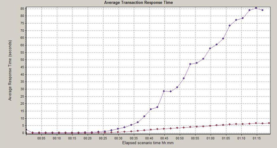
间隔时间为零

间隔时间长

#### Notes:

<!-- Slide number: 10 -->
### 负载模式
加载的循环次数或持续时间
加载的方式或模式，如均匀加载、峰值交替加载等

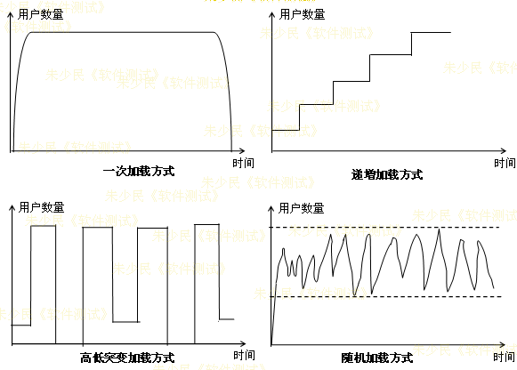

<!-- Slide number: 11 -->
### 示例：系统负载测试

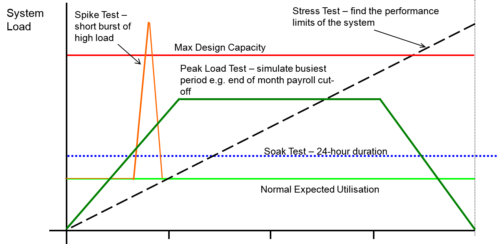

#### Notes:
Burst：爆炸；突破；冲进 ； soak test：渗入测试

<!-- Slide number: 12 -->
### 性能测试类型

> [!IMPORTANT]
> **压力与稳定性测试类型**：
> - **压力测试 (Stress test)**：模拟实际应用的软硬件环境及用户使用过程的高负载、异常负载、超长时间运行，从而加速系统崩溃，以检查程序对异常情况的抵抗能力，找出性能瓶颈、不稳定等问题。
> - **渗入测试（Soak test）**：通过长时间运行，使问题逐渐渗透出来，从而发现内存泄漏、垃圾回收（GC）或系统的其他问题，以检验系统的健壮性。
> - **峰谷测试（Peak-rest test）**：采用高低突变加载方式进行，先加载到高水平的负载，然后急剧降低负载，稍微平息一段时间，再加载到高水平的负载，重复这样过程，容易发现问题的蛛丝马迹，最终找到问题的根源。

性能基准测试：在系统标准配置下获得有关的性能指标数据，作为将来性能改进的基线(Baseline)
性能验证测试：验证系统是否达到事先已定义的系统性能指标、能否满足系统的性能需求
性能规划测试：在多种特定的环境下，获得不同配置的系统性能指标，从而决定系统部署的软硬件配置选型
容量测试可以看作性能的测试一种，因为系统的容量可以看作是系统性能指标之一

<!-- Slide number: 13 -->
### 性能测试类型

> [!IMPORTANT]
> **压力与稳定性测试类型**：
> - **压力测试 (Stress test)**：模拟实际应用的软硬件环境及用户使用过程的高负载、异常负载、超长时间运行，从而加速系统崩溃，以检查程序对异常情况的抵抗能力，找出性能瓶颈、不稳定等问题。
> - **渗入测试（Soak test）**：通过长时间运行，使问题逐渐渗透出来，从而发现内存泄漏、垃圾回收（GC）或系统的其他问题，以检验系统的健壮性。
> - **峰谷测试（Peak-rest test）**：采用高低突变加载方式进行，先加载到高水平的负载，然后急剧降低负载，稍微平息一段时间，再加载到高水平的负载，重复这样过程，容易发现问题的蛛丝马迹，最终找到问题的根源。

压力测试 (Stress test) ：模拟实际应用的软硬件环境及用户使用过程的高负载、异常负载、超长时间运行，从而加速系统崩溃，以检查程序对异常情况的抵抗能力，找出性能瓶颈、不稳定等问题。
渗入测试（soak test），通过长时间运行，使问题逐渐渗透出来，从而发现内存泄漏、垃圾回收（GC）或系统的其他问题，以检验系统的健壮性
峰谷测试（peak-rest test），采用高低突变加载方式进行，先加载到高水平的负载，然后急剧降低负载，稍微平息一段时间，再加载到高水平的负载，重复这样过程，容易发现问题的蛛丝马迹，最终找到问题的根源

<!-- Slide number: 14 -->
### 示例：压力测试

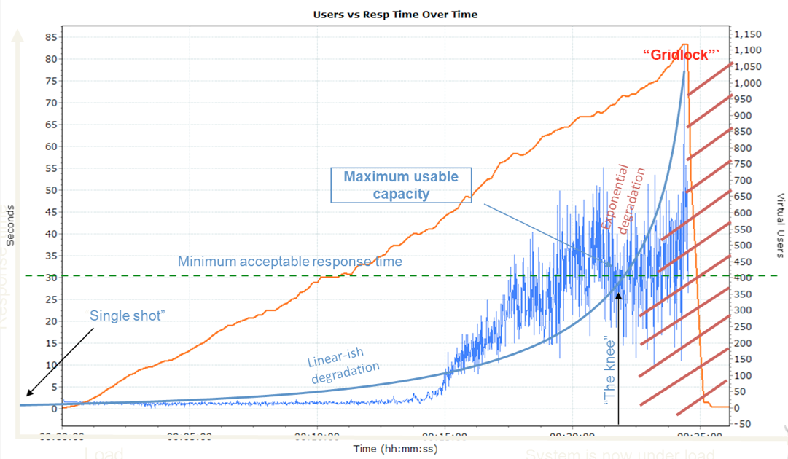
14

<!-- Slide number: 15 -->
### 性能测试的层次

Web/App客户端
应用服务器
数据库访问层
RDBMS 数据库
端口连接
网络通信

<!-- Slide number: 16 -->
### 全生命周期的性能测试
| 计划 | 系统架构 | 迭代 | 在线 |
| --- | --- | --- | --- |
| 确定性能需求 （包括运维需求） 业务场景 业务数据 性能测试策略 性能需求和计划评审 | 架构评估 性能测试策略 |  |  |

性能
监控
容量
规划

性能
优化
健康
检查

经验积累
性能建模
性能需求调整修改
定位性能瓶颈/优化
设计/执行性能测试
性能数据
性能数据
16

<!-- Slide number: 17 -->
### 从需求开始明确性能
（获取、分析和评审性能需求）
 最终用户的体验，如2-5-10原则
 商业需求，如“比竞争对手的产品好”
 技术需求，如CPU使用率不超过70％
 标准要求，如数据通信延时<80ms
用户关注系统的外部表现，如响应时间
业务部门关注系统的容量和数据吞吐量
技术团队关注系统资源占用率、或使用效率

#### Notes:
获取性能需求、分析和评审需求
根据历史数据分析获得
业务调查分析，业务指标转化成系统性能指标
参照行业标准
系统技术指标分析
需求评审

<!-- Slide number: 18 -->
### 性能需求可测试性
清楚而量化的性能指标

每秒平均处理约130笔交易
每天要处理
一千万笔交易

高峰期间处理要求是平均值四倍
520笔交易／秒

#### Notes:

<!-- Slide number: 19 -->
### 架构设计评审

19

<!-- Slide number: 20 -->
### 代码评审 - 性能问题

> [!IMPORTANT]
> **Java 字符串拼接性能对比**：
> - **String**：性能最差，因为每次拼接都会创建新的对象。
> - **StringBuilder**：适合**单线程**操作，字符串连接操作比使用 `String` 的操作快了近 **200 倍**。
> - **StringBuffer**：更安全，适合**多线程**操作，字符串连接操作比 `String` 快了近 **700 倍**。

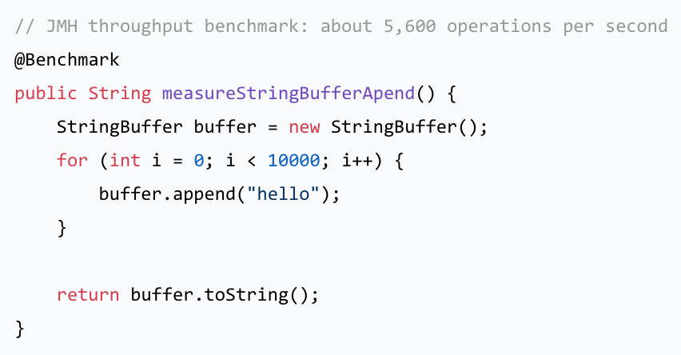

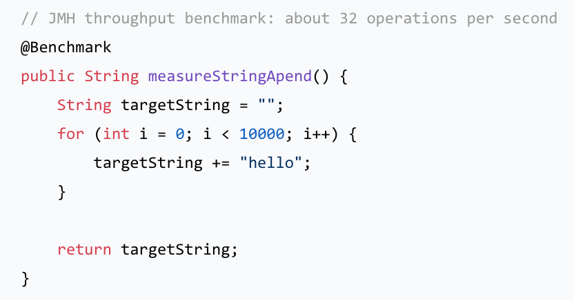
使用 String 的性能是最差
35个java代码性能优化总结
20

#### Notes:
StringBuilder可变字符串类，适合单线程操作，字符串连接操作，比使用 String 的操作快了近 200 倍
StringBuffer 更安全，适合多线程操作，字符串连接操作，更是快了近 700 倍
35个java代码性能优化总结
编写高性能Java代码的最佳实践:https://blog.csdn.net/dev_csdn/article/details/79033972

<!-- Slide number: 21 -->
### 性能测试设计与执行

分析器
网络及其配置
服务器硬件选型
被测试系统部署
数据库数据量
测试机器池
SUT监控

被测系统SUT

应用
服务器
Web服务器
数据库
服务器

测试机(池)
产生虚拟用户和负载
26

<!-- Slide number: 22 -->
测试执行和监控
DNS时间
客户端时间
网络时间

应用处理返回时间
网络时间
数据返回时间
数据库时间

服务时间
服务时间

#### Notes:

<!-- Slide number: 23 -->
### 性能测试工具
服务器端性能测试工具
客户端性能测试工具
JMeter
LoadRunner
Webload
Gatling
k6
Vegata
Locust
Skywalking
……
Google Lighthouse
PerfDog
Monkey
Monekyrunner
mobileperf
Pyroscope
MemoryLeakDetector

详见我之前写的文章

#### Notes:

<!-- Slide number: 24 -->
### 客户端PerfDog

详见：教材P201-203，和官方网站 https://perfdog.wetest.net/

<!-- Slide number: 25 -->
### 性能测试工具 JMeter

测试计划
线程组
取样器/请求
逻辑控制器
断言
前置/后置处理器
监听器

https://jmeter.apache.org/index.html

#### Notes:

<!-- Slide number: 26 -->
### JMeter构成
JMeter
测试计划
远程运行控制器
其它
工作台
HTTP Proxy
脚本
录制
线程组
Thread Group
Test Fragment

Templates
Log View
函数助手

setup
线程
teardown

逻辑控制器
Logic Controllers
采样器
Sampler

配置元件
定时器
前置处理器
后置处理器
断言
监听器

#### Notes:

<!-- Slide number: 27 -->
### JMeter 支持的协议
Web - HTTP, HTTPS
SOAP / REST Webservices
FTP
Database via JDBC
LDAP
JMS
Mail - SMTP
JSR223
TCP
Java Objects等

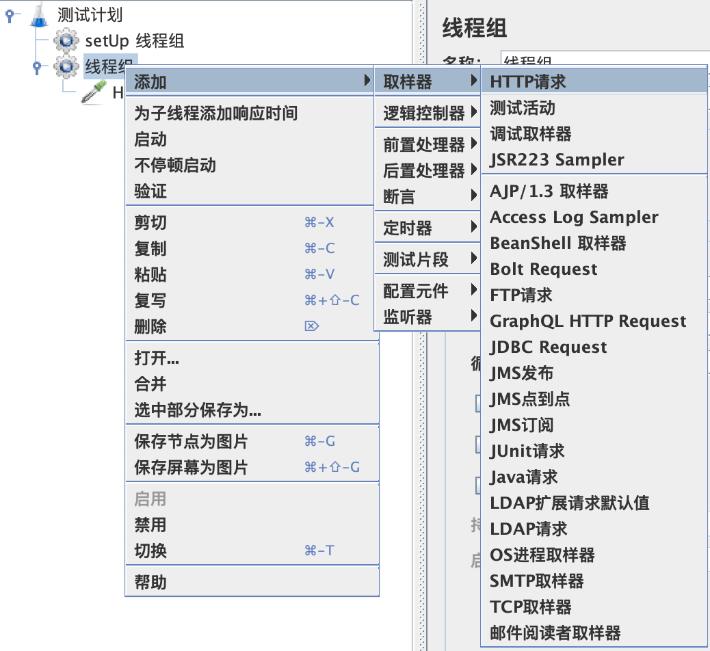

#### Notes:

<!-- Slide number: 28 -->
### 支持cli（命令行） 模式
-n	非GUI方式运行
-t	指定运行的测试脚本的地址与名称，可以是相对路径，相对路径的根是命令窗口 的当前路径
-p	指定读取JMeter属性文件
-l	记录测试结果到文件
-s	以服务器方式运行（远程方式，启动agent）；-X	停止远程运行
-H 	设置代理，一般填写代理ip；  -p：设置代理端口
-u	代理账号；     -a：代理口令
-j	定义JMeter属性，等同于在jmeter.properties中进行设置
-D	定义系统属性，等同于在system.properties中进行设置
-S	加载系统属性文件，可以通过此参数指定加载一个系统属性文件，此文件可以用户自己定义
-L	定义JMeter日志级别，比如DEBUG,INFO,ERROR等
-r	开启远程负载机（非GUI方式），远程机列表在jmeter.properties中指定
-d	指定JMeter home 目录
jmeter -n -t my_test.jmx -l log.jtl -H my.proxy.server -P 8000

#### Notes:
jmeter -n -t testplan.jmx -r [-Gprop=val] [-Gglobal.properties] [-X]

<!-- Slide number: 29 -->
### JMeter 录制功能

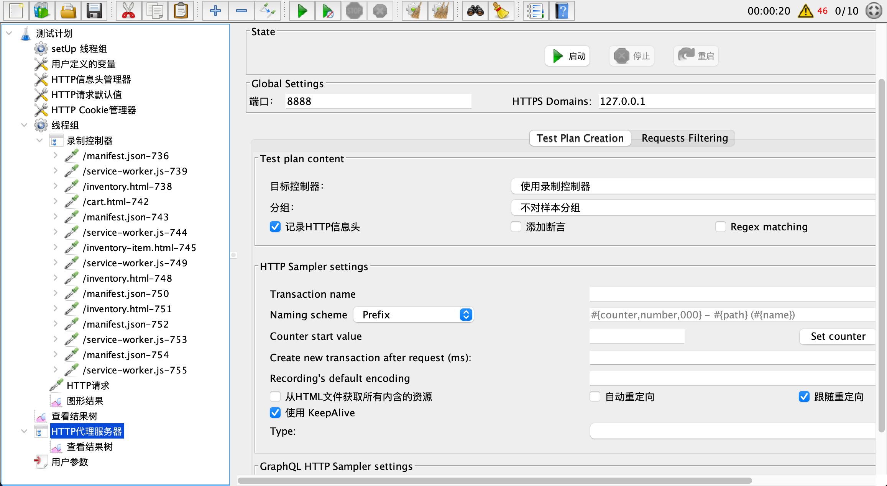
逻辑控制单元：录制控制器
非测试元件：HTTP代理服务器
在浏览器或网络中设置HTTPS代理

#### Notes:
https://sso.eolink.com/
Test IDE 支持录制、开发和调试
CLI mode
呈现动态 HTML报告
HTML, JSON , XML等

<!-- Slide number: 30 -->
### JMeter支持分布式环境
JMeter GUI 192.168.0.1
Master

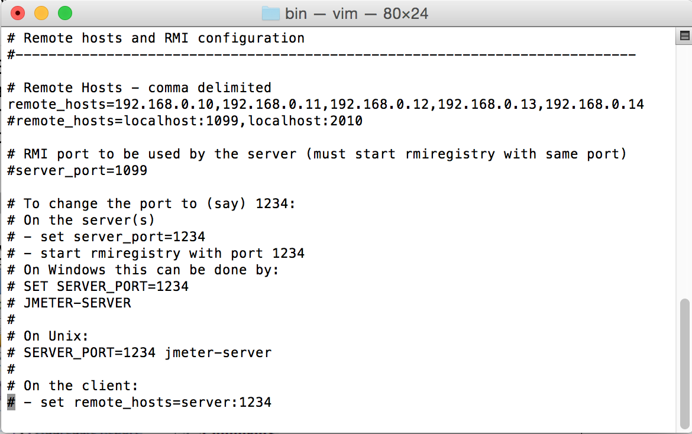
JMeter server 192.168.0.10
JMeter server 192.168.0.11
JMeter server 192.168.0.19
……
Slaves
Requests
Requests
Requests
jmeter.properties

Web Sever
被测试系统

#### Notes:

<!-- Slide number: 31 -->
JMeter Plugins Manager

jmeter-plugins-manager-1.8.jar 放在 jmeter_Home/lib/ext 目录下面
31

<!-- Slide number: 32 -->
### 插件示例

<!-- Slide number: 33 -->
### JMeter 更多参考

http://jmeter.apache.org/usermanual/index.html
http://wiki.apache.org/jmeter/

<!-- Slide number: 34 -->
### 性能分析

34

#### Notes:
StringBuilder 的字符串连接操作，比使用 String 的操作快了近 200 倍
StringBuffer 的字符串连接操作，更是快了近 700 倍

<!-- Slide number: 35 -->
### 调优-Tuning

35

#### Notes:
StringBuilder 的字符串连接操作，比使用 String 的操作快了近 200 倍
StringBuffer 的字符串连接操作，更是快了近 700 倍

<!-- Slide number: 36 -->
### 性能监控

<!-- Slide number: 37 -->
### 全生命周期的性能测试
性能需求收集与定义
代码质量
与性能
环境验证
测试执行（含
基线、生产负载、可伸缩性等）

业务度量，DoD
性能度量/
KPI Dashboard

内建性能（设计中）
性能建模

单元性能测试
代码优化
容量管理

性能测试
性能测试与
工程策略
性能监控

监控 & 容量管理

#### Notes:

<!-- Slide number: 38 -->
### 本节小结
了解性能测试的不同目的（性能测试类型）
清楚一些基本概念：负载、负载模式、虚拟用户、性能指标
性能测试会涉及架构评审、代码评审、性能调优
熟练使用性能测试工具（如JMeter）

<!-- Slide number: 39 -->
### 实验4-1：基于JMeter的后端性能测试
选一个web应用，需要用户登录的
使用代理服务器+录制控制器录制脚本
选用插件，设置线程组相关参数
会使用2-3种控制器
会配置2-3种采样器
会使用HTTP 授权、cookie管理器
会设置断言
会使用JDBC连接预处理
会使用2-3种监听器（如查看树、响应时间、吞吐量）
提交
性能测试报告（word格式，含测试系统、环境、场景设计、执行和结果分析）
性能测试脚本（.jmx 文件）

#### Notes:

<!-- Slide number: 40 -->
### 实验4-2：基于PerfDog的客户端性能测试
登录PerfDog官网https://perfdog.wetest.net/ ，下载正确的桌面应用程序；
USB连接手机，自动检测添加手机到应用列表中。
设定测试模式（USB模式测试或WIFI模式测试）；
选择被测试的App应用开始测试；
测试过程中采集性能数据；
保存测试结果；
进行测试数据统计与分析；
编写测试报告。

#### Notes:

<!-- Slide number: 41 -->

## 7.2 安全性测试

#### Notes:
威胁模型与安全漏洞模式
安全性测试的范围与方法
贯穿研发生命周期的安全性测试
Web安全性测试
安全性测试工具

<!-- Slide number: 42 -->
知道它们的区分吗？

白帽黑客

黑帽黑客
42

<!-- Slide number: 43 -->
第13讲：安全性测试
威胁模型与安全漏洞模式
安全性测试的范围与方法
贯穿研发生命周期的安全性测试
Web安全性测试
安全性测试工具

#### Notes:
十二、性能测试
系统性能指标和测试类型（含压力测试、容量测试）
系统负载及其模式
性能测试的基本过程
前端/后端性能测试工具
十三、安全性测试
威胁模型与安全漏洞模式
安全性测试的范围与方法
贯穿研发生命周期的安全性测试
Web安全性测试
安全性测试工具
十四、兼容性测试和易用性测试
软件兼容性测试
全链路压测
混沌工程
A/B测试
重难点小结
系统负载模式、后端性能测试、威胁模型与安全漏洞模式、安全性测试方法、A/B测试
课后实践练习
基于JMeter的性能测试的实验
基于ZAP的安全性测试

<!-- Slide number: 44 -->
威胁模型与安全漏洞模式

<!-- Slide number: 45 -->
### 安全性缺陷 － 漏洞

> [!TIP]
> **脆弱性（Vulnerability，又称弱点或漏洞）**：是IT系统中存在的可能被威胁利用造成损害的薄弱环节。脆弱性一旦被威胁成功利用就可能违犯安全策略，对IT系统（资产）造成损害。

脆弱性（vulnerability），又称弱点或漏洞，是IT系统中存在的可能被威胁利用造成损害的薄弱环节，脆弱性一旦被威胁成功利用就可能违犯安全策略, 对IT系统（资产）造成损害

45

#### Notes:
vulnerability [ˌvʌlnərə'bɪləti]
脆弱性；弱点；易伤性；可捕性
网络漏洞；易损性；脆弱度
susceptibility , weakness , defenselessness , defencelessness , helplessness

<!-- Slide number: 46 -->
### 安全性：漏洞来源
恶意：木马病毒、陷门、逻辑/定时炸弹
非恶意：如隐秘通道

故意

校验错误
范围错误
串行错误
认证／鉴别错误
边界条件错误
其它可利用的逻辑错误

漏洞
无意
46

#### Notes:
所谓陷门是一个程序模块秘密的、未记入文档的入口。一般陷门是在程序开发的时候插入的一小段程序，或者是为了将来发生故障后，为程序员提供方便等合法用

逻辑炸弹又称分枝炸弹，是一种当运行环境满足某种特定条件时执行其他特殊功能的程序，触发条件可能是日期和时间的组合，由程序设计者设定
2001年10月1日0时0分0秒，147台YS-88型电力故障录波器软件程序中的“逻辑炸弹”准时爆炸，设备功能瘫痪。影响遍布全国各省的147个变电站和发电厂
KV300 江民炸弹
第一，逻辑炸弹。在网络软件(比如程序控制交换机的软件中)可以预留隐蔽的对日期敏感的定时炸弹。在一般情况下，网络处于正常状态，一旦到某个预订的日期，程序便会自动跳转到死循环中，造成死机甚至是网络瘫痪事件的发生。
　　第二，遥控旁路。某国向我国出口一种传真机，其软件可以通过遥控将加密接口旁路，从而失去加密功能，造成信息泄密。
　　第三，远程维护。某些通信设备具有一种远程维护功能，可以通过远程终端，由公开预留的接口进入系统完成维护检修功能，甚至可以实现国外厂家维护人员在其本部终端上对国内进口设备进行远程维护。这种功能在带来明显的维护管理便利的同时，当然也带来了一定的潜在威胁。
　　第四，非法通信。某些程控交换机具有单向监听功能，即就是特许用户，利用自身的话机拨号，可以监听任意通话方的话音而不会被发现。
　　第五，贪婪程序。一般程序都有一定的执行时限，如程序被有意或者错误更改为贪婪程序和循环程序，或者被植入某些病毒，那此程序则会长期占用计算机使用时间，造成以外阻塞使得合法用户被排挤在外不能得到服务。

<!-- Slide number: 47 -->
### 危险、攻击手段
信息收集
       Ping/telnet/whois/Traceoute
端口扫描 snmp,superscan
常规信息获取
漏洞扫描
社会工程学
搜索引擎

预攻击（扫描）

DoS
远程渗透
口令猜测
远程溢出，如getadmin
应用攻击：如SQL注入

攻击

攻击
权限提升（本地溢出、口令嗅探等）
后门
痕迹擦除

后攻击
47

#### Notes:
一般利用缓冲区溢出漏洞攻击root程序，大都通过执行类似“exec(sh）”的执行代码来获得root 的shell。
黑客要达到目的通常要完成两个任务：
在程序的地址空间里安排适当的代码
通过适当的初始化寄存器和存储器，让程序跳转到安排好的地址空间执行

<!-- Slide number: 48 -->
### 攻击带来的安全性问题
信息泄露、破坏信息的完整性
拒绝服务（DoS、DDoS）
非法使用(非授权访问)、窃听
业务数据流分析
假冒、旁路控制
授权侵犯 （内部攻击）
抵赖 （来自用户的攻击）
计算机病毒、恶意软件
信息安全法律法规不完善

#### Notes:

<!-- Slide number: 49 -->
### 软件系统安全威胁：STRIED

> [!IMPORTANT]
> **STRIDE 安全威胁模型**：
> - **S**poofing Identify (假冒 ID / 身份仿冒)
> - **T**ampering (篡改)
> - **R**epudiation (抵赖)
> - **I**nformation Disclosure (信息泄露)
> - **D**enial of Service (拒绝服务, DoS)
> - **E**levation of Privilege (特权升级, EoP)

假冒 ID  (Spoofing Identify)
篡改 (Tampering)
抵赖 (Repudiation)
信息泄露 (Information)
拒绝服务 (Denial of Service, DoS )
特权升级 (Elevation of Privilege, EoP)

http://techdo.me/identity-spoofing-and-how-to-protect-yourself-from-it/

<!-- Slide number: 50 -->
### 一些常见的安全漏洞模式
缓冲区溢出漏洞
图像格式(WWF/TIFF/PNG)漏洞
竞争条件漏洞模式
SQL注入漏洞
跨站脚本攻击（XSS）
跨站请求伪造攻击（CSRF）
Frame-proxy攻击漏洞
并发漏洞
……

#### Notes:
http://wiki.open.qq.com/wiki/Web%E6%BC%8F%E6%B4%9E%E6%A3%80%E6%B5%8B%E5%8F%8A%E4%BF%AE%E5%A4%8D

http://blog.sina.com.cn/s/blog_70dd16910100q60t.html
Tarantella Enterprise在安装过程中存在竞争条件问题，可以使本地攻击者得到主机的root权限。　在安装过程中，程序会在$TMPDIR环境变量指定的临时文件目录（通常是/tmp）中创建一个二进制的gunzip文件，此文件的文件名一般是gunzip$$，$$代表了进程号，安装程序会以root身份在以后的安装过程中用到这个gunzip程序。这个gunzip程序在被创建时是全局可读写的，如果能在它被使用之前以其他的可执行程序替换之，则可能以root身份执行任意命令

FUSE‘s fusermount工具存在竞争条件问题，通过执行FUSE文件系统卸载操作(不是自动执行)，本地非特权用户可以利用这个缺陷通过符号链接进行拒绝服务(无需特权卸载特权用户所属的FUSE文件系统共享)。

<!-- Slide number: 51 -->
### 常见的 C/ C++缓冲区溢出问题

> [!IMPORTANT]
> **C/C++ 常见易溢出函数及风险**：
> - `strcpy` 和 `strcat` 不检查目标缓冲区大小，极易发生溢出。
> - `gets` 无法限制输入长度，已被废弃，应用 `fgets` 代替。
> - `getwd`，`sprintf`，`scanf` 等也存在安全隐患，应使用带安全边界检查的替代函数（如 `getcwd`，`snprintf`，`sscanf` 等）。

| strcpy(char \*dest, const char \*src) | 可导致dest缓冲区溢出 |
| --- | --- |
| strcat(char \*dest, const char \*src) | 可导致dest缓冲区溢出 |
| getwd(char \*buf) | 可导致buf缓冲区溢出 |
| gets(char \*s) | 可导致s缓冲区溢出 |
| [vf]scanf(const char \*format, ...) | 可导致参数溢出 |
| realpath(char \*path, char resolved\_path[]) | 可导致path缓冲区溢出 |
| [v]sprintf(char \*str, const char \*format, ...) | 可导致str缓冲区溢出 |
51

#### Notes:
char *_getcwd( char *buffer, int maxlen );

getcwd()会将当前工作目录的绝对路径复制到参数buffer所指的内存空间中,参数maxlen为buffer的空间大小

<!-- Slide number: 52 -->
### OWASP Top10 漏洞模式
OWASP：Open Web Application Security Project

https://owasp.org/Top10/
52

#### Notes:
Cross-site Request Forgery：跨站点请求伪造

A1 Injection
A2 Broken Authentication & Session Management
A3 Cross-Site Scripting (XSS)
A4 Insecure Direct Object References
A5 Security Misconfiguration
A6 Sensitive Data Exposure
A7 Missing Function Level Access Control
A8 Cross-Site Request Forgery (CSRF)
A9 Using Components with Known Vulnerabilities
A10 Unvalidated Redirects and Forwards

<!-- Slide number: 53 -->
安全性测试的范围与方法

<!-- Slide number: 54 -->
### 安全目标

> [!TIP]
> **安全目标 (CIA三元组)**：
> - **保密性 (Confidentiality)**：确保信息只被授权人访问，信息即使被截取也不能了解信息的真实含义。
> - **完整性 (Integrity)**：保护信息和信息处理方法的准确性和原始性，包括数据的一致性，防止数据被非法用户篡改。
> - **可用性 (Availability)**：确保授权的用户在需要时可以访问信息。
> 
> *平衡原则*：这些目标常常是互相矛盾的，需要在保密性与可用性之间达到最佳平衡。

安全目标是指能够满足一个组织或者个人的所有安全需求，通常强调CIA三元组的目标，即保密性(Confidentiality)、完整性(Integrity)和可用性(Availability)
由于这些目标常常是互相矛盾的，因此需要在这些目标中达到最佳平衡。例如，简单地阻止所有人访问一个资源，就可以实现该资源的保密性，但这样就不满足可用性。

可用性
保密性
完整性
安全
保障

<!-- Slide number: 55 -->
### 安全性要求
保密性 ：确保信息只被授权人访问，信息即使被截取也不能了解信息的真实含义
完整性： 保护信息和信息处理方法的准确性和原始性，包括数据的一致性，防止数据被非法用户篡改
可用性： 确保授权的用户在需要时可以访问信息
真实性：保证信息来源真实可靠
不可抵赖性：用户对其行为不可否定
可追溯性 (Accountability)：确保实体的行动可被跟踪
可控制性：对信息的传播及内容具有控制能力
可审查性：对出现的网络安全问题提供调查的依据和手段

#### Notes:

<!-- Slide number: 56 -->
### 练习
假冒 ID
篡改
抵赖
信息泄露
拒绝服务
特权升级

授权
保密
不可抵赖性
可用性
完整性
认证

#### Notes:

<!-- Slide number: 57 -->
### 练习
授权
保密
不可抵赖性
可用性
完整性
认证

假冒 ID
篡改
抵赖
信息泄露
拒绝服务
特权升级

#### Notes:

<!-- Slide number: 58 -->
### 软件安全性需求
数据安全性

系统安全性

加密
数据结构
安全存储
安全访问
认证
备份
用户身份认证
用户权限限制
异常处理
入口验证机制
系统强壮性设计

#### Notes:

<!-- Slide number: 59 -->
### 示例：系统安全性问题

对用户口令有多少防范措施 ？

#### Notes:

<!-- Slide number: 60 -->
### 系统安全的基本机制

主体

主动用户、
进程
权限

客体

被动文件、
存储设备

访问：读、写、执行

强制访问控制
安全策略
安全审计

#### Notes:

<!-- Slide number: 61 -->
### 安全三大保障机制：预防、恢复、支撑

<!-- Slide number: 62 -->
### 完整的安全策略示例
可接受的加密控制
可接受的使用控制
模拟线路和拨入访问控制
防病毒流程
应用程序提供上（ASP）控制
引入评估控制
审核和风险评估
自动转发电子邮件控制
数据库信任编码
外部网络访问控制
远程访问和VPN安全控制
敏感信息控制
Internet  DNS设备控制
口令保护
路由器安全管理
服务器安全管理
第三方网络连接协议
无线通信控制

<!-- Slide number: 63 -->
### 安全性测试的目标
通常的目标
（强制）访问控制
身份鉴别
完整性保护

进一步的目标
隐蔽通道分析
可信路径
加密算法、代码规范
潜在的安全漏洞

(数据存储、传输和处理)
数据的机密性、完整性、可用性
63

#### Notes:
内存溢出
SQL injection/XSS
各种输入验证型问题
不充分的随机数
完整性：数字签名，可以判断发送的信息在传递的过程中是否被篡改过
全性是保护数据库，以防止非法使用所造成数据的泄露、更改或破坏，安全性措施的防范对象是非法用户和非法操作；
完整性是防止合法用户使用数据库时向数据库中加入不符合语义的数据，完整性措施的防范对象是不合语义的数据。

<!-- Slide number: 64 -->
### 软件安全性测试的范围
安全功能测试 (Security Functional Testing)：数据机密性、完整性、可用性、不可否认性、身份认证、授权、访问控制、审计跟踪、委托、隐私保护、安全管理等

安全漏洞测试 (Security Vulnerability Testing)：从攻击者的角度, 以发现软件的安全漏洞为目的。安全漏洞是指系统在设计、实现、操作、管理上存在的可被利用的缺陷或弱点
64

<!-- Slide number: 65 -->
### 功能性测试  vs. 安全性测试
功能性测试：软件做它应该做的事，验证正确的输出
发现不正确的输出 /行为 / 缺陷(Bug)

安全性测试：软件不做它不应该做的事，应用输入的验证, 以避免不安全的事情发生。在测试软件系统中对危险防止和危险处理设施进行的测试，以验证其是否有效
65

<!-- Slide number: 66 -->
### 安全性测试的任务
全面检验软件在需求规格说明中规定的防止危险状态措施的有效性和在每一个危险状态下的反应
对软件设计中用于提高安全性的结构、算法、容错、冗余、中断处理等方案，进行针对性测试
在异常条件下测试软件，以表明不会因可能的单个或多个输入错误而导致不安全状态
对安全性关键的软件单元、组件，单独进行加强的测试，以确认其满足安全性需求
66

#### Notes:
还有什么安全测试任务吗？ 安全标准、规范规定的任务，需求、设计中没有描述的。

<!-- Slide number: 67 -->
### 安全等级

用户自主保护级
系统审计保护级
安全标记保护级
结构化保护级
访问验证保护级

<!-- Slide number: 68 -->
不同等级的安全要求

#### Notes:

<!-- Slide number: 69 -->
### 不同安全级别的安全功能测试

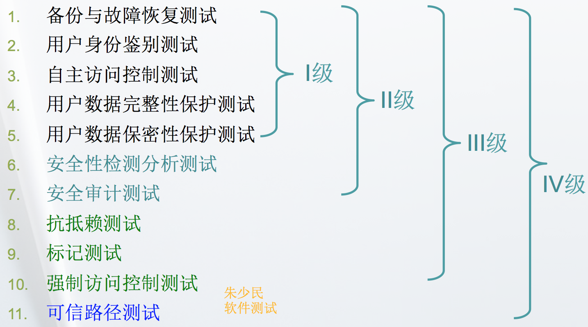
69

<!-- Slide number: 70 -->
### 安全性测试方法
静态测试方法
工具扫描/分析代码
人工评审：架构/代码
专家安全风险评估

动态测试方法
功能测试方法
模糊测试方法
渗透测试方法
基于威胁的方法
从软件外部考察其安全性，识别软件面临的安全威胁并测试其是否能够发生

基于漏洞的方法
从软件内部考虑其安全性，识别软件的安全漏洞，如借助特定的漏洞扫描工具
70

<!-- Slide number: 71 -->
### 安全性功能测试
示例：口令
规则验证
负面测试
传输检查
存储检查
控件兼容性
……
身份认证测试
（如DCE/Kerberos、基于公共密钥等认证机制）
访问控制策略验证（如入口访问、权限、目录等控制）
71

#### Notes:
Kerberos是一种为网络通信提供可靠第三方服务的、面向开放系统的认证机制 (双向认证)

<!-- Slide number: 72 -->
### 模糊测试方法

> [!TIP]
> **模糊测试 (Fuzz Testing)**：在被测试程序中附加上随机数据（fuzz）作为程序的输入。如果被测试程序出现问题（例如 Crush，或者异常退出），就可以定位程序的缺陷。其优势是测试设计极其简单，不需要先入为主地假设系统的行为。

Fuzz Testing

模糊测试：在一个被测试程序中附加上随机数据（fuzz）作为程序的输入。如果被测试程序出现问题（例如 Crush ,或者异常退出），就可以定位程序的缺陷。
模糊测试的巨大优势：测试设计极其简单，系统的行为先入为主。
72

<!-- Slide number: 73 -->
### 几种不同模糊器的构造
黑盒随机模糊，对正确格式的输入数据进行随机变异，然后用这些变异的输入运行程序，看是否能够触发异常。
基于语法的模糊，是模糊复杂格式输入的替代方法，需要指定输入格式的输入语法、哪些输入部分要进行模糊化以及如何模糊化。
白盒模糊处理，由微软研究院于2008年首创，这种方法包括：动态地执行被测程序，从执行过程中遇到的条件分支收集输入约束。然后，系统地逐个否定所有这些约束，并使用约束求解器求解，其解被映射到执行不同程序执行路径的新输入。使用系统搜索技术重复这个过程，试图扫描程序的所有可行的执行路径。
73

#### Notes:
黑盒随机模糊，对正确格式的输入数据进行随机变异，然后用这些变异的输入运行程序，看是否能够触发异常。这是一种简单的hack，如果一个应用从未进行过模糊测试，可以用这种技术有效地发现应用中的漏洞。
基于语法的模糊，是模糊复杂格式输入的替代方法，需要指定输入格式的输入语法，还指定哪些输入部分要进行模糊化以及如何模糊化。基于语法的模糊生成器会生成许多新的输入，每个输入满足语法编码的约束。基于语法的fuzzing通过模糊生成器的用户的创造力和专业知识来指导fuzzing。
白盒模糊处理，由微软研究院于2008年首创，这种方法包括：动态地执行测试下的程序，并从执行过程中遇到的条件分支收集输入约束。然后，系统地逐个否定所有这些约束，并使用约束求解器求解，其解被映射到执行不同程序执行路径的新输入。使用系统搜索技术重复这个过程，试图扫描程序的所有可行的执行路径。与黑盒随机模糊相比，白盒模糊通常更精确，可以运行更多的代码，从而发现更多的bug。

<!-- Slide number: 74 -->
### American fuzzy lop方法
AFL是一款开源的模糊测试工具，是当今使用最广泛的Fuzzer，这个工具在程序执行前对程序源码进行插桩（instrumentation），以便在程序执行过程中实时获取程序的执行情况。AFL采用遗传算法对程序的输入进行变异能够在程序运行的时候注入自己的代码， 然后自动产生测试用例进行模糊测试。简化一下，整个算法可以总结为：
将用户提供的初始测试用例加载到队列中。
从队列中获取下一个输入文件。
试图将测试用例修剪到不改变程序测量行为的最小尺寸。
使用均衡的、经过充分研究的各种传统模糊策略，重复地对文件进行变异。
如果任何产生的变异导致插桩记录新的状态转换，将变异的输出作为一个新的条目添加到队列中。
转到第2步
https://afl-1.readthedocs.io/en/latest/
https://github.com/google/AFL

<!-- Slide number: 75 -->
### 变异测试

> [!TIP]
> **变异测试 (Mutation Testing)**：一种在细节方面改进程序源代码的软件测试方法。变异操作是模拟典型应用错误（定位代码的弱点）或强制产生有效的测试。

mutation testing
变异测试（Mutation Testing）是一种在细节方面改进程序源代码的软件测试方法。变异操作是模拟典型应用错误（定位代码的弱点）、或强制产生有效地测试

<!-- Slide number: 76 -->
### 变异测试的方法与流程

<!-- Slide number: 77 -->

### 渗透测试

> [!TIP]
> **渗透测试 (Penetration Testing)**：采用探索式测试方式，模拟黑客可能使用的攻击技术和漏洞发现技术，对目标系统的安全做深入的探测，发现系统最脆弱的环节，直观地发现问题。

采用探索式测试方式，模拟黑客可能使用的攻击技术和漏洞发现技术，对目标系统的安全做深入的探测，发现系统最脆弱的环节，直观地发现问题
漏洞挖掘
利用搜索引擎
漏洞利用
利用开源平台
权限提升
收集产品资料
持久化
风险评估
与总结
信息
收集
渗透
攻击
威胁
分析
结合攻击模式库
测试报告
价值资产
攻击目标
高风险模块
攻击树分析

<!-- Slide number: 78 -->
### 渗透测试－概览
渗透测试
探索
exploration
利用
exploitation
修复
与报告
网络发现
漏洞评估
指纹识别
端口扫描
网络映射
主机探索
服务识别
平台识别
漏洞研究
漏洞发现
威胁分类
利用开发
权限提升
威胁消除
未来计划
报告
概念性证明
http://www.security-audit.com/
78

#### Notes:
Compromise: 违背、折衷

<!-- Slide number: 79 -->
### 渗透测试的一些具体方法
不同网段 /vlan 之间的渗透
端口扫描：利用网络安全扫描器，如X-Scan、NMAP
远程溢出：可利用现成的工具实现远程溢出攻击
（例如：溢出工具SQL2.exe + 监听工具nc.exe 攻击SQL server 1433端口）
口令猜测：简单的暴力攻击程序 ＋ 比较完善的字典
本地溢出：指在拥有了一个普通用户的账号之后，通过一段特殊的指令代码获得管理员权限的方法（如Wincsrss）
脚本及应用测试，利用脚本相关弱点获取web服务器/DB目录访问权限，甚至有可能取得系统的控制权限

#### Notes:
无线测试
社交工程学
拒绝服务攻击
时间选择
策略选择

nc -l -p 40
SQL2.exe IP
net user guest /active:yes
net user guest 123456
net localgroup administrators guest /add

查看用户，执行“net user”命令，查看用户列表，一般GUEST为自己的用户，只有普通权限
PID=156 Process=winlogon.exe
wincsrss.exe 156
溢出，并会自动弹出一个新窗口，显示溢出进程。
溢出成功后，将会在系统中添加一个新的用户名为“e”,密码为“asd#321”的管理员账号
再次运行“net user e”命令，可以看到新账号属于Administrators组，已经具有管理权限了

<!-- Slide number: 80 -->
### 渗透测试实施策略
全程监控：采用类似wireshark的嗅探软件进行全程抓包嗅探
择要监控：对扫描过程不进行录制，仅仅在数据分析后，准备发起渗透前才开启软件进行嗅探
主机监控：仅监控受测主机的存活状态
指定攻击源：多方监控指定源（某主机）进程、网络连接、数据传输等
对关键系统，可以采用对目标的副本进行渗透测试

<!-- Slide number: 81 -->
贯穿SDLC的安全性测试

<!-- Slide number: 82 -->
### 软件安全实施方针
软件安全是一种系统级的问题，需要考虑安全机制（如访问控制）和基于安全的设计（如使攻击难以实施的健壮设计）
软件安全必须成为完整的软件开发生命周期方法的一部分

82

#### Notes:

<!-- Slide number: 83 -->
### 全生命周期的安全性测试
将风险分析、安全测试与软件开发过程 (Security Development Lifecycle，SDL)结合起来, 在软件开发的各个阶段进行误用模式、异常场景、风险分析以及渗透测试等, 尽早地发现高风险的安全漏洞

83

<!-- Slide number: 84 -->
### 体系结构风险分析
工件：设计和说明书
发现风险的例子：对关键数据的区分和保护很糟糕；Web服务未能验证调用代码及其用户
系统体系必须连贯一致，并提供统一的安全防线，应用文档清晰地记录各种前提假设，并确定可能的攻击。
体系结构风险分析都是必需的，以揭示体系结构瑕疵，并进行评估、降低风险，否则后果严重。在软件生命周期的各个阶段都可能出现风险，因此，应采用持续的风险管理方法，并不断地监控风险
84

<!-- Slide number: 85 -->
### 代码评审示例

85

<!-- Slide number: 86 -->
### 基于风险的安全测试
工件：单元和系统
安全测试策略：
用标准功能测试技术来进行的安全功能性测试；
以攻击模式、风险分析结果和滥用案例为基础的基于风险的安全测试。
标准的质量保障方法可能不能揭示所有严重的安全问题。
安全测试是为了保证坏的事情不会发生，像攻击者一样地考虑问题很重要
86

<!-- Slide number: 87 -->
Web安全性测试

<!-- Slide number: 88 -->
### Web/数据库 渗透测试点
  检查应用系统架构,防止用户绕过系统直接修改数据库
 检查身份认证模块，用以防止非法用户绕过身份认证
 检查数据库接口模块，用以防止用户获取系统权限
 检查文件接口模块，防止用户获取系统文件
 检查其他安全威胁

#### Notes:

<!-- Slide number: 89 -->
### Web安全性 渗透测试
注入攻击（Injection）
跨站点脚本攻击（XSS）
跨站点请求伪造(CSRF)
未能限制URL访问
  (Failure to  Restrict URL Access)

89

<!-- Slide number: 90 -->
### 针对XSS进行测试
XSS：允许恶意用户将代码植入到“供其它用户使用的web页面” 中

例如：一般输入域中能输入：javascript:alert(document.cookie)

在其它页面显示，具有隐藏性
受害者的敏感数据、session、cookie等会泄漏
更严重的是黑客能监控用户的行为、用户被迫访问其它站点

90

#### Notes:
Innocent：无辜受害的
Phishing：网络钓鱼
Malware：恶意软件

<!-- Slide number: 91 -->
### SQL注入式攻击
根据SQL语句的编写规则，附加一个永远为“真”的条件，使系统中某个认证条件总是成立，从而欺骗系统、躲过认证，进而侵入系统
| Username=Request.from(“username”) Password=Request.from(“password”) xSql=”select \* from admin where username=’”&usename&” ’ and password=’”&password &” ’” Rs.open xSql.com.0.3 If not rs.eof then Session(“login”)=true Response.redirect(“next.asp”) End if |
| --- |

' OR '1' = '1

#### Notes:

<!-- Slide number: 92 -->
### XML注入
<?xml version="1.0" encoding="UTF-8"?>
<USER role=guest>
	<name>user1</name>
	<email>user1@a.com</email>
</USER>

<?xml version="1.0" encoding="UTF-8"?>
<USER role=guest>
	<name>user1</name>
	<email>user1@a.com</email>
</USER>
<USER role=admin>
	<name>test</name>
	<email>user2@a.com</email>
</USER>

<!-- Slide number: 93 -->
### 会话劫持
通过Cookie或者Session判断和跟踪不同的用户，由于Cookie失效时间很长，攻击手段一般是盗取用户Cookie然后伪造Cookie冒充该用户，从而劫持会话。

也可以通过XSS来劫持，如Cross-Site JS的document.cookie()方法获得Cookie

#### Notes:
会话劫持类型
中间人攻击 (Man In The Middle，MITM)使用ARP欺骗或DNS欺骗
注射式攻击（Injection）1）IP欺骗（特别是对UDP），2）预测TCP序列号

<!-- Slide number: 94 -->
### 无效认证和Session管理方式
用户密码在数据库中用明文保存、用户登录使用未加密连接
用户密码可以被特殊操作覆盖。例如不正确的实现密码更改功能、恢复密码功能等都有可能造成密码被直接更改。
网页URL中包含Session ID。
Session ID不会timeout，或者session/token/SSO token在登出的时候未失效。
用户认证信息、Session ID使用未加密连接传输。

#### Notes:
开发人员经常自己编写认证或session管理模块，但是这种模块需要考虑的因素众多，很难正确完整的实现。所以经常会在登入登出、密码管理、超时设置、安全问题、帐户更新等方面存在安全隐患，给攻击者以可乘之机。
示例
用户密码用明文保存，例如2011年12月多家网站数据泄露，其中就发现国内知名技术网站居然也用明文存储用户密码。单纯的客户密码复杂度高还是不够，服务器的坑爹的实现还是会导致客户裸奔。
用户密码可以被特殊操作覆盖。例如不正确的实现密码更改功能、恢复密码功能等都有可能造成密码被直接更改。
网页URL中包含Session ID。例如你发现一个有趣的网页，然后把链接通过聊天工具贴给其他人，但是这个链接中包含了你的session id，别人点击这个链接就直接使用了你的session，同时他也可以作任何你可以在该网站上允许的操作，例如买张手机冲值卡。
Session ID不会timeout，或者session/token/SSO token在登出的时候没有将其失效。
用户认证信息、Session ID使用未加密连接传输。这里要提一下博客园的认证连接也是不加密的，通过抓报工具很容易抓到用户的密码信息。目前来说我们可以做的是为博客园专门设置一个密码，千万别用自己自己信用卡或支付宝密码。
防御
推荐直接使用被广泛应用的认证控件及Session管理模块。

<!-- Slide number: 95 -->
### 未验证跳转
有些页面跳转会根据用户输入来决定，这就给了攻击者可乘之机，从而将用户导向恶意网站或者未授权链接。

[示例]
下面页面请求根据query string URL字段来进行跳转，很容易伪造类似于以下的跳转链接将客户导向到钓鱼网站。
http://www.example.com/redirect.jsp?url=evil.com

又如未授权用户通过下面链接跳过授权检查直接到admin页面
http://www.example.com/boring.jsp?fwd=admin.jsp
95

#### Notes:
(Unvalidated Redirects and Forwards)
防御
避免跳转
不要根据用户输入来跳转
如果必须根据输入跳转，验证该输入并且该用户具备访问该目标路径的权限
如果必须根据输入跳转，推荐根据用户输入来内部决定对应的跳转目标，不直接使用输入

Verify your architecture
Authentication should be simple, centralized, and standardized
Use the standard session id provided by your container
Be sure SSL protects both credentials and session id at all times
Verify the implementation
Forget automated analysis approaches
Check your SSL certificate
Examine all the authentication-related functions
Verify that logoff actually destroys the session
Use OWASP’s WebScarab to test the implementation
Follow the guidance from
http://www.owasp.org/index.php/Authentication_Cheat_Sheet

<!-- Slide number: 96 -->
### 直接对象引用
例如一个网站通过以下代码返回客户信息：
String query = "SELECT * FROM accts WHERE account = ?";
PreparedStatement pstmt = connection.prepareStatement(query , … );
pstmt.setString( 1, request.getParameter("acct"));
ResultSet results = pstmt.executeQuery( );

攻击者可以通过修改querystring来查询任何人的信息
http://example.com/app/accountInfo?acct=notmyacct
96

#### Notes:
使用用户级别或Session级别的间接对象引用，比如用户界面上下拉框中选项对应简单数字而不是对象的数据库键值，界面数字与对象键值之间的对应关系在用户级别或session级别维护。
控制访问，在真正的操作之前判断用户是否有权限执行该操作或访问目标数据。

<!-- Slide number: 97 -->
### 直接对象引用

https://www.onlinebank.com/user?acct=6065
97

#### Notes:
使用用户级别或Session级别的间接对象引用，比如用户界面上下拉框中选项对应简单数字而不是对象的数据库键值，界面数字与对象键值之间的对应关系在用户级别或session级别维护。
控制访问，在真正的操作之前判断用户是否有权限执行该操作或访问目标数据。

<!-- Slide number: 98 -->
### 功能级权限控制缺失
权限控制一般是写在代码中或者通过程序的配置文件来完成，但开发者人员容易忘记添加一些功能的权限控制代码

例如以下链接本该只有admin才能访问，但非admin用户可以直接在浏览器中访问该链接，说明网站存在功能级权限控制漏洞。
http://example.com/app/admin_getappInfo
98

#### Notes:
功能级权限控制缺失(Missing Function Level Access Control)
防御
不要hard code权限控制，需要建立一种可以比较容易更新和监测权限控制的机制
默认拒绝所有访问，访问任何功能都需要被赋予特定的权限
如果某功能在一个workflow中，需要确认所有的前提条件都在正确的状态，然后允许访问该功能

<!-- Slide number: 99 -->
安全性测试工具

<!-- Slide number: 100 -->
### 静态分析工具
词汇语法分析类工具，通过模式匹配找出特定的函数中可能导致安全问题的缺陷。使用简单、快速，但误报率比较高、很难检测出比较复杂的安全问题。主要有：ITS4、Flawfinder、RATS和Pscan等
约束分析类工具，更好地分析函数的安全性，通过对解析树的分析，确定缺陷的位置。但检查缺陷范围比较有限。主要有：BOON、CQUAL、Splint、UNO以及ESC/JAVA。
基于模型测试的工具，构建程序的有限状态模型，使用形式化方法表示需要检查的安全属性，设计分析算法检测模型中存在的缺陷。这类工具有：SLAM、BLAST、MOPS、ESP以及FindBugs等。
100

<!-- Slide number: 101 -->
### 常见的安全漏洞检测工具
CppCheck
Findbugs
C++Test/Jtest
Knocwork insight
Metasploit
Backtrack5
Burp Suite
Nikto web scanner
W3af
ZAP
Fortify SSC

详见我之前写的文章

#### Notes:
http://www.proveq.jp/cn/cn_html/klocwork-insight.html
w3af is a Web Application Attack and Audit Framework
http://w3af.org/
https://cirt.net/nikto2
http://www.rapid7.com/products/metasploit/capabilities.jsp

<!-- Slide number: 102 -->
### 十大漏洞对应的工具
注入式攻击 注入类漏洞
跨站点脚本(XSS)
无效的认证及会话管理功能
对不安全对象的直接引用
伪造的跨站点请求 (CSRF)
安全设置错误
加密存储的不安全因素
不限制访问者的URL
传输层面的保护力度不足
未经验证的重新指向及转发
SQL Inject Me
Zed攻击代理（ZAP）
Firefox HackBar
Burp Suite
Tamper Data、Seride
Watobo
MatriXay
Nikto/Wikto
Calomel Add-on
Watcher

102

<!-- Slide number: 103 -->
### Burp Suite- web security testing
An intercepting Proxy, which lets you inspect and modify traffic between your browser and the target application
An application-aware Spider, for crawling content and functionality.
An advanced web application Scanner, for automating the detection of numerous types of vulnerability.
An Intruder tool, for performing powerful customized attacks to find and exploit unusual vulnerabilities.
A Repeater tool, for manipulating and resending individual requests.
A Sequencer tool, for testing the randomness of session tokens.
Extensibility, allowing you to easily write your own plugins, to perform complex and highly customized tasks within Burp
103

<!-- Slide number: 104 -->
### Burp Suite- web security testing

104

<!-- Slide number: 105 -->
### W3af
Web Application Attack and Audit Framework
implements web / proxy servers which are easy to integrate into your code in order to identify & exploit vulnerabilities
Fast HTTP Client
Send specially crafted HTTP requests at lightning speeds.
Proxy support
HTTP Basic/Digest authentication
User Agent faking
Add custom headers to requests
Cookie handling
HTTP response / DNS cache
File upload using multipart
Fuzzing engine
Query string
POST-data
Headers
Cookie values
Multipart/form file content
URL filename
URL path
105

<!-- Slide number: 106 -->
### 本讲小结
基于模型的安全功能测试
基于故障注入的安全性测试
模糊测试（Fuzz Testing）
基于白盒的安全测试
威胁模型与攻击树理论
形式化安全测试方法
语法测试
基于属性的测试
动态污点分析方法（Dynamic Taint Analysis）
基于风险的安全测试

106

<!-- Slide number: 107 -->
### 特别推荐

<!-- Slide number: 108 -->
### 特别推荐 2

<!-- Slide number: 109 -->

## 7.3 兼容性测试

#### Notes:
10. 软件兼容性测试
11. 全链路压测
12 混沌工程
13. A/B测试

<!-- Slide number: 110 -->
### 碰到兼容性问题、升级失败

110

<!-- Slide number: 111 -->
### 软件与硬件兼容性问题

111

<!-- Slide number: 112 -->
### 软件系统之间的兼容性 -1
Red Hat Enterprise Linux 7.1

upgrade
Red Hat Enterprise Linux 6.6

兼容
中间件/OS
服务器端
应用软件
MySQL Enterprise Edition 5.7

upgrade
MySQL Enterprise Edition 5.6

第三方软件
兼容
112

<!-- Slide number: 113 -->
### 软件系统之间的兼容性 -2

兼容
客户端软件
Ver 2.1

兼容
中间件/OS
兼容

客户端软件
Ver 2.2
兼容

客户端软件
Ver 3.0
服务器端
应用软件
兼容

第三方软件
113

<!-- Slide number: 114 -->
### 最常见的数据兼容性问题？
文件打不开
数据显示不对
导致系统崩溃
……

<!-- Slide number: 115 -->

### 相同系统之间的数据兼容

新版本软件
存取历史数据

原版本软件
存取 DB 新
schema数据
上传旧版
/下载新版
数据文件
DB schema
升级
服务器端
版本升级
客户端
版本升级

#### Notes:

<!-- Slide number: 116 -->

### 不同系统之间的数据兼容
Network Import/Export
Word Editor
From
Microsoft
Running on
Windows 11
Word Editor
From
Apple
Running on
Mac OS X

Cut, Copy, Paste

Backup
File Import/Export

Spreadsheet
From
IBM Lotus
Running on
Windows 11

File Load/Save

#### Notes:

<!-- Slide number: 117 -->
### 数据兼容性更复杂的案例
读取已有文件
 /(better)另存为

读取/导出
下列格式文件

导入下列格式文件

<!-- Slide number: 118 -->
### 软件环境(组合)兼容性测试
Pairwise组合测试、正交实验法
根据市场调查数据，设计组合矩阵表
|  | PC |  |  |  | 移动设备 |  |  |  |
| --- | --- | --- | --- | --- | --- | --- | --- | --- |
|  | Win 10 | Win 11 | Linux | OS X | 鸿蒙 | iOS 16 | Android | WP10 |
| IE 10 | √ |  |  |  |  |  |  | √ |
| IE 11 | √ | √ |  |  |  |  |  | √ |
| Edge | √ | √ |  |  |  |  |  | √ |
| Firefox | √ |  | √ | √ | √ | √ | √ |  |
| Chrome |  | √ | √ | √ |  | √ | √ |  |
| Safari |  |  |  | √ |  |  |  | √ |
| … |  |  |  |  | BB10 |  |  |  |

<!-- Slide number: 119 -->
### 小结
 硬件兼容
 系统之间兼容
 数据之间兼容
升级
迁移
备份
恢复
导入／导出
向后兼容
可使用之前版本的数据
向前兼容
可使用未来版本的数据

<!-- Slide number: 120 -->

## 7.4 可靠性测试
增加了现在流行的全链路压测和混沌工程
全链路压测属于稳定性工程，但也可以算性能测试的一类

#### Notes:
10. 软件兼容性测试
11. 全链路压测
12 混沌工程
13. A/B测试

<!-- Slide number: 121 -->
### 可靠性测试方法

> [!TIP]
> **可靠性 (Reliability)**：在规定的一段时间和条件下，软件能维持其性能水平的能力有关的一组属性，可用成熟性、容错性、易恢复性三个基本子特性来度量。

> [!IMPORTANT]
> **DDP (Defect Detection Percentage, 错误发现率)**：
> 用于度量软件的成熟性。DDP 越小，说明测试阶段漏过的缺陷越多，软件越不成熟。
> 
> **计算公式**：
> $$\text{DDP} = \frac{\text{测试发现的错误数量}}{\text{已知的全部错误数量（测试发现的错误数量} + \text{用户发现的错误数量）}}$$

可靠性：在规定的一段时间和条件下，软件能维持其性能水平的能力有关的一组属性，可用成熟性、容错性、易恢复性三个基本子特性来度量。
成熟性度量：通过错误发现率DDP（Defect Detection Percentage）来表现。DDP越小，软件越成熟。
DDP=测试发现的错误数量/已知的全部错误数量
容错性测试在下面一节介绍
恢复性的测试先设法（模拟）使系统崩溃、失效等，然后计算其系统和数据恢复的时间来做出易恢复性评估。

#### Notes:
影响衣食住行、财产损失、PV、GMV损失、商业赔付、公司信誉下降、给竞品机会

<!-- Slide number: 122 -->
### 容错性测试
容错测试是一种对抗性的测试过程。在这种测试中，通过各种手段让软件强制性地发生故障，或将把应用程序或系统置于（模拟的）异常条件下，以产生故障，例如设备输入/输出（I/O）故障或无效的数据库指针和关键字等
之前有故障注入测试，现在有混沌工程，目前掌握混沌工程更有意义

<!-- Slide number: 123 -->
全链路压测

<!-- Slide number: 124 -->
### 全链路压测的需求

#### Notes:

<!-- Slide number: 125 -->
### 系统流量控制
阻塞&泄洪
阻塞&泄洪
憋洪&泄洪
憋洪&泄洪

管道
预分拣
任务分发
订单
MQ消息
MQ消息
下游系统（系统、机房、分组）
应用集群（线上集群）
Docker3
Docker1
Docker2
生产流量
互联网
Docker4
Docker5
Docker6
Docker7
Docker8
Docker9

<!-- Slide number: 126 -->
### 压测平台原理示意图
流
量
引
擎
集
群
压
测
平
台
站
外
分
区
域
节
点
联通CDN节点
移动CDN节点
压力机引擎
压力机引擎
电信CDN节点
其它CDN节点
压力机引擎
压力机引擎
脚本
流量
控制台
站
内
各
机
房
节
点
IDC机房B
IDC机房A
压力机引擎
压力机引擎
IDC机房C
IDC机房D
压力机引擎
压力机引擎
数据
业
务
系
统
首页
购物车
结算页
……

公网入口

内网入口

<!-- Slide number: 127 -->
### 压测平台原理示意图-2
压测人员
脚本仓库
ES
前端页面
数据库
实时计算服务
控制器
任务调度服务
Kafka
结果采集服务
VIP
Agent
Agent
Agent

<!-- Slide number: 128 -->
### 压测数据处理过程
压测
平台
压力机
集群

线上
应用
数据
验证
模块

线上
流量
数据
核心交换机

网关
Nginx
应用
大数据平台
压测数据池
存储
分发
……
脱敏
筛选
排序

MQ
Redis
网盘
……
数据
修正
模型
MQ（Message queue，消息队列）
Redis 代表缓存

#### Notes:
为了避免雪崩，常见的优化方案有两种：
1）业务上游队列缓冲，限速发送
2）业务下游队列缓冲，限速执行

<!-- Slide number: 129 -->
### 流量录制回放的过程
分光分流

MQ
压测平台
被测应用
回放部分
Agent
流量
缓存
手工上传
……
云盘
GoReplay
录制部分

#### Notes:
MQ（Message queue，消息队列）保存消息的一个容器，常用的MQ组件有Kafka、activeMQ、rabbitMQ

<!-- Slide number: 130 -->
### 全链路压测全流程

被压系统范围界定
场景、流量、方案
设计评审
基础数据构造
（商品、促销、优惠券等）
脚本、模型
创建调试
准备阶段

压测方案配置
（场景创建、资源准备等）
压测数据分发
发布压测实施计划
小流量验证
线上压测流量验证
校验阶段

机房流量切换
压测执行
动态调整流量
应用降级演练
机房流量恢复
压测报告生成
实施阶段

<!-- Slide number: 131 -->
### 压测平台提供的整体能力
线
上
应
用
压测平台
平台用户
评
估
策
略
单点容量
集群容量
场景容量
链路容量
评
估
结
论
评估报告
优化方案
风险建议
压
测
控
制
压
测
模
型
动态发压
峰值模拟
人工

智能寻值
自动
流量回放
数
据
采
集
智
能
分
析
压测数据
水位告警
日志数据
资源数据
结论预研
调用数据

链路数据
容量预期
健康状态

<!-- Slide number: 132 -->
### 现在来看开源的Takin
Takin是基于Java语言开发的一套生产全链路压测的系统，可以在无业务代码侵入的情况下，嵌入到各个应用程序节点，实现生产环境的全链路性能测试，适用于复杂的微服务架构系统
业务代码0侵入：在接入、采集和实现逻辑控制时，不需要修改任何业务代码；
数据安全隔离：可以在不污染生产环境业务数据情况下进行全链路性能测试，可以在生产环境对写类型接口进行直接的性能测试
安全性能压测：在生产环境进行性能压测，对业务不会造成影响
性能瓶颈快速定位：性能测试结果直接展现业务链路中性能瓶颈的节点

羚牛

#### Notes:

<!-- Slide number: 133 -->
### Takin架构

<!-- Slide number: 134 -->
### Takin界面截图

<!-- Slide number: 135 -->
### Takin开源介绍

Takin：https://github.com/shulieTech/Takin

<!-- Slide number: 136 -->
### Takin使用

应用配置
 影子库表配置
挡板配置
白名单配置
链路梳理
脚本配置
场景配置、
详细可参考 https://news.shulie.io/?p=2987、 https://news.shulie.io/?p=3661

<!-- Slide number: 137 -->
### 与JMeter集成 -1

<!-- Slide number: 138 -->
### 与JMeter集成 -2

更多参考：https://github.com/shulieTech/Takin-jmeter/blob/main/README.md

<!-- Slide number: 139 -->
### 压测结果展示

<!-- Slide number: 140 -->
### 压测结果展示 – 续

压测概览

<!-- Slide number: 141 -->
### 小结：压测平台特点
HTTP/HTTPS
JSF
HBASE
数据库
中间件
压测数据秒级反馈
动态增减压结果   自动分段展示
结果区间计算
应用监控结果采集
动态发压
智能寻点
标准模式
梯度模式
集合点模式
资源灵活调度
资源重复使用，   减少拉取时间
统筹压力机调度

多维度结果查看
资源合理分配
支持协议广泛
多种发压模式

<!-- Slide number: 142 -->
混沌工程

<!-- Slide number: 143 -->
### 从复杂到混沌
影响

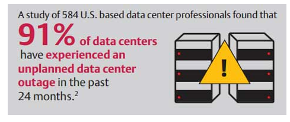
Source: Data Center Knowledge

#### Notes:
影响衣食住行、财产损失、PV、GMV损失、商业赔付、公司信誉下降、给竞品机会

<!-- Slide number: 144 -->
### 企业服务中断1小时所带来的损失

© Statista 2022
>87.6小时
<5分钟
>8.7小时
>52分钟
公司产品可用性
来源：混沌工程实验室

#### Notes:
影响衣食住行、财产损失、PV、GMV损失、商业赔付、公司信誉下降、给竞品机会

<!-- Slide number: 145 -->
### 稳定性风险集中治理 – 故障画像
链路设计类
预案设计类
异常场景类
故障发生缺乏标准化流程
快速恢复止损优于问题排查
节点异常状态下的表现
异常场景下的预案是否完善
各类链路异常预案的正确性、有效性问题，预案验证的常态化问题
依赖异常
内存泄漏
线程池满
连接池满
依赖超时
应用问题
进程僵死
同步问题
组件问题
异步阻塞
缓存异常
热点问题
慢查询
稳定性风险
网卡问题
跨机房
网络问题
延时
丢包
重试风暴
带宽问题
网络抖动
内存争抢
IO异常
宕机
节点异常
集群异常
CPU争抢
系统问题

<!-- Slide number: 146 -->
### 混沌工程出现：以毒攻毒

> [!TIP]
> **混沌工程 (Chaos Engineering)**：是分布式系统的实验学科，是一套基于系统的实验以提高技术架构弹性能力的复杂技术解决方案，用于验证系统在生产中抵御突发事件的能力。

混沌工程(Chaos Engineering)是分布式系统的实验学科，是一套基于系统的实验以提高技术架构弹性能力的复杂技术解决方案、在生产中抵御突发事件能力
影响

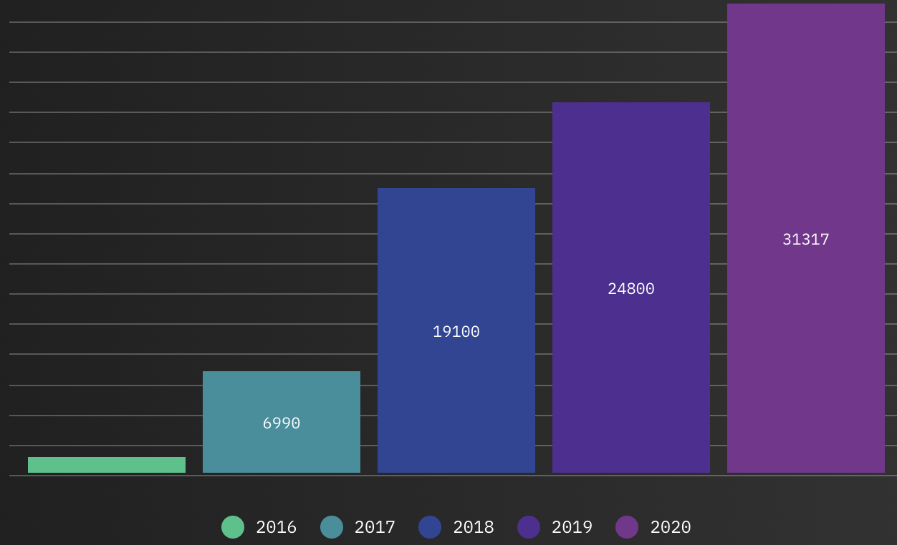
Google searches for "Chaos Engineering"

#### Notes:

影响衣食住行、财产损失、PV、GMV损失、商业赔付、公司信誉下降、给竞品机会

<!-- Slide number: 147 -->
### 混沌工程确实能提升系统可用性
https://www.gremlin.com/state-of-chaos-engineering/2021/

影响

#### Notes:
影响衣食住行、财产损失、PV、GMV损失、商业赔付、公司信誉下降、给竞品机会

<!-- Slide number: 148 -->
### 混沌工程发展历程

影响

#### Notes:
影响衣食住行、财产损失、PV、GMV损失、商业赔付、公司信誉下降、给竞品机会

<!-- Slide number: 149 -->
### 混沌工程的原则

> [!IMPORTANT]
> **混沌工程的五项原则**：
> 1. **建立围绕稳态行为的假说**：定义系统正常运行时的“稳态”指标。
> 2. **多样化真实世界的事件**：引入服务器崩溃、硬盘故障、网络断开等真实变量。
> 3. **在生产环境中运行实验**：真实反映生产环境下的韧性。
> 4. **持续自动化运行实验**：将实验常态化、自动化。
> 5. **最小化影响范围 (控制爆炸半径)**：确保实验风险可控，不影响大面积用户。

在实验中引入反映真实事件的变量，如服务器崩溃、硬盘故障、网络连接断开等
计划/报告
混沌工程
人员组织/实践

量化评价
业务应用
风险保护
安全审计
报告改进
故障注入

故障注入
基础平台

故障注入
基础设施

演练可观测
建立一个围绕稳定状态行为的假说
多样化真实世界的事件
在生产环境中运行实验
持续自动化运行实验
最小化影响范围

<!-- Slide number: 150 -->
### 混沌工程关键工作

实验设计
故障画像
上下游依赖梳理
链路受力分析

注入故障能力

稳态标准

爆炸半径控制

【运】私有云、容器化、贝壳云、…
【研】Java、Go、Cpp、PHP、…
【测】接口、性能、巡检自动化
线上服务定制化稳定标准定义
服务/业务/链路级稳态定义和管理
灵活的稳态可接入能力
节点可控
链路可控
演练隔离机制
兜底安全策略

<!-- Slide number: 151 -->
### 爆炸半径控制

> [!IMPORTANT]
> **什么是爆炸半径？**
> 爆炸半径是指混沌实验注入的故障可能波及的系统范围。控制爆炸半径是为了确保在最小实验范围内暴露问题，而不会引发意外的大规模系统故障。
> 
> **最佳实践**：
> - **分级发布**：随着对系统信心的增加逐步扩大实验范围（从线下环境、沙盒到生产环境的灰度流量）。
> - **快速熔断与自动恢复**：必须有完备的自动化预案和一键终止演练的手段。

最小实验范围内让系统潜在问题暴露，而不会意外造成更大规模故障
实验环境
实验流量

线下环境
引流流量
mock流量
沙盒环境
压测流量
回放流量

压测流量

生产环境
流量抽样x%
金丝雀环境
单/多实例
请求粒度
测试中间件-请求粒度实验
用户粒度
实践经验：
选择最小爆炸半径
混沌实验的“分级发布”：随对系统信心增加而逐步扩大实验范围
混沌并不意味着一定要在全量生产环境实施
完备的自动化、高效预案；快速熔断能力

<!-- Slide number: 152 -->
### 混沌工程的局限性
混沌工程有技术、有价值，但它的局限性也很明显
过时的疫苗不一定能增强身体的免疫力。经过混沌工程的系统可能还会继续宕机。头痛医头、脚痛医脚，不够全面，而且故障（模式）是人为设计的，局限于过去发生的故障，无法发现未来出现的新的故障
无数的混沌工程将无法修复“泥浆大球”，在混沌工程实验时发现问题，修正问题已经变得很困难
前进一步，后退两步，在某一方面的优化工作可能会增加其他方面的脆弱性
以优美的、自动的方式来注入故障的同时，给系统增加了新的复杂性，更多的实验可能给系统更进一步的伤害
过多关注故障测试，容易导致忽视前期设计工作和事后反思评估的工作
“一键回滚”具有欺骗性，数据可能在回滚时已经遭到破坏

<!-- Slide number: 153 -->
### 国外的混沌工程实践：Slack的灾难片剧场
2018年1月启动，严格的流程，遵循的流程都是为了最大限度地提高学习效果，同时将生产事故的风险降到最低
详细的计划和精心的组织，每次演习都是在指定的时间内进行，专家集中在一起，包括进行探索性的演习、在运营团队中传阅响应计划。
演习的主持人记录如何 ”incite the failure“、运行哪些命令，以及哪些Amazon EC2实例将被涉及，还记录了所有应该被监控的日志、指标和警报…
主持人会提一系列问题，如对“基于开发环境的容错性预测生产环境的容错性 ”有多大信心？

<!-- Slide number: 154 -->
### Google's Disaster Recovery Program
RTO：恢复时间目标
RPO：恢复点目标
构建专用架构模式，以标准化灾难恢复方法，恢复能力期望与服务中断场景相匹配

层级2
层级3:灰色的需要恢复
层级1: 零故障
RTO 为 零RPO 为 零
RTO 为 4 小时RPO 为 零
RTO 为 12 小时RPO 为 24 小时
区域

<!-- Slide number: 155 -->
### 微软的混沌工程

uses an agent-based fault to add CPU pressure to a Linux VM with the Azure portal
CLI：az vm identity assign --ids $VM_RESOURCE_ID --identities $MANAGED_IDENTITY_RESOURCE_ID

<!-- Slide number: 156 -->
### 实验

<!-- Slide number: 157 -->
### 故障库
Time delay
CPU pressure
Physical memory pressure
Virtual memory pressure
Disk I/O pressure (Windows)
Disk I/O pressure (Linux)
Arbitrary Stress-ng stress
Stop Windows service
Time change
Kill process
DNS failure
Network latency
Network disconnect
Network disconnect with firewall rule
ARM virtual machine shutdown
ARM virtual machine scale set instance shutdown
Cosmos DB failover
AKS Chaos Mesh network faults
AKS Chaos Mesh pod faults
AKS Chaos Mesh stress faults
AKS Chaos Mesh IO faults
AKS Chaos Mesh time faults
AKS Chaos Mesh kernel faults
AKS Chaos Mesh HTTP faults
AKS Chaos Mesh DNS faults
Network security group (set rules)
Azure Cache for Redis reboot
Cloud Services (Classic) shutdown
Key Vault Deny Access

AKS：Azure Kubernetes Service
https://docs.microsoft.com/en-us/azure/chaos-studio/

<!-- Slide number: 158 -->
### 可观察性

<!-- Slide number: 159 -->
### 优秀实践1：复杂系统韧性实现之道

来源：中国信息通信研究院，2021年

<!-- Slide number: 160 -->
### 优秀实践2: 从灾难中学习、细化实验目标

<!-- Slide number: 161 -->
### 示例：基于历史问题抽象建设通用故障库
业务攻击
core
oom
性能下降
业务应用
…………….
格式错误
依赖超时
配置错误
实例迁移
实例部署
下游失败
环境错误
基础架构
存储热点
读写拒绝
连接打满
性能下降
cpu抢占
内存抢占
io抢占
…………….
宕机
假死
磁盘读写慢
网卡打满
基础设施
网络抖动
网络拥塞
网络中断
dns异常
风:空调
火:消防
水:恒湿
…………….

<!-- Slide number: 162 -->
### 优秀实践3: 从线下到生产、从小到大
测试环境-> Staging环境 -> 预览环境特定流量 -> 生产集群全流量
可控流量 -> 单个接口 -> 单机 -> 单集群 -> 单机房 -> 全链路

<!-- Slide number: 163 -->
### 优秀实践4: 混沌工程可观察性

<!-- Slide number: 164 -->
### 优秀实践5: 采用开源混沌工程平台
Open Source solutions for chaos engineering in Kubernetes
kube-monkey: https://github.com/asobti/kube-monkey
chaoskube: https://github.com/linki/chaoskube
Chaos Mesh: https://github.com/chaos-mesh/chaos-mesh
Litmus Chaos: https://github.com/litmuschaos/litmus
Chaos Toolkit: https://github.com/chaostoolkit/chaostoolkit/
KubeInvaders : https://github.com/lucky-sideburn/KubeInvaders

https://blog.container-solutions.com/comparing-chaos-engineering-tools

#### Notes:
字节跳动：容灾演练平台到故障模型、故障中心和自动化指标分析、红蓝对抗等
携程：Cmonkey，场景覆盖访问入口类、应用类、数据类、系统和网络等5大类

<!-- Slide number: 165 -->
### ChoasBlade
https://github.com/chaosblade-io/chaosblade
Chaosblade 是阿里内部 MonkeyKing 对外开源的项目，是在十年故障测试和演练实践基础上不断演化而成，支持丰富的实验场景：

基础资源：如 CPU、内存、网络、磁盘、进程等
Java 应用：如数据库、缓存、消息、JVM 本身、微服务等，还可以指定任意类方法注入各种复杂的实验场景；
C++ 应用：如指定任意方法或某行代码注入延迟、变量和返回值篡改等；
影响
Docker 容器：比如杀容器、容器内 CPU、内存、网络、磁盘、进程等；
云原生平台：比如 Kubernetes 平台节点上 CPU、内存、网络、磁盘、进程实验场景，kill Pod、kill docker等

#### Notes:
影响衣食住行、财产损失、PV、GMV损失、商业赔付、公司信誉下降、给竞品机会

<!-- Slide number: 166 -->
### ChoasBlade 关键组件
chaosblade：混沌实验的执行工具，执行方式包含 CLI 和 HTTP 两种，包含创建实验、销毁实验、查询实验、实验环境准备、实验环境撤销等命令，并提供完善的命令、实验场景、场景参数说明
chaosblade-exec-os: 基础资源实验场景实现。
chaosblade-exec-docker: Docker 容器实验场景实现，通过调用 Docker API 标准化实现。
chaosblade-exec-cri: 容器实验场景实现，通过调用 CRI 标准化实现。
chaosblade-operator: Kubernetes 平台实验场景实现，使用 Kubernetes 资源操作的方式来创建、更新、删除实验场景，包括使用 kubectl、client-go 、的chaosblade cli等方式执行
chaosblade-exec-jvm: Java 应用实验场景实现，使用 Java Agent 技术动态挂载
chaosblade-exec-cplus: C++ 应用实验场景实现，使用 GDB 技术实现方法、代码行级别的实验场景注入
chaosblade-spec-go: 混沌实验模型 Golang 语言定义，便于使用 Golang 语言实现的场景

<!-- Slide number: 167 -->
### ChaosBlade构成

<!-- Slide number: 168 -->
### 一个简单的演示

更多内容请参考：https://chaosblade-io.gitbook.io/chaosblade-help-zh-cn/

<!-- Slide number: 169 -->
### 云原生架构下混沌工程引入
通过naming service访问
混沌工程注入故障
异常实例迁移正常，异常实例变化不影响上游对该服务的访问，业务不受影响

单点故障容忍能力
混沌工程注入单实例故障
业务SLA等无波动，业务不受影响

状态可感知
混沌工程注入故障
PaaS能及时感知实例故障，异常实例能自动迁移成功，且业务指标不受影响
部署满足单一包描述
混沌工程注入故障
引发服务扩容，PaaS平台自动执行，而不用其他前置或者后置人工操作

从而引出面向云原生的Chaos Mesh

<!-- Slide number: 170 -->

### Chaos Mesh
https://chaos-mesh.org/website-zh/
Started out as a testing framework “Schrödinger’s Cat” for TiDB

2019

CNCF Cloud Native Interactive Landscape

2020.2.6
2.1 GA

2021.11.30
1.0 GA

2020.9.26

2019.12.31

Open sourced on GitHub

2022.2

CNCF Incubating project

2021.7.23

2.0 GA

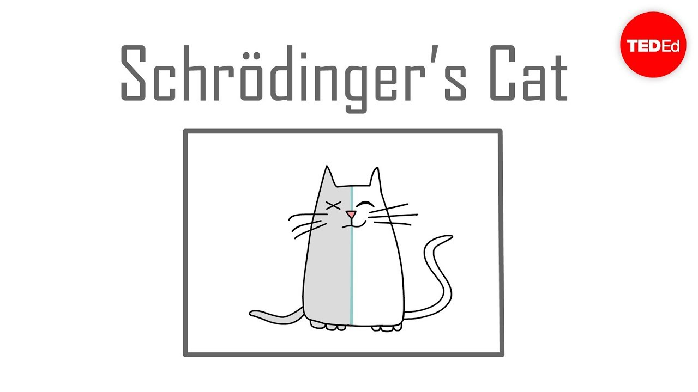
2020.7.14

CNCF Sandbox project
CNCF：Cloud Native Computing Foundation
CNCF基于著名的鸿沟理论开展项目管理，将项目分为 沙盒项目 (Sandbox) 、 孵化项目 (Incubating) 、 毕业项目 (Graduated)

#### Notes:

<!-- Slide number: 171 -->
### 声明式 API 定义简化混沌实验管理
CRD (Custom Resources) 拓展 Kubernetes API 定义
PodChaos
NetworkChaos
IOChaos
TimeChaos
StressChaos
KernelChaos
...

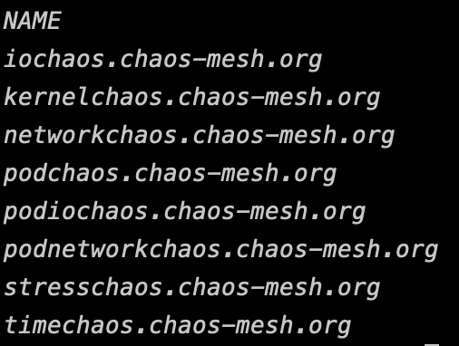

<!-- Slide number: 172 -->
### Chaos Mesh 架构

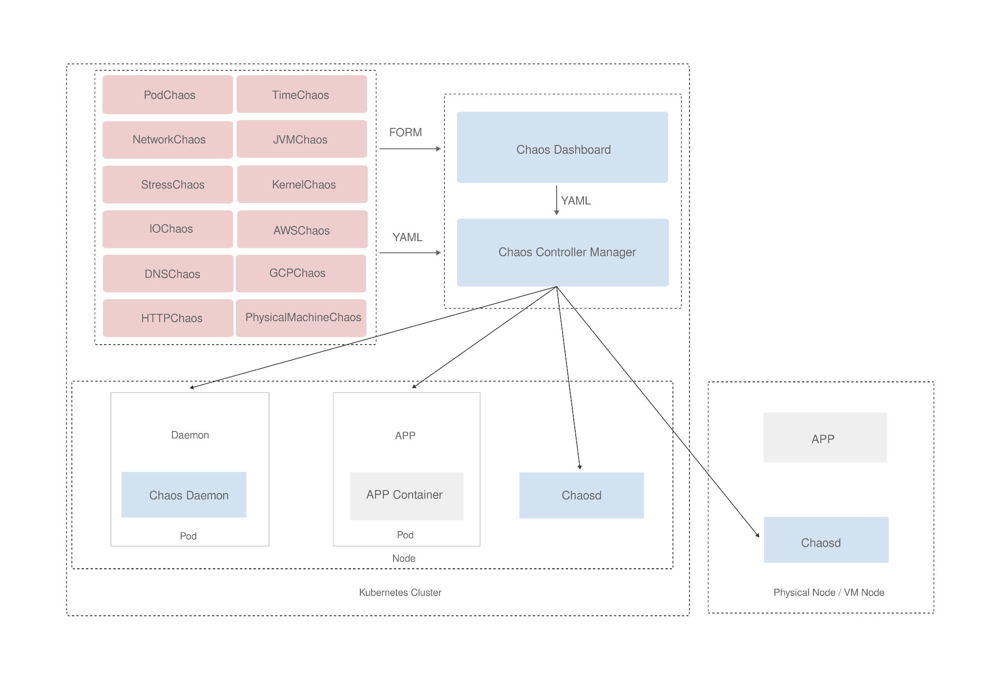
Chaos Dashboard：通过 UI 界面管理和监控混沌实验
Chaos Controller Manager
调度和控制组件
编排引擎
Chaos Daemon：K8s 环境执行组件
Chaosd：non-K8s 环境执行组件

<!-- Slide number: 173 -->
### 监听资源变化

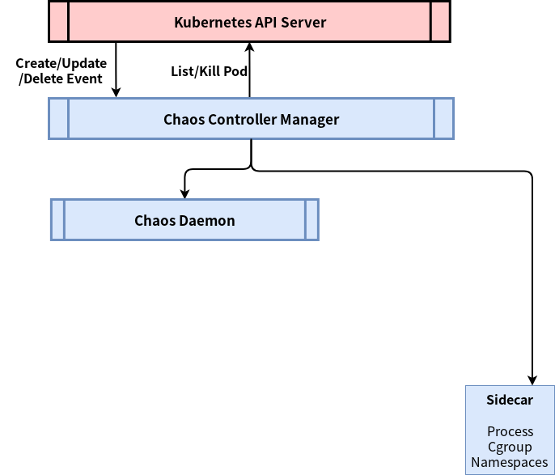
监听 PodChaos, NetworkChaos… 等资源的创建/更新/删除
决定当前该 注入 / 恢复 / 等待
进行简单的注入，比如 PodKill
向 Chaos Daemon / Sidecar 发送请求

<!-- Slide number: 174 -->
### 故障如何注入？

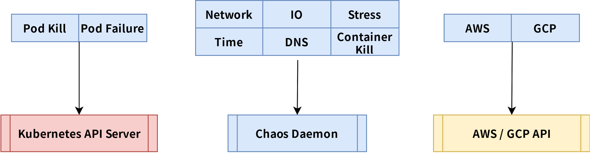
监听 PodChaos, NetworkChaos… 等资源的 创建/更新/删除
Container 的实体：
进程
Namespace 控制可见性
Cgroup 限制资源
注入的实质
侵入 Namespace / Cgroup
进行干扰、注入

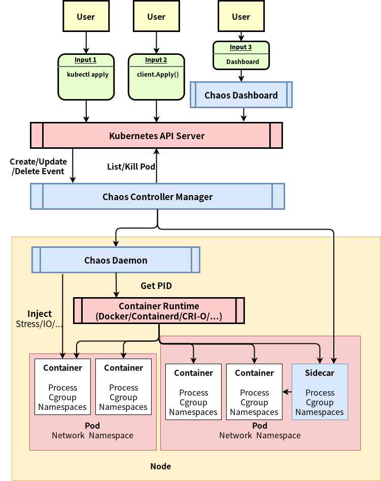

<!-- Slide number: 175 -->
### 使用 Chaos Mesh 定义混沌实验

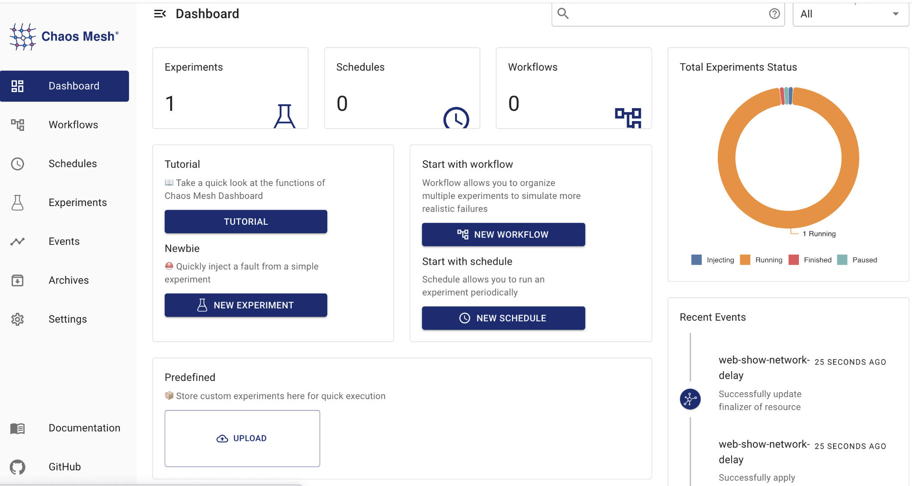
apiVersion: chaos-mesh.org/v1alpha1
kind: PodChaos
metadata:
 name: pod-failure-example
 namespace: chaos-testing
spec:
 action: pod-failure
 mode: one
 duration: '30s'
 selector:
   labelSelectors:
     'app.kubernetes.io/component': 'tikv'

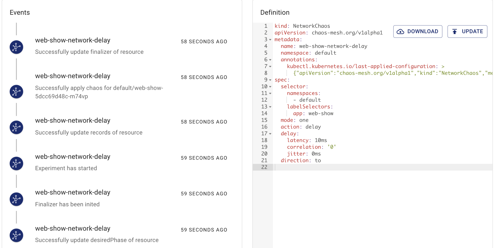

<!-- Slide number: 176 -->
### 编排混沌实验
apiVersion: chaos-mesh.org/v1alpha1
kind: Workflow
metadata:
  name: <name-of-workflow>
spec:
  entry: <refs-to-name-of-one-template>
  templates:
  - name: <name>
    templateType: <type>
  - name: <name>
    templateType: <type>
  ... 更多的 template
Workflow 主要由以下几部分构成:
Workflow 名称
Entry, 作为入口, 引用任一声明过的 Template
Template 数组, 定义各个行为
5 种不同类型的模版
Serial / Parallel / Chaos / Suspend / Task
Serial, Parallel, Task 允许将其他节点以引用的方式作为子节点
Workflow 需要指定一个节点作为入口（entry）
所有的节点之间形成了一个有向图
Workflow 定义:
名称
入口

入口引用任意 template
template 1
template 2

<!-- Slide number: 177 -->
### 用户场景演练

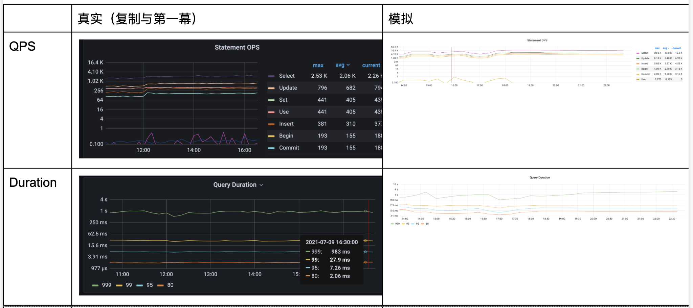

<!-- Slide number: 178 -->
### Pull Request 场景

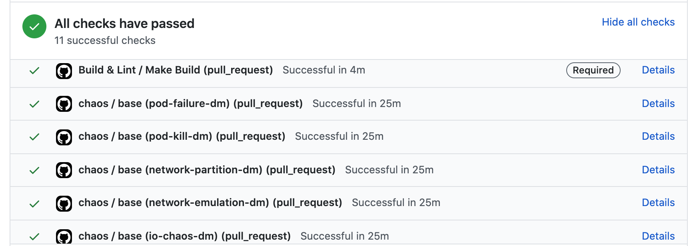

<!-- Slide number: 179 -->
从故障注入到混沌工程 – KeChaos2.0

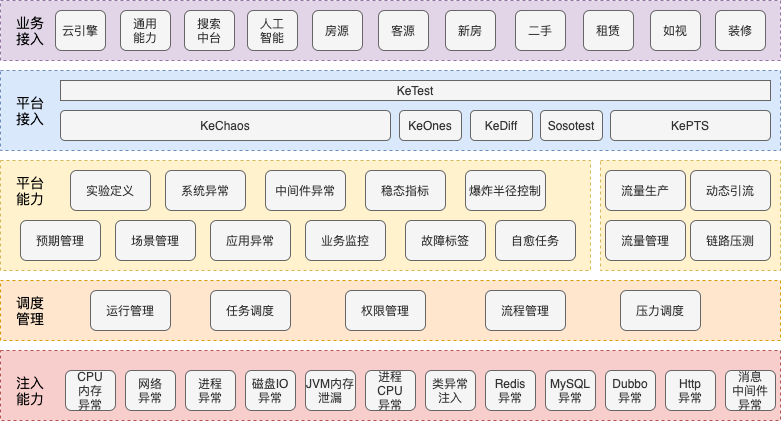
定义实验场景
关联注入能力
确定监测稳态标准
实验运行 + 爆炸半径控制
实验终止产出报告

<!-- Slide number: 180 -->
基础服务稳定性风险治理
实验验证
修复问题
做出假设
执行实验
定义实验

KeChaos 0.1：核心基础服务稳定性风险探索
KeChaos 1.0：核心基础服务常态化的故障注入和异常测试、故障演练例行化

<!-- Slide number: 181 -->
基于KeChaos的故障注入
链路分析
强弱依赖梳理
依赖降级梳理
其他熔断限流降级能力梳理
依赖梳理

报备周知
历史故障画像
专注自身服务
模拟下游异常
模拟依赖异常
故障注入
报警触达率
报警及时性
报警有效性

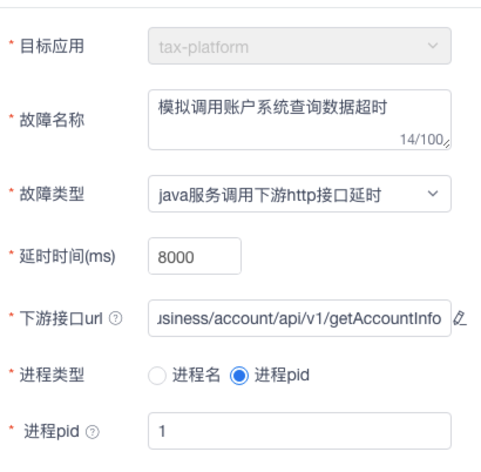
报警验证

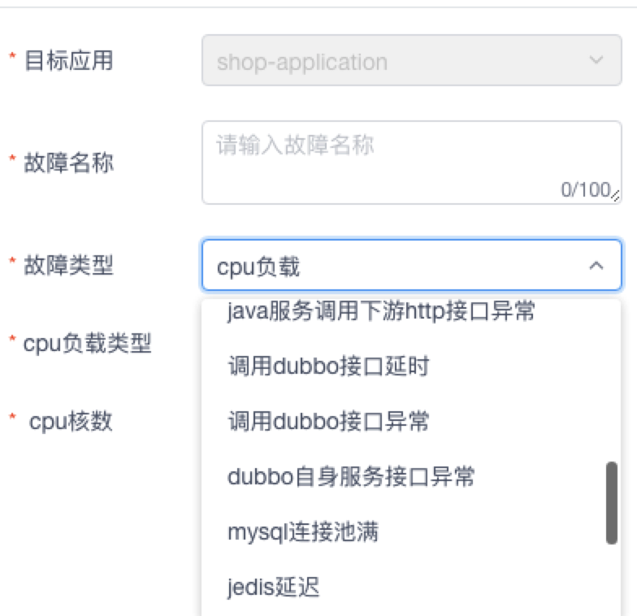

降级能力建设
限流有效性
熔断、降级有效性
降级验证

<!-- Slide number: 182 -->

## 7.5 易用性测试：A/B测试

#### Notes:
10. 软件兼容性测试
11. 全链路压测
12 混沌工程
13. A/B测试

<!-- Slide number: 183 -->
### 良好的UI元素
好的用户界面包括7个要素：符合标准和规范、直观性、一致性、灵活性、舒适性、正确性、实用性

舒适性
灵活性

<!-- Slide number: 184 -->
### 用户体验测试方法
探索式测试：可确定新产品应包含哪些内容和功能，可评估初步设计或原型的有效性和易用性。
评估性测试：在发布前或发布后对最新版本的测试，以确保用户直观使用并提供良好的用户体验。
比较性测试：比较两种或更多种产品或设计的易用性，并区分各自的优缺点，以确定哪种设计能提供最佳的用户操作体验。

<!-- Slide number: 185 -->
### 用户体验测试模型
谷歌GSM 模型，从产品或功能的目标（Goals）出发，来分析这些目标会转化为哪些信号（Signal），再根据这些信号最终建立适用的、具体的度量指标（Metric）
传统的网站UX衡量指标PULSE：Page view（页面浏览量）、Uptime（在线运行时间）、Latency（延迟）、Seven-day active user（周活用户数）、Earning（收益）。
以用户为中心的指标体系HEART： Happiness（愉悦度）、Engagement（参与度）、Adoption（接受度）、Retention（留存率）和Task success（任务完成度）
……

<!-- Slide number: 186 -->
### A/B测试

> [!TIP]
> **A/B测试 (ABTest)**：将用户随机分成不同的组，同时在线试验产品的不同版本，通过用户反馈的真实数据来确定哪一个方案更好（数据说话）。

有些东西需要 Sense，但大部分东西是可以用 Science 来做判断的
A/B测试（ABTest） 是将用户分成不同的组，同时在线试验产品的不同版本，通过用户反馈的真实数据来确定哪一个方案更好

<!-- Slide number: 187 -->
### A/B测试特点

> [!IMPORTANT]
> **A/B 测试三大特点**：
> - **先验性**：小流量在线验证，减少决策风险。
> - **并行性**：多个版本在相同环境下同时运行，消除时间维度上的干扰因素。
> - **科学性**：基于统计学（置信区间、假设检验）数据来做出决策。

先验性：采用流量分割与小流量测试的方式，先让线上部分小流量用户使用以验证设计，再根据数据反馈来推广到全流量，减少产品损失
并行性：同时运行两个或两个以上版本的试验完成对比分析，而且保证每个版本所处的环境一致的，避免流程周期长的问题，节省验证时间
科学性：基于统计的数据来做出决策，避免主观或经验的错误决策

<!-- Slide number: 188 -->
### ABTest适应的场景
灰度发布：技术&算法迭代
功能优化：界面模块、样式风格、交互方式等
内容优化：推广海报、落地页、内容模块、文案等
运营优化：运营策略、沟通话术等

<!-- Slide number: 189 -->
### ABTest适应的场景

<!-- Slide number: 190 -->
### 核心概念

> [!IMPORTANT]
> **A/B 测试核心概念**：
> - **场景**：对应特定的业务场景，各场景间完全独立。
> - **桶**：圈定特定的用户流量，**不同桶之间的流量是互斥的**。
> - **层**：一类实验的集合，一个场景可包含多个层。**同一层内的实验流量互斥，不同层之间的实验流量正交**。
> - **流量正交**：不同层之间流量分配方式完全独立，互不干扰，符合 MECE (相互独立，完全穷尽) 原则。

场景：对应业务场景，场景之间完全独立
桶：圈定了特定的用户流量，即不同的桶之间流量是互斥的。它从属于场景，一个场景可以有多个桶
层：一类实验的集合，从属于场景，一个场景可以有多个层，处于同一层的各实验之间流量互斥，处于不同层的各实验之间流量正交，各实验流量之和为总流量
实验：用来验证某个决定请求处理方式的功能或策略的一部分流量，通常用来验证某个功能或策略对系统指标（如PV/UV，CRT，下单转化率等）的影响
流量：指所有用户请求
流量正交：不同层之间流量分配方式完全独立，不会互相影响，符合MECE

<!-- Slide number: 191 -->
### A/B测试：桶、层、流量

<!-- Slide number: 192 -->
### 基于 OpenResty 的多层分流模型
跨平台、语言的ABTest网关

1～50

版本A

终端唯一标识请求URI
URI匹配
终端
MurmurHash算法
Redis
实验策略地

版本B
51～100
App，H5，小程序
ABTest header
Mfw_project
Cookie协议
网关
后端具体服务程序
具体微服务
OpenResty是一个基于 Nginx 与 Lua 的高性能 Web 平台，用于方便地搭建能够处理超高并发、扩展性极高的动态 Web 应用、Web 服务和动态网关
https://openresty.org/cn/

<!-- Slide number: 193 -->
### OpenResty分流模型的优势
| 非OpenResty方式 | OpenResty方式 |
| --- | --- |
| sdk接口，跨语言跨平台成本高 | headermap透传，不区分语言、平台 |
| 20ms-100ms，偶有超时 | 1ms-2ms，无超时 |
| 侵入业务代码 | 无代码侵入 |
| 同步阻塞，影响业务 | 异常自动降级 |
| 产生二次流量 | 无二次流量 |

<!-- Slide number: 194 -->
### MurmurHash算法

> [!IMPORTANT]
> **MurmurHash 算法的分流优势**：
> 1. **计算极快**：比 MD5、SHA 等安全散列算法快几十倍，非常适合在网关层进行实时分流。
> 2. **散布均匀（雪崩效应好）**：对于相似的输入字符（如设备ID只差一位），能够生成极其均匀的哈希分布，从而保证了分流实验的随机性与科学性。

参与算法的 Hash 因子有设备 id、策略 id、流量层 id。MurmurHash用来实现正交和互斥实验的分流，因为有两个明显的特点：
快，比安全散列算法快几十倍
变化足够激烈，对于相似字符串，比如说「abc」和「 abd 」能够均匀散布在哈希环上

互斥 ：指两个实验流量独立，用户只能进入其中一个实验。
正交：正交是指用户进入所有的实验之间没有必然关系

<!-- Slide number: 195 -->
### A/B测试流程

产生实验想法
评估实验优先级
设计和开发实验
分析数据
应用结果

<!-- Slide number: 196 -->

### A/B测试 数据流

<!-- Slide number: 197 -->
### A/B测试SDK
实验配置动态分发：实现针对场景标识+用户分流标识的一致性哈希算法，根据场景的实验流量配置，进行实验配置的动态分发
上报ABTest数据：请求日志、业务自定义日志以及监控日志
基于ABTest埋点规范生成前端埋点标识：abTraceId（请求唯一标识）和bcm（请求结果标识）、事件标识（曝光view、点击、收藏、转发等）等追踪标识，用以透传到前端埋点来追踪用户行为

<!-- Slide number: 198 -->
### A/B测试平台功能
ABTest元数据管理，包括应用、场景与实验的创建、编辑，以及配置的发布等。
ABTest接入的开发和测试支持。用户可以方便地查看完整可用的接入示例代码，可以输入分流用户标识进行测试，以及查询实时日志等。
实时报表和离线效果报表。实时报表包含实时请求、点击(率)、转化率、千次曝光转化等相关指标数据，及其对比分析
异常监控和告警。平台实时监控 SDK 上报的 ABTest 请求数、失败数和延迟时间等数据，一旦发现异常即发出告警

<!-- Slide number: 199 -->
### A/B测试评价

<!-- Slide number: 200 -->
### A/B测试优秀实践

> [!TIP]
> **AARRR 用户漏斗模型**：
> - **Acquisition (获取)**
> - **Activation (激活)**
> - **Retention (留存/存留)**
> - **Revenue (收益)**
> - **Referral (推荐)**
> 
> AARRR 模型用于把控产品的生命周期价值，当 **LTV (生命周期价值) > CAC (获取成本) + COC (经营成本)** 时，产品即获得商业上的成功。

采用流量拦截分发的方式，摒弃了原有接口的形式，对业务代码没有侵入，性能没有明显影响，且不会产生二次流量
采用流量分层并绑定实验的策略，更精细直观地去定义分流实验
数据传输：通过在 HTTP 头部增加分流信息，业务方无需关心具体的实现语言
监控体系
用户画像等精细化定制AB
统计功效支持置信区间、特征值等
通过 AARRR 模型评估实验对北极星指标的影响
AARRR分别代表：Acquisition/获取、Activation/激活、Retention/存留、Revenue/收益、Referral/推荐。
AARRR模型把控产品整体的成本/收入关系，用户生命周期价值(LTV)远大于用户获取成本(CAC)与用户经营成本（COC）之和就意味着产品的成功

#### Notes:

<!-- Slide number: 201 -->
### A/B测试优秀实践-续
需要关注ABTest接入成本与易用性、ABTest数据价值
提升平台易用性：支持完备的ABTest元数据管理、应用级的角色和权限、实验的商家id或者用户分流标识的白名单
系统优化：多级缓存、优化SDK性能、实现SDK配置自动化和透明化、优化一致性哈希算法
支持分别针对Java和Node端的示例代码，包括引入代码库、初始化、获取实验配置以及前端埋点等。
支持测试、预发、生产等不同的应用环境。
支持输入分流用户标识获取实验配置，以测试和还原A/B分流结果。
支持实时日志明细查询，查询条件包括日志类型、实验以及以及分流用户标识等。

<!-- Slide number: 202 -->
A/B测试Dashboard
加权满意度成绩

120.9
No Feature Y
27%
Satisfaction Improvement
147.3
Feature X Off
5.5%
Satisfaction Improvement
153.8
Feature Y
154.4
Feature X On
（正面）满意比例
（正面）满意比例

78%
No Feature Y
6.60%
Off vs On
85%
Feature X Off
2.3%
Off vs On
85%
Feature Y
87%
Feature X On

#### Chart

| Category | No Feature Y | Feature Y |
|---|---|---|
| A | 5.0 | 10.0 |
| B | 10.0 | 14.0 |
| C | 15.0 | 18.0 |
| D | 18.0 | 20.0 |
| E | 20.0 | 35.0 |

#### Chart

| Category | Feature X Off | Feature X On |
|---|---|---|
| A | 5.0 | 10.0 |
| B | 10.0 | 14.0 |
| C | 15.0 | 18.0 |
| D | 18.0 | 20.0 |
| E | 20.0 | 35.0 |

<!-- Slide number: 203 -->
A/B测试分析

#### Chart

| Category | Control 181.8 | Enable New Content |
|---|---|---|
| 37316 | 5.0 | 50.0 |
| 38047 | 20.0 | 30.0 |
| 38777 | 25.0 | 30.0 |
| 39508 | 40.0 | 50.0 |
| 40238 | 60.0 | 70.0 |
| 40969 | 30.0 | 50.0 |
| 41699 | 70.0 | 80.0 |
| 42430 | 20.0 | 85.0 |
Average session
length
Subscribing occurrence per day
1%
24%

#### Chart

| Category | Series 1 |
|---|---|
| Category 1 | 4.0 |
| Category 2 | 5.0 |
| Category 3 | 5.0 |
| Category 4 | 3.0 |
| Category 5 | 6.0 |

#### Chart

| Category | Series 1 |
|---|---|
| Category 1 | 4.0 |
| Category 2 | 5.0 |
| Category 3 | 5.0 |
| Category 4 | 3.0 |
| Category 5 | 6.0 |

Views Content occurrences /session
Time in subscribingper daily user
28%
24%

#### Chart

| Category | Series 1 |
|---|---|
| Category 1 | 4.0 |
| Category 2 | 5.0 |
| Category 3 | 5.0 |
| Category 4 | 3.0 |
| Category 5 | 6.0 |

#### Chart

| Category | Series 1 |
|---|---|
| Category 1 | 4.0 |
| Category 2 | 5.0 |
| Category 3 | 5.0 |
| Category 4 | 3.0 |
| Category 5 | 6.0 |

Sessions per daily user
Sign In occurrences per daily user
7%
32%

#### Chart

| Category | Series 1 |
|---|---|
| Category 1 | 4.0 |
| Category 2 | 5.0 |
| Category 3 | 5.0 |
| Category 4 | 3.0 |
| Category 5 | 6.0 |

#### Chart

| Category | Series 1 |
|---|---|
| Category 1 | 4.0 |
| Category 2 | 5.0 |
| Category 3 | 5.0 |
| Category 4 | 3.0 |
| Category 5 | 6.0 |Daily Active Users

Lifetime value per daily user
Subscribed occurrences per daily user
60%
9%

#### Chart

| Category | Series 1 |
|---|---|
| Category 1 | 4.0 |
| Category 2 | 5.0 |
| Category 3 | 5.0 |
| Category 4 | 3.0 |
| Category 5 | 6.0 |

#### Chart

| Category | Series 1 |
|---|---|
| Category 1 | 4.0 |
| Category 2 | 5.0 |
| Category 3 | 5.0 |
| Category 4 | 3.0 |
| Category 5 | 6.0 |

<!-- Slide number: 204 -->
多因素的A/B实验
To Statistically Significant Confidence
A/B Testing    Improvements

Button Color Test
New Headline Test
Totally New Landing Page
Another All-new Landing Page
+1.5
6

登录页面
+0.8
8

-4.0%
4.5

+6.0%
2

<!-- Slide number: 205 -->
A/B测试结果分析

#### Chart

| Category | Sum of Newsletter Sign Ups |  Sum of Amount  |
|---|---|---|
| Landing Page 01 | 65.0 | 100.0 |
| Landing Page 02 | 46.0 | 140.0 |
| Product Video | 93.0 | 60.0 |
| No Product Video | 66.0 | 100.0 |
| Remove Navigation | 12.0 | 150.0 |
| Add Navigation | 80.0 | 20.0 |
| Longer From | 60.0 | 80.0 |
| Shorter Form | 120.0 | 96.0 |SUM OF AMOUNT
Sum of newsletter Sign up
Remove Navigation
Landing Page 02
No Product Video
Add
Navigation
Landing Page 01
Longer Form Page
Shorter Form Page
Show Product Video

<!-- Slide number: 206 -->
逐层递进的A/B实验：决策树
158 {n=38, 100%}
Pageviews < 8460
117 {n=7, 18%}
167 {n=31, 82%}
Pageviews < 7720
Clicks >= 775
17 {n=4, 11%}
149 {n=15, 39%}
184 {n=16 42%}
Experiment >= 0.5
Pageviews < 9907
Pageviews < 9418
134 {n=7 18%}
162 {n=8, 21%}
176 {n=16, 34%}
Experiment >= 0.5
Experiment >= 0.5
DOW = Sun, Tue, Fri, Sat
130 {n=5 13%}
171 {n=5 13%}
171 {n=11 29%}
Pageviews < 9765
DOW = Mon, Wed
Clicks >= 730
142
n=2, 5%
164
n=4, 11%
196
n=1, 3%
147
n=2, 8%
154
n=3, 8%
178
n=8, 21%
198
n=2, 5%
222
n=3, 8%
121
n=2, 5%
132
n=2, 5%
103
n=3, 8%
124
n=3, 8%
139
n=2, 5%

<!-- Slide number: 207 -->
A/B测试Testin技术架构

<!-- Slide number: 208 -->
A/B测试平台设计

<!-- Slide number: 209 -->
A/B测试后端的多级缓存
缓存 30s 的情况下
Nginx

Worker
Lru cache
Worker
Lru cache
Worker
Lru cache
L1
命中率在 99%

Lru_shared_dict
命中率在 0.5 %
L2

mutex
Callback
lua-resty-lock
请求只有 0.03 %
I/O fetch
L3
Redis

<!-- Slide number: 210 -->
### 本节小结
兼容性测试覆盖软件于硬件、软件与软件、数据之间的兼容性，而且数据兼容更为重要，因为数据更具价值
全链路压测可看作是性能测试的的右移，全面地提升系统的稳定性。
混沌工程可看作是故障注入测试的右移，并提升为工程层次，遵守五项原则，践行优秀实践，熟练使用开源工具
A/B测试是为了提高用户体验采用的科学方法，让数据说话
A/B测试包括实验设计、流量分发控制算法等关键内容
建立一个灵活支持A/B测试的平台

<!-- Slide number: 211 -->
去搭建一个简单的A/B测试平台

https://posthog.com/blog/best-open-source-ab-testing-tools
https://www.convert.com/blog/a-b-testing/best-free-and-open-source-a-b-testing-software/

#### Notes:
的朋友戴比上学老是迟到，她想改变这个糟糕的情况，请你提建议。你需要从戴比那儿获得哪些信息才能给她一个好的建议？
在老师引导下，孩子们会重点考虑：为什么戴比会经常迟到？或者说，让她迟到的因素有哪些，这些因素哪些能有改变，哪些无法改变？能改变的因素，改进方法有哪些

<!-- Slide number: 212 -->
学习资源推荐

《软件性能测试、分析与调优实践之路》，清华大学出版社，2020.7
《全栈性能测试修炼宝典 JMeter实战（第2版） 》，人民邮电出版社，2021.5
《 Web安全攻防：渗透测试实战指南》，电子工业出版社，2018.7
《 超大流量分布式系统架构解决方案》 ，电子工业出版社，2020.3
《混沌工程：复杂系统韧性实现之道》，机械工业出版社，2021.6
《 A/B测试：创新始于试验》，机械工业出版社，2019.4

<!-- Slide number: 213 -->
### 感 谢 聆 听
朱少民 / 同济大学

#### Notes:
每课结束时使用“以上是本节课的内容”“这一章讲到这里”\n
## 期末重点考点与概念提炼

### 核心术语
1. **性能测试 (Performance Testing)**：在特定负载条件下，通过工具模拟系统运行，监控各项性能指标，以发现性能瓶颈、验证性能指标或进行性能调优。
2. **思考时间 (Thinking Time)**：用户在发出连续两个请求之间的间隔时间，是模拟真实用户行为的关键参数。
3. **性能基准测试 (Baseline Testing)**：在系统标准配置下获得的性能数据，作为未来进行性能对比 and 改进的基准线。
4. **压力测试 (Stress Testing)**：模拟超高负载或异常负载，使系统加速崩溃，以检验系统在极限状态下的容错与恢复能力。
5. **渗入测试 (Soak Testing)**：通过长时间的持续负载运行，使潜在问题（如内存泄漏、GC停顿）暴露出来的测试方法。
6. **脆弱性/漏洞 (Vulnerability)**：系统中存在的可能被威胁利用从而导致安全策略违犯、造成资产损失的薄弱环节。
7. **CIA 三元组 (Confidentiality, Integrity, Availability)**：信息安全的三大核心目标——保密性（防未授权访问）、完整性（防未授权篡改）、可用性（确保授权访问）。
8. **STRIDE 模型**：微软提出的威胁建模方法，包括：假冒（Spoofing）、篡改（Tampering）、抵赖（Repudiation）、信息泄露（Information Disclosure）、拒绝服务（Denial of Service）、特权升级（Elevation of Privilege）。
9. **模糊测试 (Fuzz Testing)**：向被测系统输入大量随机、畸形的数据，监测系统是否崩溃或发生异常，以快速定位隐蔽的安全缺陷。
10. **渗透测试 (Penetration Testing)**：模拟黑客攻击手段对目标系统进行安全漏洞探测，评估其脆弱性并提供修复方案。
11. **向后兼容性 (Backward Compatibility)**：新版本软件能够正确读取或处理旧版本软件产生的数据/文件的能力。
12. **DDP (Defect Detection Percentage, 错误发现率)**：用于度量测试有效性及系统成熟度的指标，计算公式为：测试发现的错误数量 / 已知的全部错误数量。
13. **混沌工程 (Chaos Engineering)**：在分布式系统生产环境中主动注入故障，通过实验验证并提升系统韧性与容错能力的工程方法。
14. **爆炸半径 (Blast Radius)**：混沌实验中所注入的故障可能波及并影响的系统范围与用户流量比例。
15. **A/B 测试**：将用户随机分流到不同的产品版本中，通过收集真实数据对比评估各方案优劣的在线实验手段。
16. **流量正交与互斥**：在多层A/B测试中，正交表示不同层实验的分流相互独立，无相关性；互斥表示同一层内不同实验的用户流量不重叠。
17. **AARRR 模型**：衡量产品用户生命周期的指标模型，包括获取 (Acquisition)、激活 (Activation)、留存 (Retention)、收益 (Revenue)、推荐 (Referral)。

### 期末考点提炼

#### 一、简答与分析题考点
1. **思考时间（Thinking Time）在性能测试中的作用与影响**
   - **答题要点**：若思考时间为零，服务器会瞬间超载并形成极长的等待队列，导致内存耗尽、系统假死，这无法模拟真实用户的操作模式。合理设置思考时间可以真实还原用户行为，得出客观的并发用户数与吞吐量关系。

2. **压力测试、负载测试、渗入测试与峰谷测试的异同点**
   - **答题要点**：
     - *负载测试*：在不同工作负载下评估性能指标，找到系统最大处理限度。
     - *压力测试*：加压到极限负载甚至异常负载，使其崩溃，检验系统的容错和瓶颈。
     - *渗入测试*：长时间运行负载以发现内存泄漏、GC等慢性问题。
     - *峰谷测试*：通过高低突变负载（峰值与低谷交替）来暴露系统在负载剧烈波动时的稳定性问题。

3. **C/C++中常见的缓冲区溢出函数及防御措施**
   - **答题要点**：
     - 易溢出函数：`strcpy`, `strcat`, `gets`, `sprintf`, `scanf` 等，因其不检查目标缓冲区边界。
     - 防御措施：使用带边界检查的安全版本函数（如 `strncpy`, `strncat`, `fgets`, `snprintf` 等）；在编译时开启缓冲区溢出检测（如 `-fstack-protector`）；使用静态分析工具扫描代码。

4. **STRIDE威胁模型与CIA安全目标的映射关系**
   - **答题要点**：
     - *假冒 ID (Spoofing)* -> 违反 **认证性/保密性 (Authentication)**
     - *篡改 (Tampering)* -> 违反 **完整性 (Integrity)**
     - *抵赖 (Repudiation)* -> 违反 **不可抵赖性 (Non-repudiation)**
     - *信息泄露 (Information Disclosure)* -> 违反 **保密性 (Confidentiality)**
     - *拒绝服务 (Denial of Service)* -> 违反 **可用性 (Availability)**
     - *特权升级 (Elevation of Privilege)* -> 违反 **授权控制 (Authorization)**

5. **混沌工程的局限性是什么？**
   - **答题要点**：
     - 人为设计的故障模式局限于已知过去，无法预测未知未来的故障。
     - 如果系统架构本身很差（泥浆大球），频繁演练难以从根本上解决系统脆弱性。
     - 局部优化可能会增加系统其他层面的复杂性与脆弱性。
     - 故障注入工具本身也给系统增加了新的复杂度。
     - “一键回滚”可能存在数据已被破坏、无法完美恢复的风险。

6. **A/B 测试的三个核心特点及流量分流机制**
   - **答题要点**：
     - *先验性*：先线上灰度小流量，验证后再全量，规避决策风险。
     - *并行性*：各实验组所处环境完全一致，消除时间维度上的干扰因素。
     - *科学性*：基于统计学置信区间与假设检验，用数据科学决策。
     - *分流机制*：利用 MurmurHash 算法对用户设备ID等因子哈希并取模，保证用户被均匀、稳定地分流到互斥或正交的实验组中。

#### 二、实操与计算设计题
1. **DDP（错误发现率）计算**
   - **练习题**：某软件在测试阶段共发现缺陷 120 个。软件发布后，用户在使用过程中又发现了 30 个缺陷。请计算该测试过程的错误发现率（DDP）并评估测试成熟度。
   - **解答公式**：
     $$\text{DDP} = \frac{120}{120 + 30} \times 100\% = 80\%$$
     *分析*：DDP为80%，意味着有20%的遗留缺陷漏到了生产环境，可根据项目质量标准判断是否达到成熟度要求（一般高可靠系统要求DDP > 90%或95%）。

2. **性能需求计算（并发用户数评估）**
   - **练习题**：某系统每天预计处理交易总量为 1200 万笔。根据历史规律，高峰期交易请求是平均值的 4 倍。如果每笔交易的平均响应时间为 2 秒，思考时间为 3 秒。请问在高峰期该系统每秒需要处理的吞吐量（RPS）是多少？
   - **解答步骤**：
     1. 一天总秒数 = $24 \times 3600 = 86400$ 秒。
     2. 日平均吞吐量 = $12,000,000 / 86400 \approx 138.89$ 笔/秒。
     3. 高峰期吞吐量 (RPS) = $138.89 \times 4 \approx 555.56$ 笔/秒。

3. **JMeter 分布式压测环境的设计与配置**
   - **答题要点**：
     - *架构设计*：采用 Master-Slave 架构。Master 节点负责分发测试脚本、收集并汇总各 Slave 的结果；Slave (Agent) 节点负责向被测系统 (SUT) 发送并发请求。
     - *关键配置步骤*：
       1. 在所有 Slave 机器上启动 `jmeter-server`，确保 JVM 版本和 JMeter 版本一致。
       2. 在 Master 的 `jmeter.properties` 配置文件中，找到 `remote_hosts` 项，填入所有 Slave 的 IP 地址和端口（如 `remote_hosts=192.168.0.10:1099,192.168.0.11:1099`）。
       3. 确保 Master 与各 Slave 之间网络互通，关闭或配置好防火墙端口，确保没有数据包被拦截。
\n