# 第9章 测试自动化及其框架


> [!TIP]
> **测试自动化 (Test Automation)**：通过平台、系统或工具自动地完成测试的某类工作都可以归为测试自动化。
> 自动化测试更侧重的测试用例或测试数据生成、测试执行和测试结果呈现等自动化。自动化测试为评审提供辅助工具和代码静态分析。自动化测试可以覆盖系统的接口测试、UI功能测试和专项测试。

## 自动化测试的内涵与原理

### 自动化测试越来越受重视
根据我们最近几年的调查，自动化测试是大家最为关注的，自动化测试高水平（达到90%以上）从之前的4%提高到 9%，大部分已实现自动化测试(超过 50%水平的)从 32%提高到达到 43.8% (2021 年)。在人才市场中，自动化测试的要求也排在第一位。

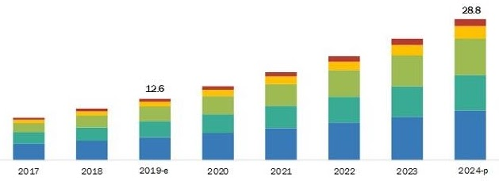
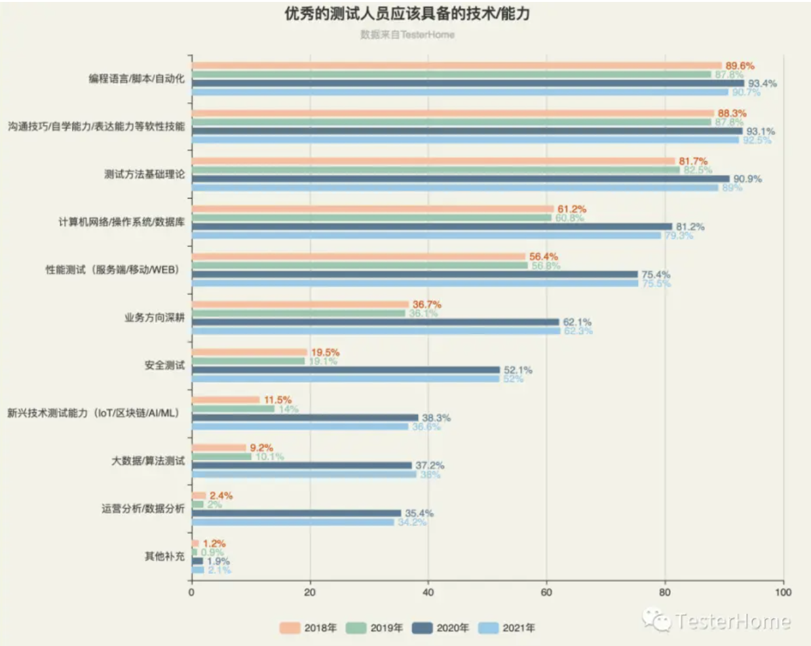
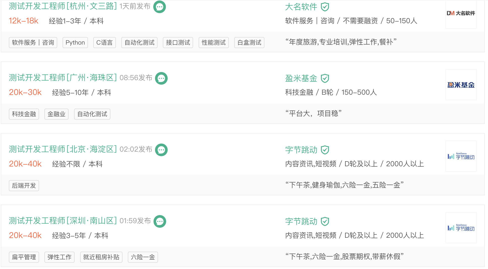

### 自动化测试分层策略

> [!IMPORTANT]
> **自动化测试分层策略 (Test Automation Pyramid)**
> - 单元测试更容易实现自动化测试，RoI也更高（收益显著）
> - API自动化测试也基本能做到100%
> - 适当加强手工E2E测试（业务层）
> - **概括起来**：以底层测试、接口测试、功能逻辑测试等为主，尽量避免UI测试。这样缺陷更易定位、效率更高、更加接近业务、反映真实需求。


现实往往是骨感的：

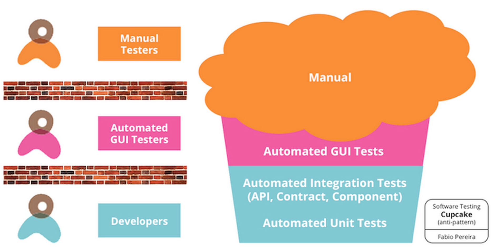

### 自动化测试四象限


详细讨论见软件质量报道公众号的文章。

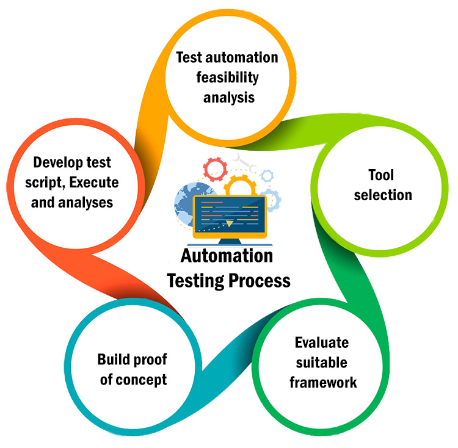

## 自动化测试的分类


自动化测试可以分为：
- 代码静态分析
- 单元测试自动化
- API（接口）自动化测试
- Web UI自动化测试
- 移动App UI自动化测试
- 自动化测试集成框架

---

## 代码静态分析：原理、框架与工具

### 代码评审辅助工具
Collaborating with pull requests @GitHub


https://docs.github.com/en/pull-requests/collaborating-with-pull-requests

### 代码静态分析原理

> [!IMPORTANT]
> **代码静态分析技术**
> 通过词法分析（Lexer）、语法分析（Parser）、控制流分析、数据流分析等技术对程序代码进行扫描，验证代码是否满足规范性、质量要求等。
> 静态分析技术可以采用模拟程序执行的技术，如符号执行、抽象解释、值依赖分析等，并采用数学约束求解工具进行路径约减或者可达性分析以减少误报、增加效率。

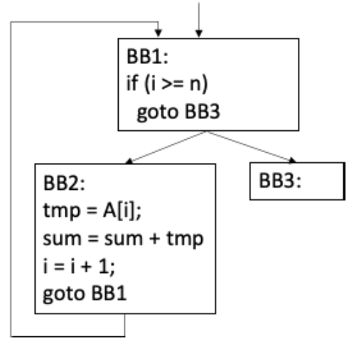

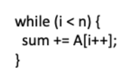

- **词法分析**：程序源代码经过词法分析器（Lexer）得到各种不同种类的单词（Token）。
- **语法分析**：由语法分析器（Parser）分析和语法检查后得到抽象语法树(AST)。
- 程序 -> 中间表示 IR -> 抽象语法树AST。
- 通常会使用控制流图（Control Flow Graph，CFG）来表示程序的控制流，使用静态单赋值（Static Single Assignment，SSA）来表示程序中数据的使用-定义链（Use-Def Chain）。

#### 示例：符号执行
微软 Pex – White Box Test Generation for .NET

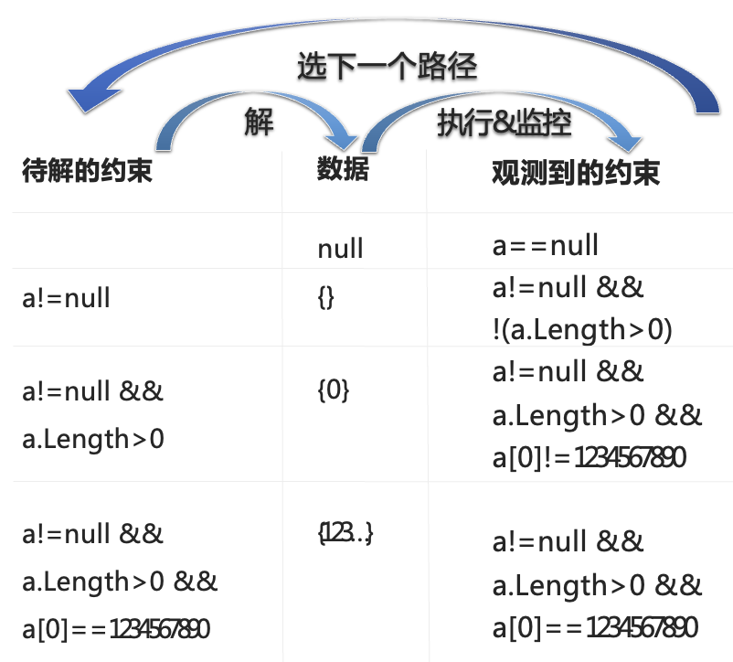


```csharp
void CoverMe(int[] a)
{
  if (a==null) return;
  if (a.Length>0)
    if (a[0] == 1234567890)
      throw new Exception("bug");
}
```

#### 值依赖分析

> [!TIP]
> **值依赖图 (Value Dependence Graph, VDG)**
> 是一种基于程序值依赖分析的、路径敏感的空指针解引用检测方法，通过结合数据流分析中的到达定值分析、区间分析及指向分析创建了值依赖分析图。


数据流分析中的定值-使用连接的依赖关系，并通过值依赖图来表现。
Alan Christopher Lawrence，Optimizing compilation with the value state dependence graph，2007。

### SAST：静态应用程序安全测试
> [!TIP]
> **SAST (Static Application Security Testing)**
> 通过调用语言的编译器或解释器把高级语言代码（如JAVA，C/C++源代码）转换成一种中间代码，将其源代码之间的调用关系、执行环境、上下文等分析清楚。

SAST 包含的分析方法：
- **语义分析**：分析程序中不安全的函数、方法使用问题。
- **数据流分析**：跟踪、记录并分析程序中的数据传递过程所产生的安全问题。
- **控制流分析**：分析程序特定时间、状态下执行操作指令的安全问题。
- **配置分析**：分析项目配置文件中的敏感信息和配置缺失的安全问题。
- **结构分析**：分析程序上下文环境、结构中的安全问题。

结合多种分析结果，匹配所有规则库中的漏洞特征以发现漏洞，形成包含漏洞信息的检测报告，包括漏洞的具体代码行数以及漏洞修复的建议。

**SAST 工具分类**：
- **正则匹配**：如 Cobra、Raptor
- **基于语法树**：如 P3C、Fireline
- **Java语言可基于class文件**：如 FindBugs
- **基于控制流、数据流、函数调用关系等**：多数商业SAST工具
- **SMT求解器**也被集成到一些大型工具中，如HOL/Isabelle、ESC/Java2、ACL2、UCLID、BLAST、ureka, CUTE和PEX等。

### DAST与IAST
> [!TIP]
> **DAST (Dynamic Application Security Testing)**：动态应用程序安全测试。
> **IAST (Interactive Application Security Testing)**：交互式应用程序安全测试。


---

## 单元测试：原理、框架与工具


### 单元测试结构
单元测试如同代码实现，但有自己的结构：
- 初始化环境
- 测试
- 断言
- 环境清理

### xUnit框架


#### JUnit 4 工作原理/框架


#### JUnit 5 架构


> [!TIP]
> **JUnit 5 架构组成** = JUnit Platform + JUnit Jupiter + JUnit Vintage
> - **JUnit Platform**：基于JVM的执行测试的基础框架及其Test-Engine API、控制台启动器（CLI）、支持CI/CD、基于JUnit 4的Runner。
> - **JUnit Jupiter**：在JUnit 5中编写测试和扩展的新编程模型和扩展模型的组合，运行基于Jupiter的测试。
> - **JUnit Vintage**：提供了TestEngine在平台上运行基于JUnit 3和JUnit 4的测试。

#### Mock技术

- Round-trip test (直接输入 -> Public interface "front door")
- **DOC**：Depend-on Component (依赖组件)
- **SUT**：System Under Test (被测系统)

#### 最常用的单元测试工具
Java、C++和Python语言的单元测试中，受欢迎的测试工具包括单元测试框架、两个智能化的单元测试用例自动生成工具、以及Mock工具、代码覆盖率工具：
- **框架**: JUnit、TestNG、GoogleTest、pytest、unittest
- **覆盖率**: Coverage.py、JaCoCo、gcov、lcov、gcovr
- **用例生成**: EvoSuite、Diffblue Cover
- **Mock工具**: JMockit


---

## API自动化测试：原理、框架与工具

### API的TA架构

- **执行方式**：触发回归、定时回归、即时触发、事件触发、按需回归。
- **用例验证**：场景设定、选择和组装API、手工组装、HAR批量生成、代码迁移、基于场景的测试用例。
- **API的来源**：文档化工具、手工录入、程序扫描、HAR导入、RAML、Swagger、Markdown。
- **API定义**：RAML（RESTful API描述性语言）、HAR（基于JSON、储存HTTP请求/响应信息的文件格式）。

### 基于API的TA工具

- **Mockbin**：可从HAR文件生成一个模拟桩
- **RAP**：淘宝开发的API管理工具
- **Swagger**：流行的API定义工具、规范
- **Easy Mock**：从swagger生成数据
- **Doclever**：编写REST接口文档，生成测试数据
- **Mocky**：无需登录，直接生成response
- 其他：kristofa/mock-http-server、wiremock、SoapUI、Rest-Assured、SOAtest、APIfortress。

---

## Web UI 自动化测试：原理、框架与工具


Web UI自动化测试的核心步骤：识别UI元素 -> 操作UI元素 -> 验证状态（比较）。

### Web UI元素与W3C DOM标准

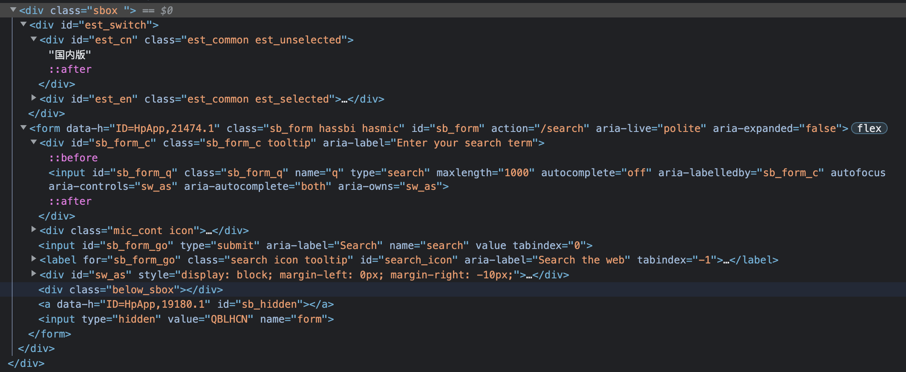


**DOM API示例**：
- `document.getElementById(id)`
- `document.getElementsByTagName(name)`
- `document.createElement(name)`
- `parentNode.appendChild(node)`
- `element.innerHTML`
- `element.style.left`
- `element.setAttribute()`
- `element.getAttribute()`
- `element.addEventListener()`

### 测试DOM API


### 定位元素

> [!IMPORTANT]
> **Web UI 定位元素方法**
> - **id** 定位：`driver.findElement(By.id("id的值"))`
> - **name** 定位：`driver.findElement(By.name("name的值"))`
> - **xpath** 定位：`driver.findElement(By.xpath("xpath表达式"))`
> - **Class** 定位：`driver.findElement(By.className("class属性"))`
> - **css** 定位：`driver.findElement(By.cssSelector("css表达式"))`
> - **TagName** 定位：`driver.findElement(By.tagName("标签名称"))`
> - **Jquery** 表达式：`Js.executeScript("return jQuery.find('jquery表达式')")`
> - **链接全部文字**：`driver.findElement(By.linkText("链接的全部文字"))`
> - **链接部分文字**：`driver.findElement(By.partialLinkText("链接的部分文字"))`

**UI元素定位示例**：


### Selenium + WebDriver


**Java HTTP Client + Selenium**：
Selenium使用HTTP & WebSocket客户端（AsyncHttpClient / jdk-http-client）来向WebDriver发送命令，从Selenium客户端库向网格发送命令，并创建ChromeDevTools协议和BiDi协议会话。
```xml
<dependency>
  <groupId>org.seleniumhq.selenium</groupId>
  <artifactId>selenium-java</artifactId>
  <version>4.6.0</version>
</dependency>
<dependency>
  <groupId>org.seleniumhq.selenium</groupId>
  <artifactId>selenium-http-jdk-client</artifactId>
  <version>4.6.0</version>
</dependency>
```

**Selenium Grid**：


### 基于Cypress的UI自动化测试

Cypress 架构：


### 基于图像识别的UI自动化测试 (SikuliX)


SikuliX1 -> SikuliNG：Implement the API completely as a REST-API backed by a server running on the target machine。

---

## 移动App UI 自动化测试框架：Appium & Airtest

### 常见测试工具比较

- **Appium** 是基于 UIAutomator 框架实现的，测试进程与目标应用进程是分开的，只能模拟触发相应事件对目标应用进行操作。
- **Robotium** 是基于 Instrumentation 框架的，测试进程与目标应用在同一个进程中作为不同线程运行，可以直接访问应用属性和数据。

### Appium


### Airtest 框架

支持Python语言的测试脚本，其开源组件包括：
- **Airtest**：跨平台的基于图像识别的UI自动化测试框架。
- **Poco**：基于UI控件识别的自动化测试框架，支持Android、iOS原生app和微信小程序。
- **AirtestIDE**：跨平台的UI自动化测试编辑器，提供脚本录制、一键回放、报告查看等功能。

**示例：基于Poco开发自动化测试脚本**


### OCR实现
目前OCR的实现一般分成两个步骤：**文本检测** 和 **文本识别**。
- **文本检测**：找到图片上文本的位置和区域（文本框）。
- **文本识别**：识别每个文本框中的文字。

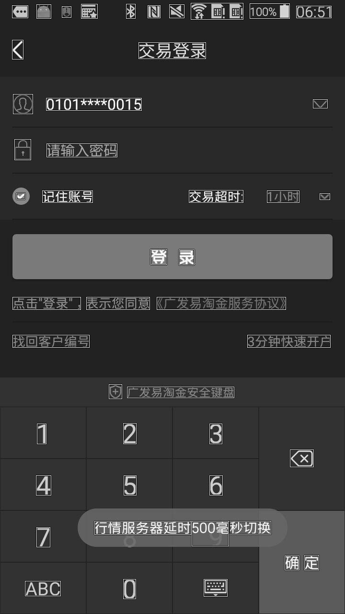
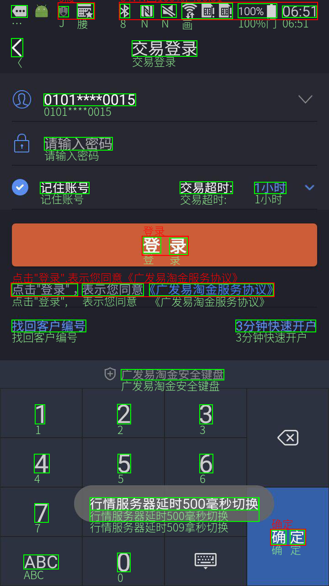

**OCR实现技术流派**：
- 常用字识别（DenseNet + CTC）
- 文本行过滤（CNN）
- 多层MSER检测（文本区域特征提取）
- 特征过滤（CNN）
- 特征合并（规则）
- 高精度识别（DenseNet + BLSTM + CTC）
- AdEAST检测（文本区域特征图）
- 后处理（框解析 + NMS）
- 多层结果合并（NMS + 规则）（相邻及重叠文本框合并）
- 繁体字识别（DenseNet + CTC）

> [!TIP]
> - **CRNN**: 卷积循环神经网络 (Convolutional Recurrent Neural Network)
> - **BLSTM**: 双向长短期记忆网络 (Bidirectional Long Short-Term Memory Networks)
> - **CTC**: 连接者时间分类 (Connectionist Temporal Classification)
> - **MSER**: 最大稳定极值区域 (Maximally Stable Extremal Regions)

---

## 自动化测试集成框架

### Selenium 关键字驱动


### RobotFramework (RF) 关键字驱动
| Setting | Value | Value | Value |
| --- | --- | --- | --- |
| Library | OperatingSystem | | |

| Test Case | Action | Argument | Argument |
| --- | --- | --- | --- |
| My Test | [Documentation] | Example test | |
| | Log | ${MESSAGE} | |
| | My Keyword | /tmp | |
| Another Test | Should Be Equal | ${MESSAGE} | Hello, world! |

| Keyword | Action | Argument | Argument |
| --- | --- | --- | --- |
| My Keyword | [Arguments] | ${path} | |
| | Directory Should Exist | ${path} | |

### 分离数据与脚本

> [!IMPORTANT]
> **分离数据与脚本 (Data-Driven)**
> 使用表（Table）或数据文件作为测试输入和可验证的输出，以及测试环境设置和控制，不采用“硬编码（hard code）”的过程。
> - **测试数据管理方式**：Excel, CSV, Property, XML, YAML, Database, JSon。
> - **优势**：处理业务实体/数据，容易描述特定的需求；读写操作容易；容易修改/维护测试数据；创建DSL来描述；容易实现比对（Outputs）。


### TA框架的构成与服务
**构成**：Harness/IDE、脚本语言(Script Language)、代理（Agents）、工具（Tools）、任务安排（Scheduler）、报告（Report）、SUT。

**提供的服务**：
- 测试件的存储与管理
- 测试脚本开发调试（TIDE）
- 测试机/资源的管理
- 任务安排
- 测试执行启动与调度
- 系统监控、Log收集
- 测试结果分析
- 测试报告查询

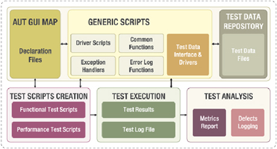

### TA框架设计要点
控制中心、多层次结构、分布式架构、通讯问题、接口定义、对象库、关键字库、数据共享、集成环境。


### TA框架支持测试设计/管理/执行


**统一规划:不同的测试类型和对象**
组件包括：Test Report Generator, Classified Test Data, Driven Script-Execution Module, Functional Libraries, Composited Tested System, Load Test Engine, Mobile Engine, Web Engine, Application Engine 等。


**数据管理与对象识别组件**
Scripts and Methods need test data or test object or both.

**测试报告组件**
包含 Test Plan, HTML Report Template, Test Report Generator, Test Script Execution Log。
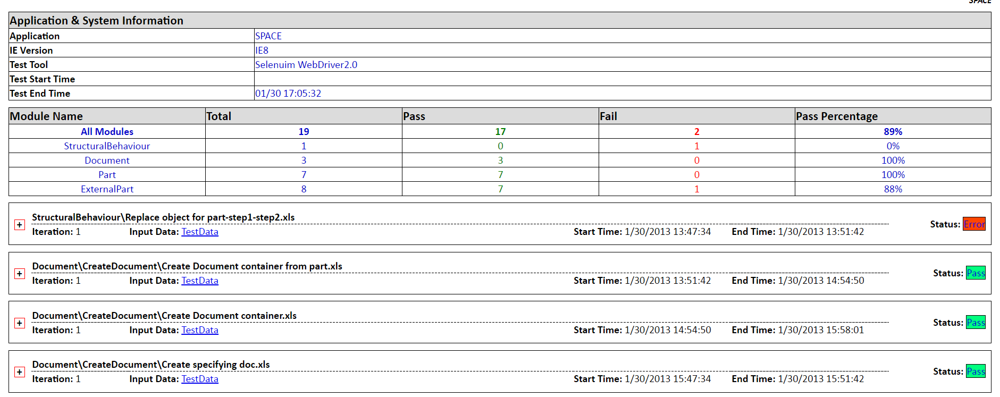

**实例：自动生成用户化的报告**


传统的自动化测试报告可读性很差，而用户化的测试报告可以非常直观地充分还原整个测试过程，极大提升测试结果的分析效率。

### Robot Framework (RF) 框架
> [!TIP]
> **Robot Framework**：一个通用的、ATDD（验收测试驱动开发）的自动化测试框架，易于使用表格来组织测试过程和测试数据。


**RF报告与插件**：


**RF扩展库/标准库**：


（如 Selenium, AutoIT, Appium, Android, Database, Http, Image, Sikuli 等）

### 其他框架示例
- **Web和Windows一体化自动化测试框架**：


- **基于SpringBoot的高效模板化自动化测试框架**：


- **RF+Selenium 完成某页面测试**：


---

## 本章小结


自动化测试具备以下特点或目标：全SDLC覆盖、高度集成、跨平台、过程透明、可测试性保障、需求可执行、支持敏捷开发 / 持续交付(CD) / DevOps。

### 提问与思考
1. 自动化测试中录制脚本轻松搞定，为何没有成为功能测试自动化脚本开发的主流？
2. 采用开源自动化测试框架还是自己开发自动化测试框架好呢？
3. 大家都重视自动化测试，但往往效果不够好，问题在哪里？

### 实验6 部署自动化测试框架
- 下载安装Robot framework；
- 安装Robot framework的GUI界面；
- 安装第三方库（Robot framework插件），如SeleniumLibrary、HTTP RequestsLibrary、AppiumLibrary、RESTinstance等；
- 启动Robot framework（RF），使用RF内建库，完成一些基本的操作的、RF自身的关键字驱动脚本。
- 结合实验3，实现RF的集成，生成测试报告；
- 基于RF和第三方库完成接口测试的脚本等，生成测试报告。

### 学习资源推荐
- 《接口自动化测试项目实战》，清华大学出版社，2021.11
- 《从零开始学Selenium自动化测试》，机械工业出版社，2020
- 《前端自动化测试框架——Cypress 从入门到精通》，电子工业出版社，2020.4
- 《Robot Framework自动化测试精解》 ，人民邮电出版社，2020.4

### 感 谢 聆 听
朱少民 / 同济大学

---

## 期末重点考点与概念提炼

### 核心术语
- **SAST (Static Application Security Testing)**：静态应用程序安全测试，通过词法、语法、控制流和数据流分析查找安全漏洞。
- **DAST (Dynamic Application Security Testing)**：动态应用程序安全测试。
- **VDG (Value Dependence Graph)**：值依赖图，用于路径敏感的空指针解引用检测。
- **DOM API**：W3C提供的页面元素操作接口。
- **SUT / DOC**：SUT代表被测系统(System Under Test)，DOC代表依赖组件(Depend-on Component)，常在Mock技术中提及。
- **OCR (Optical Character Recognition)**：光学字符识别，在基于图像识别的UI测试中用于文本检测与识别，涉及CRNN、BLSTM、CTC等网络。
- **Robot Framework (RF)**：一种通用的、基于关键字驱动和ATDD的自动化测试框架。

### 期末考点提炼
1. **自动化测试的分层策略（Test Automation Pyramid）**
   - 单元测试投入产出比（RoI）最高，应作为基础大量实施。
   - API接口测试相对容易实现自动化。
   - 尽量减少易碎的、高维护成本的UI层自动化测试。
2. **代码静态分析的技术与原理**
   - 包含词法分析（生成Token）和语法分析（生成AST抽象语法树）。
   - 可通过控制流图（CFG）与静态单赋值（SSA）等中间表示进行分析。
   - SAST工具可基于正则、语法树或控制流/数据流进行安全检查。
3. **单元测试与Mock技术的应用**
   - JUnit 5架构由Platform、Jupiter、Vintage三部分组成。
   - Mock技术用于隔离DOC，针对SUT进行验证。
4. **Web UI元素定位方法**
   - 常用的八大定位方式：id, name, xpath, className, cssSelector, tagName, linkText, partialLinkText。
5. **自动化测试框架的核心组件与设计要点**
   - **分离数据与脚本**：是自动化测试框架降低维护成本、提升灵活性的关键。
   - **数据驱动与关键字驱动**：以表格或数据文件作为测试输入，通过特定的关键字指令执行。
   - TA框架应包含脚本、测试数据管理、执行调度、测试结果报告及对象识别等组件。
6. **常见工具的区分**
   - **Selenium/Cypress**：主流Web UI自动化测试工具。
   - **Appium/Airtest/Robotium**：主流移动App UI测试工具。
   - **SikuliX/Airtest**：基于图像识别和OCR机制的自动化测试工具。