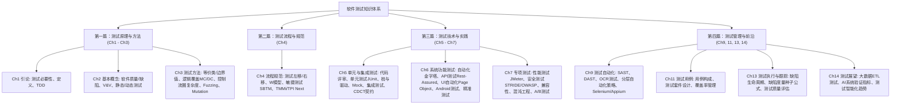

# 软件测试方法和技术期末复习指南 (Software Testing Review Guide)

> [!IMPORTANT]
> 本复习指南是针对同济大学朱少民教授《软件测试方法和技术》教材及相关课件整理的核心知识点与期末必考考点汇总。包含完整的课程大纲、思维导图、各章核心术语与期末高频题型解析。建议结合各章节详细的 Markdown 文件进行复习。

---

## 🗺️ 软件测试知识体系脑图 (Mental Map)

---

## 📚 课程大纲与章节导航 (Syllabus & Navigation)

本复习资料共包含以下 11 个章节，点击下方链接可直接跳转到对应的章节详细复习文档：

| 章节名称 | 核心主题与技术 | 对应文档链接 | 期末考点提炼 |
| :--- | :--- | :--- | :--- |
| **第 1 章 引论** | 测试定义、必要性、正/反向思维、TDD/ATDD | [Ch1-引论.md](Ch1-引论.md) | 缺陷修复成本非线性规律、正/反向思维对比、TDD障碍与克服 |
| **第 2 章 软件测试基本概念** | 软件质量模型 (ISO 9126/25000)、缺陷定义、V&V、静态分析原理、探索式测试 (ET vs ST) | [Ch2-软件测试基本概念.md](Ch2-软件测试基本概念.md) | Verification 与 Validation 辨析、探索式测试与脚本测试对比、Stub/Driver作用 |
| **第 3 章 软件测试方法** | 等价类、边界值、因果图/判定表、两两组合 (Pairwise)、逻辑覆盖、圈复杂度、基本路径、Fuzzing | [Ch3-软件测试方法.md](Ch3-软件测试方法.md) | 逻辑覆盖强弱关系、MC/DC 原理与用例设计、圈复杂度计算、因果图转判定表 |
| **第 4 章 软件测试流程和规范** | 测试左移/右移、W模型、敏捷测试价值观、基于会话的测试管理 (SBTM)、测试改进模型 (TMMi/TPI Next) | [Ch4-软件测试流程和规范.md](Ch4-软件测试流程和规范.md) | 测试左移与右移场景、W模型优缺点、SBTM(Charter/Session Sheet/PROOF)实践、TMMi与TPI Next对比 |
| **第 5 章 单元测试与集成测试** | 代码评审、第三方库风险 (SAST/SCA)、单元测试与 JUnit、测试替身 (Mock/Stub/Fake)、微服务契约测试 (CDCT) | [Ch5-单元测试与集成测试.md](Ch5-单元测试与集成测试.md) | 代码评审实践指标、SAST与SCA对比、5类测试替身选用策略、加法计算器Bug与用例设计、契约测试CDC优势 |
| **第 6 章 系统功能测试** | 分层自动化金字塔、接口测试 (WebService/REST)、UI自动化 (Page Object)、Android UI测试、精准测试 | [Ch6-系统功能测试.md](Ch6-系统功能测试.md) | 分层自动化测试ROI、Instrumentation与UIAutomator原理对比、Page Object设计思想、精准测试双向映射机理 |
| **第 7 章 专项测试** | 性能测试 (JMeter)、安全测试 (STRIDE/OWASP/Fuzz)、兼容性、混沌工程、A/B测试 (分流算法) | [Ch7-专项测试.md](Ch7-专项测试.md) | 负载/压力/渗入测试对比、STRIDE与CIA映射、DDP与RPS性能计算、A/B测试三核心与MurmurHash、分布式JMeter |
| **第 9 章 测试自动化及其框架** | 分层自动化策略、代码静态分析(SAST/DAST)、Selenium/Appium UI自动化、Robot Framework | [Ch9-软件测试自动化及其框架.md](Ch9-软件测试自动化及其框架.md) | 自动化测试分层策略(RoI)、静态代码分析原理、Web元素定位方法、自动化框架的分离数据与脚本设计 |
| **第 11 章 设计和维护测试用例** | 测试用例五大基本内容、良好测试用例标准、测试套件设计、覆盖率管理 | [Ch11-设计和维护测试用例.md](Ch11-设计和维护测试用例.md) | 测试用例编写原则(避免冗长、单一验证点)、测试套件的应用场景、用例及需求覆盖率 |
| **第 13 章 测试执行、缺陷报告与跟踪** | 测试执行进度的管理、缺陷生命周期、严重性与优先级、缺陷分布与趋势分析、种子公式质量度量 | [Ch13-测试执行、缺陷报告与跟踪.md](Ch13-测试执行、缺陷报告与跟踪.md) | 只有测试人员能关闭Bug、缺陷优先级计算公式、优秀的Bug报告要素、利用种子公式估算潜在Bug数 |
| **第 14 章 软件测试展望** | 大数据ETL测试、机器学习系统的评估指标(Precision/Recall/ROC)、智能化测试、持续测试趋势 | [Ch14-软件测试展望.md](Ch14-软件测试展望.md) | ETL各阶段验证点、机器学习的分类/回归评估指标及含义、蜕变测试、软件测试六大发展趋势 |

---

## 🎯 核心章节要点与考点速览

### 1. [第 1 章：引论](Ch1-引论.md)
* **核心内容**：解释了为什么软件不可避免地存在缺陷，探讨了软件测试的历史演进，并详细对比了以 Hetzel 为代表的“证明软件能正常工作”的**正向思维**与以 Myers 为代表的“证明程序有错”的**逆向思维**。
* **期末重点**：
  * **缺陷修复成本的非线性增长规律**：缺陷发现越晚，修复成本呈指数级（非线性）上升。要求测试活动必须“尽早介入”（测试左移）。
  * **TDD 闭环**：编写失败测试 $\rightarrow$ 编写最小代码 $\rightarrow$ 重构。
  * **测试与 SQA 的区别**：SQA 关注**过程**（管理性、Are we building it right?），测试关注**产品**（技术性、Are we building the right product?）。

---

### 2. [第 2 章：软件测试基本概念](Ch2-软件测试基本概念.md)
* **核心内容**：定义了软件质量与缺陷，介绍了 ISO 9126 及 ISO 25000（SQuaRE）质量模型，探讨了静态测试与动态测试、验证与确认（V&V），以及探索式测试（ET）。
* **期末重点**：
  * **V&V 经典对比**：验证（Verification）是“Are we building the product right?”（与规格书一致）；确认（Validation）是“Are we building the right product?”（与用户期望一致）。
  * **探索式测试 (ET) vs. 基于脚本测试 (ST)**：ET 是边测试边设计（强调人的主动性与自发设计），ST 是先设计后执行（强调合规性与规范）。
  * **单元测试环境隔离**：桩模块 (Stub) 和驱动模块 (Driver) 的功能与使用。

---

### 3. [第 3 章：软件测试方法](Ch3-软件测试方法.md)
* **核心内容**：涵盖了所有经典的黑盒与白盒测试方法，包括等价类、边界值、因果图、两两组合（Pairwise）、逻辑覆盖标准、圈复杂度、控制流分析、模糊测试、变异测试和基于场景的测试等。
* **期末重点**：
  * **逻辑覆盖强度顺序**：语句覆盖（最弱） $<$ 判定覆盖 / 条件覆盖 $<$ 判定条件覆盖 $<$ 条件组合覆盖。
  * **MC/DC (修正条件/判定覆盖)**：每个原子条件必须能独立影响判定输出。用例数仅需线性级 $n+1$ 至 $2n$，有效抵御用例爆炸，是航空航天级安全软件的强制标准。
  * **圈复杂度 V(G) 计算**：
    1. $V(G) = \text{控制流图区域数}$ (外大区算 1)
    2. $V(G) = E - N + 2$
    3. $V(G) = P + 1$ (简单判定节点数 + 1)
  * **基本路径设计**：根据圈复杂度导出线性独立基本路径集合，并设计具体的测试用例数据。
  * **因果图法约束符号**：互斥（E）、包含（I）、唯一（O）、要求（R）等逻辑关系的表述。

> [!TIP]
> 期末考试中，**控制流图绘制与圈复杂度计算**、**等价类与边界值设计**、**因果图转换为判定表**是三大必考的大型实操与设计计算题。务必熟练掌握相关的计算步骤与简化规则。

---

### 4. [第 4 章：软件测试流程和规范](Ch4-软件测试流程和规范.md)
* **核心内容**：讲解了测试在生命周期中的流转（测试左移/右移），双V模型的代表（W模型），敏捷测试流程，以及基于会话的测试管理（SBTM）和测试能力改进模型（TMMi, TPI NEXT）。
* **期末重点**：
  * **测试左移与右移**：left-shift 侧重**缺陷预防**（需求和设计评审，TDD）；right-shift 侧重**在线验证与持续反馈**（TiP、生产日志分析、A/B测试）。
  * **SBTM 探索性测试框架**：主要元素包括 **Charter**（轻量级章程）、**Session**（90分钟时限盒）、**Session Sheet**（会话记录单，采用 **TSB** 分解：Test / Bug / Setup）和 **Debriefing**（简报会，基于 **PROOF** 框架汇报）。
  * **过程改进模型对比**：TMMi 是**阶段式/分级式**模型，具有 5 个固定的成熟度级别；TPI NEXT 是**连续性模型**，定义了 20 个关键域，基于**业务驱动 (BDTM)**，支持组织根据风险灵活选择优先改进项。

---

### 5. [第 5 章：单元测试与集成测试](Ch5-单元测试与集成测试.md)
* **核心内容**：聚焦代码级别的质量保证。包括代码评审实践指标、第三方依赖分析 (SAST/SCA)、JUnit 框架的构成、测试替身的使用，以及微服务架构下的消费者驱动契约测试（CDCT）。
* **期末重点**：
  * **代码评审核心指标**：单次审查代码行控制在 200～400 行之间，审查速度 300～500 LOC/小时，单次会议不超过 60～90 分钟。
  * **测试替身 (Test Double) 辨析**：
    * **Dummy**（占位，不参与调用）
    * **Stub**（硬编码返回预设状态）
    * **Spy**（记录调用参数与频次）
    * **Fake**（轻量化真实逻辑实现，如内存数据库）
    * **Mock**（基于行为与交互验证，开销大但精确）
  * **微服务契约测试 CDC**：由消费者编写期望规范，解耦传统集成测试，降低多服务联调成本。

---

### 6. [第 6 章：系统功能测试](Ch6-系统功能测试.md)
* **核心内容**：分析系统功能测试的多维内容，强调分层自动化策略，以及常用的自动化工具（REST-Assured、Selenium、Cypress、Robotium、Espresso、UIAutomator），介绍了回归测试的选择策略与精准测试的智能推荐机理。
* **期末重点**：
  * **系统测试 7 大维度**：功能、逻辑、接口、界面、数据、操作和平台。
  * **Android 两大自动化机制对比**：
    * **Instrumentation**（如 Espresso）：同进程不同线程。能够读取 AUT 内部内存和类状态，速度快，但无法跨应用。
    * **UIAutomator**（如 Appium）：跨进程独立运行。通过 Android 系统的 Accessibility 辅助功能模拟物理按键与手势，速度慢但支持跨应用。
  * **Page Object 设计模式**：将页面元素和操作封装进类中，与测试脚本（TestCase）的业务逻辑分离。当 UI 发生更改时，仅需更新 Page Class 的定位器，提高了代码复用性与用例的可维护性。
  * **精准测试工作机理**：代码与测试用例双向映射 $\rightarrow$ 静态/动态调用图 $\rightarrow$ 识别 Git 代码变更集 $\rightarrow$ 智能推荐并回放受影响的最小回归测试用例集。

---

### 7. [第 7 章：专项测试](Ch7-专项测试.md)
* **核心内容**：覆盖非功能性测试的五大方向：性能测试、安全性测试、兼容性测试、可靠性（包括全链路压测和混沌工程）以及易用性测试（主要是 A/B 测试原理与分流机制）。
* **期末重点**：
  * **性能测试类型**：负载测试（探测系统上限）、压力测试（极限/崩溃测试）、渗入测试（长时间高压，暴露内存泄漏）、峰谷测试（剧烈突变波动的稳定性）。
  * **安全性 STRIDE 威胁建模**：假冒 (S)、篡改 (T)、抵赖 (R)、信息泄露 (I)、拒绝服务 (D)、特权升级 (E) 及其对应的 CIA 目标映射。
  * **混沌工程核心概念**：主动注入故障以提高系统韧性；控制**爆炸半径**以降低对生产环境的影响；常用平台包括 ChaosBlade、Chaos Mesh。
  * **A/B 测试的三大特性**：先验性（小流量试验）、并行性（排除时间干扰）、科学性（基于统计学置信区间与假设检验）。
  * **DDP (缺陷发现率) 与 性能 RPS (高峰吞吐量) 计算**：
    * $\text{DDP} = \frac{\text{测试发现缺陷数}}{\text{测试发现缺陷数} + \text{生产遗留缺陷数}} \times 100\%$
    * 高峰 RPS 计算：基于全天总量 $\rightarrow$ 日平均 $\rightarrow$ 峰值倍数转换。

---

### 8. [第 9 章：测试自动化及其框架](Ch9-软件测试自动化及其框架.md)
* **核心内容**：介绍自动化测试的内涵、分层策略、代码静态分析 (SAST/DAST)、单元测试框架、接口及 Web/App UI 自动化原理，以及主流自动化测试框架设计。
* **期末重点**：
  * **自动化分层策略 (Test Automation Pyramid)**：单元测试收益最大、UI测试最脆弱，应加大底层测试比重。
  * **静态代码分析**：AST生成、控制流和数据流分析，SAST以及安全漏洞的识别。
  * **UI 定位与分离设计**：熟练掌握常用的 8 种 Web 元素定位法。框架设计必须遵循**数据与脚本分离**（Data-Driven）的原则。

---

### 9. [第 11 章：设计和维护测试用例](Ch11-设计和维护测试用例.md)
* **核心内容**：讲解如何设计规范化、高覆盖、易维护的测试用例，介绍了测试套件 (Test Suite) 的概念、用例的组织跟踪与覆盖率度量。
* **期末重点**：
  * **测试用例构成**：前置条件、测试数据、测试环境、操作步骤、期望结果。
  * **良好用例的标准**：避免含糊；单一验证点；步骤少于 7 步。
  * **测试套件使用**：针对修改模块、不同优先级或不同执行环境进行动态组合打包。

---

### 10. [第 13 章：测试执行、缺陷报告与跟踪](Ch13-测试执行、缺陷报告与跟踪.md)
* **核心内容**：探讨软件测试进度管理，详细阐述缺陷生命周期、优先级的定义、书写优秀缺陷报告的方法，以及使用种子公式和趋势分析进行度量。
* **期末重点**：
  * **缺陷的生命周期权限**：必须由测试人员验证后关闭 Bug，开发无权关闭。
  * **严重性 vs. 优先级**：严重性是破坏力，优先级是修复紧急程度，要综合评估。
  * **缺陷报告准则**：可重现、精确不主观、步骤详细、不包含评价词汇。
  * **经典质量度量 (种子公式)**：利用 $N = S \times (n / s)$ 公式估算残余 Bug 数，以及掌握缺陷逃逸率的计算。

---

### 11. [第 14 章：软件测试展望](Ch14-软件测试展望.md)
* **核心内容**：前瞻性地介绍了大数据的测试 (ETL机制)、AI 系统与算法的测试验证指标，探讨了智能化测试以及未来“持续测试”和“敏捷化”、“超级自动化”的发展趋势。
* **期末重点**：
  * **ETL 验证核心**：数据抽取、转换、加载过程中的正确性与清洗规则。
  * **AI/机器学习测试难点**：输入输出不确定、非确定的 Oracle、需要新的评估手段。
  * **模型评估指标**：熟练掌握 Precision（查准率）、Recall（查全率）、F1-Score、ROC 曲线与回归模型的 MSE/MAE 等计算。
  * **测试发展新趋势**：一切皆服务 (IaC)、测试智能化与超级自动化、基于模型的测试 (MBT) 加速敏捷交付。

---

## 💡 备考建议与答题技巧

1. **基本概念辨析**：常考的**验证与确认 (V&V)**、**SQA与软件测试**、**静态测试与动态测试**、**严重性与优先级**等概念要能够脱口而出，答题时注意使用行业标准的术语。
2. **应用设计题**：针对逻辑覆盖与基本路径题，圈复杂度 $V(G)$ 的计算务必检查三遍，使用不同的公式进行验证以防遗漏或数错连线。
3. **等价类与边界值设计**：千万不要漏掉**无效等价类**。在设计边界值测试用例时，应写明所选取的具体数据是边界点（如 `0`）、刚在边界内（如 `1`）还是刚在边界外（如 `-1`）。
4. **计算与估算题**：熟练运用“种子公式”估算残余缺陷，并且能运用Precision/Recall公式完成AI算法的准确性计算。
